# 🎨 ARCHITECTURE VISUAL REFERENCE GUIDE

## Mermaid Diagram Exports

All diagrams below can be rendered in Mermaid (GitHub, GitLab, Notion, etc.)

---

## 1. CURRENT MONOLITHIC ARCHITECTURE


---

## 2. TARGET MODULAR ARCHITECTURE


---

## 3. DEPENDENCY NETWORK COMPARISON

### BEFORE: Circular Dependencies


### AFTER: Clean Hierarchy


---

## 4. MODULE STRUCTURE EVOLUTION


---

## 5. PERFORMANCE IMPROVEMENTS TIMELINE


---

## 6. STARTUP TIME BREAKDOWN

### Current (65 seconds)

```mermaid
xychart-beta
    title "Current Startup Time Breakdown"
    x-axis [Module Init, Dep Resolve, CLI Setup, Lazy Ops, Overhead]
    y-axis "Time (seconds)" 0 --> 25
    line [18, 22, 15, 8, 2]

    highlight 1,2 color #ff6b6b
```

### Target (5 seconds)

```mermaid
xychart-beta
    title "Target Startup Time Breakdown"
    x-axis [Core Init, Dep Resolve, CLI Setup, Dispatch, Ready]
    y-axis "Time (seconds)" 0 --> 2
    line [1.5, 1.1, 1.2, 0.8, 0.4]

    highlight 5,6 color #51cf66
```

---

## 7. MEMORY PROFILE TRANSFORMATION

### Current (760 MB)


### Target (200 MB)


---

## 8. DEPENDENCY REDUCTION

```mermaid
xychart-beta
    title "Dependency Count Over Time"
    x-axis [Current, Phase 1, Phase 2, Phase 3, Target]
    y-axis "# of Dependencies" 0 --> 100
    line [92, 92, 85, 68, 68]

    highlight 5 color #51cf66
```

---

## 9. DATA FLOW: COMMAND EXECUTION

### Current (Mixed, Monolithic)


### Target (Modular, Lazy)


---

## 10. SERVICE INITIALIZATION COMPARISON

### Current (Upfront Loading)

```mermaid
graph LR
    START["Program Start"] -->|"MUST load"| AI["AI SDKs<br/>280 MB"]
    START -->|"MUST load"| GIT["Git Libs"]
    START -->|"MUST load"| PKG["Package Mgr"]
    START -->|"MUST load"| UTILS["Utilities"]
    START -->|"MUST load"| CORE["Core"]

    AI --> |"Even if never used"| WAIT["Wait 65s ⏱"]
    GIT --> WAIT
    PKG --> WAIT
    UTILS --> WAIT
    CORE --> WAIT

    WAIT --> READY["Ready for cmd"]

    style WAIT fill:#ff6b6b,stroke:#c92a2a
```



### Target (On-Demand Loading)

```mermaid
graph LR
    START["Program Start"] -->|"Always"| CORE["Core Layer<br/>50 MB"]

    CORE --> CLI["CLI Parser"]

    CLI --> READY["Ready: 5s ✓"]

    READY -->|"User runs: ai"| AI["AI SDKs<br/>+280 MB<br/>on demand"]
    READY -->|"User runs: git"| GIT["Git Libs<br/>+50 MB<br/>on demand"]
    READY -->|"User runs: pkg"| PKG["Package Mgr<br/>+30 MB<br/>on demand"]

    AI --> EXE["Execute"]
    GIT --> EXE
    PKG --> EXE

    style READY fill:#51cf66,stroke:#2f9e44
    style AI fill:#fcc419,stroke:#f59f00
    style GIT fill:#fcc419,stroke:#f59f00
    style PKG fill:#fcc419,stroke:#f59f00
```



---

## 11. CACHING STRATEGY


---

## 12. HEALTH SCORE PROGRESSION

```mermaid
xychart-beta
    title "Overall Health Score (0-10)"
    x-axis [Current, P0, P1, P2, P3, P4, P5, Target]
    y-axis "Score" 0 --> 10
    line [5.3, 5.3, 5.5, 6.2, 6.8, 7.5, 8.1, 8.3]

    highlight 8 color #51cf66
```

---

## 13. RISK MATRIX: CURRENT STATE


---

## 14. TEST COVERAGE ROADMAP

```mermaid
xychart-beta
    title "Test Coverage Growth"
    x-axis [Current, P2, P3, P4, P5, Target]
    y-axis "Coverage %" 0 --> 100
    line [20, 35, 45, 60, 75, 75]

    highlight 6 color #51cf66
```

---

## 15. COMPLETE MIGRATION FLOWCHART

```mermaid
graph TD
    START["Start Migration"] -->
    P0["Phase 0: Baseline & Planning"]

    P0 --> P0_TASKS["Create baselines<br/>Audit security<br/>Map dependencies"]
    P0_TASKS --> P0_GATE{"Baseline<br/>Approved?"}

    P0_GATE -->|"No"| P0_TASKS
    P0_GATE -->|"Yes"| P1["Phase 1: Security"]

    P1 --> P1_TASKS["Fix 3 CVEs<br/>Update deps<br/>Test changes"]
    P1_TASKS --> P1_GATE{"Security<br/>Verified?"}
    P1_GATE -->|"No"| P1_TASKS
    P1_GATE -->|"Yes"| P2["Phase 2: Modularize"]

    P2 --> P2_TASKS["Extract modules<br/>Create commands/<br/>Create services/<br/>Create core/"]
    P2_TASKS --> P2_GATE{"Module Tests<br/>Pass?"}
    P2_GATE -->|"No"| P2_TASKS
    P2_GATE -->|"Yes"| P3["Phase 3: Dependencies"]

    P3 --> P3_TASKS["Prune deps<br/>Remove dupes<br/>Consolidate"]
    P3_TASKS --> P3_GATE{"Deps Valid?"}
    P3_GATE -->|"No"| P3_TASKS
    P3_GATE -->|"Yes"| P4["Phase 4: Lazy Loading"]

    P4 --> P4_TASKS["Implement lazy load<br/>AI SDKs<br/>Git libs<br/>Package mgrs"]
    P4_TASKS --> P4_GATE{"Performance<br/>Verified?"}
    P4_GATE -->|"No"| P4_TASKS
    P4_GATE -->|"Yes"| P5["Phase 5: Optimize"]

    P5 --> P5_TASKS["Add caching<br/>Add streaming<br/>Connection pooling"]
    P5_TASKS --> FINAL_GATE{"All Metrics<br/>Met?"}

    FINAL_GATE -->|"No"| P5_TASKS
    FINAL_GATE -->|"Yes"| SUCCESS["✓ Migration Complete<br/>Health: 5.3 → 8.3<br/>Startup: 65s → 5s<br/>Memory: 760MB → 200MB"]

    style START fill:#ffd43b,stroke:#f59f00
    style P1 fill:#ff922b,stroke:#e67700
    style P2 fill:#ff8787,stroke:#d63031
    style P3 fill:#ffa7a7,stroke:#e17055
    style P4 fill:#b2f2bb,stroke:#2f9e44
    style P5 fill:#69db7c,stroke:#2f9e44
    style SUCCESS fill:#51cf66,stroke:#2f9e44,stroke-width:3px
```



---

## 16. QUICK REFERENCE: METRICS AT A GLANCE

```mermaid
xychart-beta
    title "Key Metrics Comparison: Current vs Target"
    x-axis [Startup, Memory, Deps, CVEs, Tests, Bundle, Score]
    y-axis "Value/Score" 0 --> 100

    line [65, 760, 92, 300, 20, 7200, 5.3]
    line [5, 200, 68, 0, 75, 3500, 8.3]
```

Legend:

- Startup: seconds (÷ 10 for scale)
- Memory: MB (÷ 10 for scale)
- Deps: count
- CVEs: count × 100
- Tests: coverage %
- Bundle: KB × 1
- Score: health score × 10

---

## EXPORTING THESE DIAGRAMS

### For GitHub README:

```markdown
# Architecture Diagrams

## Current State


## Target State


```

### For Mermaid.live:

1. Go to https://mermaid.live
2. Copy any diagram above
3. Paste to render live
4. Export as PNG/SVG

### For Documentation Wiki:

- These diagrams work in Confluence, Notion, GitBook, etc.
- Simply paste the mermaid code blocks
- They'll render automatically

---

## INTERPRETATION GUIDE

### Color Coding

🔴 **RED (Current Problems)**

- High risk areas
- Performance bottlenecks
- Security issues

🟠 **ORANGE (Warnings)**

- Medium risk
- Gradual improvement needed

🟢 **GREEN (Target State)**

- Optimized areas
- After migration
- Improved metrics

### Reading the Charts

1. **Timeline Charts**: Show progression left-to-right
2. **Pie Charts**: Show proportion breakdowns
3. **Sequence Diagrams**: Show process flow over time
4. **Network Graphs**: Show relationships and dependencies

---

## NEXT ACTIONS

1. ✅ **Review Diagrams**: Understand each visualization
2. 📊 **Present to Team**: Use in meetings/docs
3. 🎯 **Reference During Development**: Keep handy during Phase 2-5
4. 📈 **Update as You Go**: Track actual vs projected improvements
5. 🔗 **Share with Stakeholders**: Get buy-in on the transformation

These visual references make the migration strategy concrete and understandable! 🎨
