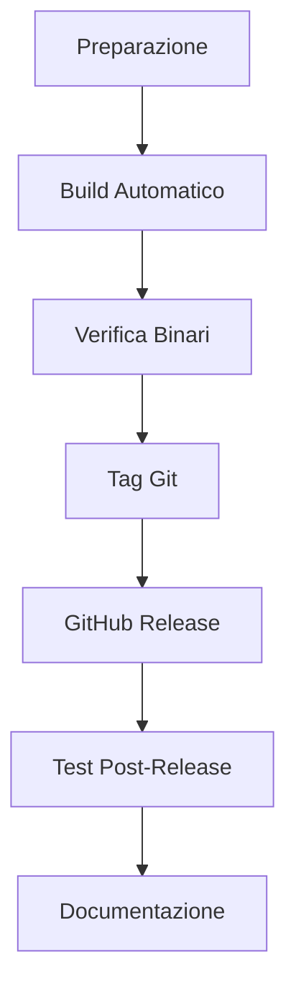

# 📦 NikCLI Release Guide

Questa guida spiega come creare e pubblicare una release di NikCLI su GitHub.

## 🚀 Processo di Release

### 1. Preparazione

```bash
# Assicurati di essere nella directory del progetto
cd /path/to/nikcli-main

# Verifica che tutto sia committato
git status

# Aggiorna la versione in package.json se necessario
# Modifica la versione in package.json
```

### 2. Build Automatico

```bash
# Esegui lo script di release completo
./create-release.sh
```

Questo script:

- ✅ Pulisce le build precedenti
- ✅ Installa le dipendenze
- ✅ Esegue i test
- ✅ Compila TypeScript
- ✅ Crea i binari per tutte le piattaforme
- ✅ Genera i checksum
- ✅ Crea l'archivio di release
- ✅ Genera le note di release per GitHub

### 3. Build Manuale

Se preferisci eseguire i passaggi manualmente:

```bash
# Installa dipendenze
npm install

# Esegui test
npm run test:run

# Build TypeScript
npm run build

# Build binari con pkg
npm run build:release
```

### 4. Verifica dei Binari

```bash
# Controlla i file creati
ls -la releases/

# Verifica i checksum
cat releases/checksums.json

# Testa un binario (esempio per macOS)
chmod +x releases/nikcli-macos-x64
./releases/nikcli-macos-x64 --help
```

## 📋 File di Release

### Binari Creati

- `nikcli-linux-x64` - Linux x64
- `nikcli-macos-x64` - macOS Intel
- `nikcli-macos-arm64` - macOS Apple Silicon
- `nikcli-win-x64.exe` - Windows x64

### File di Supporto

- `checksums.json` - Checksum SHA256 per verifica
- `release-info.json` - Informazioni sulla release
- `nikcli-vX.X.X-binaries.tar.gz` - Archivio completo

## 🎯 Creazione Release su GitHub

### 1. Tag della Release

```bash
# Crea un tag per la versione
git tag v0.3.6-beta

# Push del tag
git push origin v0.3.6-beta
```

### 2. GitHub Release

1. Vai su GitHub → Releases → "Create a new release"
2. Seleziona il tag appena creato
3. Copia il contenuto di `github-release-notes.md`
4. Carica tutti i file dalla directory `releases/`
5. Pubblica la release

### 3. Contenuto della Release

**Titolo**: `NikCLI v0.3.6-beta - Context-Aware AI Development Assistant`

**Descrizione**: Usa il contenuto di `github-release-notes.md`

**File da caricare**:

- `nikcli-linux-x64`
- `nikcli-macos-x64`
- `nikcli-macos-arm64`
- `nikcli-win-x64.exe`
- `checksums.json`
- `nikcli-v0.3.6-beta-binaries.tar.gz`

## 🔧 Configurazione pkg

Il file `pkg-config.json` contiene la configurazione per pkg:

```json
{
  "scripts": ["dist/cli/index.js"],
  "assets": ["dist/**/*", "node_modules/**/*"],
  "targets": [
    "node18-linux-x64",
    "node18-macos-x64",
    "node18-macos-arm64",
    "node18-win-x64"
  ],
  "outputPath": "releases"
}
```

## 🛠️ Troubleshooting

### Problemi Comuni

**Build fallisce**:

```bash
# Pulisci cache npm
npm cache clean --force

# Rimuovi node_modules e reinstalla
rm -rf node_modules package-lock.json
npm install
```

**Binari troppo grandi**:

- Controlla `pkg-config.json` per escludere file non necessari
- Usa `"compress": "GZip"` nelle opzioni

**Errore di permessi**:

```bash
# Rendi eseguibili i binari
chmod +x releases/*
```

### Verifica Post-Release

1. **Test dei binari** su diverse piattaforme
2. **Verifica dei checksum** per sicurezza
3. **Test di installazione** da zero
4. **Controllo della documentazione** aggiornata

## 📊 Metriche di Release

### Dimensioni Target

- **Binari**: ~45MB ciascuno
- **Archivio completo**: ~180MB
- **Tempo di build**: ~5-10 minuti

### Piattaforme Supportate

- ✅ Linux x64
- ✅ macOS Intel
- ✅ macOS Apple Silicon
- ✅ Windows x64
- ❌ Linux ARM64 (non ancora supportato)

## 🔄 Workflow di Release



## 📚 Risorse

- **Documentazione pkg**: https://github.com/vercel/pkg
- **GitHub Releases API**: https://docs.github.com/en/rest/releases
- **Semantic Versioning**: https://semver.org/

---

**🎯 Con questa guida puoi creare release professionali e complete per NikCLI!**
