// TODO: Consider refactoring for reduced complexity
# NikCLI Architecture: Deep Dive Analysis

**Comprehensive System Design and Component Relationships**

---

## Abstract

This document provides an in-depth architectural analysis of NikCLI's multi-layered system design. We examine component relationships, data flow patterns, integration points, and design decisions that enable the system to function as a cohesive autonomous development platform. Our analysis reveals a well-architected system based on proven enterprise design patterns.

---

## 1. System Architecture Overview

### 1.1 Complete Architecture Diagram

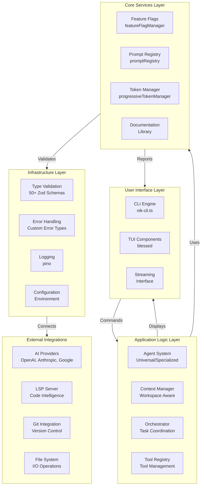

### 1.2 Layered Architecture Model

**5-Layer Model:**

```
┌─────────────────────────────────────────────────┐
│  Layer 5: User Interface                        │
│  (CLI Commands, TUI, Streaming, Web Interface) │
├─────────────────────────────────────────────────┤
│  Layer 4: Application Logic                    │
│  (Agents, Context, Orchestration, Tools)       │
├─────────────────────────────────────────────────┤
│  Layer 3: Core Services                        │
│  (Feature Flags, Prompts, Token Mgmt)          │
├─────────────────────────────────────────────────┤
│  Layer 2: Infrastructure                       │
│  (Types, Errors, Logging, Config)              │
├─────────────────────────────────────────────────┤
│  Layer 1: External Integrations                │
│  (AI Providers, LSP, Git, File System)         │
└─────────────────────────────────────────────────┘
```

---

## 2. Core Components Detailed Analysis

### 2.1 CLI Engine (nik-cli.ts)

**Location**: `src/cli/nik-cli.ts`  
**Size**: 20,688 LOC  
**Responsibility**: Main entry point and command orchestration

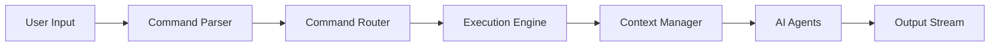

**Key Features:**

- Command parsing and routing
- Execution context management
- Streaming output handling
- Error recovery and logging
- Metrics collection

**Major Responsibilities:**

1. Parse user input into commands
2. Route to appropriate handlers
3. Manage execution context
4. Handle streaming responses
5. Coordinate with agents
6. Log operations and metrics

---

### 2.2 Feature Flag System

**Location**: `src/cli/core/feature-flags.ts`  
**Size**: 21,400 LOC  
**Responsibility**: Dynamic feature enablement and A/B testing

#### 2.2.1 Feature Flag Architecture

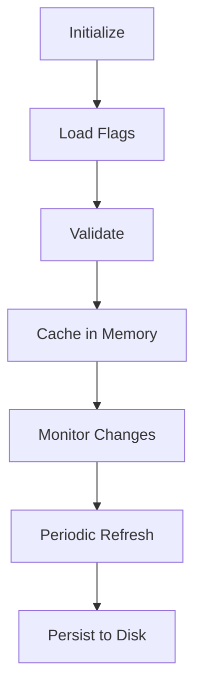

#### 2.2.2 Feature Flag Management

**20+ Core Flags:**

| Category         | Flags                                        | Purpose             |
| ---------------- | -------------------------------------------- | ------------------- |
| **Core**         | LSP Integration, Context Awareness           | Foundation features |
| **Tools**        | Tool Registry, Advanced Validation           | Tool management     |
| **Agents**       | Prompt Engineering, Agent System             | AI capabilities     |
| **UI**           | TUI Components, Dashboard, Real-time Updates | User interface      |
| **Performance**  | Performance Monitoring                       | Metrics             |
| **Security**     | Advanced Security, Sandboxing                | Protection          |
| **Experimental** | Hot Reload, Remote Config, Plugin System     | Innovation          |

#### 2.2.3 Flag Evaluation Logic

```typescript
// Pseudo-code for flag evaluation
function isEnabled(flagId: string): boolean {
  const flag = getFlag(flagId);

  // 1. Environment check
  if (!flag.environment.includes(currentEnv)) return false;

  // 2. Date range check
  if (now < flag.startDate || now > flag.endDate) return false;

  // 3. User group check
  if (!flag.userGroups.includes(userGroup)) return false;

  // 4. Rollout percentage (consistent hashing)
  if (hash(flagId + userId) % 100 >= flag.rolloutPercentage) return false;

  // 5. Dependencies check (recursive)
  for (dep of flag.dependencies) {
    if (!isEnabled(dep)) return false;
  }

  // 6. Conflicts check
  for (conflict of flag.conflicts) {
    if (isEnabled(conflict)) return false;
  }

  return flag.enabled;
}
```

---

### 2.3 Prompt Registry

**Location**: `src/cli/core/prompt-registry.ts`  
**Size**: 19,094 LOC  
**Responsibility**: Centralized prompt management and template processing

#### 2.3.1 Prompt Registry Architecture

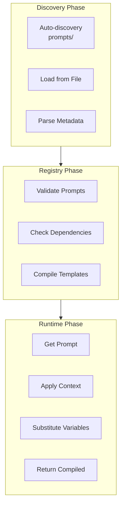

#### 2.3.2 Built-in System Prompts

**15+ System Prompts:**

| ID                       | Name            | Category       | Purpose                  |
| ------------------------ | --------------- | -------------- | ------------------------ |
| `universal-agent-system` | Universal Agent | agent          | Main AI system prompt    |
| `tool-execution-system`  | Tool Execution  | tool           | Tool operation guidance  |
| `error-handling-system`  | Error Handling  | error-handling | Error recovery protocols |

#### 2.3.3 Prompt Template Variables

**Variable Substitution System:**

```typescript
// Template with variables
const template = `
You are working in: {{workingDirectory}}
Agent ID: {{agentId}}
Tool: {{toolName}}
Session: {{sessionId}}
Timestamp: {{timestamp}}
`;

// Compilation with context
const context = {
  workingDirectory: "/project",
  agentId: "universal-001",
  toolName: "file-operations",
  sessionId: "sess-123",
  timestamp: "2025-10-28T...",
};

// Result
const compiled = `
You are working in: /project
Agent ID: universal-001
Tool: file-operations
Session: sess-123
Timestamp: 2025-10-28T...
`;
```

---

### 2.4 Progressive Token Manager

**Location**: `src/cli/core/progressive-token-manager.ts`  
**Size**: 17,656 LOC  
**Responsibility**: Intelligent token management for large contexts

#### 2.4.1 Token Management Pipeline

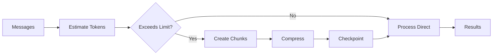

#### 2.4.2 Token Limits Configuration

```typescript
// Token limits for different scenarios
const LIMITS = {
  maxTokensPerChunk: 15000, // Ultra-reduced
  maxTokensTotal: 120000, // 120k with 80k safety margin
  targetCompressionRatio: 0.2, // Ultra-aggressive (80% compression)
  summaryMaxTokens: 150, // Drastically reduced
  maxRetries: 1, // Only 1 retry
};
```

#### 2.4.3 Chunking Strategy

```typescript
// Message chunking algorithm
async createProgressiveChunks(messages: CoreMessage[]): Promise<TokenChunk[]> {
    const chunks = []
    let currentChunk = []
    let currentTokens = 0

    for (const message of messages) {
        const messageTokens = estimateTokens(message)

        // Check if adding would exceed chunk limit
        if (currentTokens + messageTokens > MAX_TOKENS_PER_CHUNK) {
            if (currentChunk.length > 0) {
                chunks.push(createChunk(currentChunk, currentTokens))
            }
            currentChunk = [message]
            currentTokens = messageTokens
        } else {
            currentChunk.push(message)
            currentTokens += messageTokens
        }
    }

    // Add remaining
    if (currentChunk.length > 0) {
        chunks.push(createChunk(currentChunk, currentTokens))
    }

    return chunks
}
```

#### 2.4.4 Emergency Truncation

```typescript
// Emergency truncation when all else fails
function emergencyTruncate(content: string, maxTokens: number): string {
  if (estimateTokens(content) <= maxTokens) {
    return content;
  }

  // Keep first 30% and last 10% of lines
  const lines = content.split("\n");
  const keepStart = Math.floor(lines.length * 0.3);
  const keepEnd = Math.floor(lines.length * 0.1);

  return [
    ...lines.slice(0, keepStart),
    "\n[... EMERGENCY TRUNCATED ...]",
    ...lines.slice(-keepEnd),
  ].join("\n");
}
```

---

### 2.5 Type System

**Location**: `src/cli/types/`  
**Total**: 50+ Zod schemas  
**Size**: 19,850+ LOC  
**Responsibility**: Runtime validation and type safety

#### 2.5.1 Type System Hierarchy

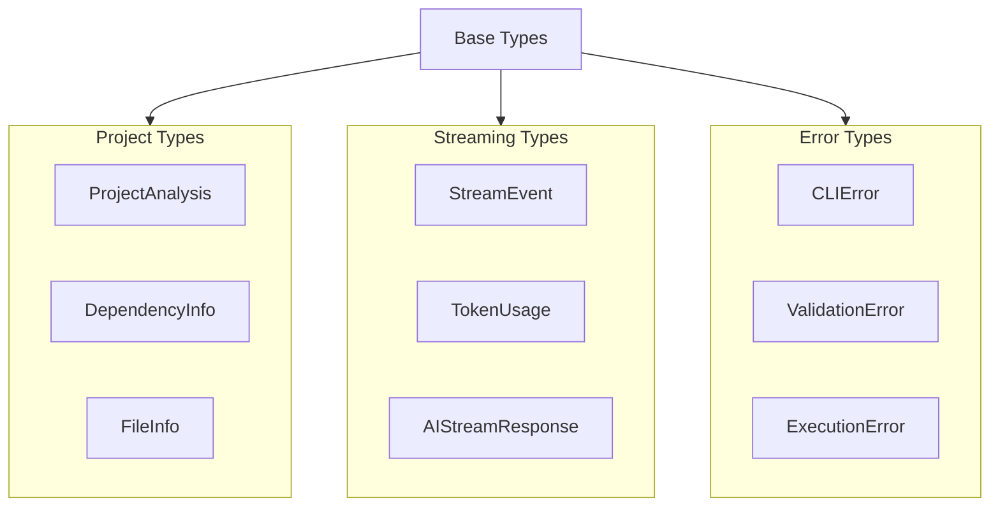

#### 2.5.2 Core Validation Schemas

**Key Schemas:**

| Schema                    | Purpose         | Validations             |
| ------------------------- | --------------- | ----------------------- |
| **FileInfoSchema**        | File metadata   | Path, size, permissions |
| **ProjectAnalysisSchema** | Project info    | Type, deps, scripts     |
| **StreamEventSchema**     | Stream events   | Type, content, metadata |
| **TokenUsageSchema**      | Token tracking  | Counts, costs           |
| **ToolCallSchema**        | Tool invocation | ID, name, args, result  |

---

## 3. Data Flow Analysis

### 3.1 Command Processing Flow

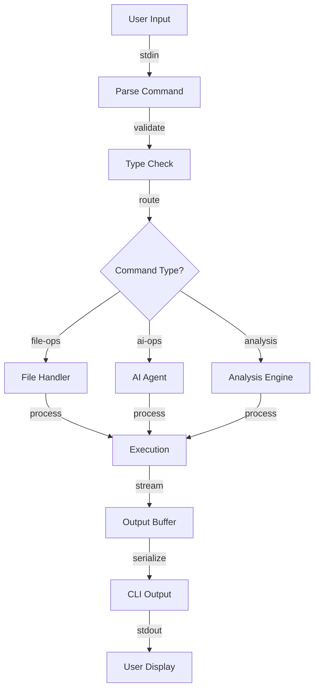

### 3.2 Context Management Flow

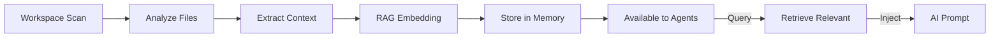

### 3.3 Agent Orchestration Flow

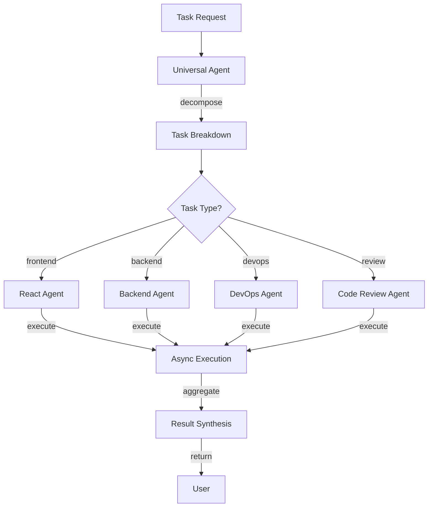

---

## 4. Module Dependency Graph

### 4.1 Component Dependencies

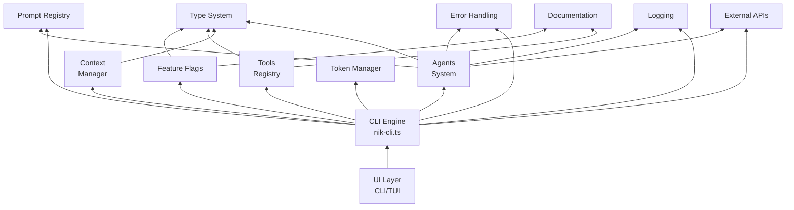

---

## 5. Design Patterns Implementation

### 5.1 Singleton Pattern

**Usage**: Feature Flags, Prompt Registry, Token Manager

```typescript
// Singleton implementation
export class PromptRegistry {
  private static instance: PromptRegistry;

  static getInstance(
    workingDirectory?: string,
    config?: Partial<PromptRegistryConfig>,
  ): PromptRegistry {
    if (!PromptRegistry.instance && workingDirectory) {
      PromptRegistry.instance = new PromptRegistry(workingDirectory, config);
    }
    return PromptRegistry.instance;
  }
}
```

**Benefit**: Single shared instance across application

### 5.2 Observer Pattern

**Usage**: Feature Flag Changes, Context Updates

```typescript
// EventEmitter for change notifications
class FeatureFlagManager extends EventEmitter {
  async setFlag(flagId: string, enabled: boolean) {
    // ... execution logic ...

    this.emit("flagChanged", {
      flagId,
      oldValue: flag.enabled,
      newValue: enabled,
      timestamp: new Date(),
      source: "manual",
    });
  }
}
```

**Benefit**: Real-time notifications for state changes

### 5.3 Strategy Pattern

**Usage**: Error Recovery, Token Compression

```typescript
// Strategy interface for error recovery
interface ErrorRecoveryStrategy {
  name: string;
  canRecover(error: CLIError): boolean;
  recover(error: CLIError, context: ErrorContext): Promise<boolean>;
}

// Multiple strategies
const strategies = [
  new NetworkRetryStrategy(),
  new TokenCompressionStrategy(),
  new CheckpointRecoveryStrategy(),
  new FallbackStrategy(),
];
```

**Benefit**: Flexible error handling with multiple approaches

### 5.4 Factory Pattern

**Usage**: Tool Creation, Agent Instantiation

```typescript
// Tool factory
class ToolRegistry {
  createTool(config: ToolConfig): Tool {
    switch (config.type) {
      case "file-ops":
        return new FileOperationsTool(config);
      case "analysis":
        return new AnalysisTool(config);
      case "execution":
        return new ExecutionTool(config);
      default:
        throw new Error(`Unknown tool type: ${config.type}`);
    }
  }
}
```

**Benefit**: Centralized tool creation with consistent configuration

### 5.5 Middleware Pattern

**Usage**: Request Processing, Validation

```typescript
// Middleware chain
type Middleware = (ctx: Context, next: () => Promise<void>) => Promise<void>;

const chain: Middleware[] = [
  validateInputMiddleware,
  authenticationMiddleware,
  contextLoadingMiddleware,
  executionMiddleware,
  responseFormattingMiddleware,
];
```

**Benefit**: Composable request processing pipeline

---

## 6. Integration Points

### 6.1 AI Provider Integration

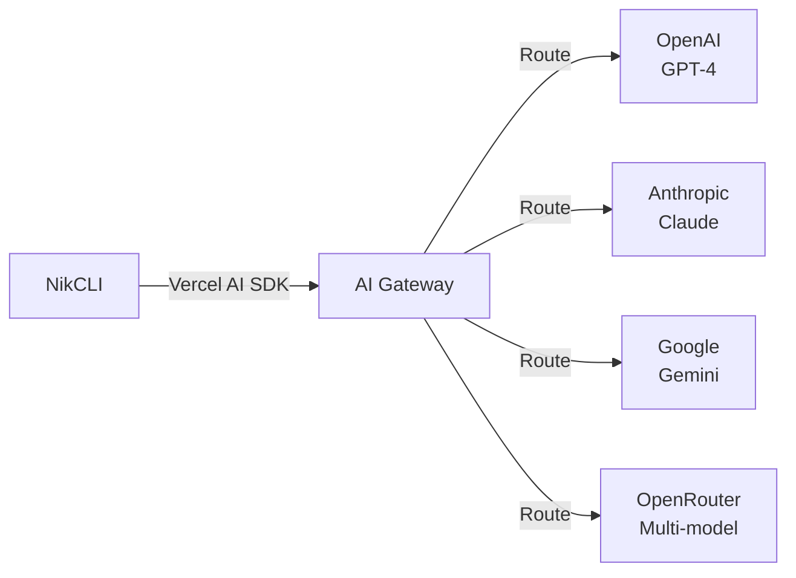

### 6.2 LSP Integration

```
CLI Commands
    ↓
NikCLI Context
    ↓
LSP Server (Running)
    ↓
- Type Information
- Code Completion
- Diagnostics
- Navigation
    ↓
Enhanced Intelligence
```

### 6.3 Git Integration

```
NikCLI
    ↓
Git Commands
    ↓
- Status Check
- Diff Analysis
- Commit Staging
- Branch Management
    ↓
Repository State
```

---

## 7. Configuration and Extensibility

### 7.1 Configuration Management

**Configuration Levels:**

```
Environment Variables
    ↓
Configuration Files (.env, config.json)
    ↓
Programmatic Config
    ↓
Runtime Adjustments
```

### 7.2 Plugin/Tool Extension Points

```typescript
// Extension points in architecture
interface ExtensionPoint {
  // Register new tools
  registerTool(tool: Tool): void;

  // Register new prompts
  registerPrompt(prompt: PromptTemplate): void;

  // Register feature flags
  registerFlag(flag: FeatureFlag): void;

  // Register middleware
  registerMiddleware(middleware: Middleware): void;

  // Add AI provider
  registerAIProvider(provider: AIProvider): void;
}
```

---

## 8. Security Architecture

### 8.1 Security Layers

```
┌─────────────────────────────────────┐
│  Input Validation Layer             │
│  (Zod schemas, type checking)       │
├─────────────────────────────────────┤
│  Authentication Layer               │
│  (JWT, session management)          │
├─────────────────────────────────────┤
│  Authorization Layer                │
│  (Role-based access control)        │
├─────────────────────────────────────┤
│  Execution Sandbox Layer            │
│  (Tool execution restrictions)      │
├─────────────────────────────────────┤
│  Output Sanitization Layer          │
│  (Prevent injection attacks)        │
└─────────────────────────────────────┘
```

### 8.2 Error Handling Security

```typescript
// Secure error handling
try {
  // Operation
} catch (error: any) {
  // Don't expose sensitive stack traces
  if (process.env.NODE_ENV === "production") {
    logger.error("Operation failed", {
      code: error.code,
      message: error.message,
      // Stack trace NOT included
    });
  } else {
    logger.error("Operation failed", error);
  }
}
```

---

## 9. Performance Optimization

### 9.1 Caching Strategy

```
Feature Flags Cache (In-memory)
    └─ Refresh Interval: 5 minutes
    └─ Change Notifications: Real-time

Prompt Templates Cache
    └─ Lazy loading on first use
    └─ Compiled template cache

Context Cache (Workspace)
    └─ File tree cache
    └─ Symbol index cache
    └─ RAG embeddings cache
```

### 9.2 Token Optimization

```
Original Context: 200,000 tokens
    ↓
Progressive Chunking: Split into 15-token chunks
    ↓
Aggressive Compression: Apply 80% compression ratio
    ↓
Optimized Context: 40,000 tokens
    ↓
Fits in model window with safety margin
```

---

## 10. Scalability Considerations

### 10.1 Horizontal Scalability

- **Stateless Design**: CLI can be distributed
- **External State**: Configuration in databases
- **Distributed Caching**: Redis for shared cache

### 10.2 Vertical Scalability

- **Efficient Token Management**: Handles large contexts
- **Progressive Processing**: Chunked execution
- **Checkpoint Recovery**: Resume from failures

---

## Conclusion

NikCLI's architecture successfully implements a **sophisticated, well-engineered system** that combines:

✅ Clear layered design  
✅ Proven design patterns  
✅ Enterprise-grade security  
✅ Scalable components  
✅ Extensible integration points

The architecture demonstrates mature software engineering practices applied to autonomous development assistance.

---

_Next Document: [Core Systems Analysis](./03-CORE_SYSTEMS_ANALYSIS.md)_

---

_Academic Paper Series - NikCLI v0.5.0_  
_Architecture Analysis - 2025-10-28_
