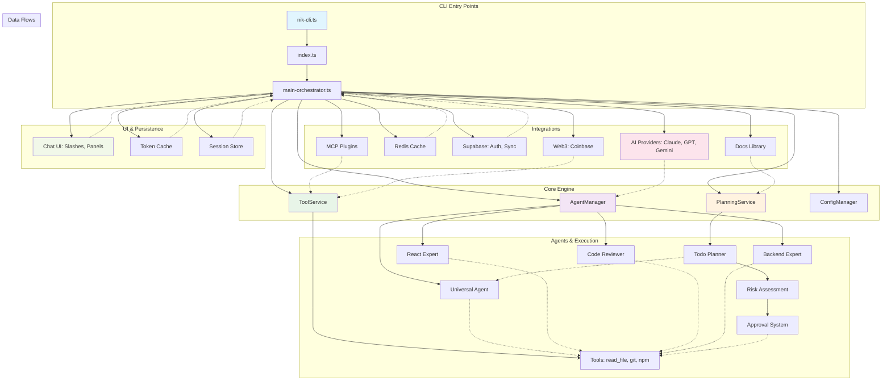

// TODO: Consider refactoring for reduced complexity
# Analysis Report: src/cli Directory

## Introduction

The `src/cli` directory serves as the core implementation for **NikCLI**, an autonomous AI developer assistant built with TypeScript. It orchestrates AI agents, tools, and services to assist with coding workflows, including task planning, code generation, analysis, and execution. The directory contains the main CLI entry points, agent management, planning systems, and integrations with external services like AI providers (Anthropic, OpenAI, Google), Redis, Supabase, and blockchain tools.

This analysis is based on the directory structure as of the latest exploration (7 root files, 29 subdirectories). The codebase emphasizes modularity, with a focus on autonomy, security, and extensibility. Key themes include:

- **AI-Driven Development**: Agents for code review, optimization, and generation.
- **Task Planning**: Enhanced planning with todo-based execution.
- **Security & Sandboxing**: Approval systems and VM isolation.
- **Integrations**: MCP (Model Context Protocol), documentation libraries, and web3.

Total codebase size: ~514 KB across ~200+ files, primarily TypeScript (.ts).

## Directory Structure

### Root-Level Files (7 files)

- **README.md**: Project documentation and setup instructions.
- **index.ts** (1,469 lines): Main entry point; bootstraps the CLI, handles onboarding, and initializes services.
- **main-orchestrator.ts** (644 lines): Core orchestrator for agents, planning, and caching. Manages event emissions and task lifecycle.
- **nik-cli.ts** (14,470 lines): Primary CLI class (~1,340 functions). Handles chat, commands, token management, UI rendering, and integrations. Monolithic but highly capable.
- **nikctl.ts**: Likely a sub-command tool or utility (small file, possibly for internal commands).
- **nikd.ts**: Daemon or background process handler (small file).
- **register-agents.ts**: Registers AI agents (e.g., universal-agent, react-expert) for dynamic task handling.

### Subdirectories (29 total, key ones highlighted)

- **acp** (4 files): Autonomous Code Processing services.
- **ai** (5 files): AI-specific logic, including model providers for Claude, GPT, Gemini.
- **automation** (1 file): Task automation scripts.
- **background-agents** (2 files): Background task runners for agents.
- **chat** (6 files): Chat management, including slash commands and history.
- **commands** (2 files): CLI command handlers (e.g., /plan, /auto).
- **config** (1 file): Configuration manager for models, keys, and settings.
- **context** (5 files): Workspace context, docs management, and semantic search.
- **core** (20 files): Heart of the system – agent factory, caches (token/completion), tool routers, planning managers, and blueprint storage. Largest subdir; includes `agent-manager.ts` (agent lifecycle) and `enhanced-planning.ts` (todo generation).
- **engine** (1 file): Core execution engine.
- **guidance** (1 file): AI guidance and policy enforcement.
- **handlers** (1 file): Event handlers (e.g., file pickers).
- **integrations** (1 file): External integrations (e.g., IDE diagnostics, git workflows).
- **lsp** (4 files): Language Server Protocol support for IDEs.
- **mcp** (1 file): Model Context Protocol for plugins (Claude Code compatible).
- **middleware** (10 files): Middleware for auth, security, and routing.
- **onchain** (1 file): Web3/blockchain features (Coinbase integration).
- **persistence** (2 files): Session and data persistence (local/cloud).
- **planning** (6 files): Enhanced planning with todos, approvals, and execution. Includes `enhanced-planning.ts` (1,777 lines, AI-generated plans).
- **policies** (1 file): Security and execution policies.
- **prompts** (2 files): AI prompt templates.
- **reporters** (1 file): Logging and reporting.
- **schemas** (2 files): Data schemas for configs and plans.
- **services** (9 files): Core services like agent service, tool service, and snapshot mgmt. Includes `agent-service.ts` (1,861 lines, task execution).
- **store** (2 files): State stores for UI and sessions.
- **stores** (1 file): Additional stores (possibly for enhanced state).

**Empty/Placeholder Dirs**: interfaces (0), panels (0), providers (0) – likely for future expansion.

## Key Components & Features

### Core Architecture

- **NikCLI Class** (`nik-cli.ts`): Monolithic core (~14k lines). Manages:
  - CLI modes (default, auto, plan, VM).
  - Token/cost tracking with real-time pricing (Anthropic: $0.25-$15/M tokens; OpenAI: $0.15-$30/M).
  - UI rendering (status bars, panels, spinners).
  - Integrations: Redis (caching), Supabase (auth/sync), MCP (plugins).
  - Security: Approval systems, sandboxing, dev/safe modes.
  - Commands: 100+ slash commands (/plan, /auto, /tokens, /web3, etc.).
- **Agent Management** (`core/agent-manager.ts`, 644 lines): Registers/coordinates agents (e.g., react-expert, code-review). Supports parallel execution, dependency injection.
- **Planning System** (`planning/enhanced-planning.ts`, 1,777 lines): AI-generated todos with risk assessment, approvals, and execution. Supports read-only modes, VM isolation.
- **Tool Service** (`services/tool-service.ts`): Executes tools (read_file, git, npm) with security wrappers.
- **Event-Driven**: Uses EventEmitter for task progress, tool calls, and UI updates.

### Subsystems Breakdown

1. **AI Integration** (`ai/`): Model providers for Claude, GPT, Gemini. Supports streaming, tool-calling, vision (image analysis/generation).
2. **Planning & Execution** (`planning/`, `services/`): Todo-based plans, agent orchestration. Handles autonomy levels (semi/full).
3. **Security & Policies** (`policies/`, `middleware/`): Approval workflows, sandbox restrictions, token limits.
4. **UI/UX** (`chat/`, core UI in nik-cli.ts): Slash commands, panels (boxen-styled), status bars with real-time metrics (tokens, costs).
5. **Persistence** (`persistence/`, `store/`): Local/cloud sessions, token caches (Redis fallback to memory).
6. **Integrations**:
   - **Web3/Onchain** (`onchain/`): Coinbase wallet transfers, CDP keys.
   - **Docs Library** (`context/`): Semantic search, auto-loading into AI context.
   - **IDE** (`integrations/`, `lsp/`): Diagnostics, git workflows, monitoring.
   - **MCP** (`mcp/`): Plugin protocol for Claude Code compatibility.

### Code Quality Notes

- **Strengths**: Modular subdirs, TypeScript with interfaces, comprehensive error handling, real-time metrics.
- **Size**: Large files (nik-cli.ts: 14k lines) indicate room for refactoring; core logic is dense but well-commented.
- **Dependencies**: ~50+ (chalk, inquirer, ora, nanoid, Redis, Supabase). AI providers: Anthropic, OpenAI, Google.
- **Testing**: References to test commands (/test), but no explicit test files in structure.
- **Performance**: Token optimization (caching, compaction at 100k tokens), async generators for streaming.

### Recommendations

- **Modularity**: Split nik-cli.ts into smaller modules (e.g., UI, commands).
- **Expansion**: Populate empty dirs (interfaces, panels) for better organization.
- **Security**: Enhance VM mode for high-risk ops.
- **Docs**: Expand README.md with architecture diagram (see below).

## System Mermaid Graph

The following Mermaid diagram visualizes the high-level architecture of src/cli, showing key components and data flows.

This graph illustrates:

- **Entry**: CLI bootstraps via index.ts.
- **Core**: Orchestrator manages agents/tools/planning.
- **Agents**: Specialized (React, Backend) execute via tools.
- **Integrations**: AI, caching, auth, plugins.
- **UI**: Slash commands, real-time panels.

For full source code, refer to individual files. This directory powers NikCLI's autonomous capabilities, making it a robust AI coding assistant.

_Generated by NikCLI Analysis on [Current Date]_
