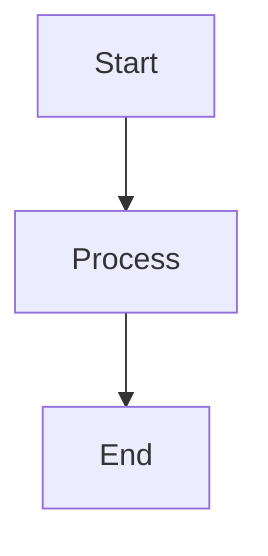

# NikCLI Documentation

Enterprise-grade documentation for NikCLI using Mintlify.

## 📁 Documentation Structure

```
docs/
├── mint.json                      # ✅ Main configuration
├── introduction.mdx               # ✅ Hero page
├── quickstart/                    # ✅ 4/4 pages complete
│   ├── installation.mdx
│   ├── first-steps.mdx
│   ├── configuration.mdx
│   └── your-first-agent.mdx
├── agent-system/                  # 🔄 1/8 pages complete
│   ├── overview.mdx              # ✅ Complete
│   ├── universal-agent.mdx       # ⏳ TODO
│   ├── specialized-agents.mdx    # ⏳ TODO
│   ├── orchestration.mdx         # ⏳ TODO
│   ├── autonomous-execution.mdx  # ⏳ TODO
│   ├── agent-streaming.mdx       # ⏳ TODO
│   ├── custom-agents.mdx         # ⏳ TODO
│   └── agent-lifecycle.mdx       # ⏳ TODO
├── user-guide/                    # ⏳ 0/7 pages
├── planning-system/               # ⏳ 0/5 pages
├── context-rag/                   # ⏳ 0/6 pages
├── integrations/                  # ⏳ 0/7 pages
├── web3-blockchain/               # ⏳ 0/6 pages
├── monitoring/                    # ⏳ 0/7 pages
├── cli-reference/                 # 🔄 5/10 pages complete
├── tools-system/                  # ✅ 5/5 pages complete
├── configuration/                 # ⏳ 0/5 pages
├── deployment/                    # ⏳ 0/5 pages
├── architecture/                  # ⏳ 0/6 pages
├── troubleshooting/               # ⏳ 0/4 pages
├── api-reference/                 # ⏳ 0/15+ pages
├── developer-guide/               # ⏳ 0/9 pages
└── examples/                      # ⏳ 0/5 pages
```

**Progress**: 9/100+ pages complete (9%)

## 🎯 Completion Roadmap

### Phase 1: Foundation (✅ Complete)
- [x] mint.json configuration
- [x] Directory structure
- [x] Introduction page
- [x] Quickstart guides (4 pages)
- [x] Agent System overview

### Phase 2: Core Documentation (Priority)
Focus on high-value, frequently accessed pages:

#### 2.1 Agent System (Critical - 7 pages remaining)
- [ ] `universal-agent.mdx` - The main agent users interact with
- [ ] `specialized-agents.mdx` - Frontend, Backend, DevOps agents
- [ ] `orchestration.mdx` - Multi-agent coordination
- [ ] `autonomous-execution.mdx` - Auto mode deep dive
- [ ] `agent-streaming.mdx` - Real-time streaming
- [ ] `custom-agents.mdx` - Creating new agents
- [ ] `agent-lifecycle.mdx` - State management

#### 2.2 User Guide (High Priority - 7 pages)
- [ ] `overview.mdx` - User guide introduction
- [ ] `chat-interface.mdx` - Chat and planning mode
- [ ] `autonomous-mode.mdx` - Fully autonomous execution
- [ ] `slash-commands.mdx` - 50+ command reference
- [ ] `approval-system.mdx` - Security workflows
- [ ] `sessions.mdx` - Session management
- [ ] `workflow-patterns.mdx` - Common use cases

#### 2.3 Planning System (High Priority - 5 pages)
- [ ] `overview.mdx` - Planning architecture
- [ ] `plan-generation.mdx` - How plans are created
- [ ] `execution-flow.mdx` - Plan execution lifecycle
- [ ] `plan-templates.mdx` - YAML templates
- [ ] `interactive-planning.mdx` - User approval workflows

#### 2.4 CLI Reference (Critical - 10 pages)
- [ ] `commands-overview.mdx` - All commands summary
- [ ] `agent-commands.mdx` - /agent, /auto, /universal
- [ ] `file-operations.mdx` - /read, /write, /grep, /glob
- [ ] `git-commands.mdx` - /git, /commit, /branch
- [ ] `project-ops.mdx` - /analyze, /build, /test
- [ ] `session-management.mdx` - /save, /load, /clear
- [ ] `configuration.mdx` - /config, /model, /provider
- [ ] `terminal-ops.mdx` - /exec, /shell, /watch
- [ ] `vim-commands.mdx` - /vim setup, /vim open
- [ ] `web3-commands.mdx` - /goat, /web3-toolchain

### Phase 3: Advanced Features
#### 3.1 Context & RAG (6 pages)
- [ ] `overview.mdx` - Context awareness
- [ ] `workspace-indexing.mdx` - File/project indexing
- [ ] `semantic-search.mdx` - Vector search
- [ ] `embeddings.mdx` - ChromaDB integration
- [ ] `token-management.mdx` - Token optimization
- [ ] `cache-system.mdx` - Semantic caching

#### 3.2 Integrations (7 pages)
- [ ] `lsp-integration.mdx` - Language Server Protocol
- [ ] `mcp-protocol.mdx` - Model Context Protocol
- [ ] `ide-support.mdx` - VS Code, JetBrains, Vim
- [ ] `github-integration.mdx` - Repos, Issues, PRs
- [ ] `browser-automation.mdx` - BrowserBase, Playwright
- [ ] `figma.mdx` - Design integration
- [ ] `vim-mode.mdx` - Vim integration guide

#### 3.3 Web3/Blockchain (6 pages)
- [ ] `overview.mdx` - Web3 capabilities
- [ ] `goat-sdk.mdx` - GOAT SDK integration
- [ ] `toolchains.mdx` - DeFi, Polymarket, Portfolio, NFT, MEV
- [ ] `wallet-operations.mdx` - Viem integration
- [ ] `erc20-tokens.mdx` - Token operations
- [ ] `polymarket-trading.mdx` - Prediction markets

#### 3.4 Monitoring (7 pages)
- [ ] `overview.mdx` - Enterprise monitoring
- [ ] `opentelemetry.mdx` - Distributed tracing
- [ ] `prometheus.mdx` - Metrics collection
- [ ] `sentry.mdx` - Error tracking
- [ ] `alerting.mdx` - Slack, Discord, webhooks
- [ ] `health-checks.mdx` - K8s probes
- [ ] `dashboards.mdx` - Visualization

### Phase 4: Developer Resources
#### 4.1 Tools System (5 pages)
- [ ] `overview.mdx` - Tool architecture
- [ ] `built-in-tools.mdx` - 40+ tools reference
- [ ] `tool-security.mdx` - Security levels
- [ ] `custom-tools.mdx` - Creating tools
- [ ] `tool-context.mdx` - Context management

#### 4.2 Architecture (6 pages)
- [ ] `overview.mdx` - System architecture
- [ ] `layered-design.mdx` - Architecture layers
- [ ] `event-system.mdx` - Event-driven design
- [ ] `streaming-architecture.mdx` - Real-time streaming
- [ ] `security-model.mdx` - Security design
- [ ] `performance.mdx` - Optimization strategies

#### 4.3 Configuration (5 pages)
- [ ] `yaml-config.mdx` - Configuration files
- [ ] `model-routing.mdx` - Model selection strategies
- [ ] `api-providers.mdx` - Provider configuration
- [ ] `environment-vars.mdx` - Environment variables
- [ ] `advanced-settings.mdx` - Advanced configuration

#### 4.4 Deployment (5 pages)
- [ ] `local-setup.mdx` - Local development
- [ ] `docker.mdx` - Container deployment
- [ ] `kubernetes.mdx` - K8s deployment
- [ ] `background-agents.mdx` - Daemon mode
- [ ] `production-best-practices.mdx` - Production guide

### Phase 5: API & Developer Guide
#### 5.1 API Reference (15+ pages)
- [ ] `overview.mdx` - API documentation intro
- [ ] Core APIs (4 pages)
  - [ ] `core-apis/config-manager.mdx`
  - [ ] `core-apis/agent-factory.mdx`
  - [ ] `core-apis/tool-registry.mdx`
  - [ ] `core-apis/streaming-orchestrator.mdx`
- [ ] Agent APIs (3 pages)
  - [ ] `agent-apis/base-agent.mdx`
  - [ ] `agent-apis/universal-agent-api.mdx`
  - [ ] `agent-apis/specialized-agents-api.mdx`
- [ ] Service APIs (4 pages)
  - [ ] `service-apis/agent-service.mdx`
  - [ ] `service-apis/cache-service.mdx`
  - [ ] `service-apis/memory-service.mdx`
  - [ ] `service-apis/planning-service.mdx`
- [ ] Provider APIs (3 pages)
  - [ ] `provider-apis/ai-providers.mdx`
  - [ ] `provider-apis/memory-providers.mdx`
  - [ ] `provider-apis/storage-providers.mdx`

#### 5.2 Developer Guide (9 pages)
- [ ] `getting-started.mdx` - Dev setup
- [ ] `project-structure.mdx` - Codebase overview
- [ ] `architecture-deep-dive.mdx` - Technical architecture
- [ ] `creating-agents.mdx` - Agent development
- [ ] `creating-tools.mdx` - Tool development
- [ ] `adding-providers.mdx` - Provider integration
- [ ] `testing.mdx` - Testing strategies
- [ ] `debugging.mdx` - Debug techniques
- [ ] `contributing.mdx` - Contribution guide

### Phase 6: Polish
#### 6.1 Examples (5 pages)
- [ ] `basic-workflows.mdx` - Common workflows
- [ ] `agent-examples.mdx` - Agent use cases
- [ ] `web3-examples.mdx` - Blockchain examples
- [ ] `automation-examples.mdx` - Automation patterns
- [ ] `integration-examples.mdx` - Integration examples

#### 6.2 Troubleshooting (4 pages)
- [ ] `common-issues.mdx` - Frequent problems
- [ ] `faq.mdx` - Frequently asked questions
- [ ] `error-reference.mdx` - Error codes
- [ ] `performance-tuning.mdx` - Performance optimization

## 🛠 Setup Instructions

### 1. Install Mintlify CLI

```bash
npm install -g mintlify
```

### 2. Preview Documentation

```bash
cd /path/to/nikcli-main/docs
mintlify dev
```

Visit `http://localhost:3000` to see the documentation.

### 3. Deploy to Mintlify

1. Create account at [mintlify.com](https://mintlify.com)
2. Connect GitHub repository
3. Set docs directory to `/docs`
4. Mintlify auto-deploys on push to main

## ✍️ Writing Guidelines

### Page Template

```mdx
---
title: 'Page Title'
description: 'Brief description for SEO (50-160 chars)'
icon: 'icon-name'  # from Font Awesome
---

## Introduction

Brief overview of the topic.

<Tip>
  Helpful tip or best practice
</Tip>

## Main Content

### Section 1

Content here...

<CodeGroup>
```bash Example 1
command here
```

```bash Example 2
another command
```
</CodeGroup>

### Section 2

More content...

<CardGroup cols={2}>
  <Card title="Feature 1" icon="icon">
    Description
  </Card>
  <Card title="Feature 2" icon="icon">
    Description
  </Card>
</CardGroup>

## Next Steps

<CardGroup cols={2}>
  <Card
    title="Related Page 1"
    icon="icon"
    href="/path/to/page"
  >
    Description
  </Card>
  <Card
    title="Related Page 2"
    icon="icon"
    href="/path/to/page"
  >
    Description
  </Card>
</CardGroup>
```

### Available Components

- **Accordion/AccordionGroup**: Expandable sections
- **Card/CardGroup**: Visual link cards
- **CodeGroup**: Multiple code examples with tabs
- **Tabs/Tab**: Tabbed content
- **Steps/Step**: Step-by-step instructions
- **Note**: Information callout (blue)
- **Tip**: Helpful tip (green)
- **Warning**: Important warning (yellow)
- **Info**: Additional info (gray)
- **Check**: Success message (green)

### Code Examples

Always provide copy-able code examples:

```bash
# Command with description
nikcli /agent universal-agent "task description"
```

Use CodeGroup for multiple examples:

```mdx
<CodeGroup>
```bash npm
npm install -g @nicomatt69/nikcli
```

```bash pnpm
pnpm install -g @nicomatt69/nikcli
```
</CodeGroup>
```

### Diagrams

Use Mermaid for architecture diagrams:

````mdx

````

## 📚 Source Code Reference

When documenting features, reference actual source code:

- **Agent System**: `/src/cli/automation/agents/`
- **Tools**: `/src/cli/tools/`
- **Services**: `/src/cli/services/`
- **Core**: `/src/cli/core/`
- **AI Providers**: `/src/cli/ai/`
- **Context/RAG**: `/src/cli/context/`
- **Monitoring**: `/src/cli/monitoring/`
- **Web3**: `/src/cli/onchain/`, `/src/cli/toolchains/`

## 🎨 Assets

### Required Assets

Create these visual assets:

1. **Logo**:
   - `/docs/logo/logo-light.svg` (for light mode)
   - `/docs/logo/logo-dark.svg` (for dark mode)

2. **Favicon**:
   - `/docs/favicon.svg`

3. **Hero Images**:
   - `/docs/images/hero-light.png`
   - `/docs/images/hero-dark.png`

4. **Architecture Diagrams**: Use Mermaid (no external files needed)

## 🔗 Internal Linking

Always link related pages:

```mdx
Learn more about [Agent System](/agent-system/overview)
```

## ⚡ Priority Pages to Complete Next

Based on user impact and frequency of access:

1. **agent-system/universal-agent.mdx** - Most used agent
2. **user-guide/chat-interface.mdx** - Primary interaction mode
3. **cli-reference/commands-overview.mdx** - Command reference
4. **planning-system/overview.mdx** - Key feature
5. **user-guide/slash-commands.mdx** - Essential reference

## 📊 Documentation Metrics

Track completion with:

```bash
# Count completed pages
find docs -name "*.mdx" | wc -l

# List TODO pages
grep -r "⏳ TODO" docs/README.md
```

## 🤝 Contributing

When adding documentation:

1. Follow the page template above
2. Include code examples
3. Add cross-references to related pages
4. Use Mintlify components for rich formatting
5. Test locally with `mintlify dev`
6. Update this README's progress tracking

## 📖 Additional Resources

- [Mintlify Documentation](https://mintlify.com/docs)
- [Mintlify Components](https://mintlify.com/docs/content/components)
- [Font Awesome Icons](https://fontawesome.com/icons)
- [Mermaid Diagrams](https://mermaid.js.org/)

## 🎯 Estimated Completion Time

- **Phase 1 (Foundation)**: ✅ Complete (4 hours)
- **Phase 2 (Core)**: ~12 hours (29 pages)
- **Phase 3 (Advanced)**: ~10 hours (26 pages)
- **Phase 4 (Developer)**: ~8 hours (21 pages)
- **Phase 5 (API)**: ~12 hours (24 pages)
- **Phase 6 (Polish)**: ~4 hours (9 pages)

**Total Remaining**: ~46 hours for 100% completion

## 🚀 Quick Start for Contributors

```bash
# 1. Install CLI
npm install -g mintlify

# 2. Start dev server
cd /path/to/nikcli-main/docs
mintlify dev

# 3. Create a new page (use template above)
touch new-page.mdx

# 4. Add to mint.json navigation
# Edit docs/mint.json and add page to relevant section

# 5. Preview changes at http://localhost:3000

# 6. Commit and push
git add .
git commit -m "docs: add new-page documentation"
git push
```

---

**Current Status**: Foundation complete, ready for Phase 2 core documentation.
**Next Priority**: Complete Agent System pages (high user demand).
