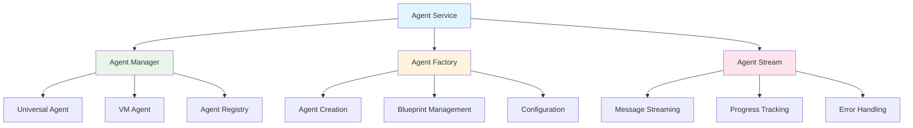
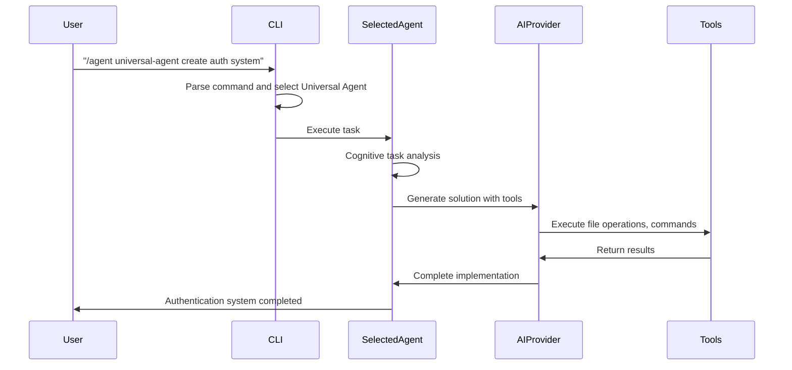

## Agent System Overview

NikCLI's agent system is the core of its autonomous development capabilities. Built on a **service-oriented architecture**, it provides two registered AI agents that handle all development tasks through intelligent orchestration and cognitive routing.

<CardGroup cols={2}>
  <Card title="Universal Agent" icon="robot">
    All-in-one enterprise agent with 44 comprehensive full-stack capabilities
  </Card>
  <Card title="VM Agent" icon="container">
    Secure virtualized agent for isolated development with Docker containerization
  </Card>
  <Card title="Agent Orchestration" icon="workflow">
    Cognitive routing and intelligent task decomposition
  </Card>
  <Card title="Stream Processing" icon="stream">
    Real-time communication and progress tracking
  </Card>
</CardGroup>

<Note>
  NikCLI uses **two registered agents** (Universal Agent and VM Agent) rather than multiple specialized agents. The Universal Agent internally handles all specializations (frontend, backend, DevOps, etc.) through cognitive orchestration and intelligent routing.
</Note>

## Architectural Principles

### 1. Service-Oriented Design

The agent system follows a **modular service architecture** where each component has well-defined responsibilities:



### 2. Agent Lifecycle Management

Each agent follows a structured lifecycle with clear phases:

<Steps>
  <Step title="Initialization">
    Agent is created with specific configuration and capabilities
    ```typescript
    const agent = await agentFactory.createAgent({
      type: 'universal',
      permissions: agentPermissions,
      context: workspaceContext
    });
    ```
  </Step>
  
  <Step title="Task Reception">
    Agent receives task with context and requirements
    ```typescript
    const task: AgentTask = {
      id: nanoid(),
      description: "Create authentication system",
      context: projectContext,
      requirements: taskRequirements
    };
    ```
  </Step>
  
  <Step title="Planning & Analysis">
    Agent analyzes task and creates execution plan
    ```typescript
    const plan = await agent.createExecutionPlan(task);
    ```
  </Step>
  
  <Step title="Execution">
    Agent executes plan with real-time progress updates
    ```typescript
    const stream = agent.executeTask(task, plan);
    ```
  </Step>
  
  <Step title="Completion">
    Agent reports results and cleanup
    ```typescript
    const result = await agent.completeTask(taskId);
    ```
  </Step>
</Steps>

### 3. Communication Patterns

Agents communicate through structured message streams:

<Tabs>
  <Tab title="Agent-to-System">
    ```typescript
    interface AgentMessage {
      type: 'progress' | 'result' | 'error' | 'request';
      agentId: string;
      taskId: string;
      payload: any;
      timestamp: number;
    }
    ```
  </Tab>
  
  <Tab title="Inter-Agent">
    ```typescript
    interface InterAgentMessage {
      fromAgent: string;
      toAgent: string;
      type: 'delegation' | 'collaboration' | 'resource_request';
      data: any;
    }
    ```
  </Tab>
  
  <Tab title="User Interaction">
    ```typescript
    interface UserInteraction {
      type: 'approval_request' | 'clarification' | 'progress_update';
      message: string;
      options?: string[];
      required: boolean;
    }
    ```
  </Tab>
</Tabs>

## Core Components

### Agent Manager (`src/cli/core/agent-manager.ts`)

The central orchestrator for all agent operations:

<AccordionGroup>
  <Accordion title="Agent Registry">
    Maintains a registry of all available agents and their capabilities:
    
    ```typescript
    class AgentManager {
      private agents: Map<string, BaseAgent> = new Map();
      private capabilities: Map<string, AgentCapability[]> = new Map();
      
      registerAgent(agent: BaseAgent): void {
        this.agents.set(agent.id, agent);
        this.capabilities.set(agent.id, agent.getCapabilities());
      }
      
      findAgentForTask(task: AgentTask): BaseAgent | null {
        // Intelligence matching algorithm
      }
    }
    ```
  </Accordion>
  
  <Accordion title="Task Distribution">
    Intelligently distributes tasks to the most suitable agents:
    
    ```typescript
    async distributeTask(task: AgentTask): Promise<AgentExecution> {
      const suitableAgents = this.findSuitableAgents(task);
      const bestAgent = this.selectBestAgent(suitableAgents, task);
      
      return await bestAgent.executeTask(task);
    }
    ```
  </Accordion>
  
  <Accordion title="Parallel Execution">
    Coordinates multiple agents working on related tasks:
    
    ```typescript
    async executeParallel(tasks: AgentTask[]): Promise<AgentExecution[]> {
      const executions = tasks.map(task => this.distributeTask(task));
      return await Promise.all(executions);
    }
    ```
  </Accordion>
</AccordionGroup>

### Agent Factory (`src/cli/core/agent-factory.ts`)

Responsible for creating and configuring agent instances:

<AccordionGroup>
  <Accordion title="Agent Creation">
    ```typescript
    class AgentFactory {
      async createAgent(config: AgentConfig): Promise<BaseAgent> {
        const AgentClass = this.getAgentClass(config.type);
        const agent = new AgentClass(config);
        
        await this.configureAgent(agent, config);
        await this.validateAgent(agent);
        
        return agent;
      }
    }
    ```
  </Accordion>
  
  <Accordion title="Blueprint System">
    ```typescript
    interface AgentBlueprint {
      id: string;
      name: string;
      type: AgentType;
      specialization: string;
      capabilities: AgentCapability[];
      configuration: AgentConfig;
      prompts: PromptTemplate[];
    }
    ```
  </Accordion>
  
  <Accordion title="Dynamic Configuration">
    ```typescript
    async configureAgent(agent: BaseAgent, config: AgentConfig): Promise<void> {
      // Apply permissions
      agent.setPermissions(config.permissions);
      
      // Set up tools
      agent.registerTools(config.allowedTools);
      
      // Configure AI provider
      agent.setAIProvider(config.aiProvider);
    }
    ```
  </Accordion>
</AccordionGroup>

### Agent Stream (`src/cli/core/agent-stream.ts`)

Manages real-time communication and progress tracking:

<AccordionGroup>
  <Accordion title="Stream Management">
    ```typescript
    class AgentStream {
      private streams: Map<string, EventEmitter> = new Map();
      
      createStream(agentId: string): EventEmitter {
        const stream = new EventEmitter();
        this.streams.set(agentId, stream);
        return stream;
      }
      
      broadcast(agentId: string, event: string, data: any): void {
        const stream = this.streams.get(agentId);
        stream?.emit(event, data);
      }
    }
    ```
  </Accordion>
  
  <Accordion title="Progress Tracking">
    ```typescript
    interface ProgressUpdate {
      agentId: string;
      taskId: string;
      progress: number; // 0-100
      stage: string;
      message: string;
      timestamp: number;
    }
    ```
  </Accordion>
  
  <Accordion title="Error Handling">
    ```typescript
    handleAgentError(agentId: string, error: AgentError): void {
      this.logError(agentId, error);
      this.notifyUser(error);
      
      if (error.recoverable) {
        this.attemptRecovery(agentId, error);
      } else {
        this.terminateAgent(agentId);
      }
    }
    ```
  </Accordion>
</AccordionGroup>

## Agent Types

### Universal Agent

The **Universal Agent** is NikCLI's flagship agent with 35 comprehensive development capabilities:

```typescript
class UniversalAgent extends BaseAgent {
  capabilities = [
    // Core capabilities (7)
    "code-generation",
    "code-analysis",
    "code-review",
    "optimization",
    "debugging",
    "refactoring",
    "testing",

    // Frontend capabilities (11)
    "react",
    "nextjs",
    "typescript",
    "javascript",
    "html",
    "css",
    "frontend",
    "components",
    "hooks",
    "jsx",
    "tsx",

    // Backend capabilities (8)
    "backend",
    "nodejs",
    "api-development",
    "database",
    "server-architecture",
    "rest-api",
    "graphql",
    "microservices",

    // DevOps capabilities (8)
    "devops",
    "ci-cd",
    "docker",
    "kubernetes",
    "deployment",
    "infrastructure",
    "monitoring",
    "security",

    // Analysis capabilities (5)
    "file-operations",
    "project-creation",
    "autonomous-coding",
    "system-administration",
    "full-stack-development",
    "performance-analysis",
    "security-analysis",
    "quality-assessment",
    "architecture-review",
    "documentation-generation",
  ];

  async executeTask(task: AgentTask): Promise<AgentExecution> {
    // Analyze task complexity
    const analysis = await this.analyzeTask(task);

    // Create execution plan
    const plan = await this.createExecutionPlan(task, analysis);

    // Execute with real-time updates
    return await this.executePlan(plan);
  }
}
```

**35 Comprehensive Capabilities:**

- **Core Development** (7): Code generation, analysis, review, optimization, debugging, refactoring, testing
- **Frontend Technologies** (11): React, Next.js, TypeScript, JavaScript, HTML, CSS, components, hooks, JSX, TSX
- **Backend Development** (8): Node.js, API development, databases, server architecture, REST, GraphQL, microservices
- **DevOps & Infrastructure** (8): CI/CD, Docker, Kubernetes, deployment, infrastructure, monitoring, security
- **Advanced Analysis** (5): Performance analysis, security analysis, quality assessment, architecture review, documentation generation

### VM Agent (Secure Virtualized Agent)

```typescript
// From src/cli/virtualized-agents/secure-vm-agent.ts
export class SecureVirtualizedAgent extends EventEmitter implements Agent {
  public readonly id: string;
  public readonly name: string = 'Secure VM Agent';
  public readonly specialization: string = 'virtualized-autonomous';
  public readonly version: string = '0.5.0';
  public readonly maxConcurrentTasks: number = 1;
  
  // Default capabilities (configurable at registration)
  public readonly capabilities: string[] = [
    // VM-specific capabilities
    'vm-management',
    'container-orchestration',
    'isolated-execution',
    'repository-cloning',
    'vscode-server',
    'autonomous-development',
    'pull-request-automation',
    
    // Repository management
    'repository-analysis',
    'dependency-management',
    'testing-automation',
    'documentation-generation',
    'code-quality-analysis',
    
    // Security capabilities
    'secure-api-communication',
    'token-budget-management',
    'audit-logging',
    'resource-isolation',
    'credential-management',
    
    // Development workflows
    'full-stack-development',
    'ci-cd-integration',
    'git-operations',
    'package-management',
    'environment-setup',
  ];

  // Default token budget: 50,000 tokens per session
  private tokenBudget: number = 50000;

  async executeTask(task: AgentTask): Promise<AgentTaskResult> {
    // Create VM container if needed
    await this.ensureContainer();
    
    // Execute in isolated environment with API proxy
    return await this.executeInContainer(task);
  }
}
```

**20 Registered Capabilities:**

- **VM Operations** (7): vm-management, container-orchestration, isolated-execution, repository-cloning, vscode-server, autonomous-development, pull-request-automation
- **Repository Management** (5): repository-analysis, dependency-management, testing-automation, documentation-generation, code-quality-analysis
- **Security Features** (5): secure-api-communication, token-budget-management, audit-logging, resource-isolation, credential-management
- **Development Workflows** (3): full-stack-development, ci-cd-integration, git-operations, package-management, environment-setup

**Key Differences from Universal Agent:**
- Runs in isolated Docker containers
- 50,000 token budget per session (vs unlimited for Universal Agent)
- Single concurrent task (vs 3 for Universal Agent)
- API key proxy for zero secret exposure
- Restricted command execution for security

## Agent Selection and Execution

### How Agent Selection Works

NikCLI uses **agent selection** rather than multi-agent coordination. Users choose which agent to use via commands:



**Agent Selection Commands:**
- `/agent universal-agent "task"` - Use Universal Agent (default for most tasks)
- `/agent vm-agent "task"` - Use VM Agent (for isolated/secure development)
- `/auto "task"` - Automatic agent selection based on task requirements

### Cognitive Task Understanding

The Universal Agent uses cognitive orchestration to understand and decompose complex tasks:

<AccordionGroup>
  <Accordion title="Task Cognition">
    ```typescript
    // From src/cli/automation/agents/universal-agent.ts
    async parseTaskCognition(taskDescription: string): Promise<TaskCognition> {
      return {
        id: nanoid(),
        originalTask: taskDescription,
        normalizedTask: taskDescription.toLowerCase(),
        intent: {
          primary: this.extractPrimaryIntent(taskDescription),
          secondary: [],
          confidence: 0.9,
          complexity: 'medium',
          urgency: 'normal'
        },
        entities: await this.extractEntities(taskDescription),
        dependencies: [],
        contexts: [],
        estimatedComplexity: 5,
        requiredCapabilities: [],
        suggestedAgents: ['universal'],
        riskLevel: 'low'
      };
    }
    ```
  </Accordion>
  
  <Accordion title="Orchestration Planning">
    ```typescript
    async createOrchestrationPlan(cognition: TaskCognition): Promise<OrchestrationPlan> {
      return {
        id: nanoid(),
        strategy: this.selectStrategy(cognition.estimatedComplexity),
        phases: await this.generatePhases(cognition),
        estimatedDuration: this.estimateDuration(cognition),
        resourceRequirements: {
          agents: 1,
          tools: this.identifyRequiredTools(cognition),
          memory: 1024,
          complexity: cognition.estimatedComplexity
        },
        fallbackStrategies: ['retry', 'simplify', 'manual'],
        monitoringPoints: ['start', 'mid', 'completion']
      };
    }
    ```
  </Accordion>
  
  <Accordion title="Execution Strategies">
    ```typescript
    selectStrategy(complexity: number): 'sequential' | 'parallel' | 'hybrid' | 'adaptive' {
      if (complexity <= 3) return 'sequential';
      if (complexity <= 6) return 'parallel';
      if (complexity <= 8) return 'hybrid';
      return 'adaptive';
    }
    ```
  </Accordion>
</AccordionGroup>

## Security and Permissions

### Permission System

Each agent operates within a defined permission framework:

```typescript
interface AgentPermissions {
  fileOperations: {
    read: string[]; // Allowed paths
    write: string[];
    execute: string[];
  };

  commandExecution: {
    allowed: string[]; // Allowed commands
    blocked: string[]; // Explicitly blocked
    requireApproval: string[]; // Need user approval
  };

  networkAccess: {
    enabled: boolean;
    allowedDomains: string[];
    blockedDomains: string[];
  };

  systemAccess: {
    environmentVariables: boolean;
    processManagement: boolean;
    systemConfiguration: boolean;
  };
}
```

### Security Policies

<Tabs>
  <Tab title="Execution Policies">
    ```typescript
    class ExecutionPolicy {
      validateCommand(command: string, agent: BaseAgent): boolean {
        const permissions = agent.getPermissions();
        
        // Check if command is explicitly blocked
        if (permissions.commandExecution.blocked.includes(command)) {
          return false;
        }
        
        // Check if command is in allowed list
        if (!permissions.commandExecution.allowed.includes(command)) {
          return false;
        }
        
        return true;
      }
    }
    ```
  </Tab>
  
  <Tab title="File Access Control">
    ```typescript
    validateFileAccess(
      path: string, 
      operation: 'read' | 'write' | 'execute',
      agent: BaseAgent
    ): boolean {
      const permissions = agent.getPermissions();
      const allowedPaths = permissions.fileOperations[operation];
      
      return allowedPaths.some(allowedPath => 
        this.isPathAllowed(path, allowedPath)
      );
    }
    ```
  </Tab>
  
  <Tab title="Approval Workflows">
    ```typescript
    async requestApproval(
      action: ActionRequest,
      agent: BaseAgent
    ): Promise<boolean> {
      const approvalRequest: ApprovalRequest = {
        agentId: agent.id,
        action: action,
        riskLevel: this.assessRisk(action),
        timestamp: Date.now()
      };
      
      return await this.approvalSystem.requestApproval(approvalRequest);
    }
    ```
  </Tab>
</Tabs>

## Performance Optimization

### Caching and Memoization

Agents use sophisticated caching to improve performance:

<AccordionGroup>
  <Accordion title="Context Caching">
    ```typescript
    class ContextCache {
      private cache = new Map<string, ProjectContext>();
      
      async getContext(projectPath: string): Promise<ProjectContext> {
        if (this.cache.has(projectPath)) {
          return this.cache.get(projectPath)!;
        }
        
        const context = await this.analyzeProject(projectPath);
        this.cache.set(projectPath, context);
        return context;
      }
    }
    ```
  </Accordion>
  
  <Accordion title="Response Caching">
    ```typescript
    class ResponseCache {
      async getCachedResponse(
        prompt: string,
        context: string
      ): Promise<string | null> {
        const cacheKey = this.generateCacheKey(prompt, context);
        return await this.cache.get(cacheKey);
      }
    }
    ```
  </Accordion>
  
  <Accordion title="Incremental Updates">
    ```typescript
    async updateContext(
      projectPath: string,
      changes: FileChange[]
    ): Promise<void> {
      const existingContext = await this.getContext(projectPath);
      const updatedContext = this.applyIncrementalChanges(
        existingContext,
        changes
      );
      
      this.cache.set(projectPath, updatedContext);
    }
    ```
  </Accordion>
</AccordionGroup>

## Error Handling and Recovery

### Resilient Agent Operations

The agent system includes comprehensive error handling:

<AccordionGroup>
  <Accordion title="Error Classification">
    ```typescript
    enum ErrorType {
      RECOVERABLE = 'recoverable',
      FATAL = 'fatal',
      USER_ACTION_REQUIRED = 'user_action_required',
      PERMISSION_DENIED = 'permission_denied'
    }
    
    class AgentError extends Error {
      constructor(
        message: string,
        public type: ErrorType,
        public agentId: string,
        public taskId: string,
        public recoveryStrategy?: RecoveryStrategy
      ) {
        super(message);
      }
    }
    ```
  </Accordion>
  
  <Accordion title="Recovery Strategies">
    ```typescript
    interface RecoveryStrategy {
      maxRetries: number;
      backoffStrategy: 'linear' | 'exponential';
      fallbackAgent?: string;
      userNotification: boolean;
    }
    
    async executeWithRecovery(
      agent: BaseAgent,
      task: AgentTask
    ): Promise<AgentExecution> {
      let retries = 0;
      const maxRetries = task.recoveryStrategy?.maxRetries || 3;
      
      while (retries < maxRetries) {
        try {
          return await agent.executeTask(task);
        } catch (error) {
          if (this.shouldRetry(error)) {
            retries++;
            await this.wait(this.calculateBackoff(retries));
          } else {
            throw error;
          }
        }
      }
    }
    ```
  </Accordion>
  
  <Accordion title="Graceful Degradation">
    ```typescript
    async handleAgentFailure(
      failedAgent: BaseAgent,
      task: AgentTask
    ): Promise<void> {
      // Try fallback agent
      const fallbackAgent = this.findFallbackAgent(failedAgent, task);
      if (fallbackAgent) {
        await fallbackAgent.executeTask(task);
        return;
      }
      
      // Graceful degradation
      await this.notifyUserOfFailure(failedAgent, task);
      await this.savePartialProgress(task);
    }
    ```
  </Accordion>
</AccordionGroup>

## Real-World Usage Examples

### Agent Commands

```bash
# Use Universal Agent for comprehensive tasks (default)
/agent universal-agent "Create a complete e-commerce platform with React frontend, Node.js backend, and PostgreSQL database"

# Use Universal Agent for full-stack development
/agent universal-agent "Create a responsive navigation component with mobile menu and dropdown"

# Use Universal Agent for API development
/agent universal-agent "Design and implement REST API for user management with JWT authentication"

# Use Universal Agent for infrastructure
/agent universal-agent "Set up Kubernetes deployment with auto-scaling and monitoring"

# Use VM Agent for secure/isolated development
/agent vm-agent "Clone repository and build authentication system in isolated container with automated testing"

# Autonomous mode (auto-selects best agent)
/auto "Build complete user authentication system with testing"

# Note: Parallel multi-agent execution is NOT supported
# The Universal Agent handles all specializations internally through cognitive routing
```

### Agent Configuration

```bash
# Configure Universal Agent behavior
/agent-config universal-agent --style collaborative --verbosity detailed

# Set Universal Agent permissions
/agent-config universal-agent --permissions "read:src/,write:src/"

# Configure Universal Agent tools
/agent-config universal-agent --tools "file-operations,code-analysis,test-runner"

# Configure VM Agent for secure operation
/agent-config vm-agent --isolation-level strict --container-resources "memory:4GB,cpu:2"

# Set agent context
/agent-config universal-agent --context "src/,tests/,docs/"
```

## Next Steps

<CardGroup cols={2}>
  <Card
    title="Universal Agent"
    icon="robot"
    href="/agent-system/universal-agent"
  >
    Deep dive into the Universal Agent's capabilities
  </Card>
  <Card
    title="VM Agent"
    icon="container"
    href="/agent-system/specialized-agents"
  >
    Learn about the secure virtualized development agent
  </Card>
  <Card
    title="Agent Orchestration"
    icon="workflow"
    href="/agent-system/orchestration"
  >
    Master multi-agent coordination and workflows
  </Card>
  <Card title="Agent Commands" icon="terminal" href="/cli-reference/agents">
    Master agent command usage and configuration
  </Card>
</CardGroup>

<Tip>
  The agent system is designed to be extensible. You can create custom agents
  for specific domains or integrate with external tools and services through the
  MCP (Model Context Protocol) system.
</Tip>
