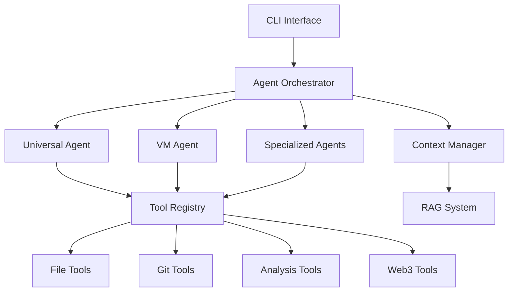

# Agent System Overview

NikCLI features a sophisticated multi-agent architecture with 26+ built-in agents for autonomous AI-driven development.

## Architecture



## Agent Types

<CardGroup cols={2}>
  <Card title="Universal Agent" icon="star">
    All-in-one enterprise agent with 70+ capabilities
  </Card>
  <Card title="VM Agent" icon="server">
    Secure virtualized execution with API key isolation
  </Card>
  <Card title="Specialized Agents" icon="users">
    Domain-specific: React, Backend, DevOps, Code Review
  </Card>
  <Card title="Dynamic Agents" icon="wand-magic">
    Custom agents created from blueprints
  </Card>
</CardGroup>

## Built-in Agents

### Primary Agents

| Agent ID | Description | Capabilities |
|----------|-------------|--------------|
| `universal-agent` | All-purpose development | 70+ capabilities |
| `vm-agent` | Virtualized secure execution | 30+ capabilities |
| `react-expert` | React & Next.js development | React, NextJS, hooks, SSR |
| `backend-expert` | API & database development | API, database, auth, microservices |
| `frontend-expert` | UI/UX development | UI, responsive, accessibility |
| `devops-expert` | Infrastructure & CI/CD | Docker, K8s, CI/CD, monitoring |
| `code-review` | Code quality analysis | Quality, security, best practices |
| `autonomous-coder` | Fully autonomous coding | Full-stack, file operations |

### Additional Agents

| Agent ID | Specialization |
|----------|---------------|
| `nextjs-expert` | Next.js, SSR, routing |
| `vue-expert` | Vue.js, Vuex, Vue Router |
| `framer-motion-expert` | UI animations, gestures |
| `system-admin` | System administration |
| `optimization-expert` | Performance optimization |
| `coding-expert` | General coding |
| `ai-expert` | AI analysis and insights |
| `ai-sdk-integrator` | Vercel AI SDK integration |
| `code-generator` | Scaffolding, boilerplate |

### Agent Aliases

For convenience, many agents have aliases:
- `react-agent` → `react-expert`
- `frontend-agent` → `frontend-expert`
- `backend-agent` → `backend-expert`
- `devops-agent` → `devops-expert`
- `coding-agent` → `coding-expert`

## Universal Agent Capabilities

The Universal Agent includes 70+ capabilities across categories:

### Code Generation
- `code-generation`, `component-creation`, `api-development`
- `database-design`, `scaffolding`, `boilerplate`

### Frontend
- `react`, `nextjs`, `typescript`, `javascript`
- `html`, `css`, `frontend`, `components`, `hooks`
- `jsx`, `tsx`

### Backend
- `backend`, `nodejs`, `api-development`, `database`
- `server-architecture`, `rest-api`, `graphql`, `microservices`

### DevOps
- `devops`, `ci-cd`, `docker`, `kubernetes`
- `deployment`, `infrastructure`, `monitoring`, `security`

### Autonomous
- `file-operations`, `project-creation`, `autonomous-coding`
- `system-administration`, `full-stack-development`

### Analysis
- `code-review`, `performance-analysis`, `security-analysis`
- `quality-assessment`, `architecture-review`, `documentation-generation`

## VM Agent Features

The VM Agent provides secure, isolated execution:

| Feature | Description |
|---------|-------------|
| **API Key Proxy** | Zero exposure of credentials |
| **Token Budget** | Managed token allocation |
| **Rate Limiting** | Request throttling |
| **Resource Isolation** | Container sandboxing |
| **Audit Logging** | Complete action history |
| **Git Operations** | Repository management |

Capabilities include:
- `vm-management`, `container-orchestration`, `isolated-execution`
- `repository-cloning`, `repository-analysis`, `dependency-management`
- `full-stack-development`, `ci-cd-integration`, `git-operations`
- `testing-automation`, `documentation-generation`, `code-quality-analysis`

## Autonomy Levels

| Level | Description | Behavior |
|-------|-------------|----------|
| `supervised` | Requires approval | All actions need confirmation |
| `semi-autonomous` | Limited independence | Critical actions need approval |
| `fully-autonomous` | Complete autonomy | Executes without confirmation |

## Context Scopes

| Scope | Description |
|-------|-------------|
| `file` | Single file context |
| `directory` | Directory-level context |
| `project` | Project-wide context |
| `workspace` | Entire workspace context |

## Agent Configuration

### Default Settings

| Setting | Default |
|---------|---------|
| Max Concurrent Tasks | 3 |
| Default Timeout | 30 minutes |
| Max Retry Attempts | 3 |

### Using Agents

```bash
# List all agents
/agents

# Run specific agent
/agent react-expert "Create a login form"

# Autonomous mode
/auto "Build a todo app"

# Parallel execution
/parallel "react,backend" "Create full-stack app"

# Create custom agent
/create-agent myagent "Custom specialization"

# Launch from blueprint
/launch-agent react-expert "Create navbar"
```

## Execution Modes

### Interactive Mode

```bash
/agent universal-agent "create auth system"
```

1. Agent analyzes task
2. Generates execution plan
3. **Requests approval**
4. Executes approved plan
5. Reports results

### Autonomous Mode

```bash
/auto "create auth system"
```

1. Agent analyzes task
2. Generates execution plan
3. **Executes immediately**
4. Reports results

<Warning>
Autonomous mode skips approval prompts. Use for trusted tasks only.
</Warning>

### Planning Mode

```bash
/plan "create auth system"
```

1. Agent generates detailed plan
2. User reviews and edits
3. User approves plan
4. Step-by-step execution
5. User approves critical steps

## Tool Security Levels

| Level | Tools | Approval |
|-------|-------|----------|
| **Safe** | File reading, code analysis, search | None required |
| **Confirmed** | File writing, Git ops, installs | Required |
| **Dangerous** | Deletion, system commands, deploy | Required with warning |

## Agent Factory

Create custom agents with blueprints:

```bash
# View factory status
/factory

# List blueprints
/blueprints

# Create from blueprint
/create-agent --vm custom-agent "Specialization description"

# Export blueprint
/export-blueprint my-agent blueprint.json
```

Blueprint properties:
- `name`, `specialization`
- `capabilities` (array of strings)
- `requiredTools` (array)
- `autonomyLevel`: supervised, semi-autonomous, fully-autonomous
- `contextScope`: file, directory, project, workspace
- `workingStyle`: sequential, parallel, adaptive
- `personality`: proactive, collaborative, analytical, creative (0-100)

## Agent Communication

Agents communicate via EventBus:
- **Task Handoff**: Complete and delegate
- **Help Requests**: Request specialist assistance
- **Conflict Resolution**: Negotiate changes
- **Status Updates**: Broadcast progress

## Monitoring

```bash
# View agent statistics
/stats

# Check factory status
/factory

# View parallel execution
/parallel-status

# View parallel logs
/parallel-logs
```

## Next Steps

<CardGroup cols={2}>
  <Card title="Universal Agent" icon="star" href="/agent-system/universal-agent">
    Deep dive into the Universal Agent
  </Card>
  <Card title="Agent Commands" icon="terminal" href="/cli-reference/agent-commands">
    Complete agent command reference
  </Card>
</CardGroup>
