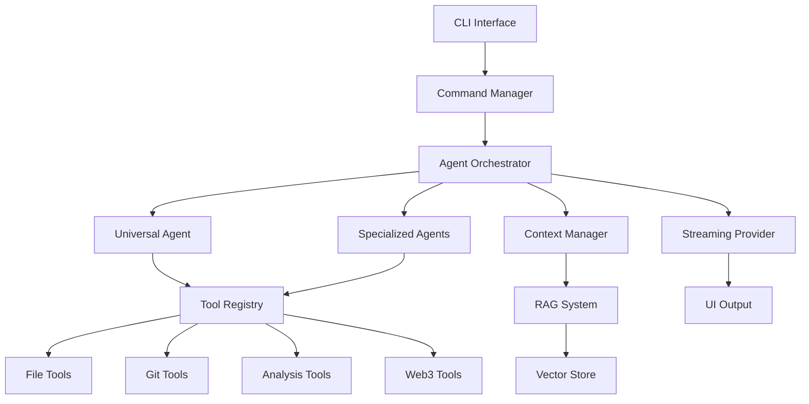

## Introduction

NikCLI's agent system is a sophisticated, multi-layered architecture that enables autonomous AI-driven development. Agents can analyze code, make decisions, execute complex tasks, and coordinate with each other to accomplish goals.

## Architecture Overview



## Agent Hierarchy

<CardGroup cols={2}>
  <Card title="Base Agent" icon="cube">
    Abstract foundation providing core functionality for all agents
  </Card>

  <Card title="Universal Agent" icon="stars">
    Single comprehensive agent with 64+ capabilities for general tasks
  </Card>

  <Card title="Specialized Agents" icon="toolbox">
    Domain-specific agents (Frontend, Backend, DevOps, etc.)
  </Card>

  <Card title="Autonomous Orchestrator" icon="network-wired">
    Coordinates multiple agents for complex multi-step workflows
  </Card>
</CardGroup>

## Core Components

### 1. Agent Factory

Creates and manages agent instances:

```typescript
interface AgentFactory {
  createAgent(type: AgentType, config: AgentConfig): Agent;
  getAgent(id: string): Agent;
  listAgents(): Agent[];
  destroyAgent(id: string): void;
}
```

**Features:**
- **Dynamic Creation**: Instantiate agents on-demand
- **Lifecycle Management**: Handle agent initialization and cleanup
- **Resource Pooling**: Reuse agents for efficiency
- **Configuration**: Customize agent behavior per instance

### 2. Agent Orchestrator

Coordinates multi-agent workflows:

```typescript
interface AgentOrchestrator {
  orchestrate(task: Task): Promise<Result>;
  coordinateAgents(agents: Agent[]): void;
  handleConflicts(conflicts: Conflict[]): Resolution;
  optimizeExecution(plan: ExecutionPlan): OptimizedPlan;
}
```

**Capabilities:**
- **Task Decomposition**: Break complex tasks into subtasks
- **Agent Selection**: Choose optimal agents for each subtask
- **Parallel Execution**: Run independent tasks concurrently
- **Conflict Resolution**: Handle competing agent actions
- **Progress Tracking**: Monitor and report execution status

### 3. Tool Registry

Manages tools available to agents:

```typescript
interface ToolRegistry {
  registerTool(tool: Tool): void;
  getTool(name: string): Tool;
  getToolsForAgent(agent: Agent): Tool[];
  validateToolAccess(agent: Agent, tool: Tool): boolean;
}
```

**Features:**
- **40+ Built-in Tools**: File ops, Git, search, Web3, etc.
- **Security Levels**: safe, confirmed, dangerous
- **Access Control**: Tool permissions per agent type
- **Context Awareness**: Tools understand project context

### 4. Context Manager

Provides agents with project understanding:

```typescript
interface ContextManager {
  getProjectContext(): ProjectContext;
  getFileContext(path: string): FileContext;
  searchSemantic(query: string): SearchResults;
  updateContext(changes: Change[]): void;
}
```

**Provides:**
- **Project Structure**: File tree, dependencies, architecture
- **Code Understanding**: Semantic search via RAG
- **Framework Detection**: React, Vue, Express, etc.
- **Coding Patterns**: Project conventions and styles
- **Historical Context**: Previous changes and decisions

### 5. Streaming Provider

Manages real-time output:

```typescript
interface StreamingProvider {
  streamMessage(message: StreamMessage): void;
  handleToolCall(toolCall: ToolCall): void;
  updateProgress(progress: Progress): void;
  streamComplete(): void;
}
```

**Features:**
- **Real-time Updates**: Stream agent thoughts and actions
- **Progress Tracking**: Visual indicators for long tasks
- **Interactive Prompts**: Request user input during execution
- **Error Handling**: Graceful failure recovery

## Agent Capabilities

### Universal Agent (64+ Capabilities)

<AccordionGroup>
  <Accordion title="Code Generation (12 capabilities)" icon="code">
    - Component creation (React, Vue, Angular)
    - Function/class generation
    - API endpoint creation
    - Database schema design
    - Configuration file generation
    - Boilerplate scaffolding
    - Type definitions
    - Interface design
    - Module structure
    - Package setup
    - Script creation
    - Documentation generation
  </Accordion>

  <Accordion title="Code Analysis (10 capabilities)" icon="magnifying-glass">
    - Quality assessment
    - Security vulnerability scanning
    - Performance profiling
    - Dependency analysis
    - Dead code detection
    - Code smell identification
    - Complexity metrics
    - Test coverage analysis
    - Architecture review
    - Best practices verification
  </Accordion>

  <Accordion title="Code Modification (8 capabilities)" icon="pen-to-square">
    - Refactoring
    - Bug fixing
    - Optimization
    - Modernization
    - Type safety improvements
    - Error handling enhancement
    - Accessibility improvements
    - Internationalization
  </Accordion>

  <Accordion title="Testing (8 capabilities)" icon="vial">
    - Unit test generation
    - Integration test creation
    - E2E test development
    - Test fixing
    - Coverage improvement
    - Mock generation
    - Test refactoring
    - Snapshot testing
  </Accordion>

  <Accordion title="Documentation (6 capabilities)" icon="book">
    - README creation
    - API documentation
    - Inline comments
    - JSDoc/TSDoc generation
    - Architecture diagrams
    - Usage examples
  </Accordion>

  <Accordion title="DevOps (8 capabilities)" icon="server">
    - Docker configuration
    - CI/CD pipeline creation
    - Environment setup
    - Deployment scripts
    - Monitoring setup
    - Infrastructure as Code
    - Build optimization
    - Dependency management
  </Accordion>

  <Accordion title="Debugging (6 capabilities)" icon="bug">
    - Error diagnosis
    - Stack trace analysis
    - Performance debugging
    - Memory leak detection
    - Logic error identification
    - Regression analysis
  </Accordion>

  <Accordion title="Web3/Blockchain (6 capabilities)" icon="ethereum">
    - Smart contract generation
    - DeFi integration
    - Wallet operations
    - Token management
    - Transaction handling
    - Web3 testing
  </Accordion>
</AccordionGroup>

### Specialized Agents

<Tabs>
  <Tab title="Frontend Agent">
    **Expertise:**
    - React, Vue, Angular, Svelte
    - CSS, Tailwind, styled-components
    - State management (Redux, Zustand, Recoil)
    - Component libraries
    - Responsive design
    - Accessibility (WCAG)
    - Performance optimization
    - SEO best practices

    **Use Cases:**
    - UI component creation
    - Layout implementation
    - State management setup
    - Styling and theming
    - Animation and transitions
    - Form handling and validation
  </Tab>

  <Tab title="Backend Agent">
    **Expertise:**
    - Node.js, Express, Fastify, NestJS
    - REST API design
    - GraphQL implementation
    - Database design (SQL, NoSQL)
    - Authentication & authorization
    - Caching strategies
    - API rate limiting
    - Microservices architecture

    **Use Cases:**
    - API endpoint creation
    - Database schema design
    - Authentication systems
    - Business logic implementation
    - Data validation
    - Error handling
  </Tab>

  <Tab title="DevOps Agent">
    **Expertise:**
    - Docker & Kubernetes
    - CI/CD (GitHub Actions, GitLab CI)
    - Cloud platforms (AWS, GCP, Azure)
    - Infrastructure as Code (Terraform)
    - Monitoring & logging
    - Security hardening
    - Performance tuning
    - Disaster recovery

    **Use Cases:**
    - Container configuration
    - Pipeline creation
    - Infrastructure setup
    - Deployment automation
    - Monitoring implementation
    - Security auditing
  </Tab>

  <Tab title="Code Review Agent">
    **Expertise:**
    - Security best practices
    - Code quality standards
    - Performance optimization
    - Accessibility compliance
    - Test coverage
    - Documentation quality
    - Design patterns
    - SOLID principles

    **Use Cases:**
    - Pull request reviews
    - Security audits
    - Performance analysis
    - Best practice enforcement
    - Technical debt identification
    - Refactoring suggestions
  </Tab>
</Tabs>

## Execution Modes

### Interactive Mode (Default)

```bash
/agent universal-agent "create authentication system"
```

**Flow:**
1. Agent analyzes task
2. Generates execution plan
3. **Requests approval** from user
4. Executes approved plan
5. Reports results

**Best For:**
- Learning how agents work
- Critical or sensitive tasks
- When you want control
- Exploratory development

### Autonomous Mode

```bash
/auto "create authentication system"
```

**Flow:**
1. Agent analyzes task
2. Generates execution plan
3. **Executes immediately** (no approval)
4. Reports results

**Best For:**
- Trusted, routine tasks
- When you're confident in the request
- Batch operations
- CI/CD automation

<Warning>
  Autonomous mode skips approval prompts. Review results carefully.
</Warning>

### Planning Mode

```bash
/plan "create authentication system"
```

**Flow:**
1. Agent generates detailed plan
2. User reviews and edits plan
3. User approves modified plan
4. Agents execute plan step-by-step
5. User approves each critical step

**Best For:**
- Complex multi-phase projects
- When you want fine-grained control
- Learning and education
- High-stakes changes

## Agent Communication

Agents can communicate through an event bus:

```typescript
interface AgentEvent {
  type: 'task-complete' | 'task-failed' | 'help-needed' | 'conflict';
  source: Agent;
  data: any;
  timestamp: number;
}

class EventBus {
  subscribe(event: string, handler: (event: AgentEvent) => void): void;
  publish(event: AgentEvent): void;
  unsubscribe(event: string, handler: Function): void;
}
```

**Communication Patterns:**
- **Task Handoff**: One agent completes task, hands off to another
- **Help Requests**: Agent requests assistance from specialist
- **Conflict Resolution**: Agents negotiate conflicting changes
- **Status Updates**: Agents broadcast progress

## Agent State Management

```typescript
interface AgentState {
  id: string;
  type: AgentType;
  status: 'idle' | 'analyzing' | 'planning' | 'executing' | 'waiting' | 'error';
  currentTask?: Task;
  progress?: Progress;
  context: AgentContext;
  history: Action[];
}
```

**State Tracking:**
- **Idle**: Agent available for tasks
- **Analyzing**: Understanding the task
- **Planning**: Creating execution plan
- **Executing**: Performing actions
- **Waiting**: Awaiting user input
- **Error**: Encountered failure

## Performance & Optimization

<CardGroup cols={2}>
  <Card title="Parallel Execution" icon="diagram-project">
    Multiple agents work simultaneously on independent tasks
  </Card>

  <Card title="Intelligent Caching" icon="database">
    Reuse analysis results and context across sessions
  </Card>

  <Card title="Token Optimization" icon="coins">
    Minimize API costs through smart context management
  </Card>

  <Card title="Streaming Output" icon="water">
    Real-time updates reduce perceived latency
  </Card>
</CardGroup>

## Security Model

### Tool Security Levels

<Steps>
  <Step title="Safe Tools">
    No approval required:
    - File reading
    - Code analysis
    - Search operations
    - Documentation generation
  </Step>

  <Step title="Confirmed Tools">
    Require approval:
    - File writing
    - File modification
    - Git operations
    - Package installation
  </Step>

  <Step title="Dangerous Tools">
    Require explicit approval with warning:
    - File deletion
    - System commands
    - Environment modification
    - Deployment operations
  </Step>
</Steps>

### Access Control

```typescript
interface AgentPermissions {
  allowedTools: string[];
  allowedPaths: string[];
  deniedPaths: string[];
  maxFileSize: number;
  requireApproval: boolean;
  canExecuteCommands: boolean;
}
```

## Monitoring & Observability

Track agent performance:

```bash
# View agent statistics
/agent-stats

# Monitor active agents
/agent-list --active

# View agent history
/agent-history universal-agent

# Export agent metrics
/agent-metrics --format json
```

<Tip>
  Enable monitoring to track agent performance and optimize your workflows
</Tip>

## Next Steps

<CardGroup cols={2}>
  <Card
    title="Universal Agent"
    icon="stars"
    href="/agent-system/universal-agent"
  >
    Master the versatile Universal Agent
  </Card>

  <Card
    title="Specialized Agents"
    icon="toolbox"
    href="/agent-system/specialized-agents"
  >
    Learn about domain-specific agents
  </Card>

  <Card
    title="Orchestration"
    icon="network-wired"
    href="/agent-system/orchestration"
  >
    Understand multi-agent coordination
  </Card>

  <Card
    title="Custom Agents"
    icon="screwdriver-wrench"
    href="/agent-system/custom-agents"
  >
    Build your own specialized agents
  </Card>
</CardGroup>
