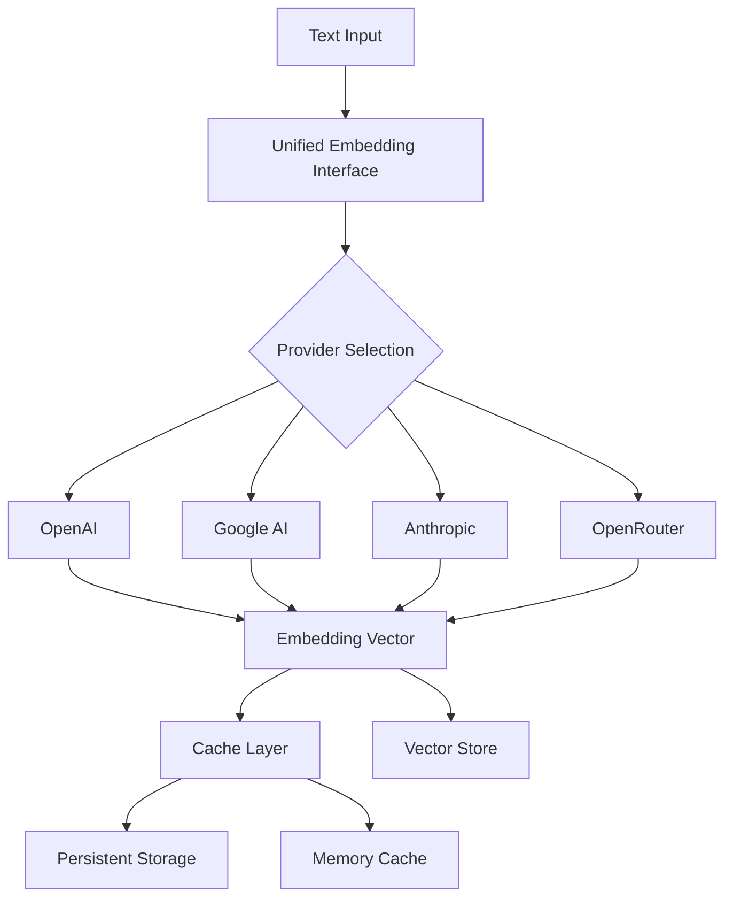

# Embeddings System

NikCLI's unified embedding interface provides consistent vector embedding generation across multiple AI providers with intelligent caching, cost tracking, and automatic fallback.

## Architecture



## Supported Providers

### OpenAI

```typescript
// Default provider with best performance
{
  provider: 'openai',
  model: 'text-embedding-3-small',  // Recommended
  dimensions: 1536,
  cost: '$0.00002 per 1K tokens'
}

// Available models:
// - text-embedding-3-small (1536 dims) - Recommended
// - text-embedding-3-large (3072 dims) - Higher accuracy
// - text-embedding-ada-002 (1536 dims) - Legacy
```

### Google AI

```typescript
{
  provider: 'google',
  model: 'text-embedding-004',
  dimensions: 768,
  cost: '$0.000025 per 1K tokens'
}
```

### Anthropic

```typescript
{
  provider: 'anthropic',
  model: 'claude-3-haiku',
  dimensions: 1024,
  cost: '$0.00025 per 1K tokens'
}
```

### OpenRouter

```typescript
{
  provider: 'openrouter',
  model: 'openai/text-embedding-3-small',
  dimensions: 1536,
  cost: 'Varies by model'
}
```

## Configuration

### Environment Variables

```bash
# Primary provider
EMBEDDING_PROVIDER=openai
EMBEDDING_MODEL=text-embedding-3-small

# API keys
OPENAI_API_KEY=sk-...
GOOGLE_AI_API_KEY=...
ANTHROPIC_API_KEY=sk-ant-...
OPENROUTER_API_KEY=sk-or-...

# Performance tuning
EMBED_BATCH_SIZE=100
EMBEDDING_CACHE_ENABLED=true
EMBEDDING_MAX_RETRIES=3
```

### Programmatic Configuration

```typescript
import { unifiedEmbeddingInterface } from '@nicomatt69/nikcli';

// Update configuration
unifiedEmbeddingInterface.updateConfig({
  provider: 'openai',
  model: 'text-embedding-3-small',
  dimensions: 1536,
  maxTokens: 8191,
  batchSize: 100,
  cacheEnabled: true,
  persistenceEnabled: true
});

// Get current config
const config = unifiedEmbeddingInterface.getConfig();
console.log(config);
```

## Usage

### Single Embedding

```typescript
import { unifiedEmbeddingInterface } from '@nicomatt69/nikcli';

// Generate single embedding
const result = await unifiedEmbeddingInterface.generateEmbedding(
  "This is a test document",
  "doc-123",
  { type: 'documentation' }
);

console.log({
  id: result.id,
  dimensions: result.dimensions,
  model: result.model,
  provider: result.provider,
  cost: `$${result.cost.toFixed(6)}`,
  tokensUsed: result.tokensUsed,
  timestamp: result.timestamp
});

// Access vector
const vector = result.vector; // number[]
```

### Batch Embeddings

```typescript
// Generate multiple embeddings efficiently
const texts = [
  { text: "First document", id: "doc-1" },
  { text: "Second document", id: "doc-2" },
  { text: "Third document", id: "doc-3", metadata: { category: 'code' } }
];

const results = await unifiedEmbeddingInterface.generateEmbeddings(texts);

results.forEach((result, i) => {
  console.log(`${result.id}: ${result.dimensions} dimensions, $${result.cost.toFixed(6)}`);
});

// Total cost
const totalCost = results.reduce((sum, r) => sum + r.cost, 0);
console.log(`Total cost: $${totalCost.toFixed(6)}`);
```

### Similarity Calculation

```typescript
// Calculate similarity between embeddings
const embedding1 = await unifiedEmbeddingInterface.generateEmbedding("Text 1");
const embedding2 = await unifiedEmbeddingInterface.generateEmbedding("Text 2");

const similarity = unifiedEmbeddingInterface.calculateSimilarity(
  embedding1.vector,
  embedding2.vector
);

console.log(`Similarity: ${(similarity * 100).toFixed(2)}%`);
// Uses cosine similarity: 0 = completely different, 1 = identical
```

### Similarity Search

```typescript
// Search for similar embeddings
const queryText = "authentication middleware";
const candidateEmbeddings = [
  await unifiedEmbeddingInterface.generateEmbedding("JWT auth handler", "doc-1"),
  await unifiedEmbeddingInterface.generateEmbedding("User login controller", "doc-2"),
  await unifiedEmbeddingInterface.generateEmbedding("Database connection", "doc-3")
];

const results = await unifiedEmbeddingInterface.searchSimilar(
  queryText,
  candidateEmbeddings,
  10,    // limit
  0.3    // threshold
);

results.forEach(result => {
  console.log(`${result.id}: ${(result.score * 100).toFixed(1)}% similar`);
});
```

## Caching System

### Memory Cache

```typescript
// Automatic memory caching
const result1 = await unifiedEmbeddingInterface.generateEmbedding("Same text");
// Generated from API

const result2 = await unifiedEmbeddingInterface.generateEmbedding("Same text");
// Retrieved from cache (instant, no cost)

// Cache configuration
{
  maxSize: 10000,        // Max entries in memory
  ttl: 24 * 60 * 60 * 1000  // 24 hours
}
```

### Persistent Cache

```typescript
// Persistent cache location
// ~/.nikcli/vector-cache/unified-embeddings.json

// Cache structure
{
  embeddings: {
    "hash-1": {
      id: "doc-1",
      vector: [...],
      dimensions: 1536,
      model: "text-embedding-3-small",
      timestamp: "2025-10-26T..."
    }
  },
  stats: {
    totalEmbeddings: 1000,
    totalQueries: 5000,
    cacheHitRate: 0.8,
    totalCost: 0.05
  }
}
```

### Cache Management

```typescript
// Clear all caches
unifiedEmbeddingInterface.clearCache();

// Optimize cache (remove old entries)
await unifiedEmbeddingInterface.optimizeCache();

// Get cache stats
const stats = unifiedEmbeddingInterface.getStats();
console.log({
  totalEmbeddings: stats.totalEmbeddings,
  cacheHitRate: `${(stats.cacheHitRate * 100).toFixed(1)}%`,
  averageLatency: `${Math.round(stats.averageLatency)}ms`,
  totalCost: `$${stats.totalCost.toFixed(6)}`
});
```

## Cost Management

### Cost Estimation

```typescript
// Estimate costs before generating
function estimateCost(texts: string[], provider: string = 'openai'): number {
  const totalChars = texts.reduce((sum, text) => sum + text.length, 0);
  const estimatedTokens = Math.ceil(totalChars / 4);

  const costPer1K = {
    openai: 0.00002,
    google: 0.000025,
    anthropic: 0.00003
  };

  return (estimatedTokens / 1000) * (costPer1K[provider] || 0.00002);
}

const texts = Array(1000).fill("Sample text for embedding");
const estimatedCost = estimateCost(texts, 'openai');
console.log(`Estimated cost: $${estimatedCost.toFixed(4)}`);
```

### Cost Tracking

```typescript
// Track costs by provider
const stats = unifiedEmbeddingInterface.getStats();

console.log('Cost by provider:');
Object.entries(stats.byProvider).forEach(([provider, stats]) => {
  console.log(`  ${provider}: ${stats.count} embeddings, $${stats.cost.toFixed(6)}`);
});

console.log(`Total cost: $${stats.totalCost.toFixed(6)}`);
```

### Cost Optimization

```typescript
// 1. Use caching aggressively
unifiedEmbeddingInterface.updateConfig({
  cacheEnabled: true,
  persistenceEnabled: true
});

// 2. Batch requests
const texts = [/*...*/];
const batchSize = 100;
for (let i = 0; i < texts.length; i += batchSize) {
  const batch = texts.slice(i, i + batchSize);
  await unifiedEmbeddingInterface.generateEmbeddings(batch);
}

// 3. Use smaller models when appropriate
unifiedEmbeddingInterface.updateConfig({
  model: 'text-embedding-3-small', // Instead of 3-large
  dimensions: 1536 // Instead of 3072
});
```

## Performance Optimization

### Batch Processing

```typescript
// Process large datasets efficiently
async function batchEmbeddings(texts: string[], batchSize: number = 100) {
  const results = [];
  const startTime = Date.now();

  for (let i = 0; i < texts.length; i += batchSize) {
    const batch = texts.slice(i, i + batchSize);
    const batchQueries = batch.map((text, idx) => ({
      text,
      id: `batch-${i + idx}`
    }));

    const batchResults = await unifiedEmbeddingInterface.generateEmbeddings(batchQueries);
    results.push(...batchResults);

    console.log(`Processed ${i + batch.length}/${texts.length} texts`);
  }

  const duration = Date.now() - startTime;
  console.log(`Total time: ${duration}ms (${(duration / texts.length).toFixed(2)}ms per text)`);

  return results;
}

// Example: 1000 texts in batches of 100
const texts = Array(1000).fill("Sample text");
const results = await batchEmbeddings(texts, 100);
```

### Parallel Processing

```typescript
// Process multiple batches in parallel
async function parallelEmbeddings(texts: string[], concurrency: number = 3) {
  const batchSize = 100;
  const batches = [];

  for (let i = 0; i < texts.length; i += batchSize) {
    batches.push(texts.slice(i, i + batchSize));
  }

  const results = [];
  for (let i = 0; i < batches.length; i += concurrency) {
    const concurrentBatches = batches.slice(i, i + concurrency);
    const promises = concurrentBatches.map(batch =>
      unifiedEmbeddingInterface.generateEmbeddings(
        batch.map((text, idx) => ({ text, id: `${i}-${idx}` }))
      )
    );

    const batchResults = await Promise.all(promises);
    results.push(...batchResults.flat());
    console.log(`Completed ${Math.min((i + concurrency) * batchSize, texts.length)}/${texts.length}`);
  }

  return results;
}
```

### Dimension Validation

```typescript
// Validate embedding dimensions
const embedding = await unifiedEmbeddingInterface.generateEmbedding("test");

const isValid = unifiedEmbeddingInterface.validateEmbedding(
  embedding.vector,
  'myComponent'
);

if (!isValid) {
  console.error('Invalid embedding dimensions or format');
}

// Get current dimensions from active provider
const currentDims = unifiedEmbeddingInterface.getCurrentDimensions();
console.log(`Current embedding dimensions: ${currentDims}`);
```

## Monitoring

### Status Logging

```typescript
// Log comprehensive status
unifiedEmbeddingInterface.logStatus();

// Output:
// ⚡︎ Unified Embedding Interface Status
// ==================================================
// Configuration:
//   Provider: openai
//   Model: text-embedding-3-small
//   Dimensions: 1536
//   Batch Size: 100
//   Caching: enabled
//
// Performance:
//   Total Embeddings: 5,234
//   Cache Hit Rate: 82.3%
//   Average Latency: 145ms
//   Total Cost: $0.0234
//
// By Provider:
//   openai: 5,234 embeddings, $0.0234, 145ms avg
//
// Cache:
//   Memory Cache: 1,523 entries
//   Last Optimization: 3:45 PM
```

### Performance Metrics

```typescript
const stats = unifiedEmbeddingInterface.getStats();

console.log({
  embeddings: {
    total: stats.totalEmbeddings,
    queries: stats.totalQueries,
    cacheHitRate: `${(stats.cacheHitRate * 100).toFixed(1)}%`
  },
  performance: {
    averageLatency: `${Math.round(stats.averageLatency)}ms`,
    totalCost: `$${stats.totalCost.toFixed(6)}`
  },
  providers: Object.entries(stats.byProvider).map(([name, data]) => ({
    provider: name,
    count: data.count,
    cost: `$${data.cost.toFixed(6)}`,
    latency: `${Math.round(data.averageLatency)}ms`
  }))
});
```

## Best Practices

### 1. Choose Right Model

```typescript
// For general use: text-embedding-3-small
unifiedEmbeddingInterface.updateConfig({
  model: 'text-embedding-3-small',
  dimensions: 1536
});

// For high accuracy needs: text-embedding-3-large
unifiedEmbeddingInterface.updateConfig({
  model: 'text-embedding-3-large',
  dimensions: 3072
});

// Trade-off: 3-large is 2x dimensions, ~2x cost, ~15% more accurate
```

### 2. Leverage Caching

```typescript
// Always enable caching for production
unifiedEmbeddingInterface.updateConfig({
  cacheEnabled: true,
  persistenceEnabled: true
});

// Pre-cache common queries
const commonQueries = [
  "authentication",
  "database connection",
  "error handling"
];

for (const query of commonQueries) {
  await unifiedEmbeddingInterface.generateEmbedding(query);
}
```

### 3. Batch Requests

```typescript
// ✓ Good: Batch processing
const texts = [/* 100 texts */];
const results = await unifiedEmbeddingInterface.generateEmbeddings(
  texts.map((text, i) => ({ text, id: `doc-${i}` }))
);

// ✗ Poor: Individual requests
for (const text of texts) {
  await unifiedEmbeddingInterface.generateEmbedding(text);
}
```

### 4. Monitor Costs

```typescript
// Set up cost monitoring
setInterval(() => {
  const stats = unifiedEmbeddingInterface.getStats();

  if (stats.totalCost > 1.0) {
    console.warn(`Warning: Embedding costs exceeded $1.00 (current: $${stats.totalCost.toFixed(2)})`);
  }
}, 3600000); // Check hourly
```

## Troubleshooting

### High Costs

```bash
# Problem: Embedding costs too high
# Solution: Enable caching and use smaller models

export EMBEDDING_CACHE_ENABLED=true
export EMBEDDING_MODEL=text-embedding-3-small
export EMBED_BATCH_SIZE=100
```

### Slow Performance

```typescript
// Problem: Slow embedding generation
// Solution: Increase batch size and use parallel processing

unifiedEmbeddingInterface.updateConfig({
  batchSize: 200 // Increase from default 100
});

// Use parallel processing
await parallelEmbeddings(texts, 5); // 5 concurrent batches
```

### Dimension Mismatches

```typescript
// Problem: Embedding dimension mismatches
// Solution: Check and validate dimensions

const currentDims = unifiedEmbeddingInterface.getCurrentDimensions();
console.log(`Expected dimensions: ${currentDims}`);

// Validate before use
if (embedding.length !== currentDims) {
  console.error(`Dimension mismatch: expected ${currentDims}, got ${embedding.length}`);
}
```

## Related Documentation

<CardGroup cols={2}>
  <Card title="Semantic Search" icon="magnifying-glass" href="/context-rag/semantic-search">
    Use embeddings for search
  </Card>
  <Card title="Workspace Indexing" icon="folder-tree" href="/context-rag/workspace-indexing">
    Index files with embeddings
  </Card>
  <Card title="Token Management" icon="coins" href="/context-rag/token-management">
    Optimize token usage
  </Card>
  <Card title="Cache System" icon="database" href="/context-rag/cache-system">
    Performance optimization
  </Card>
</CardGroup>
