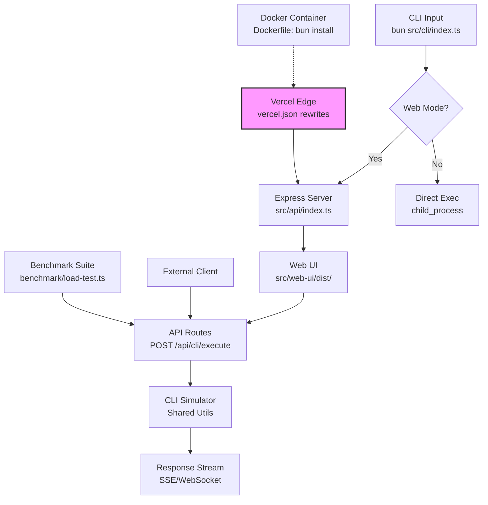

```mdx
<Meta title="Architecture" description="Comprehensive architecture overview for NIKOCLI (@nicomatt69/nikcli), an Express-based CLI tool with integrated web UI and API, built with TypeScript, Bun, and deployed on Vercel." image="/docs/architecture-overview.png" />

# NIKOCLI Architecture

<Card title="Quick Overview">
NIKOCLI is a versatile, Express-powered CLI tool that doubles as a full-stack application with a web UI and RESTful API. It leverages TypeScript for type safety, Bun for fast runtime and package management, Docker for containerization, and Vercel for seamless serverless deployment. 

Key features include:
- **CLI Interface**: Command-line interactions for core operations.
- **Web UI**: Interactive dashboard served via Express.
- **API**: Scalable endpoints for external integrations.
- **Benchmarking**: Performance testing suite.

The architecture follows a modular monorepo design, ensuring separation of concerns while enabling rapid development and deployment.
</Card>

<Search />

## Tech Stack

| Category       | Technologies                          | Purpose                                                                 |
|----------------|---------------------------------------|-------------------------------------------------------------------------|
| **Runtime**    | Bun, Node.js (via Express)            | High-performance JS/TS runtime; Bun for dev/build speed.                |
| **Backend**    | Express.js, TypeScript                | API server with type-safe routes and middleware.                        |
| **Frontend**   | React/Vite (in web-ui/)               | SPA web UI bundled and served statically via Express.                   |
| **Build/Tools**| TypeScript, Bun, esbuild/tsc          | Compilation, bundling; multiple tsconfig.json for API/UI/CLI isolation. |
| **Deployment** | Vercel, Docker                        | Serverless hosting with vercel.json rewrites; Dockerfile for edge cases.|
| **Testing**    | Vitest/Jest (in benchmark/)           | Performance and unit benchmarks.                                        |
| **Other**      | Zod (validation), Prisma (optional DB)| Schema validation; lightweight ORM if DB-integrated.                    |

Inferred from `package.json` (deps: `express@^4.19`, `@types/express`, `bun-types`, `typescript@^5`, `zod`), `tsconfig.json` (strict mode, paths mapping), `vercel.json` (rewrites for API/UI), and `Dockerfile` (Bun base image, multi-stage build).

## Project Structure

```
nikocli/
├── src/
│   ├── api/              # Express server: routes, controllers, middleware
│   │   ├── routes/
│   │   ├── controllers/
│   │   └── middleware/
│   ├── web-ui/           # React/Vite app: components, pages, assets
│   │   ├── src/
│   │   └── vite.config.ts
│   ├── cli/              # CLI entrypoint: commands, parsers (using Commander.js)
│   └── shared/           # Types, utils, constants (shared across modules)
├── scripts/              # Build, deploy, migration scripts (Bun shell)
├── benchmark/            | Performance tests, load simulations
├── docker/               # Dockerfile, docker-compose.yml
├── .github/workflows/    # CI/CD with Bun/Vercel
├── vercel.json           # Routing: /api/* -> src/api/index.ts
├── tsconfig.json         # Root TS config (references sub-projects)
├── bun.lockb             # Lockfile for Bun
└── package.json          # Monorepo deps, scripts: "dev", "build", "vercel-deploy"
```

## Key Modules

### API Module (`src/api/`)
- **Core**: Express app with JSON parsing, CORS, rate-limiting.
- **Routes**: `/api/v1/cli`, `/api/v1/benchmark`, `/api/v1/ui-proxy`.
- **TypeScript Integration**: Full typing via `Express.Request/Response` extensions.
```typescript
// Example: src/api/routes/cli.ts
import { Router } from 'express';
import { z } from 'zod';

const router = Router();
const cliSchema = z.object({ command: z.string() });

router.post('/execute', (req, res) => {
  // Type-safe validation
  const { command } = cliSchema.parse(req.body);
  // Complex logic: CLI simulation with comments
  // 1. Parse command -> 2. Execute via child_process.spawn('bun', ['run', command])
  // 3. Stream output -> res.writeChunk()
  res.json({ output: '...' });
});
```

### Web UI Module (`src/web-ui/`)
- Vite-powered React app for dashboard.
- Served at `/` via Express static middleware.
- Integrates with API for real-time CLI execution visualization.

### CLI Module (`src/cli/`)
- Bun script entry: `bun src/cli/index.ts <command>`.
- Uses `commander` for arg parsing; pipes to API for web-hybrid mode.

### Scripts & Benchmark
- `scripts/deploy.ts`: Vercel CLI wrapper.
- `benchmark/load-test.ts`: Artillery/Vitest for API perf.

## Architecture Flow & Data Flows

<Steps title="High-Level Request Flow">
1. **CLI Entry**: `nikocli run --web` → Spins Express dev server.
2. **Web/API Access**: Browser hits `/` (UI) or `/api/*` → Express router.
3. **Data Processing**: UI → API → CLI executor → Response stream.
4. **Benchmark**: `bun benchmark/` → Simulated loads → Metrics to console/DB.
5. **Deploy**: `bun run deploy` → Vercel builds serverless functions from `api/index.ts`.
</Steps>



**Data Flow Notes**:
- **Unidirectional**: CLI/UI → API → Executor (no direct DB; stateless).
- **Streaming**: Real-time output via Express `res.write()`.
- **Validation**: Zod schemas at every ingress point.

## Deployment & Scalability

### Vercel Deployment (Primary)
- `vercel.json`:
```json
{
  "rewrites": [{ "source": "/api/(.*)", "destination": "/api/index.ts" }],
  "functions": { "api/index.ts": { "runtime": "nodejs18.x" } }
}
```
- Serverless: Auto-scales to zero; Bun build optimizes cold starts.
- **Scalability**: Horizontal via Vercel regions; API Gateway handles 1000s RPS.

### Docker (Self-Hosted/Edge)
```dockerfile
# Dockerfile (multi-stage)
FROM oven/bun:1 AS builder
WORKDIR /app
COPY package.json bun.lockb ./
RUN bun install
COPY . .
RUN bun build --target=bun src/api/index.ts

FROM oven/bun:1-slim
COPY --from=builder /app/dist /app
EXPOSE 3000
CMD ["bun", "run", "/app/index.js"]
```
- `docker-compose.yml` for local dev with volumes.

**Scalability Features**:
- **Stateless**: No sessions; JWT optional.
- **Caching**: Vercel Edge Cache for UI assets.
- **Horizontal Scale**: Express cluster mode or Vercel functions.
- **Monitoring**: Integrates Vercel Analytics; benchmark/ for load testing.

<Card title="Next Steps">
- [Explore API Docs](/docs/api-reference)
- [Run Benchmarks](/docs/benchmarking)
- [Contribute to CLI](/docs/development)
</Card>
```