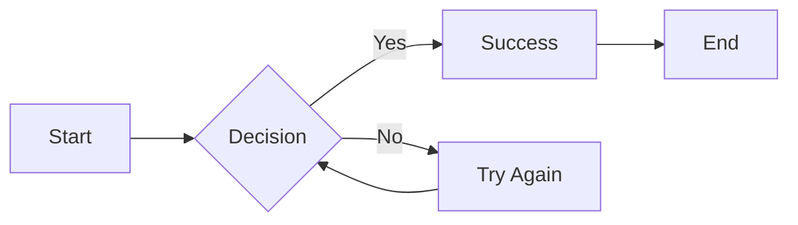
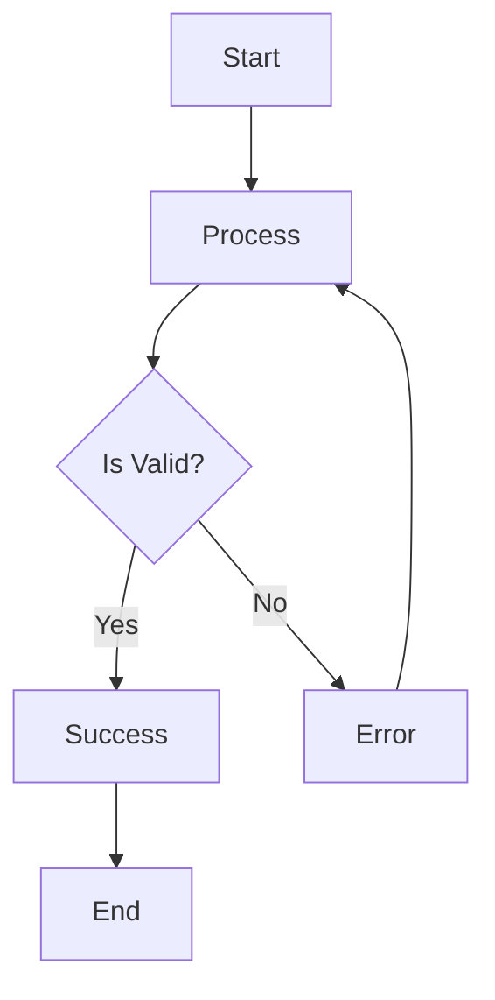
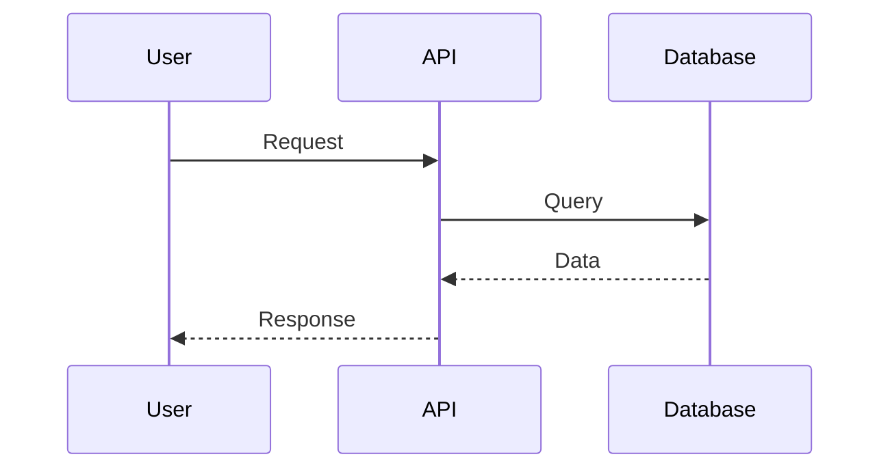
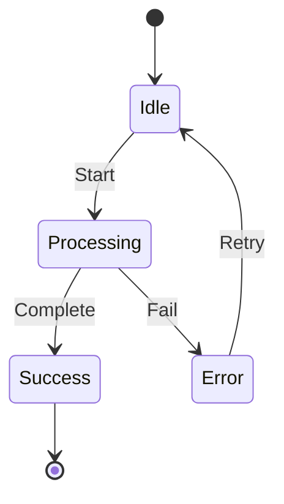

# Mermaid Diagram Rendering

NikCLI supports automatic rendering of Mermaid diagrams directly in your terminal with multiple rendering strategies optimized for different terminal environments.

## Features

✨ **Multi-Strategy Rendering**
- **ASCII Art**: High-quality text-based diagrams using `mermaid-ascii`
- **Inline Images**: PNG rendering for iTerm2, Kitty, and WezTerm
- **Smart Fallback**: Code display with clickable link to mermaid.live

🎯 **Automatic Detection**
- Detects terminal capabilities automatically
- Selects optimal rendering strategy
- Graceful fallback on errors

⚡ **Performance**
- Diagram caching for instant re-display
- Configurable rendering options
- Minimal dependencies

## Rendering Strategies

### 1. ASCII Art (Recommended)

The `mermaid-ascii` tool renders high-quality ASCII art diagrams directly in your terminal.

**Pros:**
- Works in any terminal
- Clean, readable output
- Fast rendering
- No external dependencies once installed

**Cons:**
- Limited diagram type support (flowcharts, graphs)
- Requires binary installation

### 2. Inline Images (High Quality)

For terminals that support inline images (iTerm2, Kitty, WezTerm), diagrams are rendered as PNG images embedded directly in terminal output.

**Pros:**
- Perfect visual fidelity
- Supports all Mermaid diagram types
- Professional appearance

**Cons:**
- Only works in supported terminals
- Slightly slower than ASCII
- Requires `@mermaid-js/mermaid-cli`

### 3. Fallback (Universal)

Displays the Mermaid code in a formatted box with a clickable link to mermaid.live for online visualization.

**Pros:**
- Works everywhere
- No installation required
- Zero dependencies

**Cons:**
- Requires browser for visualization
- Manual interaction needed

## Installation

### mermaid-ascii (Recommended)

#### macOS

**Option 1: Download Binary**
```bash
# Intel/AMD64
curl -L https://github.com/AlexanderGrooff/mermaid-ascii/releases/latest/download/mermaid-ascii-darwin-amd64 -o /usr/local/bin/mermaid-ascii

# Apple Silicon (M1/M2)
curl -L https://github.com/AlexanderGrooff/mermaid-ascii/releases/latest/download/mermaid-ascii-darwin-arm64 -o /usr/local/bin/mermaid-ascii

chmod +x /usr/local/bin/mermaid-ascii
```

**Option 2: With Go**
```bash
go install github.com/AlexanderGrooff/mermaid-ascii@latest
```

#### Linux

```bash
# AMD64
curl -L https://github.com/AlexanderGrooff/mermaid-ascii/releases/latest/download/mermaid-ascii-linux-amd64 -o /usr/local/bin/mermaid-ascii

# ARM64
curl -L https://github.com/AlexanderGrooff/mermaid-ascii/releases/latest/download/mermaid-ascii-linux-arm64 -o /usr/local/bin/mermaid-ascii

chmod +x /usr/local/bin/mermaid-ascii
```

#### Verify Installation

```bash
mermaid-ascii --version
```

### Inline Image Support

Inline image rendering is automatically enabled if you're using:
- **iTerm2** (macOS)
- **Kitty** (macOS/Linux)
- **WezTerm** (macOS/Linux/Windows)

No additional installation required - just use one of these terminals!

## Configuration

Customize Mermaid rendering via `.nikcli/config.json`:

```json
{
  "userPreferences": {
    "mermaidRendering": {
      "strategy": "auto",
      "enableCache": true,
      "asciiPaddingX": 5,
      "asciiPaddingY": 5,
      "asciiBorderPadding": 1,
      "theme": "dark"
    }
  }
}
```

### Configuration Options

| Option | Type | Default | Description |
|--------|------|---------|-------------|
| `strategy` | `'auto' \| 'inline-image' \| 'ascii-art' \| 'fallback'` | `'auto'` | Rendering strategy. `auto` detects best option. |
| `enableCache` | `boolean` | `true` | Cache rendered diagrams for performance |
| `asciiPaddingX` | `number` | `5` | Horizontal spacing between nodes (ASCII) |
| `asciiPaddingY` | `number` | `5` | Vertical spacing between nodes (ASCII) |
| `asciiBorderPadding` | `number` | `1` | Padding between text and border (ASCII) |
| `theme` | `'default' \| 'dark' \| 'neutral' \| 'forest'` | `'dark'` | Diagram color theme |

### Force Specific Strategy

```json
{
  "userPreferences": {
    "mermaidRendering": {
      "strategy": "ascii-art"  // Always use ASCII art
    }
  }
}
```

## Usage

Mermaid diagrams are automatically detected and rendered from code blocks:

````markdown

````

The rendering happens automatically when NikCLI outputs responses containing Mermaid diagrams.

## Supported Diagram Types

### With `mermaid-ascii`:
- ✅ Flowcharts (LR, TD, RL, BT)
- ✅ Basic graphs with labeled edges
- ✅ Node connections
- ✅ Simple styling via `classDef`

⚠️ **Not supported:**
- Subgraphs
- Complex node shapes
- Sequence diagrams
- Gantt charts
- ER diagrams

### With Inline Images:
- ✅ All Mermaid diagram types supported

### Fallback:
- ✅ All diagrams (link to online viewer)

## Diagnostics

Check your terminal's rendering capabilities:

```bash
/mermaid-info
```

Output example:
```
Terminal: iTerm2
Dimensions: 120x40
Inline Images: ✓
Image Protocol: iterm2
Mermaid ASCII Binary: ✓ available
Recommended Strategy: ascii-art
```

## Troubleshooting

### ASCII Rendering Issues

**Problem:** `mermaid-ascii` binary not found

**Solution:**
```bash
which mermaid-ascii  # Check if installed
# If not found, install following instructions above
```

**Problem:** Diagram rendering fails

**Solution:**
```bash
# Test manually
echo "graph LR\n  A-->B" > test.mmd
mermaid-ascii -f test.mmd

# Check syntax at https://mermaid.live
```

### Performance Issues

**Problem:** Slow diagram rendering

**Solution:**
- Enable caching: `"enableCache": true`
- Use ASCII art instead of inline images for faster rendering
- Reduce diagram complexity

### Visual Issues

**Problem:** Diagram too wide/narrow

**Solution:**
Adjust padding in configuration:
```json
{
  "asciiPaddingX": 3,  // Reduce horizontal spacing
  "asciiPaddingY": 2   // Reduce vertical spacing
}
```

**Problem:** Colors don't display correctly

**Solution:**
- Ensure your terminal supports 256 colors
- Try different theme: `"theme": "neutral"`
- Check terminal's color scheme settings

## Examples

### Simple Flowchart

````markdown

````

### Sequence Diagram (Inline Images Only)

````markdown

````

### State Diagram

````markdown

````

## Advanced Usage

### Custom ASCII Padding

For complex diagrams, fine-tune spacing:

```json
{
  "mermaidRendering": {
    "asciiPaddingX": 8,
    "asciiPaddingY": 3,
    "asciiBorderPadding": 2
  }
}
```

### Disable Caching (Development)

```json
{
  "mermaidRendering": {
    "enableCache": false
  }
}
```

Useful when iterating on diagram layouts.

## Best Practices

1. **Keep diagrams simple** - Complex diagrams may not render well in terminals
2. **Use descriptive labels** - Short, clear text works best
3. **Test rendering** - Use `/mermaid-info` to verify capabilities
4. **Choose appropriate strategy** - ASCII for speed, inline for quality
5. **Enable caching** - Improves performance for repeated views

## See Also

- [Mermaid Documentation](https://mermaid.js.org/)
- [mermaid-ascii GitHub](https://github.com/AlexanderGrooff/mermaid-ascii)
- [Mermaid Live Editor](https://mermaid.live/)
- [Terminal Capabilities](./terminal-capabilities.md)
