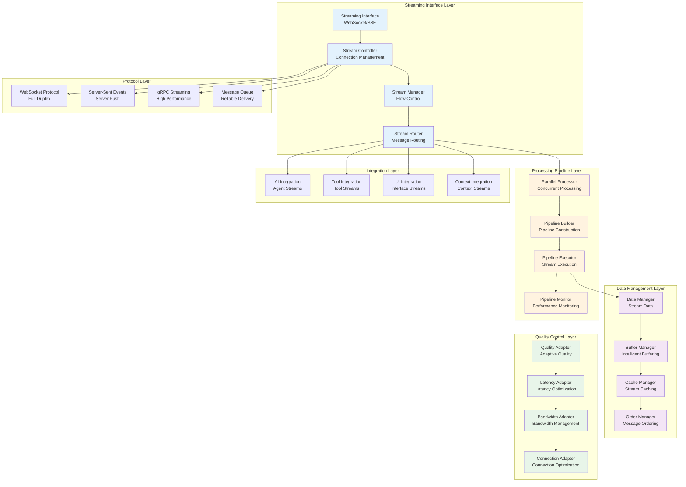

# NikCLI Streaming Infrastructure: Real-Time Communication and Processing Architecture

## Abstract

This paper presents the streaming infrastructure implemented in NikCLI, a comprehensive framework for real-time communication, data processing, and user interface updates in AI-powered development environments. The system implements advanced streaming protocols, parallel processing pipelines, intelligent buffering strategies, and adaptive quality mechanisms. We examine the architectural design, performance optimization techniques, and scalability solutions that enable seamless real-time interactions between AI agents, development tools, and users.

## 1. Introduction

Real-time communication and processing capabilities are essential for modern AI-powered development tools. Traditional request-response architectures introduce latency and break the natural flow of development activities, particularly when dealing with long-running AI operations, continuous tool integration, and collaborative development scenarios.

NikCLI's streaming infrastructure addresses these challenges by implementing a comprehensive real-time communication framework that supports bidirectional streaming, parallel processing pipelines, intelligent data flow management, and adaptive quality optimization. The system enables seamless real-time interactions while maintaining high performance and reliability.

### 1.1 Problem Statement

Current streaming approaches face several limitations:

1. **High Latency**: Traditional polling mechanisms introduce significant delays
2. **Resource Inefficiency**: Continuous connections waste bandwidth and processing power
3. **Scalability Limitations**: Poor performance with increasing concurrent streams
4. **Quality Degradation**: Inconsistent streaming quality under varying network conditions
5. **Integration Complexity**: Difficult integration with existing development tools

### 1.2 Solution Overview

NikCLI's streaming infrastructure implements:

- **Bidirectional Streaming**: Full-duplex communication channels for real-time interaction
- **Parallel Processing Pipelines**: Concurrent processing of multiple data streams
- **Intelligent Buffering**: Adaptive buffering strategies for optimal performance
- **Quality Adaptation**: Dynamic quality adjustment based on network conditions
- **Tool Integration**: Seamless integration with development tools and workflows

## 2. System Architecture

### 2.1 High-Level Architecture

