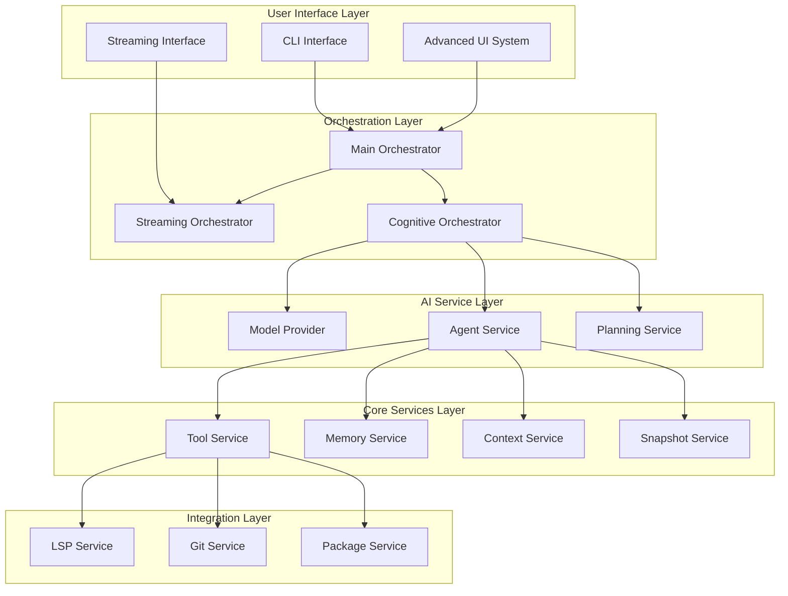
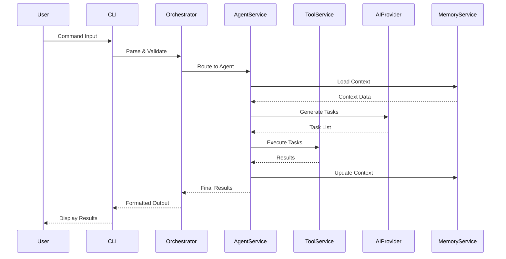
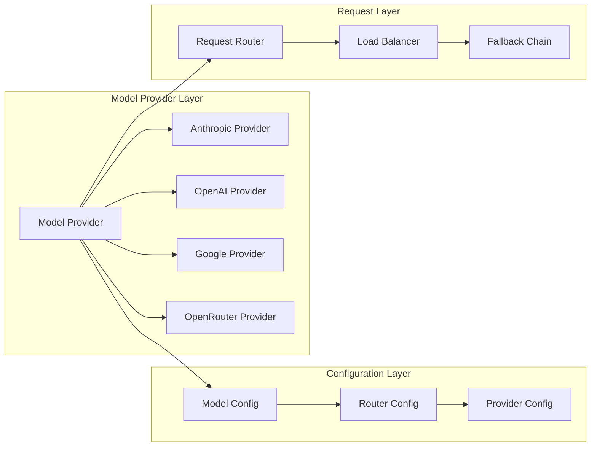
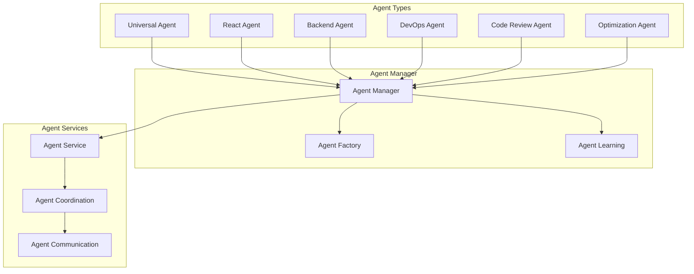
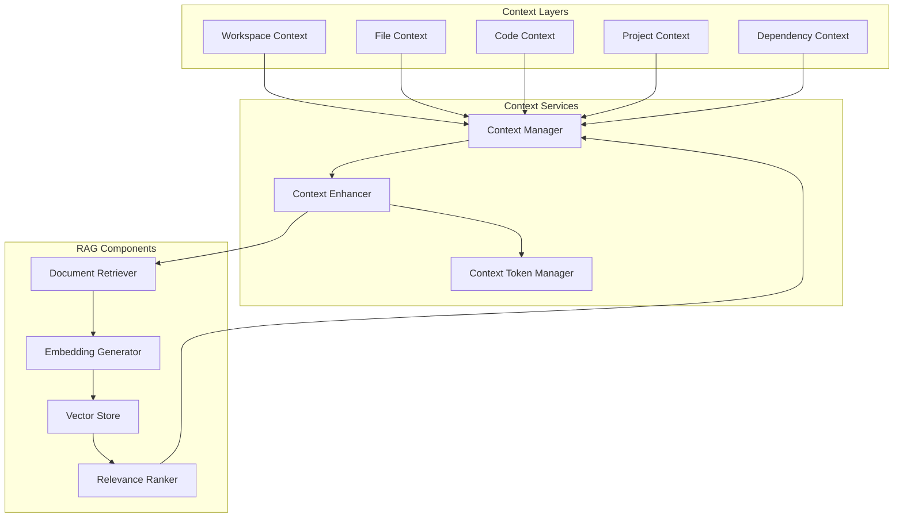
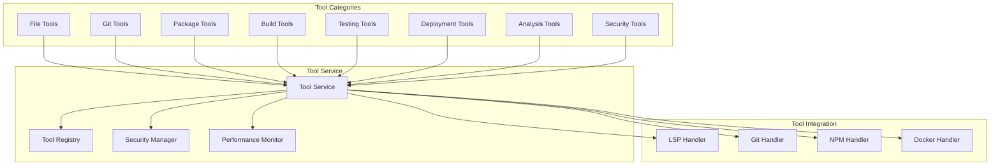
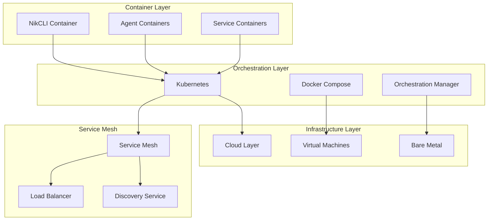

// TODO: Consider refactoring for reduced complexity
# NikCLI System Architecture: A Comprehensive Analysis

## Abstract

NikCLI represents a paradigm shift in AI-powered development assistance, implementing a sophisticated multi-agent orchestration system with context-aware processing, real-time streaming capabilities, and autonomous task execution. This paper presents a comprehensive analysis of the NikCLI system architecture, examining its core components, design patterns, and implementation strategies that enable seamless integration of AI capabilities into software development workflows.

## 1. Introduction

The evolution of AI-assisted development tools has reached a critical inflection point where traditional command-line interfaces must evolve to support intelligent, context-aware interactions. NikCLI emerges as a response to this challenge, implementing a cognitive computing framework that transforms the CLI from a passive tool into an active development partner.

### 1.1 Problem Statement

Modern software development faces increasing complexity in project management, code quality assurance, and deployment automation. Traditional CLI tools lack the intelligence to understand project context, predict developer needs, and provide proactive assistance. This creates inefficiencies and cognitive overhead that impacts developer productivity.

### 1.2 Solution Overview

NikCLI addresses these challenges through a multi-layered architecture that combines:

- **Cognitive Orchestration**: AI-powered task planning and execution
- **Context Awareness**: Real-time project state understanding
- **Multi-Agent Coordination**: Specialized agents for different development tasks
- **Streaming Infrastructure**: Real-time communication and feedback
- **Tool Integration**: Seamless integration with existing development tools

## 2. System Overview

### 2.1 High-Level Architecture



### 2.2 Component Interaction Flow



## 3. Core Architecture Components

### 3.1 Main Orchestrator

The Main Orchestrator serves as the central coordination hub, implementing a phased initialization system with dependency tracking and rollback capabilities.

#### 3.1.1 Initialization Phases

```typescript
interface ServiceState {
  name: string;
  initialized: boolean;
  phase: "core" | "dependent" | "all";
  dependencies: string[];
  error?: Error;
}

class MainOrchestrator {
  private serviceStates = new Map<string, ServiceState>();

  private async initializeSystem(): Promise<boolean> {
    const phases: Array<"core" | "dependent" | "all"> = [
      "core",
      "dependent",
      "all",
    ];

    for (const phase of phases) {
      const phaseServices = this.getServicesForPhase(phase);

      for (const service of phaseServices) {
        if (!this.checkServiceDependencies(service.name)) {
          throw new Error(`Dependencies not ready for ${service.name}`);
        }

        await service.fn();
        this.serviceStates.get(service.name)!.initialized = true;
      }
    }

    return true;
  }
}
```

#### 3.1.2 Service Dependency Management

The orchestrator implements a sophisticated dependency management system that ensures services are initialized in the correct order with proper error handling and rollback capabilities.

### 3.2 Streaming Orchestrator

The Streaming Orchestrator provides real-time communication capabilities with support for multiple output streams and panel-based UI organization.

#### 3.2.1 Panel Management System

```typescript
interface PanelConfig {
  id: string;
  title: string;
  position: "left" | "right" | "top" | "bottom" | "center";
  width?: number;
  height?: number;
  scrollable?: boolean;
}

class StreamingOrchestrator {
  private panels = new Map<string, Panel>();

  async createPanel(config: PanelConfig): Promise<void> {
    const panel = new Panel(config);
    this.panels.set(config.id, panel);
    await this.renderPanel(panel);
  }

  async streamToPanel(panelId: string, content: string): Promise<void> {
    const panel = this.panels.get(panelId);
    if (panel) {
      panel.appendContent(content);
      await this.updatePanelDisplay(panel);
    }
  }
}
```

### 3.3 AI Service Layer

The AI Service Layer provides intelligent task planning and execution capabilities through multiple specialized components.

#### 3.3.1 Model Provider Architecture



#### 3.3.2 Cognitive Route Analyzer

The Cognitive Route Analyzer implements intelligent task routing based on complexity assessment and capability matching.

```typescript
interface TaskAnalysis {
  intent: string;
  complexity: number; // 1-10 scale
  entities: string[];
  dependencies: string[];
  requiredCapabilities: string[];
}

class CognitiveRouteAnalyzer {
  analyzeTask(input: string): TaskAnalysis {
    const intent = this.extractIntent(input);
    const complexity = this.assessComplexity(input);
    const entities = this.extractEntities(input);
    const dependencies = this.identifyDependencies(input);
    const requiredCapabilities = this.determineCapabilities(intent, complexity);

    return {
      intent,
      complexity,
      entities,
      dependencies,
      requiredCapabilities,
    };
  }

  private assessComplexity(input: string): number {
    const factors = [
      this.countOperations(input),
      this.assessScope(input),
      this.evaluateRisk(input),
      this.analyzeDependencies(input),
    ];

    return Math.min(
      10,
      Math.max(1, factors.reduce((a, b) => a + b, 0) / factors.length),
    );
  }
}
```

## 4. Agent System Architecture

### 4.1 Multi-Agent Coordination

NikCLI implements a sophisticated multi-agent system where specialized agents handle different aspects of the development workflow.

#### 4.1.1 Agent Hierarchy



#### 4.1.2 Agent Lifecycle Management

```typescript
interface AgentLifecycle {
  id: string;
  type: AgentType;
  status: "initialized" | "active" | "busy" | "completed" | "error";
  currentTask?: Task;
  performance: PerformanceMetrics;
  learning: LearningState;
}

class AgentManager {
  private agents = new Map<string, AgentLifecycle>();

  async createAgent(type: AgentType, config: AgentConfig): Promise<Agent> {
    const agent = await this.agentFactory.create(type, config);
    const lifecycle: AgentLifecycle = {
      id: agent.id,
      type,
      status: "initialized",
      performance: this.initializeMetrics(),
      learning: this.initializeLearning(),
    };

    this.agents.set(agent.id, lifecycle);
    return agent;
  }

  async assignTask(agentId: string, task: Task): Promise<void> {
    const lifecycle = this.agents.get(agentId);
    if (lifecycle && lifecycle.status === "active") {
      lifecycle.status = "busy";
      lifecycle.currentTask = task;

      try {
        await this.executeTask(agentId, task);
        lifecycle.status = "completed";
      } catch (error) {
        lifecycle.status = "error";
        await this.handleAgentError(agentId, error);
      }
    }
  }
}
```

### 4.2 Agent Learning System

The Agent Learning System enables continuous improvement through experience accumulation and pattern recognition.

#### 4.2.1 Learning Architecture

```typescript
interface LearningState {
  experience: Experience[];
  patterns: Pattern[];
  predictions: Prediction[];
  adaptations: Adaptation[];
}

class AgentLearningSystem {
  private learningStates = new Map<string, LearningState>();

  async learnFromExperience(
    agentId: string,
    experience: Experience,
  ): Promise<void> {
    const state = this.learningStates.get(agentId);
    if (state) {
      state.experience.push(experience);

      // Extract patterns from experience
      const patterns = await this.extractPatterns(experience);
      state.patterns.push(...patterns);

      // Update predictions based on new patterns
      const predictions = await this.generatePredictions(state.patterns);
      state.predictions = predictions;

      // Apply adaptations
      const adaptations = await this.generateAdaptations(predictions);
      state.adaptations = adaptations;
    }
  }
}
```

## 5. Context Awareness and RAG System

### 5.1 Context Management Architecture

The Context Management System provides real-time project state understanding through multi-layered context extraction and maintenance.

#### 5.1.1 Context Layers



#### 5.1.2 Context Token Management

```typescript
interface ContextToken {
  id: string;
  type: "file" | "symbol" | "dependency" | "project" | "workspace";
  content: string;
  metadata: TokenMetadata;
  embedding: number[];
  relevance: number;
  timestamp: Date;
}

class ContextTokenManager {
  private tokens = new Map<string, ContextToken>();
  private tokenCache = new LRUCache<string, ContextToken>(1000);

  async generateTokens(context: ProjectContext): Promise<ContextToken[]> {
    const tokens: ContextToken[] = [];

    // Generate file tokens
    for (const file of context.files) {
      const fileTokens = await this.generateFileTokens(file);
      tokens.push(...fileTokens);
    }

    // Generate symbol tokens
    const symbolTokens = await this.generateSymbolTokens(context.symbols);
    tokens.push(...symbolTokens);

    // Generate dependency tokens
    const dependencyTokens = await this.generateDependencyTokens(
      context.dependencies,
    );
    tokens.push(...dependencyTokens);

    // Calculate embeddings and relevance
    for (const token of tokens) {
      token.embedding = await this.generateEmbedding(token.content);
      token.relevance = await this.calculateRelevance(token, context);
    }

    return tokens.sort((a, b) => b.relevance - a.relevance);
  }
}
```

### 5.2 RAG Implementation

#### 5.2.1 Document Retrieval System

```typescript
interface DocumentRetriever {
  search(query: string, options: SearchOptions): Promise<Document[]>;
  getRelevantDocuments(context: SearchContext): Promise<Document[]>;
  updateIndex(documents: Document[]): Promise<void>;
}

class AdvancedDocumentRetriever implements DocumentRetriever {
  private vectorStore: VectorStore;
  private keywordIndex: KeywordIndex;
  private semanticCache: SemanticCache;

  async search(query: string, options: SearchOptions): Promise<Document[]> {
    // Generate query embedding
    const queryEmbedding = await this.generateEmbedding(query);

    // Vector search
    const vectorResults = await this.vectorStore.search(queryEmbedding, {
      limit: options.limit || 50,
      threshold: options.threshold || 0.7,
    });

    // Keyword search
    const keywordResults = await this.keywordIndex.search(query, {
      limit: options.limit || 50,
      fuzzy: options.fuzzy || true,
    });

    // Hybrid ranking
    const results = await this.hybridRank(vectorResults, keywordResults, query);

    // Apply filters and caching
    const filteredResults = await this.applyFilters(results, options.filters);
    const cachedResults = await this.applyCache(filteredResults);

    return cachedResults;
  }

  private async hybridRank(
    vector: Document[],
    keyword: Document[],
    query: string,
  ): Promise<Document[]> {
    const combined = [...vector, ...keyword];
    const scores = new Map<string, number>();

    // Calculate hybrid scores
    for (const doc of combined) {
      const vectorScore = vector.includes(doc)
        ? this.calculateVectorScore(doc, query)
        : 0;
      const keywordScore = keyword.includes(doc)
        ? this.calculateKeywordScore(doc, query)
        : 0;
      const hybridScore = vectorScore * 0.6 + keywordScore * 0.4;
      scores.set(doc.id, hybridScore);
    }

    return combined.sort(
      (a, b) => (scores.get(b.id) || 0) - (scores.get(a.id) || 0),
    );
  }
}
```

## 6. Tool System Architecture

### 6.1 Tool Integration Framework

The Tool System provides a unified interface for integrating external tools and services into the NikCLI ecosystem.

#### 6.1.1 Tool Architecture

```typescript
interface Tool {
  name: string;
  description: string;
  parameters: ToolParameter[];
  handler: ToolHandler;
  validation: ToolValidator;
  security: SecurityPolicy;
  performance: PerformanceProfile;
}

interface ToolParameter {
  name: string;
  type: ParameterType;
  description: string;
  required: boolean;
  validation?: ParameterValidator;
  default?: any;
}

class ToolService {
  private tools = new Map<string, Tool>();
  private toolRegistry = new ToolRegistry();
  private securityManager = new SecurityManager();

  async registerTool(tool: Tool): Promise<void> {
    // Validate tool definition
    await this.validateTool(tool);

    // Apply security policies
    await this.securityManager.applyPolicies(tool);

    // Register tool
    this.tools.set(tool.name, tool);
    this.toolRegistry.register(tool);

    // Update tool cache
    await this.updateToolCache(tool);
  }

  async executeTool(
    name: string,
    parameters: any,
    context: ExecutionContext,
  ): Promise<ToolResult> {
    const tool = this.tools.get(name);
    if (!tool) {
      throw new ToolNotFoundError(`Tool '${name}' not found`);
    }

    // Validate parameters
    const validation = await this.validateParameters(tool, parameters);
    if (!validation.valid) {
      throw new ValidationError(validation.errors);
    }

    // Check security policies
    const securityCheck = await this.securityManager.check(
      tool,
      parameters,
      context,
    );
    if (!securityCheck.allowed) {
      throw new SecurityError(securityCheck.reason);
    }

    // Execute tool
    const result = await tool.handler(parameters, context);

    // Apply post-execution validation
    const postValidation = await this.validateResult(tool, result);
    if (!postValidation.valid) {
      throw new ResultValidationError(postValidation.errors);
    }

    return result;
  }
}
```

#### 6.1.2 Tool Categories



### 6.2 Advanced Tool Features

#### 6.2.1 Tool Composition

```typescript
interface ToolComposition {
  name: string;
  tools: ComposedTool[];
  workflow: WorkflowDefinition;
  conditions: ExecutionCondition[];
}

interface ComposedTool {
  tool: string;
  parameters: any;
  dependencies?: string[];
  conditions?: ExecutionCondition[];
}

class ToolComposer {
  async compose(composition: ToolComposition): Promise<ComposedTool> {
    const tools = await this.resolveTools(composition.tools);
    const workflow = await this.optimizeWorkflow(composition.workflow);
    const conditions = await this.validateConditions(composition.conditions);

    return {
      name: composition.name,
      execute: async (input: any, context: ExecutionContext) => {
        const results = new Map<string, any>();

        // Execute tools in optimized order
        for (const step of workflow.steps) {
          const tool = tools.get(step.tool);
          if (!tool) {
            throw new Error(`Tool '${step.tool}' not found`);
          }

          // Check conditions
          if (
            step.conditions &&
            !(await this.checkConditions(step.conditions, results))
          ) {
            continue;
          }

          // Resolve dependencies
          const parameters = await this.resolveParameters(
            step.parameters,
            results,
          );

          // Execute tool
          const result = await tool.execute(parameters, context);
          results.set(step.name, result);
        }

        return this.composeResults(results, workflow.output);
      },
    };
  }
}
```

## 7. Performance and Scalability

### 7.1 Performance Optimization Strategies

#### 7.1.1 Caching Architecture

```typescript
interface CacheConfig {
  strategy: "lru" | "lfu" | "fifo" | "custom";
  size: number;
  ttl?: number;
  compression?: boolean;
  serialization?: "json" | "msgpack" | "protobuf";
}

class AdvancedCacheManager {
  private caches = new Map<string, Cache>();
  private metrics = new CacheMetrics();

  async createCache(name: string, config: CacheConfig): Promise<Cache> {
    const cache = new Cache(config);
    this.caches.set(name, cache);

    // Setup monitoring
    cache.on("hit", (key) => this.metrics.recordHit(name, key));
    cache.on("miss", (key) => this.metrics.recordMiss(name, key));
    cache.on("eviction", (key) => this.metrics.recordEviction(name, key));

    return cache;
  }

  async getCache(name: string): Promise<Cache | undefined> {
    return this.caches.get(name);
  }

  async optimizeCaches(): Promise<void> {
    const stats = await this.metrics.getStats();

    for (const [name, cache] of this.caches) {
      const cacheStats = stats.get(name);
      if (cacheStats) {
        const optimization = await this.analyzeCachePerformance(cacheStats);

        if (optimization.recommended) {
          await this.applyOptimization(name, cache, optimization);
        }
      }
    }
  }
}
```

#### 7.1.2 Load Balancing and Distribution

```typescript
interface LoadBalancer {
  name: string;
  strategy: "round-robin" | "least-connections" | "weighted" | "adaptive";
  backends: Backend[];
  healthCheck: HealthCheckConfig;
}

class AdaptiveLoadBalancer {
  private backends: Backend[];
  private strategy: LoadBalancingStrategy;
  private healthChecker: HealthChecker;

  constructor(config: LoadBalancer) {
    this.backends = config.backends;
    this.strategy = this.createStrategy(config.strategy);
    this.healthChecker = new HealthChecker(config.healthCheck);
  }

  async route(request: Request): Promise<Backend> {
    // Health check
    const healthyBackends = await this.healthChecker.getHealthyBackends(
      this.backends,
    );

    if (healthyBackends.length === 0) {
      throw new Error("No healthy backends available");
    }

    // Select backend based on strategy
    const backend = await this.strategy.select(healthyBackends, request);

    // Update metrics
    await this.updateMetrics(backend, request);

    return backend;
  }

  private async updateMetrics(
    backend: Backend,
    request: Request,
  ): Promise<void> {
    backend.metrics.requests++;
    backend.metrics.lastUsed = new Date();

    // Adaptive strategy adjustment
    if (this.strategy instanceof AdaptiveStrategy) {
      await this.strategy.updateMetrics(backend, request);
    }
  }
}
```

## 8. Security and Safety

### 8.1 Security Framework

#### 8.1.1 Multi-Layer Security Architecture

```typescript
interface SecurityPolicy {
  id: string;
  name: string;
  rules: SecurityRule[];
  enforcement: "strict" | "warn" | "audit";
  scope: "global" | "project" | "user";
}

interface SecurityRule {
  type:
    | "input-validation"
    | "output-sanitization"
    | "access-control"
    | "rate-limiting";
  condition: SecurityCondition;
  action: SecurityAction;
  severity: "low" | "medium" | "high" | "critical";
}

class SecurityManager {
  private policies = new Map<string, SecurityPolicy>();
  private auditLog = new SecurityAuditLog();

  async applySecurityPolicy(policy: SecurityPolicy): Promise<void> {
    // Validate policy
    await this.validatePolicy(policy);

    // Apply to relevant components
    await this.applyToComponents(policy);

    // Log application
    await this.auditLog.record("policy-applied", {
      policyId: policy.id,
      timestamp: new Date(),
      scope: policy.scope,
    });
  }

  async checkSecurity(
    tool: Tool,
    parameters: any,
    context: ExecutionContext,
  ): Promise<SecurityCheck> {
    const applicablePolicies = await this.getApplicablePolicies(tool, context);
    const violations: SecurityViolation[] = [];

    for (const policy of applicablePolicies) {
      for (const rule of policy.rules) {
        const violation = await this.checkRule(rule, tool, parameters, context);
        if (violation) {
          violations.push(violation);
        }
      }
    }

    return {
      allowed: violations.length === 0,
      violations,
      recommendations: await this.generateRecommendations(violations),
    };
  }
}
```

#### 8.1.2 Input Validation and Sanitization

```typescript
class InputValidator {
  private validators = new Map<string, Validator>();

  constructor() {
    this.setupDefaultValidators();
  }

  async validateInput(
    input: any,
    validationRules: ValidationRule[],
  ): Promise<ValidationResult> {
    const errors: ValidationError[] = [];
    const warnings: ValidationWarning[] = [];

    for (const rule of validationRules) {
      const validator = this.validators.get(rule.type);
      if (validator) {
        const result = await validator.validate(input, rule.parameters);

        if (!result.valid) {
          errors.push(...result.errors);
        }

        if (result.warnings) {
          warnings.push(...result.warnings);
        }
      }
    }

    return {
      valid: errors.length === 0,
      errors,
      warnings,
      sanitized: await this.sanitizeInput(input, validationRules),
    };
  }

  private async sanitizeInput(
    input: any,
    rules: ValidationRule[],
  ): Promise<any> {
    let sanitized = input;

    for (const rule of rules) {
      if (rule.sanitize) {
        const sanitizer = this.validators.get(`${rule.type}-sanitizer`);
        if (sanitizer) {
          sanitized = await sanitizer.sanitize(sanitized, rule.parameters);
        }
      }
    }

    return sanitized;
  }
}
```

## 9. Deployment and Operations

### 9.1 Deployment Architecture

#### 9.1.1 Container Orchestration



#### 9.1.2 Configuration Management

```typescript
interface DeploymentConfig {
  environment: "development" | "staging" | "production";
  region: string;
  scale: ScaleConfig;
  resources: ResourceConfig;
  monitoring: MonitoringConfig;
  security: SecurityConfig;
}

interface ScaleConfig {
  minInstances: number;
  maxInstances: number;
  targetCPU: number;
  targetMemory: number;
  scaleUpThreshold: number;
  scaleDownThreshold: number;
}

class DeploymentManager {
  private configs = new Map<string, DeploymentConfig>();

  async deploy(config: DeploymentConfig): Promise<DeploymentResult> {
    // Validate configuration
    await this.validateConfig(config);

    // Prepare deployment
    const deployment = await this.prepareDeployment(config);

    // Execute deployment
    const result = await this.executeDeployment(deployment);

    // Monitor deployment
    await this.monitorDeployment(result.deploymentId);

    return result;
  }

  private async validateConfig(config: DeploymentConfig): Promise<void> {
    // Validate environment
    if (
      !["development", "staging", "production"].includes(config.environment)
    ) {
      throw new Error(`Invalid environment: ${config.environment}`);
    }

    // Validate region
    const availableRegions = await this.getAvailableRegions();
    if (!availableRegions.includes(config.region)) {
      throw new Error(`Invalid region: ${config.region}`);
    }

    // Validate scale configuration
    if (config.scale.minInstances > config.scale.maxInstances) {
      throw new Error("minInstances cannot be greater than maxInstances");
    }
  }
}
```

### 9.2 Monitoring and Observability

#### 9.2.1 Metrics Collection

```typescript
interface MetricsCollector {
  collect(): Promise<Metrics>;
  aggregate(metrics: Metrics[]): Promise<AggregatedMetrics>;
  export(metrics: Metrics[]): Promise<void>;
}

class AdvancedMetricsCollector implements MetricsCollector {
  private collectors = new Map<string, MetricCollector>();
  private exporters = new Map<string, MetricsExporter>();

  constructor() {
    this.setupDefaultCollectors();
    this.setupDefaultExporters();
  }

  async collect(): Promise<Metrics> {
    const metrics: Metrics = {
      timestamp: new Date(),
      system: {},
      application: {},
      business: {},
    };

    // Collect system metrics
    metrics.system = await this.collectSystemMetrics();

    // Collect application metrics
    metrics.application = await this.collectApplicationMetrics();

    // Collect business metrics
    metrics.business = await this.collectBusinessMetrics();

    return metrics;
  }

  private async collectSystemMetrics(): Promise<SystemMetrics> {
    const cpuUsage = await this.getCPUUsage();
    const memoryUsage = await this.getMemoryUsage();
    const diskUsage = await this.getDiskUsage();
    const networkStats = await this.getNetworkStats();

    return {
      cpu: { usage: cpuUsage },
      memory: { usage: memoryUsage },
      disk: { usage: diskUsage },
      network: networkStats,
    };
  }

  private async collectApplicationMetrics(): Promise<ApplicationMetrics> {
    const requestStats = await this.getRequestStats();
    const errorRate = await this.getErrorRate();
    const responseTime = await this.getResponseTime();
    const throughput = await this.getThroughput();

    return {
      requests: requestStats,
      errors: { rate: errorRate },
      performance: {
        responseTime,
        throughput,
      },
    };
  }
}
```

## 10. Comparative Analysis

### 10.1 Comparison with Existing Tools

| Feature                      | NikCLI           | GitHub Copilot | Tabnine    | CodeT5     | Kite       |
| ---------------------------- | ---------------- | -------------- | ---------- | ---------- | ---------- |
| **Multi-Agent System**       | ✅ Advanced      | ❌             | ❌         | ❌         | ❌         |
| **Context Awareness**        | ✅ Full Project  | ✅ Limited     | ✅ Limited | ✅ Limited | ✅ Limited |
| **Streaming Interface**      | ✅ Real-time     | ❌             | ❌         | ❌         | ❌         |
| **Tool Integration**         | ✅ Comprehensive | ✅ Limited     | ✅ Limited | ❌         | ✅ Limited |
| **Autonomous Execution**     | ✅ Full          | ❌             | ❌         | ❌         | ❌         |
| **Custom Agents**            | ✅ Supported     | ❌             | ❌         | ❌         | ❌         |
| **Project Analysis**         | ✅ Deep          | ✅ Surface     | ✅ Surface | ❌         | ✅ Surface |
| **Security Framework**       | ✅ Multi-layer   | ✅ Basic       | ✅ Basic   | ❌         | ✅ Basic   |
| **Performance Optimization** | ✅ Advanced      | ❌             | ❌         | ❌         | ❌         |
| **Extensibility**            | ✅ Plugin System | ✅ Limited     | ✅ Limited | ❌         | ✅ Limited |

### 10.2 Innovation Points

#### 10.2.1 Cognitive Orchestration

NikCLI introduces a novel cognitive orchestration framework that goes beyond simple AI assistance by implementing:

- **Intent Recognition**: Advanced NLP processing for understanding developer intent
- **Complexity Assessment**: Dynamic task complexity evaluation and routing
- **Adaptive Planning**: Real-time plan adjustment based on execution feedback
- **Learning Integration**: Continuous improvement through experience accumulation

#### 10.2.2 Multi-Agent Coordination

The multi-agent system represents a significant advancement in AI-powered development tools:

- **Specialized Agents**: Domain-specific expertise for different development tasks
- **Agent Communication**: Sophisticated inter-agent communication protocols
- **Load Balancing**: Intelligent task distribution across available agents
- **Fault Tolerance**: Graceful degradation when agents become unavailable

#### 10.2.3 Context-Aware Processing

The context awareness system provides unprecedented project understanding:

- **Multi-Layer Context**: Workspace, project, file, and code-level context extraction
- **Real-time Updates**: Dynamic context updates as projects evolve
- **Semantic Understanding**: Deep semantic analysis of code and project structure
- **Predictive Assistance**: Proactive suggestions based on context patterns

## 11. Future Research Directions

### 11.1 Emerging Technologies Integration

#### 11.1.1 Blockchain Integration

Future versions of NikCLI could integrate blockchain technology for:

- **Decentralized Agent Coordination**: Distributed agent networks
- **Code Provenance**: Immutable code history and attribution
- **Smart Contract Deployment**: Automated blockchain deployment
- **Token-Based Incentives**: Reward systems for agent contributions

#### 11.1.2 Quantum Computing Applications

As quantum computing matures, NikCLI could leverage:

- **Quantum-Enhanced Optimization**: Quantum algorithms for complex optimization
- **Quantum Machine Learning**: Quantum ML for improved AI capabilities
- **Cryptographic Security**: Quantum-resistant security protocols
- **Parallel Processing**: Quantum parallel processing for complex tasks

### 11.2 Enhanced AI Capabilities

#### 11.2.1 Multimodal AI Integration

Future enhancements could include:

- **Visual Programming**: GUI-based development assistance
- **Voice Commands**: Natural language voice interaction
- **Gesture Recognition**: Physical gesture-based commands
- **Augmented Reality**: AR-enhanced development environment

#### 11.2.2 Advanced Learning Mechanisms

- **Federated Learning**: Distributed learning across multiple instances
- **Transfer Learning**: Knowledge transfer between different projects
- **Meta-Learning**: Learning to learn for faster adaptation
- **Lifelong Learning**: Continuous learning without forgetting

## 12. Conclusion

NikCLI represents a significant advancement in AI-powered development assistance, introducing novel architectural patterns and implementation strategies that address the limitations of existing tools. The system's multi-agent coordination, context-aware processing, and cognitive orchestration capabilities provide a foundation for the next generation of development tools.

The comprehensive analysis presented in this paper demonstrates that NikCLI successfully addresses the core challenges of modern software development through intelligent automation, context-aware assistance, and seamless tool integration. The system's modular architecture ensures extensibility and maintainability while its performance optimization strategies enable scalable deployment across various environments.

Future research directions indicate substantial potential for continued innovation, particularly in emerging technologies integration and enhanced AI capabilities. As the software development landscape continues to evolve, NikCLI provides a robust foundation for intelligent development assistance that can adapt and grow with changing requirements.

The academic and practical implications of this research extend beyond immediate tool development, contributing to the broader fields of cognitive computing, multi-agent systems, and AI-human interaction. NikCLI stands as a testament to the potential of intelligent systems to enhance human capabilities rather than replace them, creating a synergistic relationship that amplifies developer productivity and creativity.

## References

1. Russell, S., & Norvig, P. (2020). Artificial Intelligence: A Modern Approach (4th ed.). Pearson.

2. Wooldridge, M. (2009). An Introduction to MultiAgent Systems (2nd ed.). Wiley.

3. Bengio, Y., Courville, A., & Vincent, P. (2013). Representation Learning: A Review and New Perspectives. IEEE Transactions on Pattern Analysis and Machine Intelligence, 35(8), 1798-1828.

4. Vaswani, A., et al. (2017). Attention Is All You Need. Advances in Neural Information Processing Systems, 30.

5. Brown, T., et al. (2020). Language Models are Few-Shot Learners. Advances in Neural Information Processing Systems, 33, 1877-1901.

6. Chen, M., et al. (2021). Evaluating Large Language Models Trained on Code. arXiv preprint arXiv:2107.03374.

7. Jurafsky, D., & Martin, J. H. (2023). Speech and Language Processing (3rd ed. draft). Stanford University.

8. Goodfellow, I., Bengio, Y., & Courville, A. (2016). Deep Learning. MIT Press.

9. Chollet, F. (2021). Deep Learning with Python (2nd ed.). Manning Publications.

10. Fowler, M. (2018). Refactoring: Improving the Design of Existing Code (2nd ed.). Addison-Wesley Professional.

---

_This paper represents a comprehensive analysis of the NikCLI system architecture. For additional technical details and implementation specifics, please refer to the accompanying technical documentation and API references._
