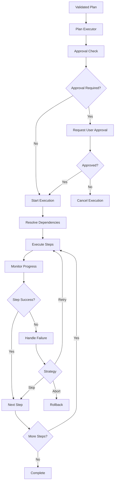

# Execution Flow

The execution flow orchestrates the step-by-step execution of validated plans with real-time monitoring, progress tracking, failure handling, and rollback capabilities.

## Execution Architecture

### Overview



## Plan Executor

### Initialization

```typescript
import { PlanExecutor } from '@nikcli/planning'
import { ToolRegistry } from '@nikcli/tools'

const toolRegistry = new ToolRegistry(process.cwd())

const executor = new PlanExecutor(toolRegistry, {
  maxStepsPerPlan: 50,
  requireApprovalForRisk: 'high',
  enableRollback: true,
  logLevel: 'info',
  timeoutPerStep: 60000,
  autoApproveReadonly: true
})
```

### Configuration Options

```typescript
interface PlannerConfig {
  /** Maximum steps allowed in a plan */
  maxStepsPerPlan: number

  /** Risk level requiring user approval */
  requireApprovalForRisk: 'medium' | 'high'

  /** Enable automatic rollback on failure */
  enableRollback: boolean

  /** Logging verbosity */
  logLevel: 'debug' | 'info' | 'warn' | 'error'

  /** Timeout per step in milliseconds */
  timeoutPerStep: number

  /** Auto-approve read-only operations */
  autoApproveReadonly?: boolean
}
```

## Execution Lifecycle

### 1. Pre-Execution Validation

```typescript
async function executePlan(plan: ExecutionPlan): Promise<PlanExecutionResult> {
  // Start execution mode
  unifiedRenderer.startExecution('plan')
  advancedUI.startPlanExecution()

  // Log execution start
  await unifiedRenderer.logToolCall(
    'plan_execution',
    { title: plan.title },
    { mode: 'plan' },
    { showInRecentUpdates: true, persistent: true }
  )

  // Initialize result
  const result: PlanExecutionResult = {
    planId: plan.id,
    status: 'completed',
    startTime: new Date(),
    stepResults: [],
    summary: {
      totalSteps: plan.steps.length,
      successfulSteps: 0,
      failedSteps: 0,
      skippedSteps: 0
    }
  }

  // Request approval if needed
  const approval = await requestApproval(plan)
  if (!approval.approved) {
    result.status = 'cancelled'
    return result
  }

  // Filter steps based on approval
  const stepsToExecute = plan.steps.filter(
    step => !approval.modifiedSteps?.includes(step.id)
  )

  // Continue with execution...
}
```

### 2. Approval Process

```typescript
async function requestApproval(
  plan: ExecutionPlan
): Promise<PlanApprovalResponse> {
  // Check if approval required
  const requiresApproval = shouldRequireApproval(plan)

  if (!requiresApproval) {
    return {
      approved: true,
      timestamp: new Date()
    }
  }

  // Display plan for approval
  await displayPlanForApproval(plan)

  // Enable input bypass for inquirer
  inputQueue.enableBypass()

  try {
    const answers = await inquirer.prompt([
      {
        type: 'list',
        name: 'approved',
        message: 'Do you approve this execution plan?',
        choices: [
          { name: 'Yes', value: true },
          { name: 'No', value: false }
        ]
      },
      {
        type: 'checkbox',
        name: 'modifiedSteps',
        message: 'Select steps to skip (optional):',
        choices: plan.steps.map(step => ({
          name: `${step.title} - ${step.description}`,
          value: step.id,
          checked: false
        })),
        when: answers => answers.approved
      }
    ])

    return {
      approved: answers.approved,
      modifiedSteps: answers.modifiedSteps || [],
      timestamp: new Date()
    }
  } finally {
    inputQueue.disableBypass()
  }
}
```

### 3. Dependency Resolution

```typescript
function resolveDependencyOrder(steps: ExecutionStep[]): ExecutionStep[] {
  const stepMap = new Map(steps.map(step => [step.id, step]))
  const resolved: ExecutionStep[] = []
  const resolving = new Set<string>()

  function resolve(stepId: string): void {
    // Already resolved
    if (resolved.find(s => s.id === stepId)) return

    // Circular dependency check
    if (resolving.has(stepId)) {
      throw new Error(`Circular dependency detected: ${stepId}`)
    }

    const step = stepMap.get(stepId)
    if (!step) return

    resolving.add(stepId)

    // Resolve dependencies first
    if (step.dependencies) {
      for (const depId of step.dependencies) {
        resolve(depId)
      }
    }

    resolving.delete(stepId)
    resolved.push(step)
  }

  // Resolve all steps
  for (const step of steps) {
    resolve(step.id)
  }

  return resolved
}
```

### 4. Step Execution

```typescript
async function executeStep(
  step: ExecutionStep,
  plan: ExecutionPlan
): Promise<StepExecutionResult> {
  const startTime = Date.now()
  const result: StepExecutionResult = {
    stepId: step.id,
    status: 'success',
    duration: 0,
    timestamp: new Date(),
    logs: []
  }

  try {
    advancedUI.startSpinner(`Executing: ${step.title}`, 'info')

    switch (step.type) {
      case 'tool':
        result.output = await executeTool(step)
        break

      case 'validation':
        result.output = await executeValidation(step, plan)
        break

      case 'user_input':
        result.output = await executeUserInput(step)
        break

      case 'decision':
        result.output = await executeDecision(step, plan)
        break

      default:
        throw new Error(`Unknown step type: ${step.type}`)
    }

    result.duration = Date.now() - startTime
    advancedUI.succeedSpinner(`Completed: ${step.title}`)

  } catch (error: any) {
    result.status = 'failure'
    result.error = error
    result.duration = Date.now() - startTime
    advancedUI.failSpinner(`Failed: ${step.title}`)
    advancedUI.logError(`Step failed: ${error.message}`)
  }

  return result
}
```

## Step Execution Types

### Tool Execution

```typescript
async function executeTool(step: ExecutionStep): Promise<any> {
  if (!step.toolName) {
    throw new Error('Tool step missing toolName')
  }

  const unifiedRenderer = getUnifiedToolRenderer()
  const toolCallId = `tool-${step.id}`

  // Log function call
  await unifiedRenderer.logToolCall(
    step.toolName,
    step.toolArgs,
    { mode: 'plan', toolCallId },
    { showInRecentUpdates: true, persistent: true }
  )

  // Try secure routing first
  const routed = await trySecureRoute(step)
  if (routed.routed) {
    await unifiedRenderer.logToolResult(
      toolCallId,
      routed.result,
      { mode: 'plan' }
    )
    return routed.result
  }

  // Execute through tool registry
  const tool = toolRegistry.getTool(step.toolName)
  if (!tool) {
    throw new Error(`Tool not found: ${step.toolName}`)
  }

  // Execute with timeout
  const timeoutPromise = new Promise((_, reject) => {
    setTimeout(
      () => reject(new Error('Step execution timeout')),
      config.timeoutPerStep
    )
  })

  const executionPromise = tool.execute(
    ...(step.toolArgs ? Object.values(step.toolArgs) : [])
  )

  const result = await Promise.race([executionPromise, timeoutPromise])

  // Log result
  await unifiedRenderer.logToolResult(
    toolCallId,
    result,
    { mode: 'plan' }
  )

  return result
}
```

### Secure Tool Routing

```typescript
async function trySecureRoute(
  step: ExecutionStep
): Promise<{ routed: boolean; result?: any }> {
  const name = String(step.toolName).toLowerCase()
  const args = step.toolArgs || {}

  // Git operations
  if (name === 'git-tools' || name === 'git') {
    const action = String(args.action || '').toLowerCase()
    switch (action) {
      case 'status':
        return { routed: true, result: await secureTools.gitStatus() }

      case 'diff':
        return { routed: true, result: await secureTools.gitDiff(args.args || {}) }

      case 'commit':
        return {
          routed: true,
          result: await secureTools.gitCommit(args)
        }

      case 'applypatch':
        return {
          routed: true,
          result: await secureTools.gitApplyPatch(args.patch)
        }
    }
  }

  // Config patching
  if (name === 'json-patch-tool' || name === 'config_patch') {
    const { filePath, operations, options } = args
    if (filePath && Array.isArray(operations)) {
      return {
        routed: true,
        result: await secureTools.applyConfigPatch(
          filePath,
          operations,
          options || {}
        )
      }
    }
  }

  // Command execution
  if (name === 'bash-tool' || name === 'run-command-tool') {
    const { command, options } = args
    if (typeof command === 'string' && command.trim()) {
      return {
        routed: true,
        result: await secureTools.executeCommand(command, options || {})
      }
    }
  }

  return { routed: false }
}
```

### Agent Delegation

```typescript
async function executeAgentStep(
  step: ExecutionStep,
  plan: ExecutionPlan
): Promise<any> {
  const agentType = step.metadata?.agent as string || 'agent'
  const taskText = step.metadata?.task as string || step.description

  // Start agent task
  const taskId = await agentService.executeTask(
    agentType,
    taskText,
    { planId: plan.id, stepId: step.id }
  )

  // Monitor progress
  agentService.on('task_progress', (task, update) => {
    if (task.id === taskId) {
      const progress = update?.progress || 0
      advancedUI.updateSpinner(
        `Executing: ${step.title} (${progress}%)`
      )
    }
  })

  // Wait for completion with timeout
  const timeoutMs = Math.max(30000, config.timeoutPerStep)
  const agentCompleted = new Promise<AgentTask>((resolve, reject) => {
    const onComplete = (task: AgentTask) => {
      if (task.id === taskId) {
        agentService.off('task_complete', onComplete)
        resolve(task)
      }
    }
    agentService.on('task_complete', onComplete)

    setTimeout(() => {
      agentService.off('task_complete', onComplete)
      reject(new Error('Agent step timeout'))
    }, timeoutMs)
  })

  const task = await agentCompleted

  if (task.status === 'completed') {
    return task.result || { completed: true }
  }

  throw new Error(task.error || 'Agent task failed')
}
```

### Validation Steps

```typescript
async function executeValidation(
  step: ExecutionStep,
  plan: ExecutionPlan
): Promise<any> {
  advancedUI.updateSpinner('Running validation checks...', 'info')

  const checks: string[] = []

  // Validate prerequisites
  if (plan.context.relevantFiles) {
    const filesExist = await Promise.all(
      plan.context.relevantFiles.map(file =>
        fs.access(file).then(() => true).catch(() => false)
      )
    )
    if (filesExist.every(Boolean)) {
      checks.push('prerequisites')
    }
  }

  // Validate permissions
  try {
    await fs.access(plan.context.projectPath, fs.constants.W_OK)
    checks.push('permissions')
  } catch {
    throw new Error('Insufficient permissions')
  }

  // Validate dependencies
  checks.push('dependencies')

  return { validated: true, checks }
}
```

### User Input Steps

```typescript
async function executeUserInput(step: ExecutionStep): Promise<any> {
  advancedUI.stopSpinner()

  inputQueue.enableBypass()

  try {
    const answers = await inquirer.prompt([
      {
        type: 'list',
        name: 'proceed',
        message: step.description,
        choices: [
          { name: 'Yes', value: true },
          { name: 'No', value: false }
        ],
        default: 0
      }
    ])

    return answers
  } finally {
    inputQueue.disableBypass()
  }
}
```

## Progress Tracking

### Real-time Updates

```typescript
// Step-level progress
planner.on('stepStart', ({ stepId, stepIndex, todos }) => {
  console.log(`[${stepIndex + 1}/${todos.length}] Starting: ${stepId}`)
})

planner.on('stepProgress', ({ stepId, progress }) => {
  console.log(`Step ${stepId}: ${progress}%`)
})

planner.on('stepComplete', ({ stepId, result }) => {
  console.log(`✓ Completed: ${stepId}`)
})

// Plan-level progress
planner.on('planExecutionStart', ({ planId, title }) => {
  console.log(`🎯 Starting: ${title}`)
})

planner.on('planExecutionComplete', ({ planId }) => {
  console.log(`🎉 Plan completed: ${planId}`)
})

planner.on('planExecutionError', ({ planId, error }) => {
  console.error(`❌ Plan failed: ${error}`)
})
```

### Progress Metrics

```typescript
interface ProgressMetrics {
  completedSteps: number
  totalSteps: number
  percentage: number
  currentStep?: string
  estimatedTimeRemaining?: number
  averageStepDuration: number
  elapsedTime: number
}

function calculateProgress(
  result: PlanExecutionResult
): ProgressMetrics {
  const completed = result.stepResults.length
  const total = result.summary.totalSteps
  const percentage = (completed / total) * 100

  const durations = result.stepResults.map(r => r.duration)
  const avgDuration = durations.reduce((a, b) => a + b, 0) / durations.length

  const remaining = total - completed
  const estimatedTimeRemaining = remaining * avgDuration

  const elapsed = Date.now() - result.startTime.getTime()

  return {
    completedSteps: completed,
    totalSteps: total,
    percentage,
    estimatedTimeRemaining,
    averageStepDuration: avgDuration,
    elapsedTime: elapsed
  }
}
```

## Error Handling

### Failure Strategies

```typescript
async function handleStepFailure(
  step: ExecutionStep,
  result: StepExecutionResult,
  plan: ExecutionPlan
): Promise<'abort' | 'skip' | 'retry' | 'continue'> {
  advancedUI.logError(`Step "${step.title}" failed: ${result.error?.message}`)

  // Non-critical steps: offer to continue
  if (step.riskLevel === 'low') {
    const answers = await inquirer.prompt([
      {
        type: 'list',
        name: 'continue',
        message: 'This step failed but is not critical. Continue?',
        choices: [
          { name: 'Yes', value: true },
          { name: 'No', value: false }
        ]
      }
    ])
    return answers.continue ? 'continue' : 'abort'
  }

  // Critical steps with rollback: offer options
  if (config.enableRollback && step.reversible) {
    const answers = await inquirer.prompt([
      {
        type: 'list',
        name: 'action',
        message: 'Critical step failed. What would you like to do?',
        choices: [
          { name: 'Abort execution', value: 'abort' },
          { name: 'Skip this step', value: 'skip' },
          { name: 'Retry this step', value: 'retry' }
        ]
      }
    ])
    return answers.action
  }

  return 'abort'
}
```

### Rollback Implementation

```typescript
async function rollbackPlan(
  plan: ExecutionPlan,
  executedSteps: StepExecutionResult[]
): Promise<void> {
  advancedUI.logWarning('Starting rollback...')

  // Reverse order execution
  const reversibleSteps = executedSteps
    .filter(result => {
      const step = plan.steps.find(s => s.id === result.stepId)
      return step?.reversible && result.status === 'success'
    })
    .reverse()

  for (const stepResult of reversibleSteps) {
    const step = plan.steps.find(s => s.id === stepResult.stepId)
    if (!step) continue

    try {
      await executeRollbackStep(step, stepResult)
      advancedUI.logSuccess(`Rolled back: ${step.title}`)
    } catch (error: any) {
      advancedUI.logError(`Rollback failed for ${step.title}: ${error.message}`)
    }
  }

  advancedUI.logInfo('Rollback completed')
}

async function executeRollbackStep(
  step: ExecutionStep,
  result: StepExecutionResult
): Promise<void> {
  // Execute rollback based on step type
  if (step.metadata?.rollbackPlan) {
    for (const action of step.metadata.rollbackPlan) {
      await executeRollbackAction(action)
    }
  }
}
```

### Retry Logic

```typescript
async function executeWithRetry(
  step: ExecutionStep,
  plan: ExecutionPlan,
  maxRetries: number = 3
): Promise<StepExecutionResult> {
  let lastError: Error | undefined

  for (let attempt = 1; attempt <= maxRetries; attempt++) {
    try {
      advancedUI.logInfo(`Attempt ${attempt}/${maxRetries}`)
      return await executeStep(step, plan)
    } catch (error: any) {
      lastError = error
      advancedUI.logWarning(`Attempt ${attempt} failed: ${error.message}`)

      if (attempt < maxRetries) {
        // Exponential backoff
        const delay = Math.min(1000 * Math.pow(2, attempt - 1), 10000)
        await new Promise(resolve => setTimeout(resolve, delay))
      }
    }
  }

  throw lastError || new Error('Max retries exceeded')
}
```

## Execution Modes

### Sequential Execution

```typescript
async function executeSequential(
  steps: ExecutionStep[],
  plan: ExecutionPlan
): Promise<StepExecutionResult[]> {
  const results: StepExecutionResult[] = []

  for (const step of steps) {
    const result = await executeStep(step, plan)
    results.push(result)

    if (result.status === 'failure') {
      const strategy = await handleStepFailure(step, result, plan)
      if (strategy === 'abort') break
    }
  }

  return results
}
```

### Parallel Execution

```typescript
async function executeParallel(
  steps: ExecutionStep[],
  plan: ExecutionPlan
): Promise<StepExecutionResult[]> {
  // Group steps by dependency level
  const levels = groupByDependencyLevel(steps)

  const results: StepExecutionResult[] = []

  // Execute each level in parallel
  for (const levelSteps of levels) {
    const levelResults = await Promise.all(
      levelSteps.map(step => executeStep(step, plan))
    )
    results.push(...levelResults)

    // Check for failures
    const failures = levelResults.filter(r => r.status === 'failure')
    if (failures.length > 0) {
      // Handle failures...
      break
    }
  }

  return results
}

function groupByDependencyLevel(
  steps: ExecutionStep[]
): ExecutionStep[][] {
  const levels: ExecutionStep[][] = []
  const processed = new Set<string>()

  while (processed.size < steps.length) {
    const level = steps.filter(step =>
      !processed.has(step.id) &&
      (step.dependencies || []).every(depId => processed.has(depId))
    )

    if (level.length === 0) break

    levels.push(level)
    level.forEach(step => processed.add(step.id))
  }

  return levels
}
```

## Execution Summary

### Result Generation

```typescript
interface PlanExecutionResult {
  planId: string
  status: 'completed' | 'failed' | 'cancelled' | 'partial'
  startTime: Date
  endTime?: Date
  stepResults: StepExecutionResult[]
  summary: {
    totalSteps: number
    successfulSteps: number
    failedSteps: number
    skippedSteps: number
  }
}

async function logExecutionSummary(
  result: PlanExecutionResult
): Promise<void> {
  const duration = result.endTime
    ? result.endTime.getTime() - result.startTime.getTime()
    : 0

  const statusIcon = result.status === 'completed' ? '✓' :
                     result.status === 'partial' ? '⚠️' : '❌'

  let summaryMarkdown = `\n## Execution Summary\n\n`
  summaryMarkdown += `${statusIcon} **Status:** ${result.status.toUpperCase()}\n\n`
  summaryMarkdown += `- Duration: **${Math.round(duration / 1000)}s**\n`
  summaryMarkdown += `- Total Steps: **${result.summary.totalSteps}**\n`
  summaryMarkdown += `- Successful: **${result.summary.successfulSteps}**\n`
  summaryMarkdown += `- Failed: **${result.summary.failedSteps}**\n`
  summaryMarkdown += `- Skipped: **${result.summary.skippedSteps}**\n\n`

  await streamttyService.renderBlock(summaryMarkdown, 'system')
}
```

## Best Practices

### Execution Reliability

✅ **DO**:
- Validate plan before execution
- Request approval for risky operations
- Monitor progress in real-time
- Handle failures gracefully
- Implement rollback for reversible operations
- Log execution details
- Use timeouts for all operations

❌ **DON'T**:
- Skip approval for high-risk operations
- Ignore step failures
- Execute without dependency resolution
- Omit error logging
- Forget to cleanup resources

### Performance Optimization

```typescript
// Good: Parallel execution where possible
const independentSteps = filterIndependentSteps(steps)
await Promise.all(
  independentSteps.map(step => executeStep(step, plan))
)

// Bad: Sequential execution of independent steps
for (const step of independentSteps) {
  await executeStep(step, plan)
}
```

## Next Steps

<CardGroup cols={2}>
  <Card title="Plan Templates" icon="file-code" href="/planning-system/plan-templates">
    Explore pre-built templates
  </Card>

  <Card title="Interactive Planning" icon="users" href="/planning-system/interactive-planning">
    Master interactive workflows
  </Card>

  <Card title="Tool System" icon="wrench" href="/tools-system/overview">
    Understand tool integration
  </Card>

  <Card title="Error Handling" icon="triangle-exclamation" href="/troubleshooting/common-issues">
    Learn error resolution
  </Card>
</CardGroup>
