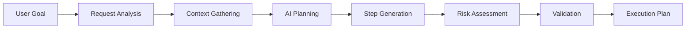

# Plan Generation

Plan generation is the core intelligence of NikCLI's planning system, transforming high-level user goals into detailed, executable plans through AI-powered analysis, context awareness, and intelligent decomposition.

## Generation Process

### Overview



### Step-by-Step Flow

1. **Request Analysis**: Parse and understand user intent
2. **Context Gathering**: Collect project and workspace information
3. **AI Planning**: Generate structured plan using AI
4. **Step Generation**: Create executable steps with dependencies
5. **Risk Assessment**: Evaluate plan safety and complexity
6. **Validation**: Check plan integrity and feasibility
7. **Execution Plan**: Return validated, executable plan

## Plan Generator

### Basic Usage

```typescript
import { PlanGenerator } from '@nikcli/planning'

const generator = new PlanGenerator()

const context: PlannerContext = {
  userRequest: 'Add user authentication to the API',
  projectPath: '/Users/dev/my-project',
  availableTools: toolCapabilities,
  projectAnalysis: {
    fileCount: 150,
    languages: ['typescript', 'javascript'],
    frameworks: ['express', 'prisma'],
    hasTests: true,
    hasDocumentation: true
  },
  userPreferences: {
    riskTolerance: 'moderate',
    preferredTools: ['typescript-tools'],
    excludedOperations: ['database-migrations']
  }
}

const plan = await generator.generatePlan(context)
```

### Plan Structure

```typescript
interface ExecutionPlan {
  id: string
  title: string
  description: string
  steps: ExecutionStep[]
  todos: PlanTodo[]
  status: 'pending' | 'running' | 'completed' | 'failed'
  estimatedTotalDuration: number
  actualDuration?: number
  riskAssessment: RiskAssessment
  createdAt: Date
  createdBy: string
  context: {
    userRequest: string
    projectPath: string
    relevantFiles?: string[]
    reasoning?: string
    simple?: boolean
  }
}
```

## Request Analysis

### Intent Detection

The generator analyzes user requests to understand intent:

```typescript
interface RequestAnalysis {
  originalRequest: string
  operations: string[]      // ['create', 'update', 'delete', 'read']
  entities: string[]        // ['file', 'test', 'documentation']
  modifiers: string[]       // ['all', 'multiple', 'specific']
  complexity: 'simple' | 'moderate' | 'complex'
  requiresFileSystem: boolean
  requiresAnalysis: boolean
  requiresUserInput: boolean
}

// Example analysis
const analysis = analyzeUserRequest(
  'Create a React component with tests and documentation'
)

// Returns:
{
  operations: ['create'],
  entities: ['component', 'test', 'documentation'],
  complexity: 'moderate',
  requiresFileSystem: true,
  requiresAnalysis: true
}
```

### Operation Detection

```typescript
// File operations
if (request.includes('create') || request.includes('add')) {
  operations.push('create')
}

if (request.includes('update') || request.includes('modify')) {
  operations.push('update')
}

if (request.includes('delete') || request.includes('remove')) {
  operations.push('delete')
}

if (request.includes('read') || request.includes('show')) {
  operations.push('read')
}
```

### Complexity Assessment

```typescript
function assessRequestComplexity(request: string): Complexity {
  const indicators = [
    request.includes('multiple'),
    request.includes('all'),
    request.includes('refactor'),
    request.includes('migrate'),
    request.includes('restructure'),
    request.split(' ').length > 10,
    (request.match(/and|or|then|also/g) || []).length > 2
  ]

  const score = indicators.filter(Boolean).length

  if (score >= 4) return 'complex'
  if (score >= 2) return 'moderate'
  return 'simple'
}
```

## Step Generation

### Execution Steps

Each step represents an atomic operation:

```typescript
interface ExecutionStep {
  id: string
  type: 'tool' | 'validation' | 'user_input' | 'decision'
  title: string
  description: string
  toolName?: string
  toolArgs?: Record<string, any>
  dependencies?: string[]
  estimatedDuration?: number
  riskLevel: 'low' | 'medium' | 'high'
  reversible: boolean
  metadata?: Record<string, any>
}
```

### Step Types

#### Tool Steps

Execute specific tools:

```typescript
{
  id: 'step-create-file',
  type: 'tool',
  title: 'Create Auth Module',
  description: 'Create authentication module with JWT support',
  toolName: 'write-file-tool',
  toolArgs: {
    filePath: 'src/auth/index.ts',
    content: '// Auth module implementation'
  },
  riskLevel: 'medium',
  reversible: true,
  estimatedDuration: 5000
}
```

#### Validation Steps

Verify prerequisites and results:

```typescript
{
  id: 'step-validate',
  type: 'validation',
  title: 'Validate Request',
  description: 'Check prerequisites and dependencies',
  riskLevel: 'low',
  reversible: true,
  estimatedDuration: 2000
}
```

#### User Input Steps

Request user confirmation:

```typescript
{
  id: 'step-confirm',
  type: 'user_input',
  title: 'Confirm High-Risk Operations',
  description: 'User approval for potentially destructive operations',
  riskLevel: 'low',
  reversible: true,
  estimatedDuration: 10000,
  dependencies: ['step-1', 'step-2']
}
```

#### Decision Steps

Evaluate conditions:

```typescript
{
  id: 'step-decide',
  type: 'decision',
  title: 'Determine Migration Strategy',
  description: 'Choose appropriate database migration approach',
  riskLevel: 'medium',
  reversible: true,
  metadata: {
    conditions: ['hasExistingData', 'hasBackup']
  }
}
```

### Step Generation Strategies

#### Operation-Specific Steps

```typescript
function generateOperationSteps(
  operation: string,
  analysis: RequestAnalysis
): ExecutionStep[] {
  switch (operation) {
    case 'create':
      return [{
        id: nanoid(),
        type: 'tool',
        title: 'Create Files',
        description: `Create new ${analysis.entities.join(', ')} files`,
        toolName: 'write-file-tool',
        riskLevel: 'medium',
        reversible: true,
        estimatedDuration: 8000
      }]

    case 'update':
      return [{
        id: nanoid(),
        type: 'tool',
        title: 'Update Files',
        description: `Update existing ${analysis.entities.join(', ')}`,
        toolName: 'replace-in-file-tool',
        riskLevel: 'medium',
        reversible: false,
        estimatedDuration: 6000
      }]

    case 'delete':
      return [{
        id: nanoid(),
        type: 'tool',
        title: 'Delete Files',
        description: `Delete ${analysis.entities.join(', ')}`,
        toolName: 'delete-file-tool',
        riskLevel: 'high',
        reversible: false,
        estimatedDuration: 3000
      }]

    case 'read':
      return [{
        id: nanoid(),
        type: 'tool',
        title: 'Read Files',
        description: `Analyze ${analysis.entities.join(', ')}`,
        toolName: 'read-file-tool',
        riskLevel: 'low',
        reversible: true,
        estimatedDuration: 4000
      }]
  }
}
```

### Dependency Management

```typescript
// Automatic dependency resolution
const steps: ExecutionStep[] = [
  {
    id: 'step-1',
    title: 'Validate Request',
    dependencies: []
  },
  {
    id: 'step-2',
    title: 'Analyze Project',
    dependencies: ['step-1']  // Depends on validation
  },
  {
    id: 'step-3',
    title: 'Create Files',
    dependencies: ['step-2']  // Depends on analysis
  },
  {
    id: 'step-4',
    title: 'Run Tests',
    dependencies: ['step-3']  // Depends on file creation
  }
]
```

## AI-Powered Generation

### Enhanced Planning System

Uses AI to generate comprehensive plans:

```typescript
import { EnhancedPlanningSystem } from '@nikcli/planning'

const enhancedPlanner = new EnhancedPlanningSystem()

const plan = await enhancedPlanner.generatePlan(
  'Implement GraphQL API with authentication',
  {
    maxTodos: 20,
    includeContext: true,
    showDetails: true,
    saveTodoFile: true
  }
)
```

### AI Planning Prompt

```typescript
const planningPrompt = `You are an expert project planner. Create a detailed, actionable plan.

Generate a JSON array of todo items with:
{
  "todos": [
    {
      "title": "Clear, actionable title",
      "description": "Detailed description",
      "priority": "low|medium|high|critical",
      "category": "planning|setup|implementation|testing|documentation",
      "estimatedDuration": 30,
      "dependencies": [],
      "tags": ["tag1", "tag2"],
      "commands": ["command1"],
      "files": ["file1.ts"],
      "reasoning": "Why this todo is necessary"
    }
  ]
}

Guidelines:
1. Break down complex tasks into 5-60 minute todos
2. Consider dependencies between tasks
3. Include setup, implementation, testing, documentation
4. Be specific about files and commands
5. Estimate realistic durations
6. Maximum ${maxTodos} todos

Project Context: ${context}
`
```

### Todo Items

```typescript
interface TodoItem {
  id: string
  title: string
  description: string
  status: 'pending' | 'in_progress' | 'completed' | 'failed' | 'skipped'
  priority: 'low' | 'medium' | 'high' | 'critical'
  category: string
  estimatedDuration: number  // minutes
  actualDuration?: number
  dependencies: string[]
  tags: string[]
  commands?: string[]
  files?: string[]
  reasoning: string
  createdAt: Date
  riskLevel?: 'low' | 'medium' | 'high' | 'critical'
  complexity?: 'simple' | 'moderate' | 'complex'
}
```

## Autonomous Planning

### Autonomous Planner

Self-directed planning with AI:

```typescript
import { AutonomousPlanner } from '@nikcli/planning'

const autonomousPlanner = new AutonomousPlanner(workspacePath)

for await (const event of autonomousPlanner.createAndExecutePlan(
  'Optimize database queries and add caching'
)) {
  switch (event.type) {
    case 'plan_start':
      console.log('🎯 Planning started')
      break
    case 'plan_created':
      console.log(`📋 Plan created: ${event.metadata.todos} steps`)
      break
    case 'todo_complete':
      console.log(`✓ ${event.content}`)
      break
    case 'plan_complete':
      console.log('🎉 Plan completed')
      break
  }
}
```

### Workspace Context Integration

```typescript
const workspaceContext = workspaceRAG.getContextForTask(userGoal)

// Returns rich context:
{
  projectInfo: {
    name: 'my-api',
    type: 'backend-service',
    stack: ['typescript', 'express', 'prisma']
  },
  relevantFiles: [
    { path: 'src/database/queries.ts', summary: 'Database query layer' },
    { path: 'src/cache/redis.ts', summary: 'Redis cache configuration' }
  ],
  dependencies: {
    runtime: ['express', 'prisma'],
    dev: ['typescript', 'vitest']
  },
  recentChanges: [...]
}
```

### Toolchain Registry

Pre-configured toolchains for common patterns:

```typescript
const toolchains = {
  'create-react-component': {
    name: 'Create React Component',
    description: 'Create a React component with TypeScript and styling',
    tools: ['analyze_project', 'generate_code', 'write_file', 'execute_command'],
    pattern: 'sequential'
  },
  'setup-api-endpoint': {
    name: 'Setup API Endpoint',
    description: 'Create API endpoint with validation and error handling',
    tools: ['read_file', 'analyze_project', 'generate_code', 'write_file', 'manage_packages'],
    pattern: 'sequential'
  },
  'add-testing': {
    name: 'Add Testing Suite',
    description: 'Set up comprehensive testing',
    tools: ['analyze_project', 'manage_packages', 'generate_code', 'write_file', 'execute_command'],
    pattern: 'parallel-then-sequential'
  }
}
```

## Risk Assessment

### Risk Calculation

```typescript
function assessPlanRisk(steps: ExecutionStep[]): RiskAssessment {
  const destructiveOperations = steps.filter(s => !s.reversible).length
  const fileModifications = steps.filter(s =>
    s.toolName?.includes('write') ||
    s.toolName?.includes('delete') ||
    s.toolName?.includes('replace')
  ).length
  const externalCalls = steps.filter(s =>
    s.toolName?.includes('api') ||
    s.toolName?.includes('network')
  ).length

  let overallRisk: 'low' | 'medium' | 'high' = 'low'

  if (destructiveOperations > 0 || steps.some(s => s.riskLevel === 'high')) {
    overallRisk = 'high'
  } else if (fileModifications > 2 || steps.some(s => s.riskLevel === 'medium')) {
    overallRisk = 'medium'
  }

  return {
    overallRisk,
    destructiveOperations,
    fileModifications,
    externalCalls
  }
}
```

### Enhanced Risk Assessment

```typescript
function performRiskAssessment(todos: TodoItem[]) {
  const riskFactors: string[] = []
  const mitigationStrategies: string[] = []

  // Destructive operations
  const destructiveOps = todos.filter(t =>
    t.commands?.some(cmd =>
      cmd.includes('rm') ||
      cmd.includes('del') ||
      cmd.includes('sudo')
    )
  )

  if (destructiveOps.length > 0) {
    riskFactors.push(`Contains ${destructiveOps.length} destructive operations`)
    mitigationStrategies.push('Review all destructive commands before execution')
  }

  // File modifications
  const fileModifications = todos.filter(t => t.files && t.files.length > 0)

  if (fileModifications.length > 10) {
    riskFactors.push(`Large number of file modifications (${fileModifications.length})`)
    mitigationStrategies.push('Ensure backups are available')
  }

  // Complex dependencies
  const complexDependencies = todos.filter(t => t.dependencies.length > 3)

  if (complexDependencies.length > 0) {
    riskFactors.push('Complex dependency chains detected')
    mitigationStrategies.push('Execute in dependency order with validation')
  }

  return { riskFactors, mitigationStrategies }
}
```

## Plan Validation

### Validation Process

```typescript
function validatePlan(plan: ExecutionPlan): PlanValidationResult {
  const errors: string[] = []
  const warnings: string[] = []
  const suggestions: string[] = []

  // Check circular dependencies
  if (hasCircularDependencies(plan.steps)) {
    errors.push('Plan contains circular dependencies')
  }

  // Check tool availability
  for (const step of plan.steps) {
    if (step.type === 'tool' && step.toolName) {
      if (!toolCapabilities.has(step.toolName)) {
        errors.push(`Unknown tool: ${step.toolName}`)
      }
    }
  }

  // Risk warnings
  if (plan.riskAssessment.overallRisk === 'high') {
    warnings.push('Plan contains high-risk operations')
  }

  if (plan.riskAssessment.destructiveOperations > 0) {
    warnings.push(
      `Plan includes ${plan.riskAssessment.destructiveOperations} destructive operations`
    )
  }

  // Performance suggestions
  if (plan.estimatedTotalDuration > 300000) {
    suggestions.push('Consider breaking plan into smaller chunks')
  }

  if (plan.steps.length > 20) {
    suggestions.push('Plan has many steps - consider consolidating')
  }

  return {
    isValid: errors.length === 0,
    errors,
    warnings,
    suggestions
  }
}
```

### Circular Dependency Detection

```typescript
function hasCircularDependencies(steps: ExecutionStep[]): boolean {
  const stepMap = new Map(steps.map(step => [step.id, step]))
  const visited = new Set<string>()
  const recursionStack = new Set<string>()

  function hasCycle(stepId: string): boolean {
    if (recursionStack.has(stepId)) return true
    if (visited.has(stepId)) return false

    visited.add(stepId)
    recursionStack.add(stepId)

    const step = stepMap.get(stepId)
    if (step?.dependencies) {
      for (const depId of step.dependencies) {
        if (hasCycle(depId)) return true
      }
    }

    recursionStack.delete(stepId)
    return false
  }

  return steps.some(step => hasCycle(step.id))
}
```

## Tool Capability Discovery

### Tool Registration

```typescript
const toolCapabilities: PlanningToolCapability[] = [
  {
    name: 'find-files-tool',
    description: 'Find files matching patterns',
    riskLevel: 'low',
    reversible: true,
    estimatedDuration: 3000,
    requiredArgs: ['pattern'],
    optionalArgs: ['options']
  },
  {
    name: 'write-file-tool',
    description: 'Write content to file',
    riskLevel: 'medium',
    reversible: true,
    estimatedDuration: 4000,
    requiredArgs: ['filePath', 'content'],
    optionalArgs: []
  },
  {
    name: 'delete-file-tool',
    description: 'Delete files or directories',
    riskLevel: 'high',
    reversible: false,
    estimatedDuration: 2000,
    requiredArgs: ['filePath'],
    optionalArgs: []
  }
]
```

### Dynamic Tool Discovery

```typescript
// Auto-discover tools from registry
const availableTools = toolRegistry.listTools().map(name => {
  const metadata = toolRegistry.getToolMetadata(name)
  return {
    name,
    description: metadata.description,
    riskLevel: metadata.riskLevel || 'medium',
    reversible: metadata.reversible ?? true,
    estimatedDuration: metadata.estimatedDuration || 5000,
    requiredArgs: metadata.requiredArgs || [],
    optionalArgs: metadata.optionalArgs || []
  }
})
```

## Plan Templates

### Creating Templates

```typescript
interface PlanTemplate {
  name: string
  description: string
  category: string
  steps: ExecutionStep[]
  variables: Record<string, string>
}

const authTemplate: PlanTemplate = {
  name: 'jwt-authentication',
  description: 'Add JWT-based authentication',
  category: 'security',
  variables: {
    secretKey: 'JWT_SECRET',
    tokenExpiry: '24h',
    refreshTokenExpiry: '7d'
  },
  steps: [
    {
      id: 'install-deps',
      type: 'tool',
      title: 'Install Dependencies',
      description: 'Install jsonwebtoken and bcrypt',
      toolName: 'manage-packages',
      toolArgs: {
        action: 'install',
        packages: ['jsonwebtoken', 'bcrypt']
      },
      riskLevel: 'low',
      reversible: true
    }
    // ... more steps
  ]
}
```

### Using Templates

```typescript
function applyTemplate(
  template: PlanTemplate,
  variables: Record<string, string>
): ExecutionPlan {
  const steps = template.steps.map(step => ({
    ...step,
    toolArgs: replaceVariables(step.toolArgs, variables)
  }))

  return {
    id: nanoid(),
    title: template.name,
    description: template.description,
    steps,
    // ... rest of plan
  }
}
```

## Best Practices

### Effective Planning

✅ **DO**:
- Analyze project context thoroughly
- Generate 5-15 steps for optimal execution
- Set realistic duration estimates
- Define clear dependencies
- Include validation steps
- Assess risks accurately

❌ **DON'T**:
- Generate overly complex plans (50+ steps)
- Skip context analysis
- Ignore tool capabilities
- Omit risk assessment
- Create circular dependencies

### Plan Quality

```typescript
// Good plan structure
const goodPlan = {
  steps: [
    { type: 'validation', title: 'Validate Prerequisites' },
    { type: 'tool', title: 'Analyze Project Structure' },
    { type: 'tool', title: 'Install Dependencies' },
    { type: 'tool', title: 'Create Auth Module' },
    { type: 'tool', title: 'Add Tests' },
    { type: 'validation', title: 'Verify Results' }
  ]
}

// Bad plan structure
const badPlan = {
  steps: [
    { type: 'tool', title: 'Do Everything' }, // Too broad
    { type: 'tool', title: 'Create 50 Files' } // Too many operations
  ]
}
```

## Next Steps

<CardGroup cols={2}>
  <Card title="Execution Flow" icon="play" href="/planning-system/execution-flow">
    Learn about plan execution
  </Card>

  <Card title="Plan Templates" icon="file-code" href="/planning-system/plan-templates">
    Explore pre-built templates
  </Card>

  <Card title="Interactive Planning" icon="users" href="/planning-system/interactive-planning">
    Master interactive workflows
  </Card>

  <Card title="Tool System" icon="wrench" href="/tools-system/overview">
    Understand tool integration
  </Card>
</CardGroup>
