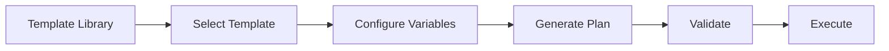

# Plan Templates

Plan templates provide pre-configured, reusable execution patterns for common development workflows, enabling rapid plan generation with best practices built-in.

## Template System

### Overview

Templates encapsulate domain expertise and proven patterns:



### Template Structure

```typescript
interface PlanTemplate {
  /** Template identifier */
  name: string

  /** Human-readable description */
  description: string

  /** Category for organization */
  category: string

  /** Template version */
  version: string

  /** Author/maintainer */
  author: string

  /** Pre-configured execution steps */
  steps: ExecutionStep[]

  /** Configurable variables */
  variables: Record<string, TemplateVariable>

  /** Required tools */
  requiredTools: string[]

  /** Prerequisites */
  prerequisites?: string[]

  /** Post-execution validation */
  validation?: ValidationRule[]
}

interface TemplateVariable {
  name: string
  description: string
  type: 'string' | 'number' | 'boolean' | 'array'
  required: boolean
  default?: any
  validation?: (value: any) => boolean
}
```

## Built-in Templates

### Authentication Template

JWT-based authentication implementation:

```typescript
const authTemplate: PlanTemplate = {
  name: 'jwt-authentication',
  description: 'Add JWT-based authentication with refresh tokens',
  category: 'security',
  version: '1.5.0',
  author: 'NikCLI',

  variables: {
    secretKey: {
      name: 'JWT_SECRET',
      description: 'Secret key for JWT signing',
      type: 'string',
      required: true,
      validation: (value) => value.length >= 32
    },
    tokenExpiry: {
      name: 'TOKEN_EXPIRY',
      description: 'Access token expiration',
      type: 'string',
      required: false,
      default: '24h'
    },
    refreshTokenExpiry: {
      name: 'REFRESH_TOKEN_EXPIRY',
      description: 'Refresh token expiration',
      type: 'string',
      required: false,
      default: '7d'
    },
    authProvider: {
      name: 'AUTH_PROVIDER',
      description: 'Authentication provider (local, oauth, etc.)',
      type: 'string',
      required: false,
      default: 'local'
    }
  },

  requiredTools: [
    'manage-packages',
    'write-file-tool',
    'read-file-tool',
    'execute-command-tool'
  ],

  steps: [
    {
      id: 'validate-prereqs',
      type: 'validation',
      title: 'Validate Prerequisites',
      description: 'Check Node.js version and project structure',
      riskLevel: 'low',
      reversible: true,
      estimatedDuration: 2000
    },
    {
      id: 'install-deps',
      type: 'tool',
      title: 'Install Dependencies',
      description: 'Install jsonwebtoken, bcrypt, and related packages',
      toolName: 'manage-packages',
      toolArgs: {
        action: 'install',
        packages: [
          'jsonwebtoken',
          'bcrypt',
          '@types/jsonwebtoken',
          '@types/bcrypt'
        ]
      },
      riskLevel: 'low',
      reversible: true,
      estimatedDuration: 30000,
      dependencies: ['validate-prereqs']
    },
    {
      id: 'create-auth-module',
      type: 'tool',
      title: 'Create Auth Module',
      description: 'Generate authentication module with JWT utilities',
      toolName: 'write-file-tool',
      toolArgs: {
        filePath: 'src/auth/jwt.ts',
        content: `import jwt from 'jsonwebtoken';
import bcrypt from 'bcrypt';

export interface TokenPayload {
  userId: string;
  email: string;
  role: string;
}

export class JWTService {
  private readonly secret = process.env.{{JWT_SECRET}} || '';
  private readonly tokenExpiry = '{{TOKEN_EXPIRY}}';
  private readonly refreshExpiry = '{{REFRESH_TOKEN_EXPIRY}}';

  generateToken(payload: TokenPayload): string {
    return jwt.sign(payload, this.secret, {
      expiresIn: this.tokenExpiry
    });
  }

  generateRefreshToken(payload: TokenPayload): string {
    return jwt.sign(payload, this.secret, {
      expiresIn: this.refreshExpiry
    });
  }

  verifyToken(token: string): TokenPayload {
    return jwt.verify(token, this.secret) as TokenPayload;
  }

  async hashPassword(password: string): Promise<string> {
    return bcrypt.hash(password, 10);
  }

  async comparePassword(
    password: string,
    hash: string
  ): Promise<boolean> {
    return bcrypt.compare(password, hash);
  }
}

export const jwtService = new JWTService();
`
      },
      riskLevel: 'medium',
      reversible: true,
      estimatedDuration: 5000,
      dependencies: ['install-deps']
    },
    {
      id: 'create-auth-middleware',
      type: 'tool',
      title: 'Create Auth Middleware',
      description: 'Generate Express middleware for authentication',
      toolName: 'write-file-tool',
      toolArgs: {
        filePath: 'src/auth/middleware.ts',
        content: `import { Request, Response, NextFunction } from 'express';
import { jwtService } from './jwt';

export interface AuthRequest extends Request {
  user?: {
    userId: string;
    email: string;
    role: string;
  };
}

export const authenticate = async (
  req: AuthRequest,
  res: Response,
  next: NextFunction
) => {
  try {
    const token = req.headers.authorization?.replace('Bearer ', '');

    if (!token) {
      return res.status(401).json({ error: 'No token provided' });
    }

    const payload = jwtService.verifyToken(token);
    req.user = payload;
    next();
  } catch (error) {
    return res.status(401).json({ error: 'Invalid token' });
  }
};

export const authorize = (...roles: string[]) => {
  return (req: AuthRequest, res: Response, next: NextFunction) => {
    if (!req.user) {
      return res.status(401).json({ error: 'Unauthorized' });
    }

    if (!roles.includes(req.user.role)) {
      return res.status(403).json({ error: 'Forbidden' });
    }

    next();
  };
};
`
      },
      riskLevel: 'medium',
      reversible: true,
      estimatedDuration: 5000,
      dependencies: ['create-auth-module']
    },
    {
      id: 'create-auth-routes',
      type: 'tool',
      title: 'Create Auth Routes',
      description: 'Generate authentication API routes',
      toolName: 'write-file-tool',
      toolArgs: {
        filePath: 'src/auth/routes.ts',
        content: `import { Router } from 'express';
import { jwtService } from './jwt';

const router = Router();

router.post('/register', async (req, res) => {
  try {
    const { email, password, role = 'user' } = req.body;

    // TODO: Save user to database
    const userId = 'generated-id';

    const hashedPassword = await jwtService.hashPassword(password);

    const token = jwtService.generateToken({ userId, email, role });
    const refreshToken = jwtService.generateRefreshToken({ userId, email, role });

    res.json({ token, refreshToken });
  } catch (error) {
    res.status(400).json({ error: 'Registration failed' });
  }
});

router.post('/login', async (req, res) => {
  try {
    const { email, password } = req.body;

    // TODO: Fetch user from database
    const user = { userId: 'id', email, password: 'hash', role: 'user' };

    const isValid = await jwtService.comparePassword(password, user.password);

    if (!isValid) {
      return res.status(401).json({ error: 'Invalid credentials' });
    }

    const token = jwtService.generateToken({
      userId: user.userId,
      email: user.email,
      role: user.role
    });

    const refreshToken = jwtService.generateRefreshToken({
      userId: user.userId,
      email: user.email,
      role: user.role
    });

    res.json({ token, refreshToken });
  } catch (error) {
    res.status(401).json({ error: 'Login failed' });
  }
});

router.post('/refresh', async (req, res) => {
  try {
    const { refreshToken } = req.body;

    const payload = jwtService.verifyToken(refreshToken);

    const newToken = jwtService.generateToken(payload);

    res.json({ token: newToken });
  } catch (error) {
    res.status(401).json({ error: 'Token refresh failed' });
  }
});

export default router;
`
      },
      riskLevel: 'medium',
      reversible: true,
      estimatedDuration: 8000,
      dependencies: ['create-auth-middleware']
    },
    {
      id: 'create-tests',
      type: 'tool',
      title: 'Create Auth Tests',
      description: 'Generate test suite for authentication',
      toolName: 'write-file-tool',
      toolArgs: {
        filePath: 'src/auth/__tests__/jwt.test.ts',
        content: `import { describe, it, expect } from 'vitest';
import { jwtService } from '../jwt';

describe('JWTService', () => {
  it('should generate and verify token', () => {
    const payload = {
      userId: '123',
      email: 'test@example.com',
      role: 'user'
    };

    const token = jwtService.generateToken(payload);
    const verified = jwtService.verifyToken(token);

    expect(verified.userId).toBe(payload.userId);
    expect(verified.email).toBe(payload.email);
  });

  it('should hash and compare password', async () => {
    const password = 'test123';
    const hash = await jwtService.hashPassword(password);

    const isValid = await jwtService.comparePassword(password, hash);
    expect(isValid).toBe(true);

    const isInvalid = await jwtService.comparePassword('wrong', hash);
    expect(isInvalid).toBe(false);
  });
});
`
      },
      riskLevel: 'low',
      reversible: true,
      estimatedDuration: 5000,
      dependencies: ['create-auth-routes']
    },
    {
      id: 'update-env',
      type: 'tool',
      title: 'Update Environment Variables',
      description: 'Add authentication configuration to .env',
      toolName: 'write-file-tool',
      toolArgs: {
        filePath: '.env.example',
        content: `JWT_SECRET={{JWT_SECRET}}
TOKEN_EXPIRY={{TOKEN_EXPIRY}}
REFRESH_TOKEN_EXPIRY={{REFRESH_TOKEN_EXPIRY}}
`
      },
      riskLevel: 'low',
      reversible: true,
      estimatedDuration: 2000,
      dependencies: ['create-tests']
    },
    {
      id: 'run-tests',
      type: 'tool',
      title: 'Run Tests',
      description: 'Execute authentication test suite',
      toolName: 'execute-command-tool',
      toolArgs: {
        command: 'npm test src/auth'
      },
      riskLevel: 'low',
      reversible: true,
      estimatedDuration: 10000,
      dependencies: ['update-env']
    },
    {
      id: 'verify-setup',
      type: 'validation',
      title: 'Verify Setup',
      description: 'Validate authentication setup is complete',
      riskLevel: 'low',
      reversible: true,
      estimatedDuration: 3000,
      dependencies: ['run-tests']
    }
  ]
}
```

### React Component Template

```typescript
const reactComponentTemplate: PlanTemplate = {
  name: 'react-component',
  description: 'Create React component with TypeScript, tests, and Storybook',
  category: 'frontend',
  version: '1.5.0',
  author: 'NikCLI',

  variables: {
    componentName: {
      name: 'COMPONENT_NAME',
      description: 'Component name (PascalCase)',
      type: 'string',
      required: true,
      validation: (value) => /^[A-Z][a-zA-Z0-9]*$/.test(value)
    },
    componentType: {
      name: 'COMPONENT_TYPE',
      description: 'Component type (functional or class)',
      type: 'string',
      required: false,
      default: 'functional'
    },
    withStorybook: {
      name: 'WITH_STORYBOOK',
      description: 'Include Storybook stories',
      type: 'boolean',
      required: false,
      default: true
    },
    withTests: {
      name: 'WITH_TESTS',
      description: 'Include test file',
      type: 'boolean',
      required: false,
      default: true
    }
  },

  steps: [
    {
      id: 'create-component',
      type: 'tool',
      title: 'Create Component File',
      description: 'Generate React component with TypeScript',
      toolName: 'write-file-tool',
      toolArgs: {
        filePath: 'src/components/{{COMPONENT_NAME}}/{{COMPONENT_NAME}}.tsx',
        content: `import React from 'react';

export interface {{COMPONENT_NAME}}Props {
  /** Component children */
  children?: React.ReactNode;
  /** Additional CSS classes */
  className?: string;
}

/**
 * {{COMPONENT_NAME}} component
 */
export const {{COMPONENT_NAME}}: React.FC<{{COMPONENT_NAME}}Props> = ({
  children,
  className
}) => {
  return (
    <div className={className}>
      {children}
    </div>
  );
};

{{COMPONENT_NAME}}.displayName = '{{COMPONENT_NAME}}';
`
      },
      riskLevel: 'low',
      reversible: true,
      estimatedDuration: 3000
    },
    {
      id: 'create-index',
      type: 'tool',
      title: 'Create Index File',
      description: 'Generate barrel export',
      toolName: 'write-file-tool',
      toolArgs: {
        filePath: 'src/components/{{COMPONENT_NAME}}/index.ts',
        content: `export * from './{{COMPONENT_NAME}}';
export { {{COMPONENT_NAME}} as default } from './{{COMPONENT_NAME}}';
`
      },
      riskLevel: 'low',
      reversible: true,
      estimatedDuration: 1000,
      dependencies: ['create-component']
    },
    // More steps for tests, styles, etc.
  ]
}
```

### API Endpoint Template

```typescript
const apiEndpointTemplate: PlanTemplate = {
  name: 'express-api-endpoint',
  description: 'Create Express API endpoint with validation and error handling',
  category: 'backend',
  version: '1.5.0',
  author: 'NikCLI',

  variables: {
    resourceName: {
      name: 'RESOURCE_NAME',
      description: 'Resource name (plural, lowercase)',
      type: 'string',
      required: true,
      validation: (value) => /^[a-z][a-z0-9-]*$/.test(value)
    },
    modelName: {
      name: 'MODEL_NAME',
      description: 'Model name (PascalCase, singular)',
      type: 'string',
      required: true,
      validation: (value) => /^[A-Z][a-zA-Z0-9]*$/.test(value)
    },
    withAuth: {
      name: 'WITH_AUTH',
      description: 'Include authentication middleware',
      type: 'boolean',
      required: false,
      default: true
    },
    withValidation: {
      name: 'WITH_VALIDATION',
      description: 'Include request validation',
      type: 'boolean',
      required: false,
      default: true
    }
  },

  steps: [
    {
      id: 'install-deps',
      type: 'tool',
      title: 'Install Dependencies',
      description: 'Install express-validator and related packages',
      toolName: 'manage-packages',
      toolArgs: {
        action: 'install',
        packages: ['express-validator', 'joi']
      },
      riskLevel: 'low',
      reversible: true
    },
    {
      id: 'create-model',
      type: 'tool',
      title: 'Create Data Model',
      description: 'Generate TypeScript model/interface',
      toolName: 'write-file-tool',
      toolArgs: {
        filePath: 'src/models/{{modelName}}.ts',
        content: `export interface {{MODEL_NAME}} {
  id: string;
  createdAt: Date;
  updatedAt: Date;
  // Add your fields here
}

export interface Create{{MODEL_NAME}}Input {
  // Add creation fields
}

export interface Update{{MODEL_NAME}}Input {
  // Add update fields
}
`
      },
      riskLevel: 'low',
      reversible: true,
      dependencies: ['install-deps']
    },
    // More steps for controller, routes, validation, etc.
  ]
}
```

## Using Templates

### Template Application

```typescript
import { applyTemplate } from '@nikcli/planning'

// Apply template with variables
const plan = await applyTemplate('jwt-authentication', {
  JWT_SECRET: 'your-secret-key-min-32-chars-long',
  TOKEN_EXPIRY: '1h',
  REFRESH_TOKEN_EXPIRY: '30d',
  AUTH_PROVIDER: 'local'
})

// Execute the plan
const result = await planner.executePlan(plan.id)
```

### Variable Replacement

```typescript
function replaceVariables(
  content: string,
  variables: Record<string, any>
): string {
  let result = content

  for (const [key, value] of Object.entries(variables)) {
    const pattern = new RegExp(`\\{\\{${key}\\}\\}`, 'g')
    result = result.replace(pattern, String(value))
  }

  return result
}

// Example usage
const template = 'Secret: {{JWT_SECRET}}, Expiry: {{TOKEN_EXPIRY}}'
const replaced = replaceVariables(template, {
  JWT_SECRET: 'my-secret',
  TOKEN_EXPIRY: '24h'
})
// Result: "Secret: my-secret, Expiry: 24h"
```

### Template Validation

```typescript
function validateTemplateVariables(
  template: PlanTemplate,
  values: Record<string, any>
): ValidationResult {
  const errors: string[] = []

  for (const [key, variable] of Object.entries(template.variables)) {
    const value = values[key]

    // Check required
    if (variable.required && !value) {
      errors.push(`Variable ${key} is required`)
      continue
    }

    // Check type
    if (value !== undefined) {
      const actualType = Array.isArray(value) ? 'array' : typeof value
      if (actualType !== variable.type) {
        errors.push(
          `Variable ${key} must be ${variable.type}, got ${actualType}`
        )
      }
    }

    // Custom validation
    if (variable.validation && value !== undefined) {
      if (!variable.validation(value)) {
        errors.push(`Variable ${key} validation failed`)
      }
    }
  }

  return {
    isValid: errors.length === 0,
    errors
  }
}
```

## Template Library

### Template Registry

```typescript
class TemplateRegistry {
  private templates = new Map<string, PlanTemplate>()

  register(template: PlanTemplate): void {
    this.templates.set(template.name, template)
  }

  get(name: string): PlanTemplate | undefined {
    return this.templates.get(name)
  }

  list(category?: string): PlanTemplate[] {
    const templates = Array.from(this.templates.values())

    if (category) {
      return templates.filter(t => t.category === category)
    }

    return templates
  }

  search(query: string): PlanTemplate[] {
    const lowerQuery = query.toLowerCase()

    return Array.from(this.templates.values()).filter(
      t =>
        t.name.toLowerCase().includes(lowerQuery) ||
        t.description.toLowerCase().includes(lowerQuery)
    )
  }
}

// Global registry
export const templateRegistry = new TemplateRegistry()

// Register built-in templates
templateRegistry.register(authTemplate)
templateRegistry.register(reactComponentTemplate)
templateRegistry.register(apiEndpointTemplate)
```

### Template Categories

```typescript
const categories = {
  'frontend': [
    'react-component',
    'vue-component',
    'angular-component',
    'react-hook',
    'styled-component'
  ],
  'backend': [
    'express-api-endpoint',
    'graphql-resolver',
    'websocket-handler',
    'cron-job',
    'background-worker'
  ],
  'security': [
    'jwt-authentication',
    'oauth-integration',
    'api-rate-limiting',
    'cors-setup',
    'helmet-security'
  ],
  'database': [
    'prisma-model',
    'mongodb-schema',
    'sql-migration',
    'redis-cache',
    'database-seeding'
  ],
  'testing': [
    'unit-test-suite',
    'integration-test',
    'e2e-test',
    'test-fixtures',
    'mock-setup'
  ],
  'deployment': [
    'docker-setup',
    'kubernetes-deployment',
    'ci-cd-pipeline',
    'vercel-deployment',
    'aws-lambda'
  ]
}
```

## Custom Templates

### Creating Custom Templates

```typescript
const myTemplate: PlanTemplate = {
  name: 'my-custom-template',
  description: 'My custom workflow',
  category: 'custom',
  version: '1.5.0',
  author: 'Your Name',

  variables: {
    projectName: {
      name: 'PROJECT_NAME',
      description: 'Project name',
      type: 'string',
      required: true
    }
  },

  requiredTools: ['write-file-tool'],

  steps: [
    {
      id: 'step-1',
      type: 'tool',
      title: 'Create Project',
      description: 'Initialize project structure',
      toolName: 'write-file-tool',
      toolArgs: {
        filePath: '{{PROJECT_NAME}}/README.md',
        content: '# {{PROJECT_NAME}}\n\nProject description here.'
      },
      riskLevel: 'low',
      reversible: true
    }
  ]
}

// Register custom template
templateRegistry.register(myTemplate)
```

### Template Inheritance

```typescript
function extendTemplate(
  base: PlanTemplate,
  overrides: Partial<PlanTemplate>
): PlanTemplate {
  return {
    ...base,
    ...overrides,
    name: overrides.name || `${base.name}-extended`,
    steps: [
      ...base.steps,
      ...(overrides.steps || [])
    ],
    variables: {
      ...base.variables,
      ...overrides.variables
    }
  }
}

// Example: Extend auth template
const customAuthTemplate = extendTemplate(authTemplate, {
  name: 'jwt-auth-with-2fa',
  steps: [
    {
      id: 'add-2fa',
      type: 'tool',
      title: 'Add 2FA Support',
      description: 'Integrate two-factor authentication',
      toolName: 'write-file-tool',
      // ... more config
    }
  ]
})
```

## Template Best Practices

### Design Principles

✅ **DO**:
- Keep templates focused on single responsibilities
- Use clear, descriptive variable names
- Provide sensible defaults
- Include validation for variables
- Document prerequisites
- Add post-execution validation
- Version your templates

❌ **DON'T**:
- Create overly complex templates
- Hardcode values that should be variables
- Skip error handling
- Omit documentation
- Mix unrelated concerns

### Template Testing

```typescript
describe('Template: jwt-authentication', () => {
  it('should validate required variables', () => {
    const result = validateTemplateVariables(authTemplate, {})

    expect(result.isValid).toBe(false)
    expect(result.errors).toContain('Variable JWT_SECRET is required')
  })

  it('should apply variables correctly', () => {
    const plan = applyTemplate('jwt-authentication', {
      JWT_SECRET: 'test-secret-key-at-least-32-chars',
      TOKEN_EXPIRY: '1h'
    })

    expect(plan.steps[2].toolArgs.content).toContain('test-secret-key')
  })

  it('should execute successfully', async () => {
    const plan = await applyTemplate('jwt-authentication', testVars)
    const result = await executor.executePlan(plan)

    expect(result.status).toBe('completed')
    expect(result.summary.failedSteps).toBe(0)
  })
})
```

## Next Steps

<CardGroup cols={2}>
  <Card title="Interactive Planning" icon="users" href="/planning-system/interactive-planning">
    Master interactive workflows
  </Card>

  <Card title="Custom Templates" icon="code" href="/developer-guide/custom-templates">
    Create your own templates
  </Card>

  <Card title="Tool System" icon="wrench" href="/tools-system/overview">
    Understand tool integration
  </Card>

  <Card title="Examples" icon="book" href="/examples/template-usage">
    See template examples
  </Card>
</CardGroup>
