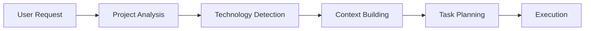

## Your First NikCLI Session

Let's walk through your first experience with NikCLI and explore its core capabilities.

### Starting NikCLI

Open your terminal and start NikCLI:

```bash
nikcli
```

You'll see the welcome screen with system information and available features:

<Frame>
  
</Frame>

## Basic Interaction Patterns

### Natural Language Commands

NikCLI understands natural language, so you can communicate as you would with a human developer:

<Tabs>
  <Tab title="Simple Request">
    ```
    > Create a simple React component for a button
    ```
    
    NikCLI will analyze your project, understand the context, and create an appropriate React component.
  </Tab>
  
  <Tab title="Complex Task">
    ```
    > Add user authentication to my Express.js app with JWT tokens and bcrypt for password hashing
    ```
    
    NikCLI will break this down into multiple steps and execute them systematically.
  </Tab>
  
  <Tab title="File Operations">
    ```
    > Read the package.json file and update the version to 1.2.0
    ```
    
    NikCLI will read the file, understand its structure, and make the requested change.
  </Tab>
</Tabs>

### Interactive Modes

NikCLI offers different interaction modes for various workflows:

<CardGroup cols={3}>
  <Card title="Chat Mode" icon="comments">
    Default conversational interface for interactive development
  </Card>
  <Card title="Autonomous Mode" icon="robot">
    Let AI work independently on complex tasks
  </Card>
  <Card title="Planning Mode" icon="clipboard-list">
    Create and review implementation plans before execution
  </Card>
</CardGroup>

## Your First Development Task

Let's create a simple project to demonstrate NikCLI's capabilities:

<Steps>
  <Step title="Create a New Project">
    ```
    > Create a new Node.js project for a todo list API with TypeScript
    ```
    
    NikCLI will:
    - Create the project structure
    - Set up package.json with appropriate dependencies
    - Configure TypeScript
    - Create basic files and folders
  </Step>
  
  <Step title="Add Core Functionality">
    ```
    > Implement CRUD operations for todos with Express.js and in-memory storage
    ```
    
    NikCLI will:
    - Create Express.js server
    - Implement route handlers
    - Add data models and types
    - Include error handling
  </Step>
  
  <Step title="Add Testing">
    ```
    > Add unit tests for the todo API endpoints using Jest
    ```
    
    NikCLI will:
    - Configure Jest
    - Create test files
    - Write comprehensive test cases
    - Set up test scripts
  </Step>
  
  <Step title="Review and Run">
    ```
    > Show me what files were created and run the tests
    ```
    
    NikCLI will provide a summary and execute the test suite.
  </Step>
</Steps>

## Essential Slash Commands

NikCLI includes powerful slash commands for system control and navigation:

### Mode Control
<Tabs>
  <Tab title="/default">
    Switch to interactive default chat mode
    ```
    > /default
    ```
  </Tab>
  
  <Tab title="/auto">
    Enter autonomous execution mode
    ```
    > /auto "Build a login page"
    ```
  </Tab>
  
  <Tab title="/plan">
    Switch to planning mode for complex tasks
    ```
    > /plan
    ```
  </Tab>
</Tabs>

### Information Commands
<Tabs>
  <Tab title="/stats">
    View current usage and model/session statistics
    ```
    > /stats
    ```
  </Tab>
  
  <Tab title="/help">
    Display all available commands and their descriptions
    ```
    > /help
    ```
  </Tab>
  
  <Tab title="/agents">
    List available agents and their capabilities
    ```
    > /agents
    ```
  </Tab>
</Tabs>

### File Operations
<Tabs>
  <Tab title="/ls">
    List files in current directory
    ```
    > /ls src/
    ```
  </Tab>
  
  <Tab title="/read">
    Read and display file contents
    ```
    > /read package.json
    ```
  </Tab>
  
  <Tab title="/search">
    Search across files (grep-like)
    ```
    > /search "interface User"
    ```
  </Tab>
</Tabs>

## Understanding NikCLI's Workflow

### 1. Context Analysis
When you give NikCLI a task, it first analyzes your project:



### 2. Task Breakdown
Complex tasks are automatically broken down into manageable steps:

<Frame>
  
</Frame>

### 3. Real-time Feedback
NikCLI provides continuous feedback during execution:

```
🔍 Analyzing project structure...
📁 Found React TypeScript project
🎯 Planning component creation...
✏️  Creating Button.tsx...
✅ Component created successfully
🧪 Running type checks...
✅ All checks passed
```

## Working with Different Project Types

NikCLI adapts to your project's technology stack:

<AccordionGroup>
  <Accordion title="React Projects">
    - Detects React/Next.js setup
    - Understands component patterns
    - Respects styling approaches (CSS modules, styled-components, etc.)
    - Follows project's folder structure
  </Accordion>
  
  <Accordion title="Node.js APIs">
    - Recognizes Express.js, Fastify, or other frameworks
    - Understands database configurations
    - Follows REST/GraphQL patterns
    - Implements proper error handling
  </Accordion>
  
  <Accordion title="Full-Stack Applications">
    - Coordinates frontend and backend changes
    - Maintains API contracts
    - Handles database migrations
    - Updates documentation
  </Accordion>
  
  <Accordion title="TypeScript Projects">
    - Respects type definitions
    - Maintains type safety
    - Updates interfaces and types
    - Runs type checking
  </Accordion>
</AccordionGroup>

## Best Practices for Beginners

<CardGroup cols={2}>
  <Card title="Be Specific" icon="target">
    Provide clear, specific instructions for better results
    
    ✅ "Create a React hook for managing form state with validation"
    
    ❌ "Make a form thing"
  </Card>
  
  <Card title="Review Changes" icon="eye">
    Always review AI-generated code before committing
    
    Review diffs in the UI and confirm when prompted; use `/clear-approvals` to reset session approvals
  </Card>
  
  <Card title="Start Small" icon="seedling">
    Begin with simple tasks and gradually increase complexity
    
    Build confidence with basic operations first
  </Card>
  
  <Card title="Use Planning Mode" icon="clipboard-list">
    For complex tasks, use `/plan` to review approach
    
    Prevent unexpected changes and maintain control
  </Card>
</CardGroup>

## Common Beginner Scenarios

### Scenario 1: Creating Components
```
> Create a responsive navigation component with mobile menu toggle
```

**What NikCLI does:**
- Analyzes your styling approach
- Creates component with proper structure
- Adds responsive CSS/styles
- Includes accessibility features

### Scenario 2: API Integration
```
> Add a function to fetch user data from the /api/users endpoint
```

**What NikCLI does:**
- Detects your HTTP client (fetch, axios, etc.)
- Creates typed interfaces for responses
- Adds error handling
- Includes loading states if applicable

### Scenario 3: Bug Fixes
```
> The login form is not validating email addresses properly, fix this issue
```

**What NikCLI does:**
- Locates the form component
- Identifies validation logic
- Fixes or improves validation
- Tests the fix

## Getting Help

<Tabs>
  <Tab title="In-App Help">
    Use the `/help` command for comprehensive command reference:
    ```
    > /help
    ```
  </Tab>
  
  <Tab title="Context-Sensitive Help">
    Ask NikCLI directly about any functionality:
    ```
    > How do I switch to autonomous mode?
    > What agents are available?
    > How do I configure API keys?
    ```
  </Tab>
  
  <Tab title="Documentation">
    Access detailed guides in this documentation:
    - [User Guide](/user-guide/overview) for detailed workflows
    - [CLI Reference](/cli-reference/commands-overview) for all commands
    - [Troubleshooting](/troubleshooting/common-issues) for common issues
  </Tab>
</Tabs>

## Next Steps

<CardGroup cols={2}>
  <Card
    title="Configure NikCLI"
    icon="gear"
    href="/quickstart/configuration"
  >
    Customize settings and preferences for your workflow
  </Card>
  <Card
    title="User Guide"
    icon="book-open"
    href="/user-guide/overview"
  >
    Learn advanced features and development patterns
  </Card>
  <Card
    title="Agent System"
    icon="users"
    href="/agent-system/architecture"
  >
    Understand how NikCLI's AI agents work together
  </Card>
  <Card
    title="Examples"
    icon="code"
    href="/examples/basic-workflows"
  >
    Explore real-world usage examples and patterns
  </Card>
</CardGroup>

<Tip>
  Remember: NikCLI learns from your project context and coding patterns. The more you use it in a project, the better it becomes at understanding your preferences and conventions.
</Tip>