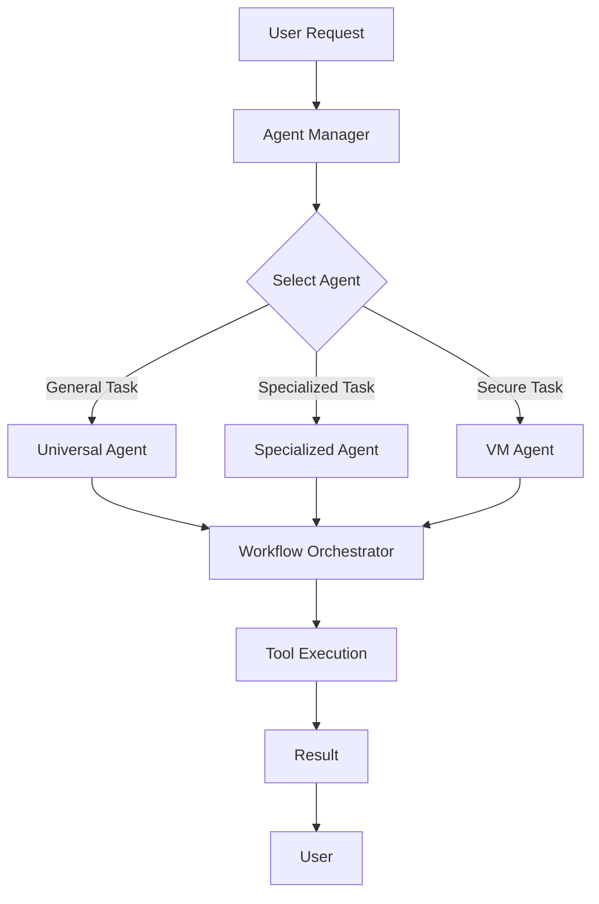

# Automation Module: Intelligent Task Orchestration

The `automation` module in `src/cli` is the orchestration layer that enables NikCLI to understand complex tasks, break them down into executable steps, and coordinate multiple agents to achieve high-level goals.

<CardGroup cols={2}>
  <Card title="Agent Management" icon="users-cog">
    Manages the lifecycle of AI agents, including creation, execution, monitoring, and termination.
  </Card>
  <Card title="Workflow Orchestration" icon="project-diagram">
    Orchestrates complex workflows by combining multiple tools, agents, and execution strategies.
  </Card>
  <Card title="Cognitive Planning" icon="brain">
    Uses advanced NLP to understand user intent and create intelligent execution plans.
  </Card>
  <Card title="Adaptive Execution" icon="sync-alt">
    Adapts execution strategies in real-time based on task progress, feedback, and changing requirements.
  </Card>
</CardGroup>

## Core Components

<AccordionGroup>
  <Accordion title="agent-manager.ts" icon="users-cog">
    The **Agent Manager** is responsible for managing the lifecycle of all AI agents in NikCLI. It handles agent creation, task assignment, execution monitoring, and resource cleanup.

    ### Key Responsibilities
    - **Agent Registration**: Registers and maintains a registry of available agents and their capabilities.
    - **Task Assignment**: Assigns tasks to the most suitable agent based on capabilities and current workload.
    - **Lifecycle Management**: Manages the creation, execution, and termination of agent instances.
    - **Resource Management**: Ensures efficient use of system resources by managing concurrent agent executions.

    ### Example Usage
    ```typescript
    import { AgentManager } from './automation/agents/agent-manager';

    const manager = new AgentManager();

    // Register a new agent
    await manager.registerAgent({
      name: 'universal-agent',
      capabilities: ['code-generation', 'analysis', 'refactoring'],
      maxConcurrentTasks: 3
    });

    // Execute a task with an agent
    const result = await manager.executeTask({
      agentName: 'universal-agent',
      task: 'Create a React authentication component',
      context: { projectPath: '/path/to/project' }
    });
    ```
  </Accordion>

  <Accordion title="universal-agent.ts" icon="robot">
    The **Universal Agent** is the primary, general-purpose agent in NikCLI. It has over 35 development capabilities and can handle a wide range of tasks, from code generation to DevOps automation.

    ### Capabilities
    The Universal Agent is organized into several capability domains:

    - **Core Development** (7 capabilities): Code generation, analysis, review, optimization, debugging, refactoring, testing
    - **Frontend Technologies** (11 capabilities): React, Next.js, TypeScript, JavaScript, HTML, CSS, components, hooks, JSX, TSX
    - **Backend Development** (8 capabilities): Node.js, API development, databases, server architecture, REST, GraphQL, microservices
    - **DevOps & Infrastructure** (8 capabilities): CI/CD, Docker, Kubernetes, deployment, infrastructure, monitoring, security
    - **Analysis & Documentation** (5 capabilities): Performance analysis, security analysis, quality assessment, architecture review, documentation generation

    ### Example Usage
    ```bash
    # Use the Universal Agent to create a complete feature
    /agent universal-agent "Build a user authentication system with JWT, refresh tokens, email verification, and password reset functionality. Include unit tests and API documentation."
    ```

    ### Advanced Features
    - **Context Awareness**: Analyzes your project structure to generate code that follows your existing patterns and conventions.
    - **Multi-Step Planning**: Breaks down complex tasks into manageable steps and executes them sequentially or in parallel.
    - **Continuous Learning**: Learns from your feedback and project history to improve future task execution.
  </Accordion>

  <Accordion title="workflow-orchestrator.ts" icon="project-diagram">
    The **Workflow Orchestrator** coordinates complex workflows that involve multiple tools, agents, and execution strategies. It is the brain behind NikCLI's cognitive orchestration capabilities.

    ### Orchestration Strategies
    The Workflow Orchestrator supports multiple execution strategies:

    - **Sequential**: Executes tasks one after another, ensuring dependencies are respected.
    - **Parallel**: Executes independent tasks concurrently to maximize efficiency.
    - **Hybrid**: Combines sequential and parallel execution for optimal performance.
    - **Adaptive**: Dynamically adjusts the execution strategy based on task progress and system resources.

    ### Example Usage
    ```typescript
    import { WorkflowOrchestrator } from './automation/workflow-orchestrator';

    const orchestrator = new WorkflowOrchestrator();

    // Define a complex workflow
    const workflow = {
      name: 'build-full-stack-app',
      steps: [
        { id: 'setup', task: 'Initialize project structure', strategy: 'sequential' },
        { id: 'backend', task: 'Build backend API', strategy: 'parallel', dependencies: ['setup'] },
        { id: 'frontend', task: 'Build frontend UI', strategy: 'parallel', dependencies: ['setup'] },
        { id: 'tests', task: 'Create test suite', strategy: 'sequential', dependencies: ['backend', 'frontend'] },
        { id: 'deploy', task: 'Deploy to production', strategy: 'sequential', dependencies: ['tests'] }
      ]
    };

    // Execute the workflow
    const result = await orchestrator.execute(workflow);
    ```
  </Accordion>

  <Accordion title="autonomous-orchestrator.ts" icon="magic">
    The **Autonomous Orchestrator** enables fully autonomous execution of complex tasks with minimal user intervention. It combines cognitive planning, adaptive execution, and continuous learning to achieve high-level goals.

    ### Key Features
    - **Intent Understanding**: Uses advanced NLP to understand user intent from natural language descriptions.
    - **Autonomous Planning**: Creates detailed execution plans without requiring step-by-step user guidance.
    - **Self-Correction**: Detects and corrects errors automatically during execution.
    - **Progress Reporting**: Provides real-time updates on task progress and status.

    ### Example Usage
    ```bash
    # Enable autonomous mode for a complex task
    /auto "Create a complete e-commerce platform with product catalog, shopping cart, checkout, payment integration, order management, and admin dashboard. Use React for the frontend, Node.js for the backend, and PostgreSQL for the database."
    ```

    ### Best Practices
    - **Clear Intent**: Provide clear, detailed descriptions of what you want to achieve.
    - **Review Plans**: Review the generated execution plan before approving autonomous execution.
    - **Monitor Progress**: Keep an eye on progress updates to ensure the task is on track.
    - **Provide Feedback**: Give feedback on the results to help the system learn and improve.
  </Accordion>
</AccordionGroup>

## Agent System Architecture

The agent system in NikCLI follows a modular, extensible architecture that allows for easy addition of new agents and capabilities.



## Best Practices

<Tabs>
  <Tab title="Task Decomposition">
    **Breaking Down Complex Tasks**

    For best results, break down complex tasks into clear, manageable steps:

    ```bash
    # Instead of:
    /agent universal-agent "Build everything"

    # Do this:
    /plan "Build authentication system"
    # Then review and approve the generated plan

    # Or provide a detailed description:
    /agent universal-agent "Build a user authentication system with the following features: 1) JWT-based authentication, 2) Email verification, 3) Password reset, 4) Role-based access control. Include unit tests for all components."
    ```
  </Tab>

  <Tab title="Agent Selection">
    **Choosing the Right Agent**

    Different agents are optimized for different types of tasks:

    - **Universal Agent**: Best for general development tasks, code generation, and project setup.
    - **VM Agent**: Best for tasks that require isolation, such as testing untrusted code or working with sensitive data.
    - **Specialized Agents**: Best for domain-specific tasks like DevOps, frontend development, or backend development.

    ```bash
    # Use the Universal Agent for general tasks
    /agent universal-agent "Create a React component"

    # Use the VM Agent for secure tasks
    /vm-agent "Test this third-party library in an isolated environment"
    ```
  </Tab>

  <Tab title="Workflow Optimization">
    **Optimizing Workflow Execution**

    To maximize efficiency and minimize execution time:

    - **Identify Parallelizable Tasks**: Look for tasks that can be executed concurrently.
    - **Minimize Dependencies**: Reduce unnecessary dependencies between tasks.
    - **Use Caching**: Cache intermediate results to avoid redundant work.
    - **Monitor Resource Usage**: Keep an eye on system resources to prevent bottlenecks.

    ```typescript
    // Example: Optimize a workflow by identifying parallel tasks
    const optimizedWorkflow = {
      steps: [
        { id: 'setup', task: 'Setup project', strategy: 'sequential' },
        { 
          id: 'parallel-dev', 
          task: 'Parallel development', 
          strategy: 'parallel',
          subtasks: [
            { id: 'backend', task: 'Build backend' },
            { id: 'frontend', task: 'Build frontend' },
            { id: 'docs', task: 'Write documentation' }
          ]
        },
        { id: 'integration', task: 'Integration tests', strategy: 'sequential', dependencies: ['parallel-dev'] }
      ]
    };
    ```
  </Tab>
</Tabs>

<Tip>
  **Pro Tip**: The automation module is highly extensible. You can create custom agents by extending the `BaseAgent` class and registering them with the Agent Manager. This allows you to tailor NikCLI to your specific development workflows and requirements.
</Tip>

## Related Documentation

<CardGroup cols={2}>
  <Card title="AI Module" icon="brain" href="/src-cli/ai-module">
    Learn how the AI module powers the automation system.
  </Card>
  <Card title="Planning System" icon="clipboard-list" href="/planning-system/overview">
    Explore the planning system for complex task management.
  </Card>
  <Card title="Agent Commands" icon="terminal" href="/cli-reference/agent-commands">
    Reference for all agent-related commands.
  </Card>
  <Card title="Workflow Patterns" icon="sitemap" href="/user-guide/workflow-patterns">
    Common workflow patterns and best practices.
  </Card>
</CardGroup>
