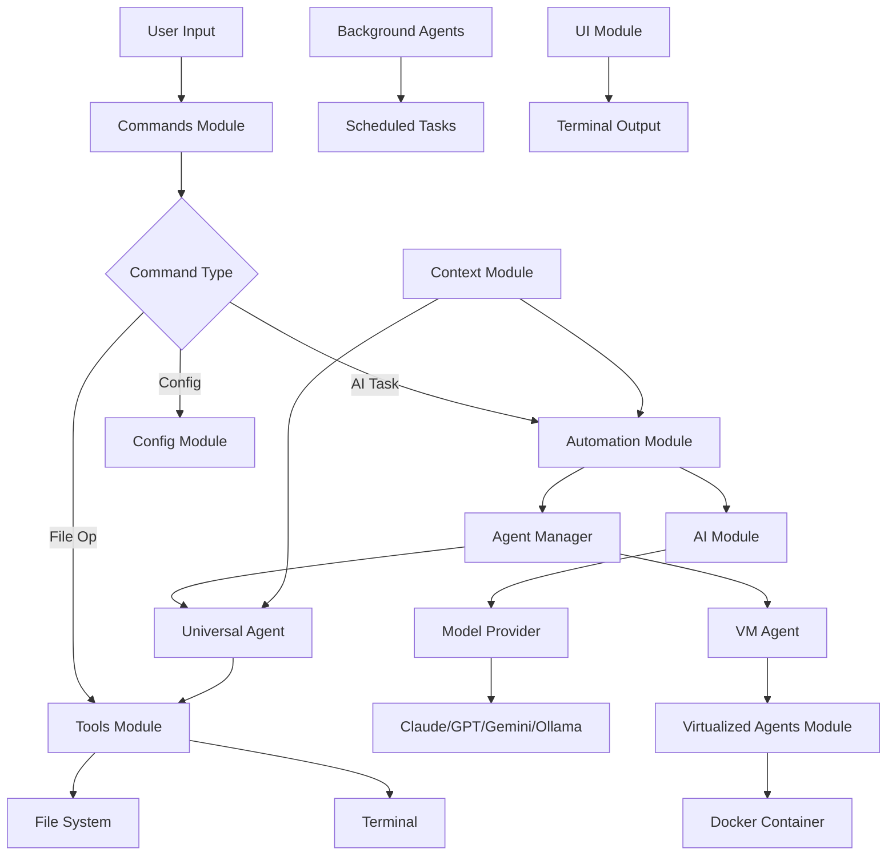

# src/cli: Complete Architecture Overview

The `src/cli` directory is the core of NikCLI, containing all the logic for the command-line interface, AI integration, agent systems, and cognitive orchestration. This document provides a comprehensive overview of its architecture and organization.

## Directory Structure

<CardGroup cols={3}>
  <Card title="ai" icon="brain" href="/src-cli/ai-module">
    AI engine with multi-provider support, adaptive routing, and RAG integration.
  </Card>
  <Card title="automation" icon="robot" href="/src-cli/automation-module">
    Agent system and workflow orchestration for intelligent task execution.
  </Card>
  <Card title="tools" icon="tools" href="/src-cli/tools-module">
    80+ commands for file operations, terminal integration, and project management.
  </Card>
  <Card title="virtualized-agents" icon="container" href="/src-cli/virtualized-agents-module">
    Secure VM agent for isolated, containerized development.
  </Card>
  <Card title="background-agents" icon="clock">
    Background services for scheduled tasks and long-running operations.
  </Card>
  <Card title="commands" icon="terminal">
    Command parsing, validation, and execution logic.
  </Card>
  <Card title="config" icon="cog">
    Configuration management and settings.
  </Card>
  <Card title="context" icon="database">
    Context management and RAG system for workspace awareness.
  </Card>
  <Card title="ui" icon="paint-brush">
    Terminal UI components and formatters.
  </Card>
</CardGroup>

## Architecture Diagram

The following diagram illustrates the high-level architecture of NikCLI and how the different modules interact:



## Module Responsibilities

<AccordionGroup>
  <Accordion title="ai - The Cognitive Engine" icon="brain">
    The `ai` module is responsible for all AI-related functionality, including model selection, API call management, and RAG integration.

    **Key Components:**
    - `adaptive-model-router.ts`: Intelligent model selection
    - `ai-call-manager.ts`: API call orchestration
    - `model-provider.ts`: Multi-provider interface
    - `rag-inference-layer.ts`: Retrieval-Augmented Generation

    **Learn More:** [AI Module Documentation](/src-cli/ai-module)
  </Accordion>

  <Accordion title="automation - Intelligent Orchestration" icon="robot">
    The `automation` module handles agent management, workflow orchestration, and cognitive planning.

    **Key Components:**
    - `agent-manager.ts`: Agent lifecycle management
    - `universal-agent.ts`: General-purpose AI agent
    - `workflow-orchestrator.ts`: Complex workflow coordination
    - `autonomous-orchestrator.ts`: Fully autonomous task execution

    **Learn More:** [Automation Module Documentation](/src-cli/automation-module)
  </Accordion>

  <Accordion title="tools - The Command Toolkit" icon="tools">
    The `tools` module contains the implementation of all 80+ commands available in NikCLI.

    **Tool Categories:**
    - File Operations: `/read`, `/write`, `/edit`, `/ls`, `/search`, `/grep`
    - Terminal Operations: `/run`, `/sh`, `/bash`, `/install`, `/git`, `/docker`
    - Project Management: `/build`, `/test`, `/lint`, `/create`
    - AI Features: `/analyze-image`, `/vision`, `/generate-image`
    - Memory & Data: `/remember`, `/recall`, `/snapshot`, `/restore`

    **Learn More:** [Tools Module Documentation](/src-cli/tools-module)
  </Accordion>

  <Accordion title="virtualized-agents - Secure Execution" icon="container">
    The `virtualized-agents` module provides secure, isolated execution environments using Docker containers.

    **Key Components:**
    - `container-manager.ts`: Docker container lifecycle
    - `secure-vm-agent.ts`: Isolated agent execution
    - `vm-chat-bridge.ts`: Communication bridge
    - `security/`: Security policies and token management

    **Learn More:** [Virtualized Agents Module Documentation](/src-cli/virtualized-agents-module)
  </Accordion>

  <Accordion title="background-agents - Scheduled Tasks" icon="clock">
    The `background-agents` module manages long-running and scheduled tasks.

    **Key Components:**
    - `background-agent-service.ts`: Service management
    - `queue/job-queue.ts`: Task queue management
    - `api/`: REST API for background agents
    - `github/`: GitHub integration for automated workflows

    **Use Cases:**
    - Scheduled code reviews
    - Automated dependency updates
    - Continuous integration monitoring
    - Periodic security scans
  </Accordion>

  <Accordion title="commands - Command Processing" icon="terminal">
    The `commands` module handles command parsing, validation, and routing.

    **Responsibilities:**
    - Parse user input into structured commands
    - Validate command syntax and parameters
    - Route commands to appropriate handlers
    - Provide command suggestions and autocomplete
  </Accordion>

  <Accordion title="config - Configuration Management" icon="cog">
    The `config` module manages all configuration settings for NikCLI.

    **Configuration Areas:**
    - AI provider settings (API keys, models, preferences)
    - Security settings (approval mode, sandbox, permissions)
    - UI preferences (themes, formatters, output styles)
    - Project-specific settings (paths, patterns, rules)

    **Configuration File:** `~/.nikcli/config.json`
  </Accordion>

  <Accordion title="context - Workspace Awareness" icon="database">
    The `context` module provides workspace awareness through RAG (Retrieval-Augmented Generation).

    **Key Features:**
    - Workspace indexing and semantic search
    - Code embeddings for similarity search
    - Project structure analysis
    - Dependency graph generation

    **Learn More:** [Context & RAG Documentation](/context-rag/overview)
  </Accordion>

  <Accordion title="ui - Terminal Interface" icon="paint-brush">
    The `ui` module handles all terminal output formatting and visualization.

    **Components:**
    - `advanced-cli-ui.ts`: Rich terminal UI
    - `diff-viewer.ts`: Side-by-side diff display
    - `dashboard-ui.ts`: Interactive dashboard
    - `mermaid-renderer.ts`: Diagram rendering
    - `syntax-highlighter.ts`: Code syntax highlighting
  </Accordion>
</AccordionGroup>

## Data Flow

Understanding how data flows through NikCLI is key to understanding its architecture.

<Steps>
  <Step title="User Input">
    The user enters a command or natural language request in the terminal.
  </Step>
  <Step title="Command Parsing">
    The `commands` module parses the input and identifies the command type and parameters.
  </Step>
  <Step title="Context Retrieval">
    The `context` module retrieves relevant information about the workspace and project.
  </Step>
  <Step title="Agent Selection">
    The `automation` module selects the appropriate agent based on the task requirements.
  </Step>
  <Step title="AI Processing">
    The `ai` module processes the request using the selected AI model, incorporating context from the RAG system.
  </Step>
  <Step title="Tool Execution">
    The selected agent executes the necessary tools from the `tools` module to complete the task.
  </Step>
  <Step title="Output Formatting">
    The `ui` module formats the results and displays them in the terminal.
  </Step>
  <Step title="Feedback Loop">
    User feedback is collected and used to improve future task execution.
  </Step>
</Steps>

## Best Practices for Working with src/cli

<Tabs>
  <Tab title="Code Organization">
    **Maintaining Clean Code**

    - **Modularity**: Keep modules focused on a single responsibility.
    - **Separation of Concerns**: Separate UI logic from business logic.
    - **Dependency Injection**: Use dependency injection for better testability.
    - **Type Safety**: Leverage TypeScript's type system for compile-time safety.

    ```typescript
    // Example: Good module structure
    export class MyService {
      constructor(
        private aiProvider: AIProvider,
        private toolRegistry: ToolRegistry,
        private logger: Logger
      ) {}
      
      async execute(task: Task): Promise<Result> {
        // Implementation
      }
    }
    ```
  </Tab>

  <Tab title="Testing">
    **Testing Strategy**

    - **Unit Tests**: Test individual functions and classes in isolation.
    - **Integration Tests**: Test interactions between modules.
    - **End-to-End Tests**: Test complete workflows from user input to output.
    - **Mocking**: Use mocks for external dependencies (AI APIs, file system).

    ```typescript
    // Example: Unit test
    describe('AdaptiveModelRouter', () => {
      it('should select the optimal model for code generation', async () => {
        const router = new AdaptiveModelRouter();
        const model = await router.selectModel({
          taskType: 'code-generation',
          complexity: 'high'
        });
        expect(model.name).toBe('claude-3-opus');
      });
    });
    ```
  </Tab>

  <Tab title="Performance">
    **Performance Optimization**

    - **Caching**: Cache frequently accessed data (embeddings, AI responses).
    - **Lazy Loading**: Load modules only when needed.
    - **Parallel Execution**: Execute independent tasks concurrently.
    - **Resource Management**: Clean up resources after use.

    ```typescript
    // Example: Caching AI responses
    class CachedAIProvider {
      private cache = new Map<string, AIResponse>();
      
      async complete(prompt: string): Promise<AIResponse> {
        if (this.cache.has(prompt)) {
          return this.cache.get(prompt)!;
        }
        const response = await this.provider.complete(prompt);
        this.cache.set(prompt, response);
        return response;
      }
    }
    ```
  </Tab>

  <Tab title="Security">
    **Security Considerations**

    - **Input Validation**: Always validate user input before processing.
    - **Sandboxing**: Use sandboxed execution for untrusted code.
    - **API Key Protection**: Never log or expose API keys.
    - **Permission Checks**: Verify permissions before executing sensitive operations.

    ```typescript
    // Example: Input validation
    function validateFilePath(path: string): boolean {
      // Prevent directory traversal attacks
      if (path.includes('..')) {
        throw new Error('Invalid file path: directory traversal not allowed');
      }
      // Additional validation...
      return true;
    }
    ```
  </Tab>
</Tabs>

## Extending src/cli

NikCLI is designed to be extensible. Here's how you can add new functionality:

<CardGroup cols={2}>
  <Card title="Create Custom Tools" icon="plus-circle">
    Extend the `BaseTool` class to create new commands.
  </Card>
  <Card title="Add New Agents" icon="user-plus">
    Extend the `BaseAgent` class to create specialized agents.
  </Card>
  <Card title="Integrate New AI Providers" icon="plug">
    Implement the `ModelProvider` interface for new AI services.
  </Card>
  <Card title="Add UI Components" icon="palette">
    Create new formatters and visualizations in the `ui` module.
  </Card>
</CardGroup>

## Related Documentation

<CardGroup cols={3}>
  <Card title="AI Module" icon="brain" href="/src-cli/ai-module">
    Deep dive into the AI engine
  </Card>
  <Card title="Automation Module" icon="robot" href="/src-cli/automation-module">
    Learn about agent systems
  </Card>
  <Card title="Tools Module" icon="tools" href="/src-cli/tools-module">
    Explore the command toolkit
  </Card>
  <Card title="Architecture Overview" icon="sitemap" href="/architecture/overview">
    High-level architecture
  </Card>
  <Card title="API Reference" icon="code" href="/api-reference/core-apis">
    Complete API documentation
  </Card>
  <Card title="Contributing" icon="code-branch" href="/contributing/development">
    Contribute to NikCLI
  </Card>
</CardGroup>
