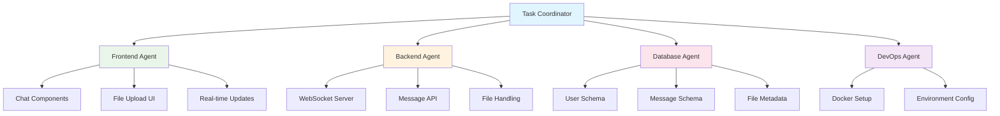

## Autonomous Mode Overview

Autonomous Mode is NikCLI's most powerful feature, enabling AI agents to work independently on complex development tasks with minimal human supervision. In this mode, AI takes full control of the development process while maintaining safety and quality standards.

<CardGroup cols={2}>
  <Card title="Independent Execution" icon="robot">
    AI works autonomously with minimal interruptions
  </Card>
  <Card title="Multi-Agent Coordination" icon="users">
    Multiple specialized agents collaborate automatically
  </Card>
  <Card title="Intelligent Planning" icon="brain">
    Automatic task breakdown and dependency management
  </Card>
  <Card title="Safety Guardrails" icon="shield">
    Built-in safety checks and approval workflows
  </Card>
</CardGroup>

## Entering Autonomous Mode

### Basic Activation

<Tabs>
  <Tab title="Command Activation">
    ```bash
    # Enter autonomous mode
    /auto
    
    # Or use the auto command with task
    /auto "Create a complete e-commerce product catalog with search and filters"
    
    # Autonomous mode activated
    🤖 Auto Mode: Minimal supervision, maximum efficiency
    ```
  </Tab>
  
  <Tab title="Keyboard Shortcut">
    ```bash
    # Cycle through modes using Shift+Tab
    💬 Default Chat → 📋 Planning Mode → 🤖 Auto Mode
    
    # Direct switch with ESC then Shift+Tab
    ```
  </Tab>
  
  <Tab title="Configuration">
    ```bash
    # Set autonomous as default mode
    nikcli config set default-mode autonomous
    
    # Configure auto-approval levels
    nikcli config set auto-approve-level medium
    ```
  </Tab>
</Tabs>

### Mode Indicators

When in autonomous mode, you'll see clear indicators:

```bash
╭─────────────────────────────────────────────────────╮
│  🤖 AUTONOMOUS MODE - AI Working Independently     │
│  Type /help for commands or /default to switch     │
╰─────────────────────────────────────────────────────╯

Auto Mode: Ready for complex task execution
Security Level: 🛡️ Default (Medium supervision)
Active Agents: 3 (Universal, React-Expert, Backend)

>
```

## How Autonomous Mode Works

### Task Analysis and Planning

<Steps>
  <Step title="Requirement Analysis">
    ```
    > /auto "Build a real-time chat application with private messages and file sharing"
    
    🤖 Autonomous Mode: Analyzing requirements...
    
    📋 Task Breakdown:
    ├── Frontend: React components for chat interface
    ├── Backend: WebSocket server and message API
    ├── Database: Message storage and user management
    ├── File Upload: Secure file sharing system
    └── Real-time: Socket.io integration
    
    Complexity: HIGH | Estimated Time: 45-60 minutes
    ```
  </Step>
  
  <Step title="Agent Assignment">
    ```
    🎯 Agent Assignment:
    ├── Frontend-Agent: React components and UI
    ├── Backend-Agent: API endpoints and WebSocket
    ├── Database-Agent: Schema design and optimization
    └── Universal-Agent: Integration and coordination
    
    Parallel execution plan created...
    ```
  </Step>
  
  <Step title="Dependency Resolution">
    ```
    🔗 Dependency Analysis:
    
    Phase 1: Foundation
    ├── Database schema setup
    ├── Basic API structure
    └── WebSocket server configuration
    
    Phase 2: Core Features
    ├── Message sending/receiving
    ├── User authentication
    └── Real-time connections
    
    Phase 3: Advanced Features
    ├── File upload handling
    ├── Private messaging
    └── Chat room management
    ```
  </Step>
  
  <Step title="Execution Begin">
    ```
    🚀 Beginning autonomous execution...
    
    [AI agents work independently with periodic status updates]
    ```
  </Step>
</Steps>

### Multi-Agent Orchestration

In autonomous mode, multiple agents work in parallel:



### Real-time Progress Monitoring

<AccordionGroup>
  <Accordion title="Live Progress Dashboard">
    ```
    🤖 Autonomous Execution Dashboard
    
    ┌─ Chat Application Implementation ─────────────────────┐
    │                                                       │
    │  Overall Progress: ████████████████░░░░  75%          │
    │  Estimated Time Remaining: 12 minutes                │
    │                                                       │
    │  Active Agents:                                       │
    │  ├── Frontend-Agent    ████████████████████  100%    │
    │  ├── Backend-Agent     ████████████████░░░░   80%    │
    │  ├── Database-Agent    ████████████████████  100%    │
    │  └── DevOps-Agent      ████████░░░░░░░░░░░░   40%    │
    │                                                       │
    │  Current Tasks:                                       │
    │  ├── ✅ Chat components created                       │
    │  ├── ✅ Database schema deployed                      │
    │  ├── 🔄 WebSocket integration (in progress)          │
    │  ├── 🔄 File upload endpoints (in progress)          │
    │  └── ⏳ Docker configuration (queued)                │
    │                                                       │
    │  Press 's' for details, 'q' to quit dashboard        │
    └───────────────────────────────────────────────────────┘
    ```
  </Accordion>
  
  <Accordion title="Agent Activity Streams">
    ```
    📡 Agent Activity Streams
    
    Frontend-Agent:
    ├── 14:23:15 ✅ Created ChatWindow.tsx component
    ├── 14:24:02 ✅ Added MessageList with virtual scrolling
    ├── 14:24:45 ✅ Implemented typing indicators
    └── 14:25:12 🔄 Adding file upload drag-and-drop...
    
    Backend-Agent:
    ├── 14:23:30 ✅ Set up Express.js server
    ├── 14:24:15 ✅ Configured Socket.io integration
    ├── 14:25:00 🔄 Implementing message broadcasting...
    └── 14:25:30 ⏳ Queued: File upload endpoints
    
    Database-Agent:
    ├── 14:23:45 ✅ Created User model with Mongoose
    ├── 14:24:30 ✅ Designed Message schema
    ├── 14:25:15 ✅ Added indexes for performance
    └── 14:25:45 ✅ Completed database setup
    ```
  </Accordion>
  
  <Accordion title="Integration Status">
    ```
    🔗 Integration Checkpoints
    
    Frontend ↔ Backend:
    ├── ✅ API endpoint compatibility verified
    ├── ✅ WebSocket connection established
    ├── 🔄 File upload integration testing...
    └── ⏳ Authentication flow validation
    
    Backend ↔ Database:
    ├── ✅ Model relationships validated
    ├── ✅ Query optimization applied
    └── ✅ Connection pooling configured
    
    System Integration:
    ├── ✅ Environment variables aligned
    ├── 🔄 Cross-component testing...
    └── ⏳ End-to-end workflow validation
    ```
  </Accordion>
</AccordionGroup>

## Autonomous Task Examples

### Full-Stack Feature Implementation

<Tabs>
  <Tab title="E-commerce Checkout">
    ```
    > /auto "Implement complete checkout flow with Stripe payment processing"
    
    🤖 Autonomous execution plan:
    
    Phase 1: Frontend Components (15 min)
    ├── Shopping cart summary
    ├── Shipping information form
    ├── Payment form with Stripe Elements
    └── Order confirmation page
    
    Phase 2: Backend Integration (20 min)
    ├── Stripe webhook handling
    ├── Order processing logic
    ├── Email notification system
    └── Inventory management
    
    Phase 3: Testing & Validation (10 min)
    ├── Payment flow testing
    ├── Error scenario handling
    └── Security validation
    
    🚀 Beginning execution...
    ```
  </Tab>
  
  <Tab title="User Authentication System">
    ```
    > /auto "Build complete authentication with JWT, email verification, and password reset"
    
    🤖 Multi-agent coordination:
    
    Backend-Agent:
    ├── JWT token management
    ├── Password hashing with bcrypt
    ├── Email verification system
    └── Password reset flow
    
    Frontend-Agent:
    ├── Login/register forms
    ├── Protected route wrapper
    ├── Authentication context
    └── User profile management
    
    Database-Agent:
    ├── User model design
    ├── Token storage strategy
    └── Session management
    
    Security-Agent:
    ├── Input validation
    ├── Rate limiting
    └── Security headers
    ```
  </Tab>
  
  <Tab title="Real-time Dashboard">
    ```
    > /auto "Create analytics dashboard with real-time charts and data visualization"
    
    🤖 Autonomous implementation:
    
    Data Layer:
    ├── Analytics API endpoints
    ├── Real-time data aggregation
    ├── WebSocket data streaming
    └── Caching strategy
    
    Visualization:
    ├── Chart.js integration
    ├── Real-time chart updates
    ├── Interactive filtering
    └── Responsive design
    
    Performance:
    ├── Data pagination
    ├── Lazy loading charts
    ├── Memory optimization
    └── Update throttling
    ```
  </Tab>
</Tabs>

### Code Optimization and Refactoring

<AccordionGroup>
  <Accordion title="Performance Optimization">
    ```
    > /auto "Optimize the entire application for better performance"
    
    🤖 Performance Analysis & Optimization:
    
    Frontend Optimization:
    ├── Bundle analysis and code splitting
    ├── Image optimization and lazy loading
    ├── Component memoization
    ├── Virtual scrolling for large lists
    └── Service worker caching
    
    Backend Optimization:
    ├── Database query optimization
    ├── Redis caching implementation
    ├── API response compression
    ├── Connection pooling
    └── Background job processing
    
    Infrastructure:
    ├── CDN configuration
    ├── Load balancing setup
    ├── Database indexing
    └── Monitoring implementation
    
    Autonomous execution with before/after metrics...
    ```
  </Accordion>
  
  <Accordion title="Security Hardening">
    ```
    > /auto "Perform comprehensive security audit and implement fixes"
    
    🤖 Security Assessment & Hardening:
    
    Code Security:
    ├── Input validation enhancement
    ├── SQL injection prevention
    ├── XSS protection implementation
    ├── CSRF token integration
    └── Secure header configuration
    
    Authentication Security:
    ├── Password policy enforcement
    ├── Rate limiting implementation
    ├── Session security improvement
    ├── Two-factor authentication
    └── OAuth integration hardening
    
    Infrastructure Security:
    ├── Environment variable security
    ├── API key rotation system
    ├── Dependency vulnerability fixes
    └── Security monitoring setup
    ```
  </Accordion>
  
  <Accordion title="Code Quality Improvement">
    ```
    > /auto "Improve code quality across the entire codebase"
    
    🤖 Code Quality Enhancement:
    
    Code Standards:
    ├── ESLint rule enforcement
    ├── Prettier formatting consistency
    ├── TypeScript strict mode
    ├── Import organization
    └── Dead code elimination
    
    Testing Coverage:
    ├── Unit test creation
    ├── Integration test expansion
    ├── E2E test implementation
    ├── Test coverage reporting
    └── Mock optimization
    
    Documentation:
    ├── Code comment enhancement
    ├── API documentation generation
    ├── README file updates
    └── Type definition improvements
    ```
  </Accordion>
</AccordionGroup>

## Safety and Control

### Approval Checkpoints

Even in autonomous mode, NikCLI maintains safety through strategic checkpoints:

<Tabs>
  <Tab title="High-Risk Operations">
    ```
    🛡️ Security Checkpoint Required
    
    The following high-risk operation requires approval:
    
    Operation: Database schema modification
    Risk Level: HIGH
    Details: Dropping existing tables and recreating schema
    
    Impact:
    ├── Data loss potential: Existing user data
    ├── Downtime expected: 2-3 minutes
    └── Rollback complexity: High
    
    Autonomous mode paused pending approval.
    
    Options:
    [A] Approve and continue
    [M] Modify approach (suggest backup first)
    [S] Skip this operation
    [P] Pause autonomous mode
    
    Choice: _
    ```
  </Tab>
  
  <Tab title="Environment Changes">
    ```
    🔧 Environment Modification Checkpoint
    
    Autonomous agent requests permission to:
    
    ├── Install 3 new npm packages
    ├── Modify .env configuration
    ├── Update Docker configuration
    └── Create new database migration
    
    These changes will affect:
    ├── Production environment compatibility
    ├── Team development setup
    └── CI/CD pipeline behavior
    
    Auto-approve similar changes in this session? (y/n)
    ```
  </Tab>
  
  <Tab title="External Service Integration">
    ```
    🌐 External Service Integration Alert
    
    Agent is requesting to integrate with:
    
    Service: Stripe Payment API
    Operations:
    ├── Create webhook endpoints
    ├── Store API keys in environment
    ├── Implement payment processing
    └── Add error handling for failed payments
    
    Security considerations:
    ├── PCI compliance requirements
    ├── Webhook signature validation
    ├── API key security
    └── Payment data handling
    
    Proceed with external integration? (y/n/review)
    ```
  </Tab>
</Tabs>

### Emergency Controls

<CardGroup cols={2}>
  <Card title="Emergency Stop" icon="stop">
    **Ctrl+C**: Immediate halt of all operations
    
    ```bash
    ^C
    🛑 Emergency stop requested
    
    Safely terminating agents:
    ├── ✅ Frontend-Agent stopped
    ├── ✅ Backend-Agent stopped
    ├── 🔄 Saving partial progress...
    └── ✅ All agents terminated safely
    
    Partial work saved. Resume with /resume
    ```
  </Card>
  
  <Card title="Pause and Review" icon="pause">
    **Type 'pause'**: Temporary halt for review
    
    ```bash
    > pause
    
    ⏸️ Autonomous mode paused
    
    Current status:
    ├── Frontend: 80% complete
    ├── Backend: 60% complete
    └── Integration: 30% complete
    
    Options:
    [R] Resume autonomous execution
    [M] Switch to manual mode
    [P] Review current progress
    [Q] Quit and save progress
    ```
  </Card>
</CardGroup>

### Quality Assurance

<AccordionGroup>
  <Accordion title="Automated Testing">
    ```
    🧪 Autonomous Testing Pipeline
    
    Running continuous validation:
    
    ├── ✅ Unit tests: 47/47 passing
    ├── ✅ Integration tests: 12/12 passing
    ├── 🔄 E2E tests: 8/10 passing (2 in progress)
    ├── ✅ TypeScript compilation: No errors
    ├── ✅ ESLint validation: Clean
    └── 🔄 Performance tests: Running...
    
    Auto-fix detected issues:
    ├── Fixed 3 linting warnings
    ├── Resolved 1 type error
    └── Optimized 2 slow queries
    ```
  </Accordion>
  
  <Accordion title="Code Review">
    ```
    📝 Automated Code Review
    
    Code Quality Metrics:
    ├── Cyclomatic Complexity: Good (avg 3.2)
    ├── Test Coverage: Excellent (94%)
    ├── Duplication: Low (2.1%)
    ├── Maintainability: High (A rating)
    └── Security: Secure (no issues)
    
    Recommendations Applied:
    ├── Extracted 2 reusable components
    ├── Added error boundaries
    ├── Improved variable naming
    └── Enhanced documentation
    ```
  </Accordion>
  
  <Accordion title="Performance Monitoring">
    ```
    📊 Performance Monitoring
    
    Real-time metrics:
    ├── Bundle size: 245KB (within limits)
    ├── Load time: 1.2s (excellent)
    ├── Memory usage: 45MB (optimal)
    ├── API response: 89ms avg (good)
    └── Database queries: 23ms avg (excellent)
    
    Optimizations applied:
    ├── Code splitting implemented
    ├── Images compressed
    ├── Queries optimized
    └── Caching enabled
    ```
  </Accordion>
</AccordionGroup>

## Configuration and Customization

### Autonomous Mode Settings

<Tabs>
  <Tab title="Approval Levels">
    ```bash
    # Set auto-approval level
    nikcli config set autonomous.approval-level strict    # Approve nothing
    nikcli config set autonomous.approval-level medium    # Approve low-risk
    nikcli config set autonomous.approval-level permissive # Approve most
    
    # Custom approval rules
    nikcli config set autonomous.auto-approve-tests true
    nikcli config set autonomous.auto-approve-docs true
    nikcli config set autonomous.auto-approve-dependencies false
    ```
  </Tab>
  
  <Tab title="Agent Behavior">
    ```bash
    # Max parallel agents
    nikcli config set autonomous.max-agents 4
    
    # Agent timeout settings
    nikcli config set autonomous.agent-timeout 600  # 10 minutes
    
    # Quality gates
    nikcli config set autonomous.require-tests true
    nikcli config set autonomous.min-coverage 80
    nikcli config set autonomous.quality-gates strict
    ```
  </Tab>
  
  <Tab title="Safety Settings">
    ```bash
    # Emergency controls
    nikcli config set autonomous.emergency-stop-key "ctrl+c"
    
    # Backup creation
    nikcli config set autonomous.auto-backup true
    nikcli config set autonomous.backup-interval 300  # 5 minutes
    
    # Rollback capability
    nikcli config set autonomous.enable-rollback true
    ```
  </Tab>
</Tabs>

### Custom Workflows

<AccordionGroup>
  <Accordion title="Workflow Templates">
    ```json
    // ~/.nikcli/workflows/feature-development.json
    {
      "name": "Full-Stack Feature Development",
      "phases": [
        {
          "name": "Planning",
          "agents": ["planner-agent"],
          "tasks": ["analyze-requirements", "create-architecture"]
        },
        {
          "name": "Backend Development",
          "agents": ["backend-agent", "database-agent"],
          "tasks": ["api-endpoints", "database-schema", "testing"]
        },
        {
          "name": "Frontend Development",
          "agents": ["frontend-agent", "ui-agent"],
          "tasks": ["components", "integration", "styling"]
        },
        {
          "name": "Integration & Testing",
          "agents": ["universal-agent"],
          "tasks": ["e2e-tests", "performance-optimization"]
        }
      ]
    }
    ```
  </Accordion>
  
  <Accordion title="Custom Agent Configurations">
    ```json
    // ~/.nikcli/agents/custom-fullstack.json
    {
      "name": "Custom Full-Stack Agent",
      "capabilities": [
        "react-development",
        "node-api-development",
        "database-design",
        "testing-automation"
      ],
      "preferences": {
        "testing-framework": "vitest",
        "styling-approach": "tailwindcss",
        "state-management": "zustand",
        "database-orm": "prisma"
      },
      "autonomy-level": "high",
      "approval-required": ["schema-changes", "dependency-updates"]
    }
    ```
  </Accordion>
</AccordionGroup>

## Best Practices

<CardGroup cols={2}>
  <Card title="Clear Requirements" icon="target">
    **Provide comprehensive initial requirements**
    
    ```
    ✅ Good:
    "Build a blog system with user authentication, 
    rich text editor, comment system, admin panel, 
    and SEO optimization"
    
    ❌ Vague:
    "Make a blog"
    ```
  </Card>
  
  <Card title="Trust but Verify" icon="shield-check">
    **Monitor progress but avoid micro-management**
    
    - Check major milestones
    - Review critical integrations
    - Test final deliverables
    - Let AI handle implementation details
  </Card>
  
  <Card title="Safety First" icon="shield">
    **Configure appropriate safety levels**
    
    - Start with higher approval requirements
    - Gradually increase autonomy as you gain confidence
    - Always enable backup creation
    - Keep emergency controls accessible
  </Card>
  
  <Card title="Quality Gates" icon="award">
    **Maintain quality standards**
    
    - Require automated testing
    - Enforce code quality metrics
    - Enable continuous integration
    - Regular performance monitoring
  </Card>
</CardGroup>

## Next Steps

<CardGroup cols={2}>
  <Card
    title="Workflow Patterns"
    icon="workflow"
    href="/user-guide/workflow-patterns"
  >
    Learn proven patterns for autonomous development
  </Card>
  <Card
    title="Agent System"
    icon="users"
    href="/agent-system/architecture"
  >
    Understand how agents coordinate in autonomous mode
  </Card>
  <Card
    title="Advanced Automation"
    icon="gear"
    href="/examples/advanced-automation"
  >
    Explore advanced autonomous development examples
  </Card>
  <Card
    title="Safety Configuration"
    icon="shield"
    href="/advanced/configuration"
  >
    Configure safety and approval systems
  </Card>
</CardGroup>

<Warning>
  Autonomous mode is powerful but requires careful configuration. Start with conservative settings and gradually increase autonomy as you become comfortable with the AI's capabilities.
</Warning>