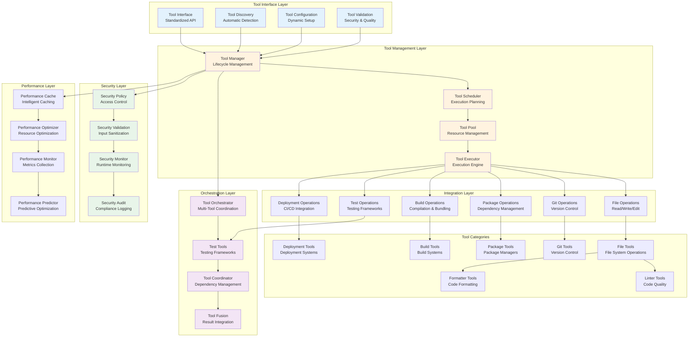

# NikCLI Tool System Architecture: Comprehensive Integration Framework for Development Tools

## Abstract

This paper presents the Tool System Architecture implemented in NikCLI, a sophisticated framework for integrating, managing, and orchestrating development tools within an AI-powered development environment. The system implements advanced tool discovery, dynamic integration, security policies, performance optimization, and collaborative tool orchestration. We examine the architectural patterns, implementation strategies, and optimization techniques that enable seamless tool integration while maintaining security, performance, and extensibility.

## 1. Introduction

Modern software development relies on a complex ecosystem of tools including linters, formatters, testing frameworks, build systems, deployment tools, and monitoring solutions. Traditional approaches to tool integration often result in fragmented workflows, configuration complexity, and security vulnerabilities.

NikCLI's Tool System Architecture addresses these challenges by providing a unified framework for tool integration that combines intelligent tool discovery, dynamic capability negotiation, security policy enforcement, and collaborative orchestration. The system enables AI agents to seamlessly interact with development tools while maintaining security boundaries and optimizing performance.

### 1.1 Problem Statement

Current tool integration approaches face several limitations:

1. **Fragmented Integration**: Tools operate in isolation without effective coordination
2. **Security Vulnerabilities**: Inconsistent security policies across different tools
3. **Performance Overhead**: Redundant operations and inefficient resource utilization
4. **Configuration Complexity**: Complex setup and maintenance requirements
5. **Limited Extensibility**: Difficulty in adding new tools or capabilities

### 1.2 Solution Overview

NikCLI's Tool System Architecture implements:

- **Unified Tool Interface**: Standardized API for tool integration and management
- **Dynamic Tool Discovery**: Automatic detection and integration of available tools
- **Security Policy Framework**: Comprehensive security policies and validation mechanisms
- **Performance Optimization**: Intelligent caching, parallel execution, and resource optimization
- **Collaborative Orchestration**: Multi-tool coordination for complex workflows

## 2. System Architecture

### 2.1 High-Level Architecture

