# NikCLI Universal Agent - System Architecture

## Overview

The NikCLI Universal Agent is an advanced AI development assistant that operates within the NikCLI autonomous development environment, providing comprehensive CLI ecosystem capabilities with cognitive orchestration.

---



```mermaid
graph TB
    %% User Interface Layer
    subgraph "User Interface Layer"
        CLI[CLI Interface]
        API[REST API]
        WebUI[Web Dashboard]
    end

    %% Core Orchestration Layer
    subgraph "Core Orchestration Layer"
        UAgent[Universal Agent<br/>Primary Coordinator]
        Orchestrator[Orchestrator Service<br/>Workflow Coordination]
        PlanningService[Planning Service<br/>TaskMaster Integration]
    end

    %% Specialized Agent System
    subgraph "Specialized Agent System"
        ReactAgent[React Agent<br/>Frontend Components]
        BackendAgent[Backend Agent<br/>API & Server]
        DevOpsAgent[DevOps Agent<br/>Infrastructure]
        CodeReviewAgent[Code Review Agent<br/>Quality Analysis]
        OptimizationAgent[Optimization Agent<br/>Performance Tuning]
    end

    %% Core Services Layer
    subgraph "Core Services"
        ToolService[Tool Service<br/>Registry & Management]
        AIProvider[AI Provider<br/>Advanced Integration]
        ContextSystem[Context System<br/>RAG Intelligence]
        FileOperations[File Operations<br/>Safe CRUD]
        GitIntegration[Git Integration<br/>Version Control]
        BuildSystem[Build System<br/>Compilation & Testing]
    end

    %% Cognitive Framework
    subgraph "Cognitive Framework"
        TaskCognition[Task Cognition<br/>Intent Classification]
        EntityExtraction[Entity Extraction<br/>Dependency Analysis]
        ComplexityAssessment[Complexity Assessment<br/>1-10 Scale Evaluation]
        StrategySelection[Strategy Selection<br/>Execution Orchestration]
    end

    %% Task Management
    subgraph "Task Management"
        TaskMaster[TaskMaster AI<br/>Planning Engine]
        ManualBreakdown[Manual Cognitive<br/>Fallback Strategy]
        TaskQueue[Task Queue<br/>Execution Pipeline]
        ProgressMonitor[Progress Monitor<br/>Real-time Tracking]
    end

    %% Data & State Layer
    subgraph "Data & State Management"
        Workspace[Workspace<br/>File System]
        ContextCache[Context Cache<br/>RAG Storage]
        SessionState[Session State<br/>Runtime Data]
        OperationLogs[Operation Logs<br/>Audit Trail]
    end

    %% External Integrations
    subgraph "External Integrations"
        NPM[Yarn/NPM<br/>Package Manager]
        Docker[Docker<br/>Container Runtime]
        Git[Git<br/>Version Control]
        IDE[IDE Integration<br/>LSP Support]
        CloudServices[Cloud Services<br/>Deployment]
    end

    %% User Flow
    CLI --> UAgent
    API --> UAgent
    WebUI --> UAgent

    %% Primary Coordination
    UAgent --> Orchestrator
    Orchestrator --> PlanningService

    %% Task Planning
    PlanningService --> TaskMaster
    TaskMaster --> TaskQueue
    ManualBreakdown --> TaskQueue

    %% Agent Delegation
    UAgent --> ReactAgent
    UAgent --> BackendAgent
    UAgent --> DevOpsAgent
    UAgent --> CodeReviewAgent
    UAgent --> OptimizationAgent

    %% Core Service Access
    UAgent --> ToolService
    UAgent --> AIProvider
    UAgent --> ContextSystem
    Orchestrator --> FileOperations
    Orchestrator --> GitIntegration
    Orchestrator --> BuildSystem

    %% Cognitive Processing
    PlanningService --> TaskCognition
    TaskCognition --> EntityExtraction
    EntityExtraction --> ComplexityAssessment
    ComplexityAssessment --> StrategySelection

    %% State Management
    ContextSystem --> ContextCache
    FileOperations --> Workspace
    Orchestrator --> SessionState
    ToolService --> OperationLogs

    %% External Access
    ToolService --> NPM
    DevOpsAgent --> Docker
    GitIntegration --> Git
    BuildSystem --> IDE
    DevOpsAgent --> CloudServices

    %% Monitoring & Feedback
    ProgressMonitor --> SessionState
    OperationLogs --> ContextCache
```

## Component Descriptions

### 1. User Interface Layer

- **CLI Interface**: Primary command-line interface for agent interaction
- **REST API**: Programmatic access to agent capabilities
- **Web Dashboard**: Visual interface for monitoring and control

### 2. Core Orchestration Layer

- **Universal Agent**: Primary coordinator with cognitive orchestration
- **Orchestrator Service**: Workflow coordination and multi-agent management
- **Planning Service**: TaskMaster AI integration and strategic planning

### 3. Specialized Agent System

- **React Agent**: Frontend component development and React-specific tasks
- **Backend Agent**: API development and server-side operations
- **DevOps Agent**: Infrastructure, deployment, and DevOps workflows
- **Code Review Agent**: Quality analysis and security auditing
- **Optimization Agent**: Performance tuning and optimization

### 4. Core Services

- **Tool Service**: Comprehensive tool registry and management
- **AI Provider**: Advanced AI integration with streaming capabilities
- **Context System**: Context-aware RAG system for workspace intelligence
- **File Operations**: Safe file CRUD with backup and validation
- **Git Integration**: Version control operations
- **Build System**: Compilation, testing, and validation

### 5. Cognitive Framework

- **Task Cognition**: Intent classification and action parsing
- **Entity Extraction**: Dependency and relationship analysis
- **Complexity Assessment**: 1-10 scale complexity evaluation
- **Strategy Selection**: Adaptive execution strategy selection

### 6. Task Management

- **TaskMaster AI**: Primary planning engine for task breakdown
- **Manual Cognitive**: Fallback strategy for planning failures
- **Task Queue**: Execution pipeline with dependency management
- **Progress Monitor**: Real-time execution tracking

### 7. Data & State Management

- **Workspace**: File system workspace management
- **Context Cache**: RAG system storage for context intelligence
- **Session State**: Runtime state management
- **Operation Logs**: Comprehensive audit trail

## Execution Flow

### 1. Task Reception

```
User Input → Interface Layer → Universal Agent
```

### 2. Cognitive Analysis

```
Task Cognition → Entity Extraction → Complexity Assessment
```

### 3. Planning Phase

```
TaskMaster AI → Task Breakdown → Strategy Selection
```

### 4. Execution Phase

```
Orchestration → Agent Delegation → Service Coordination
```

### 5. Quality Assurance

```
Validation → Testing → Security Checks → Documentation
```

## Key Features

### Autonomy Level

- **High Autonomy**: Complete execution within NikCLI ecosystem
- **Adaptive Strategy**: Dynamic approach adjustment based on complexity
- **Fallback Systems**: Multiple recovery mechanisms for reliability

### Intelligence Systems

- **Cognitive Orchestration**: Advanced task understanding and planning
- **Context Intelligence**: Workspace-aware decision making
- **Pattern Recognition**: Learning from execution patterns

### Quality Standards

- **Code Quality**: Industry-standard best practices
- **Security**: Comprehensive security validation
- **Performance**: Optimized execution and resource management
- **Documentation**: Maximum 2 markdown files per task

### Integration Capabilities

- **Multi-Agent Coordination**: Specialized agent delegation
- **External Tool Integration**: Seamless third-party tool usage
- **Version Control**: Git workflow integration
- **IDE Support**: LSP and development tool compatibility

## Success Metrics

### Functional Correctness

- All requirements met
- No breaking changes
- Backward compatibility
- Edge case handling

### Code Quality

- Industry standards compliance
- Project convention adherence
- Proper testing coverage
- Comprehensive documentation

### Performance

- No regressions
- Resource optimization
- Scalable solutions
- Fast response times

### Security

- No vulnerabilities
- Best practices
- Sensitive data protection
- Proper authentication

---

_Generated by NikCLI Universal Agent - Advanced AI Development Assistant_
