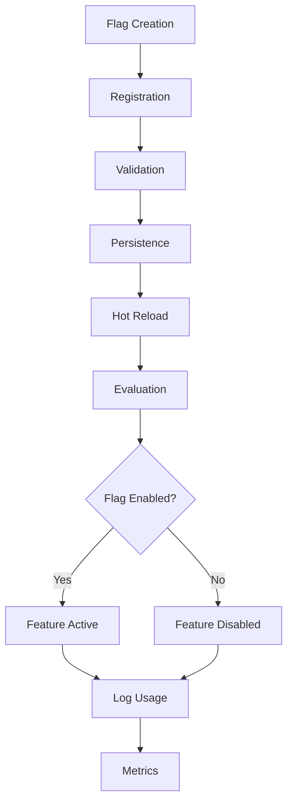
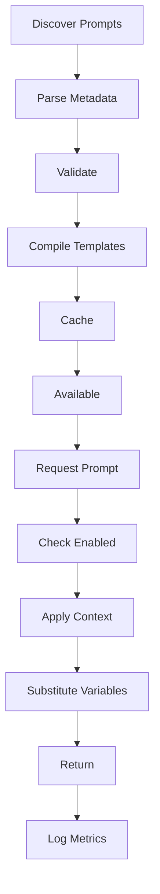
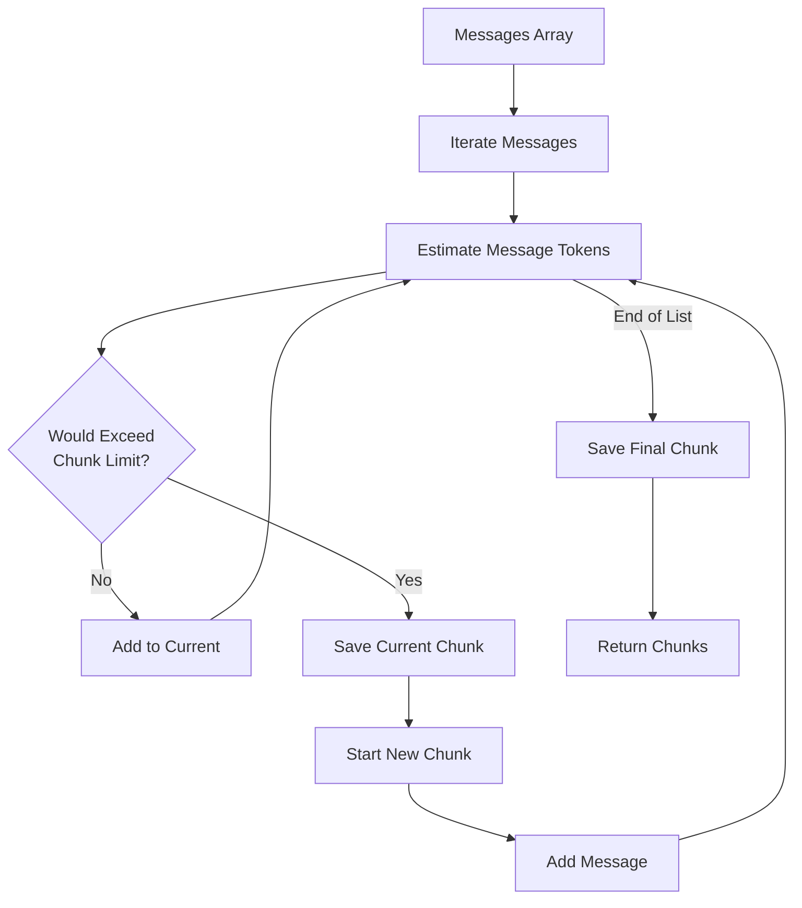
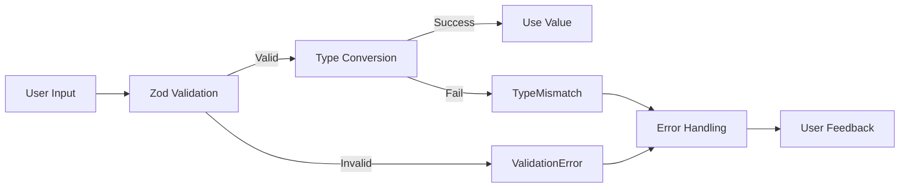
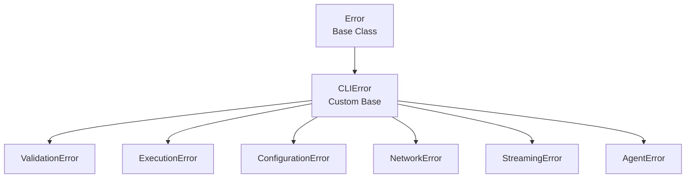
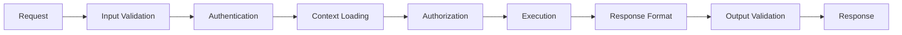

// TODO: Consider refactoring for reduced complexity
# NikCLI Core Systems: Implementation Analysis

**Detailed Technical Examination of Major Subsystems**

---

## 1. Feature Flag Management System

### 1.1 System Overview

The Feature Flag Manager implements a **comprehensive feature toggling system** with production-ready capabilities including:

- Dynamic flag management (create, read, update, delete)
- Environment-aware evaluation
- User group-based rollout
- Dependency resolution with cycle detection
- Real-time change notifications
- Persistent configuration

### 1.2 Flag Lifecycle



### 1.3 Core Flag Categories

**System Prompts: 20+ Flags**

```typescript
// Core Flags Structure
enum FlagCategory {
  CORE = "core", // Foundation features
  TOOLS = "tools", // Tool management
  AGENTS = "agents", // AI capabilities
  UI = "ui", // User interface
  PERFORMANCE = "performance", // Metrics
  SECURITY = "security", // Protection
  EXPERIMENTAL = "experimental", // Innovation
}
```

### 1.4 Advanced Flag Features

#### Dependency Management

```typescript
// Flag with dependencies
{
    id: 'advanced-security',
    name: 'Advanced Security',
    dependencies: ['tool-registry', 'context-awareness'],
    conflicts: ['legacy-mode'],
    enabled: false
}

// Evaluation checks all dependencies
if (flag.dependencies.every(depId => isEnabled(depId))) {
    // Dependencies satisfied, can enable
}
```

#### Rollout Percentage

```typescript
// Gradual rollout
{
    id: 'hot-reload',
    rolloutPercentage: 50,  // 50% of users

    // Consistent hashing for user stability
    if (hash(flagId + userId) % 100 >= rolloutPercentage) {
        return false  // User is not in rollout group
    }
}
```

#### User Group Management

```typescript
// User group targeting
{
    id: 'beta-feature',
    userGroups: ['beta-testers', 'internal-team'],

    // User evaluation
    if (!flag.userGroups.includes('all') &&
        !flag.userGroups.includes(currentUserGroup)) {
        return false  // User not in target group
    }
}
```

#### Time-based Activation

```typescript
// Time-based flag control
{
    id: 'new-ui',
    startDate: new Date('2025-11-01'),
    endDate: new Date('2025-12-31'),

    // Evaluation
    if (now < flag.startDate || now > flag.endDate) {
        return false  // Outside valid time window
    }
}
```

### 1.5 Statistical Analysis

**Flag Statistics Collected:**

| Metric                       | Tracked        | Usage                |
| ---------------------------- | -------------- | -------------------- |
| **Usage Count**              | Per flag       | Performance analysis |
| **Success Rate**             | Per flag       | Quality metrics      |
| **Last Used**                | Timestamp      | Activity tracking    |
| **Category Distribution**    | By category    | Usage patterns       |
| **Environment Distribution** | By environment | Deployment tracking  |

---

## 2. Prompt Registry System

### 2.1 System Architecture

The Prompt Registry manages **60+ system prompts** with:

- Centralized prompt management
- Template variable substitution
- Dependency tracking
- Performance metrics
- Category organization
- Validation and error handling

### 2.2 Prompt Lifecycle



### 2.3 Prompt Template System

#### Variable Substitution

```typescript
// Template with variables
const template = `
System Context:
- Working Directory: {{workingDirectory}}
- Agent ID: {{agentId}}
- Tool: {{toolName}}
- Session: {{sessionId}}
- Timestamp: {{timestamp}}

Instructions for the {{agentId}} agent...
`;

// Compilation
const compiled = compileTemplate(template, context);
```

#### Metadata Structure

```typescript
interface PromptMetadata {
  id: string; // Unique identifier
  name: string; // Human-readable name
  description: string; // Purpose
  category: PromptCategory; // Classification
  version: string; // Version tracking
  author: string; // Creator
  tags: string[]; // Searchable tags
  complexity: "basic" | "intermediate" | "advanced" | "expert";
  usageCount: number; // Usage statistics
  successRate: number; // Quality metric
  lastUsed: Date; // Activity tracking
  isEnabled: boolean; // Feature control
  requiresContext: boolean; // Context dependency
  contextTypes: string[]; // Required context types
  variables: Variable[]; // Template variables
  examples: Example[]; // Usage examples
  dependencies: string[]; // Prompt dependencies
}
```

### 2.4 Built-in System Prompts

**Universal Agent System Prompt**

```
You are the Universal Agent, a comprehensive AI assistant for
autonomous software development.

Core Capabilities:
- Full-stack development (React, TypeScript, Node.js)
- Code generation, analysis, review, and optimization
- DevOps operations and deployment
- Autonomous project creation and management
- LSP integration for code intelligence

Operating Principles:
1. Enterprise Quality: Production-ready code
2. Security First: Best practices
3. Clean Architecture: Separation of concerns
4. Type Safety: TypeScript throughout
5. Testing: Comprehensive tests
6. Documentation: Clear docs
7. Performance: Optimization
8. Accessibility: Guidelines
```

**Tool Execution System Prompt**

```
Guidelines for tool execution:

Pre-Execution Analysis:
1. Analyze task requirements
2. Select appropriate tools
3. Validate inputs and permissions
4. Check LSP diagnostics
5. Review context history

Execution Process:
1. Use tools in logical sequence
2. Handle errors with rollback
3. Validate outputs
4. Record operations
5. Provide feedback

Quality Assurance:
1. Validate with Zod schemas
2. Appropriate error handling
3. Follow security practices
4. Ensure type safety
5. Test critical operations
```

### 2.5 Prompt Validation

```typescript
// Comprehensive validation
async validatePrompt(prompt: PromptTemplate): Promise<void> {
    // 1. Check template is not empty
    if (!prompt.template?.trim()) {
        throw new Error('Prompt template is empty')
    }

    // 2. Check size limits
    if (prompt.template.length > MAX_SIZE) {
        throw new Error('Prompt exceeds maximum size')
    }

    // 3. Extract template variables
    const variablePattern = /\{\{(\w+)\}\}/g
    const foundVariables = [...prompt.template.matchAll(variablePattern)]
        .map(m => m[1])

    // 4. Validate all variables are declared
    const declaredVars = prompt.metadata.variables.map(v => v.name)
    const undeclaredVars = foundVariables.filter(
        v => !declaredVars.includes(v)
    )

    if (undeclaredVars.length > 0) {
        logWarning(`Undeclared variables: ${undeclaredVars.join(', ')}`)
    }
}
```

---

## 3. Progressive Token Manager

### 3.1 Token Estimation Algorithm

```typescript
function estimateTokens(content: string): number {
  const words = content.split(/\s+/).length;
  const chars = content.length;
  const specialChars = (content.match(/[^a-zA-Z0-9\s]/g) || []).length;

  // Multiple estimation methods
  const charEstimate = chars / 4; // Avg 4 chars per token
  const wordEstimate = words * 1.3; // Avg 1.3 tokens per word
  const specialAdjustment = specialChars * 0.2; // Special chars add complexity

  return Math.ceil(Math.max(charEstimate, wordEstimate) + specialAdjustment);
}
```

### 3.2 Progressive Chunking Algorithm



### 3.3 Checkpoint System

**Purpose**: Recovery from failures during large context processing

```typescript
interface ProcessingCheckpoint {
  id: string; // Unique checkpoint ID
  chunkId: string; // Associated chunk
  state: "pending" | "processing" | "completed" | "failed";
  result?: any; // Processing result
  error?: string; // Error message
  timestamp: Date; // Creation time
  context: any; // Processing context
}
```

### 3.4 Async Generator Pattern

**Streaming Results as They Process:**

```typescript
async *processChunksProgressively(
    chunks: TokenChunk[],
    processor: (chunk: TokenChunk, ctx: any) => Promise<any>
): AsyncGenerator<ProcessingEvent> {

    for (const chunk of chunks) {
        // 1. Create checkpoint
        const checkpointId = await createCheckpoint(chunk.id)
        yield { type: 'checkpoint', checkpointId }

        // 2. Process chunk
        const result = await processor(chunk, context)

        // 3. Update checkpoint
        await updateCheckpoint(checkpointId, 'completed', result)
        yield { type: 'result', data: result }

        // 4. Generate intermediate summary
        if (processedCount % 5 === 0) {
            yield { type: 'summary', data: summary }
        }

        // 5. Progress update
        yield { type: 'progress', percentage: progress }
    }
}
```

### 3.5 Emergency Truncation

**Last Resort When All Optimization Fails:**

```typescript
function emergencyTruncate(content: string, maxTokens: number): string {
  if (estimateTokens(content) <= maxTokens) {
    return content;
  }

  // Keep first 30% (important context) + last 10% (recent changes)
  const lines = content.split("\n");
  const keepStart = Math.floor(lines.length * 0.3);
  const keepEnd = Math.floor(lines.length * 0.1);

  return [
    ...lines.slice(0, keepStart),
    "\n[... EMERGENCY TRUNCATED ...]",
    ...lines.slice(-keepEnd),
  ].join("\n");
}
```

### 3.6 Compression Strategy

```
Original Context (200,000 tokens)
    ↓
Chunking by messages (reduces context switching)
    ↓
Aggressive compression (80% reduction)
    ├─ System messages: Truncate to 1,000 tokens
    ├─ Assistant messages: Compress to summary
    └─ User messages: Keep intact
    ↓
Summary extraction (150 tokens max)
    ↓
Final Output (40,000 tokens with 80k safety margin)
```

---

## 4. Type System Deep Analysis

### 4.1 Validation Architecture



### 4.2 Zod Schema Categories

**Core Schemas (50+):**

| Category            | Count | Purpose          |
| ------------------- | ----- | ---------------- |
| **Project Types**   | 5     | Project analysis |
| **Streaming Types** | 8     | Real-time data   |
| **Error Types**     | 7     | Error handling   |
| **Command Types**   | 6     | CLI commands     |
| **Response Types**  | 5     | API responses    |
| **Configuration**   | 4     | System config    |
| **Utility Types**   | 15+   | General purpose  |

### 4.3 Discriminated Unions

```typescript
// Type-safe command handling
const CommandSchema = z.discriminatedUnion("type", [
  z.object({
    type: z.literal("file-read"),
    path: z.string(),
    encoding: z.string().default("utf-8"),
  }),
  z.object({
    type: z.literal("file-write"),
    path: z.string(),
    content: z.string(),
    overwrite: z.boolean().default(false),
  }),
  z.object({
    type: z.literal("ai-generate"),
    prompt: z.string(),
    model: z.string().optional(),
    tokens: z.number().optional(),
  }),
]);

// Usage
const command = CommandSchema.parse(userInput);
switch (command.type) {
  case "file-read":
    handleFileRead(command.path, command.encoding);
    break;
  case "file-write":
    handleFileWrite(command.path, command.content);
    break;
  case "ai-generate":
    handleAIGeneration(command.prompt, command.model);
    break;
}
```

### 4.4 Recursive Type Definitions

```typescript
// Recursive schema for nested structures
const TreeNodeSchema: z.ZodType<TreeNode> = z.lazy(() =>
  z.object({
    name: z.string(),
    type: z.enum(["file", "directory"]),
    children: z.array(TreeNodeSchema).optional(),
    metadata: z.record(z.unknown()).optional(),
  }),
);
```

---

## 5. Error Handling System

### 5.1 Error Hierarchy



### 5.2 Error Context

```typescript
// Rich error context
class CLIError extends Error {
    public readonly code: string            // Error code
    public readonly context?: Record<...>   // Error context
    public readonly timestamp: Date         // When it happened

    // Example error
    throw new ExecutionError(
        'Command execution failed',
        'npm install',
        128,
        {
            stderr: 'Package not found',
            cwd: '/project',
            attempted: 3,
            duration: 5000
        }
    )
}
```

### 5.3 Error Recovery Strategies

```typescript
interface ErrorRecoveryStrategy {
  name: string;
  canRecover(error: CLIError): boolean;
  recover(error: CLIError, context: ErrorContext): Promise<boolean>;
}

// Implemented strategies
const strategies = [
  new NetworkRetryStrategy(), // Retry network errors
  new TokenCompressionStrategy(), // Reduce token usage
  new CheckpointRecoveryStrategy(), // Resume from checkpoint
  new FallbackStrategy(), // Default fallback
];

// Error recovery
async function handleError(error: CLIError) {
  for (const strategy of strategies) {
    if (strategy.canRecover(error)) {
      const recovered = await strategy.recover(error, context);
      if (recovered) return;
    }
  }
  throw error; // All strategies failed
}
```

---

## 6. Middleware Pipeline

### 6.1 Request Processing



### 6.2 Middleware Implementation

```typescript
// Middleware composition
type Middleware = (ctx: Context, next: () => Promise<void>) => Promise<void>;

// Create pipeline
const pipeline = compose([
  validateInputMiddleware,
  authenticationMiddleware,
  contextLoadingMiddleware,
  executionMiddleware,
  responseFormattingMiddleware,
]);

// Usage
await pipeline(context);
```

### 6.3 Context Enrichment

**Each middleware enriches the context:**

```typescript
// Validation middleware
async function validateInputMiddleware(
  ctx: Context,
  next: () => Promise<void>,
) {
  ctx.input = await validateInput(ctx.input);
  ctx.metadata.validated = true;
  await next();
}

// Context loading middleware
async function contextLoadingMiddleware(
  ctx: Context,
  next: () => Promise<void>,
) {
  ctx.workspace = await loadWorkspaceContext(ctx.projectPath);
  ctx.history = await loadSessionHistory(ctx.sessionId);
  ctx.metadata.contextLoaded = true;
  await next();
}

// Execution middleware
async function executionMiddleware(ctx: Context, next: () => Promise<void>) {
  ctx.result = await executeCommand(ctx.command, ctx.workspace);
  ctx.metadata.executed = true;
  await next();
}
```

---

## 7. Logging and Observability

### 7.1 Structured Logging

```typescript
// Pino logger configuration
const logger = pino({
  level: process.env.LOG_LEVEL || "info",
  transport: {
    target: "pino-pretty",
    options: {
      colorize: true,
      translateTime: "SYS:standard",
      ignore: "pid,hostname",
    },
  },
});

// Usage
logger.info(
  { userId: "123", action: "file-read", duration: 45 },
  "File read completed",
);

// Output
// 18:45:32 ℹ  info: File read completed
//   userId: 123
//   action: file-read
//   duration: 45ms
```

### 7.2 Metrics Collection

**Key Metrics:**

```typescript
// System metrics
{
    // Command metrics
    commandCount: number,
    commandErrors: number,
    averageExecutionTime: number,

    // Token metrics
    totalTokensUsed: number,
    averageTokensPerRequest: number,
    compressionRatio: number,

    // Agent metrics
    agentTaskCount: number,
    agentSuccessRate: number,
    averageTaskDuration: number,

    // Tool metrics
    toolInvocationCount: number,
    toolSuccessRate: number,
    toolExecutionTimes: number[]
}
```

---

## Conclusion

The core systems of NikCLI demonstrate:

✅ **Sophisticated Feature Management**: Flexible flag system with complex evaluation  
✅ **Comprehensive Prompt System**: Centralized, validated, and measurable  
✅ **Intelligent Token Management**: Progressive chunking with recovery  
✅ **Type Safety**: Comprehensive validation with Zod  
✅ **Robust Error Handling**: Custom error types with recovery strategies  
✅ **Observable Systems**: Structured logging and metrics

---

_Next Document: [Feature Implementation](./04-FEATURE_IMPLEMENTATION.md)_

---

_Academic Paper Series - NikCLI v0.5.0_  
_Core Systems Analysis - 2025-10-28_
