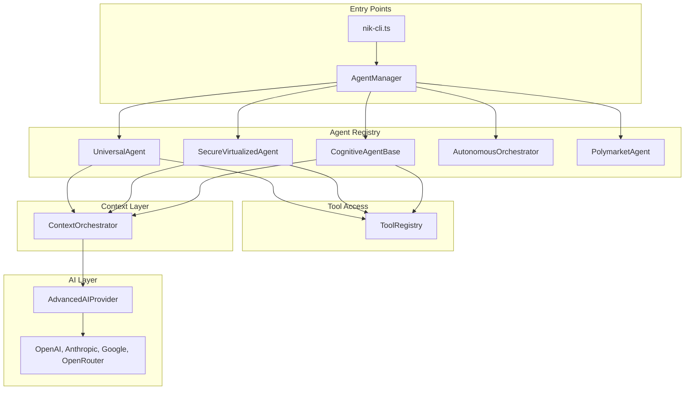
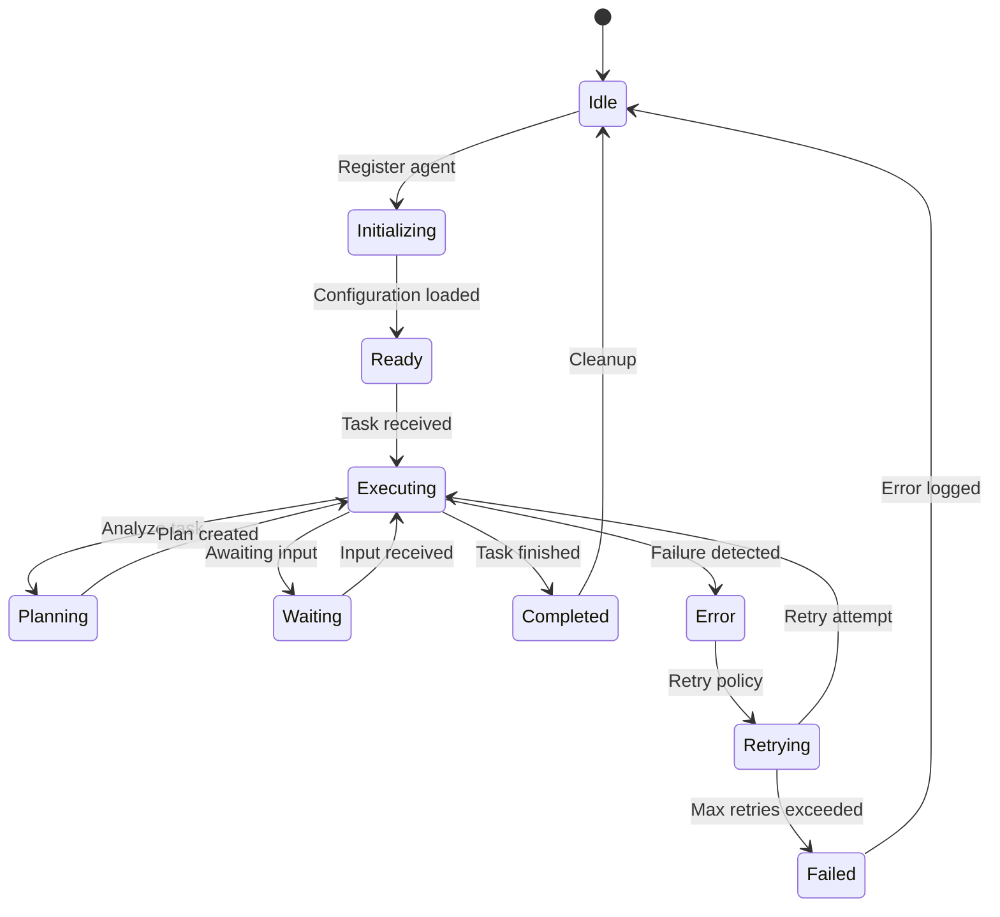

# Agent System Overview

NikCLI's agent system is a sophisticated, multi-layered architecture that enables autonomous AI-driven development. Agents can analyze code, make decisions, execute complex tasks, and coordinate with each other to accomplish goals.

## Architecture Overview



## Registered Agents

Agents are registered in `src/cli/register-agents.ts` via `AgentManager.registerAgentClass()`.

### 1. UniversalAgent

**File:** `src/cli/automation/agents/universal-agent.ts`

The primary enterprise agent for general-purpose development tasks.

**Configuration:**
```typescript
{
  id: 'universal-agent',
  name: 'Universal Agent',
  specialization: 'universal',
  version: '1.6.0',
  category: 'enterprise',
  requiresGuidance: false,
  defaultConfig: {
    autonomyLevel: 'fully-autonomous',
    maxConcurrentTasks: 3,
    defaultTimeout: 1800000,
    retryPolicy: {
      maxAttempts: 3,
      backoffMs: 1000,
      backoffMultiplier: 2,
      retryableErrors: ['timeout', 'network', 'temporary']
    },
    enabledTools: ['file', 'terminal', 'git', 'npm', 'analysis']
  }
}
```

**Capabilities (47 total):**

| Category | Capabilities |
|----------|--------------|
| **Core (7)** | code-generation, code-analysis, code-review, optimization, debugging, refactoring, testing |
| **Frontend (11)** | react, nextjs, typescript, javascript, html, css, frontend, components, hooks, jsx, tsx |
| **Backend (8)** | backend, nodejs, api-development, database, server-architecture, rest-api, graphql, microservices |
| **DevOps (8)** | devops, ci-cd, docker, kubernetes, deployment, infrastructure, monitoring, security |
| **Autonomous (5)** | file-operations, project-creation, autonomous-coding, system-administration, full-stack-development |
| **Analysis (6)** | performance-analysis, security-analysis, quality-assessment, architecture-review, documentation-generation |
| **Additional (2)** | project-creation, autonomous-coding |

**Tags:** `['universal', 'all-in-one', 'enterprise', 'autonomous', 'fullstack']`

**Best For:**
- General development tasks
- Full-stack application development
- Code review and analysis
- Project scaffolding

### 2. SecureVirtualizedAgent

**File:** `src/cli/virtualized-agents/secure-vm-agent.ts`

VM-based isolated development agent for secure operations.

**Purpose:**
- Isolated development environments via Docker containers
- Repository cloning with network fallbacks
- Playbook parsing and execution
- PR creation workflow
- Secure operations in sandboxed environment

**Features:**
- Docker container management
- Git repository integration
- Secure development workflows
- Container orchestration

**Best For:**
- Untrusted code execution
- Repository analysis
- CI/CD automation
- Isolated testing environments

### 3. CognitiveAgentBase

**File:** `src/cli/automation/agents/cognitive-agent-base.ts`

Specialized cognitive agent for intelligent code generation.

**Purpose:**
- Advanced NLP-based task understanding
- Adaptive execution strategies
- Pattern recognition in code
- Context-aware code generation

**Features:**
- Cognitive code generation
- Intelligent task decomposition
- Learning from code patterns
- Adaptive optimization

**Best For:**
- Complex refactoring tasks
- Code optimization
- Pattern-based code generation
- Architectural decisions

### 4. AutonomousOrchestrator

**File:** `src/cli/automation/agents/autonomous-orchestrator.ts`

Orchestrates autonomous workflows across multiple agents.

**Purpose:**
- Multi-agent coordination
- Complex workflow management
- Task delegation and tracking
- Dependency management

**Features:**
- Workflow orchestration
- Agent handoff management
- Progress tracking
- Error recovery

**Best For:**
- Complex multi-phase projects
- Coordinating specialized agents
- Managing task dependencies
- Automated CI/CD pipelines

### 5. PolymarketAgent

**File:** `src/cli/automation/agents/polymarket-agent.ts`

Specialized agent for market-related tasks and predictions.

**Purpose:**
- Market analysis and predictions
- DeFi integration
- Polymarket strategy development
- Portfolio optimization

**Features:**
- Market data analysis
- DeFi protocol integration
- Prediction market strategies
- Risk assessment

**Best For:**
- Market analysis tasks
- DeFi development
- Prediction market integration
- Portfolio management

## Agent Lifecycle



## Configuration

### Agent Configuration Schema

```typescript
interface AgentConfig {
  id: string
  name: string
  description: string
  specialization: string
  version: string
  capabilities: string[]
  category: 'enterprise' | 'specialized' | 'utility'
  tags: string[]
  requiresGuidance: boolean
  defaultConfig: {
    autonomyLevel: 'guided' | 'semi-autonomous' | 'fully-autonomous'
    maxConcurrentTasks: number
    defaultTimeout: number
    retryPolicy: RetryPolicy
    enabledTools: string[]
    guidanceFiles: string[]
    logLevel: 'debug' | 'info' | 'warn' | 'error'
    permissions: AgentPermissions
  }
}
```

### Agent Permissions

```typescript
interface AgentPermissions {
  canReadFiles: boolean
  canWriteFiles: boolean
  canDeleteFiles: boolean
  allowedPaths: string[]
  forbiddenPaths: string[]
  canExecuteCommands: boolean
  allowedCommands: string[]
  forbiddenCommands: string[]
  canAccessNetwork: boolean
  allowedDomains: string[]
  canInstallPackages: boolean
  canModifyConfig: boolean
}
```

## Execution Modes

### Autonomous Mode (Universal Agent Default)

```typescript
// Universal Agent configured for fully-autonomous execution
{
  autonomyLevel: 'fully-autonomous',
  maxConcurrentTasks: 3,
  requiresGuidance: false
}
```

**Flow:**
1. Agent receives task
2. Analyzes and decomposes task
3. Executes with tools directly
4. Reports results

### Guided Mode

```typescript
{
  autonomyLevel: 'guided',
  requiresGuidance: true,
  guidanceFiles: ['./CLAUDE.md', './GUIDANCE.md']
}
```

**Flow:**
1. Agent receives task
2. Requests guidance for decisions
3. Waits for user approval
4. Executes approved plan

### Semi-Autonomous

```typescript
{
  autonomyLevel: 'semi-autonomous',
  maxConcurrentTasks: 1,
  retryPolicy: {
    maxAttempts: 3,
    backoffMs: 1000
  }
}
```

**Flow:**
1. Agent receives task
2. Plans execution
3. Asks for confirmation on high-risk operations
4. Executes with monitoring

## Tool Access

Agents access tools through the `ToolRegistry`:

| Security Level | Tools | Requires Approval |
|----------------|-------|-------------------|
| **safe** | read_file, grep, glob, search | No |
| **confirmed** | write_file, edit_file, git | Yes |
| **dangerous** | delete_file, execute_command, rm | Explicit |

## Performance

### Agent Benchmarks

| Agent | Startup Time | Avg Task Time | Memory |
|-------|--------------|---------------|--------|
| UniversalAgent | ~500ms | Variable | ~50MB |
| SecureVirtualizedAgent | ~2s (container) | Variable | ~100MB |
| CognitiveAgentBase | ~300ms | Faster for patterns | ~40MB |
| AutonomousOrchestrator | ~400ms | Overhead for coordination | ~60MB |

## Monitoring

### Agent Status

```bash
# Check agent status
/debug

# View agent statistics
/stats

# Monitor active agents
/agent-list --active
```

### Metrics

- **Task Completion Rate**: Percentage of successfully completed tasks
- **Average Execution Time**: Mean time per task type
- **Retry Count**: Number of automatic retries
- **Tool Usage**: Frequency of tool invocations

## Best Practices

### 1. Choose the Right Agent

| Task Type | Recommended Agent |
|-----------|------------------|
| General development | UniversalAgent |
| Isolated operations | SecureVirtualizedAgent |
| Complex refactoring | CognitiveAgentBase |
| Multi-phase projects | AutonomousOrchestrator |
| Market/DeFi tasks | PolymarketAgent |

### 2. Configure Appropriate Autonomy

```typescript
// High-risk operations - use guided mode
{
  autonomyLevel: 'guided',
  requiresGuidance: true
}

// Routine tasks - use fully-autonomous
{
  autonomyLevel: 'fully-autonomous',
  requiresGuidance: false
}
```

### 3. Set Appropriate Timeouts

```typescript
// Quick tasks
defaultTimeout: 60000  // 1 minute

// Complex operations
defaultTimeout: 1800000  // 30 minutes
```

## Related Documentation

- [Universal Agent](/agent-system/universal-agent) - Deep dive into the main agent
- [Tool System](/tools-system/overview) - Available tools for agents
- [Context & RAG](/context-rag/overview) - How agents understand your code
- [Planning System](/planning-system/overview) - Task planning and execution
