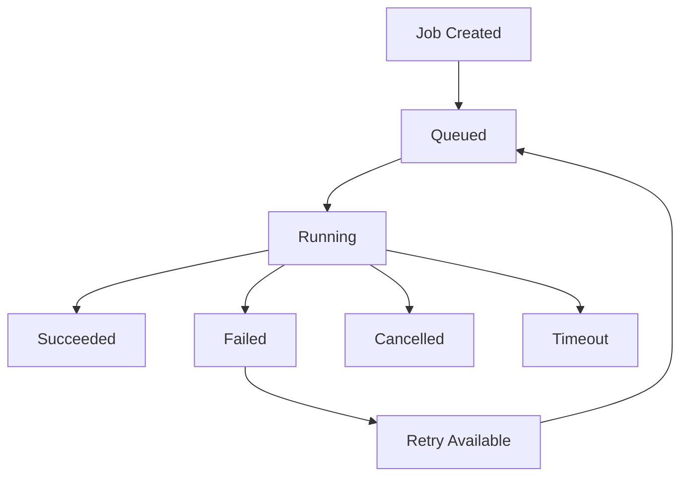

# Background Agents (nikctl)

The `nikctl` CLI provides comprehensive management of background agents and jobs. Background agents can execute long-running tasks autonomously while you continue working.

## Installation

```bash
npm install -g @nicomatt69/nikcli
```

## Global Options

All `nikctl` commands support these global options:

| Option | Description | Default |
|--------|-------------|---------|
| `--api-url <url>` | API server URL | `http://localhost:3000` |
| `--debug` | Enable debug logging | `false` |
| `--json` | Output in JSON format | `false` |

## Commands Overview

### `nikctl bg start`

Start a new background job with specified parameters.

**Syntax:**
```bash
nikctl bg start -r <repo> -t <task> [options]
```

**Required Options:**
- `-r, --repo <repo>` - Repository in format `owner/name`
- `-t, --task <task>` - Task description for the agent

**Optional Options:**
- `-b, --branch <branch>` - Base branch (default: `main`)
- `-p, --playbook <playbook>` - Playbook name to use
- `--time <minutes>` - Maximum execution time in minutes (default: `30`)
- `--tokens <count>` - Maximum tool calls allowed (default: `50`)
- `--reviewers <reviewers>` - PR reviewers, comma-separated
- `--labels <labels>` - PR labels, comma-separated
- `--draft` - Create draft PR instead of regular PR
- `--priority <priority>` - Job priority 0-10 (default: `5`)

**Examples:**
```bash
# Basic job
nikctl bg start -r myorg/myproject -t "Fix authentication bug in login component"

# Advanced job with options
nikctl bg start \
  -r myorg/myproject \
  -t "Implement user dashboard with charts" \
  -b develop \
  --time 60 \
  --tokens 100 \
  --reviewers "alice,bob" \
  --labels "enhancement,frontend" \
  --priority 8

# Using playbook
nikctl bg start \
  -r myorg/myproject \
  -t "Optimize database queries" \
  -p backend-optimization \
  --time 45
```

### `nikctl bg list`

List background jobs with optional filtering.

**Syntax:**
```bash
nikctl bg list [options]
```

**Options:**
- `-s, --status <status>` - Filter by job status
- `-r, --repo <repo>` - Filter by repository
- `-l, --limit <limit>` - Limit number of results (default: `20`)
- `--json` - Output as JSON

**Job Statuses:**
- `queued` - Job is waiting to start
- `running` - Job is currently executing
- `succeeded` - Job completed successfully
- `failed` - Job failed with error
- `cancelled` - Job was cancelled
- `timeout` - Job exceeded time limit

**Examples:**
```bash
# List all jobs
nikctl bg list

# List only running jobs
nikctl bg list -s running

# List jobs for specific repo
nikctl bg list -r myorg/myproject

# List failed jobs in JSON format
nikctl bg list -s failed --json

# List recent jobs (limit 10)
nikctl bg list -l 10
```

### `nikctl bg show <jobId>`

Show detailed information for a specific job.

**Syntax:**
```bash
nikctl bg show <jobId> [options]
```

**Options:**
- `--json` - Output as JSON format

**Examples:**
```bash
# Show job details
nikctl bg show job-abc123

# Show job details as JSON
nikctl bg show job-abc123 --json
```

**Output includes:**
- Job ID and status
- Repository and branch information
- Task description and playbook
- Timing information (created, started, completed)
- Resource usage metrics (tokens, tool calls, memory)
- Pull request URL (if created)
- Error details (if failed)
- Recent log entries

### `nikctl bg logs <jobId>`

Stream or view logs for a specific job.

**Syntax:**
```bash
nikctl bg logs <jobId> [options]
```

**Options:**
- `-f, --follow` - Follow logs in real-time
- `--tail <lines>` - Show last N lines (default: `50`)

**Examples:**
```bash
# View recent logs
nikctl bg logs job-abc123

# Follow logs in real-time
nikctl bg logs job-abc123 -f

# Show last 100 log lines
nikctl bg logs job-abc123 --tail 100

# Follow logs from beginning
nikctl bg logs job-abc123 -f --tail 0
```

**Log Format:**
```
HH:MM:SS LEVEL [SOURCE] Message content
```

**Log Levels:**
- `INFO` - General information
- `WARN` - Warning messages
- `ERROR` - Error messages
- `DEBUG` - Debug information

### `nikctl bg cancel <jobId>`

Cancel a running or queued job.

**Syntax:**
```bash
nikctl bg cancel <jobId>
```

**Examples:**
```bash
# Cancel specific job
nikctl bg cancel job-abc123
```

**Notes:**
- Only jobs in `queued` or `running` status can be cancelled
- Cancelled jobs cannot be restarted (use `retry` to create new job)
- Cancellation is immediate and cannot be undone

### `nikctl bg followup <jobId> <message>`

Send a follow-up message to a running job.

**Syntax:**
```bash
nikctl bg followup <jobId> <message> [options]
```

**Options:**
- `-p, --priority <priority>` - Message priority: `low`, `normal`, `high` (default: `normal`)

**Examples:**
```bash
# Send normal priority message
nikctl bg followup job-abc123 "Please also add unit tests"

# Send high priority message
nikctl bg followup job-abc123 "Stop work, requirements changed" -p high

# Send low priority suggestion
nikctl bg followup job-abc123 "Consider using TypeScript interfaces" -p low
```

**Message Priorities:**
- `high` - Interrupts current work immediately
- `normal` - Processed at next checkpoint
- `low` - Processed when convenient

### `nikctl bg open <jobId>`

Open job in browser (console or PR).

**Syntax:**
```bash
nikctl bg open <jobId> [options]
```

**Options:**
- `--pr` - Open pull request instead of console

**Examples:**
```bash
# Open job console
nikctl bg open job-abc123

# Open job's pull request
nikctl bg open job-abc123 --pr
```

**Environment Variables:**
- `CONSOLE_URL` - Base URL for job console (default: `http://localhost:3001`)

### `nikctl bg stats`

Show background agent statistics and metrics.

**Syntax:**
```bash
nikctl bg stats [options]
```

**Options:**
- `--json` - Output as JSON format

**Examples:**
```bash
# Show statistics
nikctl bg stats

# Get stats as JSON
nikctl bg stats --json
```

**Statistics Include:**
- Total jobs created
- Jobs by status (queued, running, succeeded, failed, cancelled)
- Average execution time
- Resource utilization
- Success rate

### `nikctl bg retry <jobId>`

Retry a failed job by creating a new job with the same parameters.

**Syntax:**
```bash
nikctl bg retry <jobId>
```

**Examples:**
```bash
# Retry failed job
nikctl bg retry job-abc123
```

**Notes:**
- Only failed jobs can be retried
- Creates a new job with a new ID
- Uses the same parameters as the original job
- Original job remains in failed state

## Job Lifecycle



## Configuration

### Environment Variables

Set these in your environment or `.env` file:

```bash
# API Configuration
NIKCTL_API_URL=http://localhost:3000
NIKCTL_DEBUG=false

# GitHub Integration (optional)
GITHUB_TOKEN=ghp_xxxxxxxxxxxx

# Notification Settings (optional)
SLACK_WEBHOOK_URL=https://hooks.slack.com/...
DISCORD_WEBHOOK_URL=https://discord.com/api/webhooks/...
```

### API Server Setup

Background agents require the `nikd` daemon to be running:

```bash
# Start daemon
nikd start

# Check daemon status
nikd status

# View daemon logs
nikd logs
```

## Integration Examples

### CI/CD Pipeline

```yaml
# .github/workflows/background-agent.yml
name: Background Agent Job
on:
  issue_comment:
    types: [created]

jobs:
  background-task:
    if: contains(github.event.comment.body, '/agent')
    runs-on: ubuntu-latest
    steps:
      - name: Extract task
        id: task
        run: |
          TASK=$(echo "${{ github.event.comment.body }}" | sed 's/\/agent //')
          echo "task=$TASK" >> $GITHUB_OUTPUT
      
      - name: Start background job
        run: |
          nikctl bg start \
            -r ${{ github.repository }} \
            -t "${{ steps.task.outputs.task }}" \
            -b ${{ github.head_ref || github.ref_name }} \
            --reviewers ${{ github.event.comment.user.login }}
```

### Slack Integration

```bash
#!/bin/bash
# slack-agent.sh - Start agent job from Slack command

REPO="$1"
TASK="$2"
CHANNEL="$3"

# Start job
JOB_ID=$(nikctl bg start -r "$REPO" -t "$TASK" --json | jq -r '.jobId')

# Notify Slack
curl -X POST "$SLACK_WEBHOOK_URL" \
  -H 'Content-type: application/json' \
  --data "{
    \"channel\": \"$CHANNEL\",
    \"text\": \"🤖 Background agent started: $JOB_ID\n📋 Task: $TASK\"
  }"

# Follow logs and update Slack
nikctl bg logs "$JOB_ID" -f | while read line; do
  if [[ "$line" == *"ERROR"* ]]; then
    curl -X POST "$SLACK_WEBHOOK_URL" \
      -H 'Content-type: application/json' \
      --data "{
        \"channel\": \"$CHANNEL\",
        \"text\": \"❌ Job $JOB_ID error: $line\"
      }"
  fi
done
```

## Troubleshooting

### Common Issues

**Job stuck in queued status:**
```bash
# Check daemon status
nikd status

# Check queue capacity
nikctl bg stats

# Restart daemon if needed
nikd start
```

**Job fails immediately:**
```bash
# Check job logs
nikctl bg logs job-abc123

# Verify repository access
git ls-remote https://github.com/owner/repo

# Check API keys
nikctl bg show job-abc123 --json | jq '.error'
```

**Cannot connect to API:**
```bash
# Check daemon is running
curl http://localhost:3000/health

# Start daemon if needed
nikd start

# Check firewall settings
netstat -tlnp | grep 3000
```

### Debug Mode

Enable debug logging for detailed information:

```bash
# Global debug flag
nikctl --debug bg list

# Environment variable
export NIKCTL_DEBUG=true
nikctl bg start -r myorg/myproject -t "debug task"

# Daemon debug mode
nikd start --debug
```

### Log Locations

- **nikctl logs**: Stdout/stderr
- **nikd daemon logs**: `~/.nikcli/logs/nikd.log`
- **Job logs**: Stored in daemon memory and database
- **Debug logs**: `~/.nikcli/logs/debug.log` (when enabled)

## Best Practices

### Job Design
- Keep tasks focused and specific
- Use descriptive task descriptions
- Set appropriate time limits
- Include acceptance criteria in task description

### Resource Management
- Monitor job statistics regularly
- Set reasonable token limits
- Use priority levels appropriately
- Clean up old jobs periodically

### Security
- Use draft PRs for experimental work
- Review generated code before merging
- Limit repository access appropriately
- Monitor job logs for sensitive data

### Monitoring
- Set up notifications for job failures
- Monitor resource usage trends
- Track success rates over time
- Use health checks for daemon monitoring
