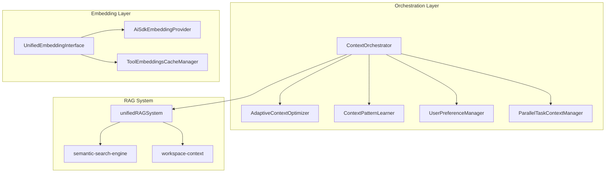

# Context & RAG System

NikCLI's Context & RAG system is a **two-layered architecture** combining:

1. **Orchestration Layer** - Manages task context, user preferences, and adaptive optimization
2. **Embedding Layer** - Handles vector embeddings for semantic similarity and RAG

This system enables AI agents to access relevant code context efficiently, reducing token usage while improving response accuracy.

## Architecture Overview



## Orchestration Layer

Located in `src/cli/orchestrator/` - 5 core files managing task execution and context.

### 1. ContextOrchestrator

**File:** `src/cli/orchestrator/context-orchestrator.ts`

Central coordinator that orchestrates all context components:

**Key Responsibilities:**
- Orchestrates tasks across multiple agents
- Manages dynamic token budgets (85% context / 15% output reserved)
- Calculates optimal agent counts based on task complexity
- Applies verbosity filtering to context (minimal/standard/detailed)
- Records usage metrics and feeds them to the pattern learner
- Emits events for monitoring (`orchestrated`, `usageRecorded`)

**Key Methods:**
```typescript
async orchestrate(todos: AgentTodo[], taskId: string): Promise<OrchestrationResult>
async recordUsage(sessionId: string, usage: Usage, model: string)
async reportOutcome(chainId: string, agentId: string, outcome: ExecutionOutcome)
getStatus(): OrchestratorStatus
```

**Dynamic Budget Management:**
- Base budget comes from `UserPreferenceManager.getMaxContextTokens()`
- 85% allocated for context, 15% reserved for output
- Adjusts based on historical completion token usage

### 2. AdaptiveContextOptimizer

**File:** `src/cli/orchestrator/adaptive-context-optimizer.ts`

Calculates task complexity and generates optimized context slices:

**Complexity Calculation:**
```typescript
calculateTaskComplexity(todos: AgentTodo[]): TaskComplexityMetrics
```

Returns metrics with score (0-100) based on:
- **Code complexity (35% weight)** - implementation/refactoring tasks
- **Dependency complexity (25% weight)** - number of dependencies
- **Scope complexity (20% weight)** - description length
- **Interdependency complexity (20% weight)** - dependent tasks and priority

**Context Slice Generation:**
```typescript
calculateOptimalSlice(): AgentContextSlice
```

Creates context slice with:
- Shared context (common task info)
- Agent-specific context (agent's assigned tasks)
- Task context (current execution status)
- Token allocations based on model limits

**Model Limits:**
| Model | Context Limit |
|-------|---------------|
| Claude Opus/Sonnet/Haiku 4.5 | 200K |
| GPT-4o | 128K |
| Gemini 1.5 Pro | 2M |
| Gemini 1.5 Flash | 1M |

### 3. ContextPatternLearner

**File:** `src/cli/orchestrator/context-pattern-learner.ts`

Learns from execution outcomes to improve future decisions:

**Pattern Extraction:**
Categorizes outcomes by:
- Complexity level (high/medium/low)
- Agent efficiency (single_agent_efficient/standard/multiple)
- Task count (many/medium/few)
- Efficiency ratio (high/medium/low)

**Adaptive Preferences:**
```typescript
adjustMaxContextTokens(successRate: number, efficiency: number): number
adjustAgentCount(outcome: ExecutionOutcome): number
```

- Adjusts `maxContextTokens` based on success rate and efficiency
- Adjusts preferred agent count based on outcomes
- Uses adaptation rate (15%) with budget caps (max 1.3x increase, 0.7x decrease)

**Prediction:**
```typescript
predictSuccess(complexity: number, agents: number, budget: number): SuccessPrediction
```
Provides success probability with recommendations.

**Cleanup:** Removes patterns older than 60 days with <3 samples

### 4. UserPreferenceManager

**File:** `src/cli/orchestrator/user-preference-manager.ts`

Persists and manages user preferences:

**Storage:** `~/.nikcli/user-preferences.json`

**Auto-save:** Flushes changes every 30 seconds

**Preferences Managed:**
| Preference | Type | Default |
|------------|------|---------|
| `preferredAgentCount` | number | 1-10 |
| `maxContextTokens` | number | 10K-100K |
| `sharedContextRatio` | number | 0.1-0.9 |
| `contextVerbosity` | enum | minimal/standard/detailed |
| `parallelExecution` | boolean | false |
| `maxParallelAgents` | number | 1-5 |

**Key Methods:**
```typescript
getMaxContextTokens(): number
getMaxParallelAgents(): number
getContextVerbosity(): 'minimal' | 'standard' | 'detailed'
async updateMaxContextTokens(newValue: number): Promise<void>
async updateAgentCount(count: number): Promise<void>
```

### 5. ParallelTaskContextManager

**File:** `src/cli/orchestrator/parallel-task-context-manager.ts`

Manages task chains and agent context allocation:

**Chain Management:**
```typescript
createChainContext(todos: AgentTodo[], chainId: string): TaskChain
createExecutionPlan(todos: AgentTodo[], maxAgents: number): ExecutionPlan
```

**Dependency-Based Grouping:**
Groups tasks by dependency level into execution waves:
```typescript
groupByDependencyLevel(todos: AgentTodo[]): AgentTodo[][]
```

**Strategy Determination:**
| Tasks | Strategy |
|-------|----------|
| 1 | `sequential` |
| 2-3 | `hybrid` |
| 4+ | `parallel` |

**Agent Context Retrieval:**
```typescript
getAgentContext(chainId: string, agentId: string): AgentContextSlice
```
Merges shared + agent-specific + task context.

## Embedding Layer

### AiSdkEmbeddingProvider

**File:** `src/cli/context/ai-sdk-embedding-provider.ts`

Unified embedding provider with multi-provider support:

**Supported Providers:**
- OpenAI (`text-embedding-3-small`, `text-embedding-3-large`)
- Google (`embedding-001`, `text-embedding-004`)
- OpenRouter (via AI SDK compatible endpoints)

**Features:**
- Automatic provider fallback on failure
- Redis-based caching via `redisProvider`
- Adaptive batching based on text length and success rate
- Retry with exponential backoff
- Cost tracking per provider

### UnifiedEmbeddingInterface

**File:** `src/cli/context/unified-embedding-interface.ts`

Standardized embedding interface for all NikCLI components:

**Features:**
- Memory cache (10K entries, 24-hour TTL)
- Persistent cache to `~/.nikcli/vector-cache/unified-embeddings.json`
- Cosine similarity calculation
- Dimension validation
- Performance statistics

### ToolEmbeddingsCacheManager

**File:** `src/cli/ai/tool-embeddings-cache.ts`

Pre-computed tool description embeddings for fast semantic search:

**Storage:** `~/.nikcli/tool-embeddings-cache.json`

**Features:**
- TF-IDF style fallback embeddings (384 dimensions)
- Hash-based change detection to skip unchanged tools
- Zero-latency lookups (~1-2ms)
- Built at startup from all registered tools

## RAG System

### UnifiedRAGSystem

**File:** `src/cli/context/rag-system.ts`

Combines multiple search strategies:

| Strategy | Purpose | Best For |
|----------|---------|----------|
| Vector Search | Semantic similarity | Conceptual queries |
| Workspace RAG | Local file analysis | File discovery |
| BM25 Search | Keyword matching | Exact matches |

### SemanticSearchEngine

**File:** `src/cli/context/semantic-search-engine.ts`

Advanced query understanding with:
- Intent detection (code search, explanation, debugging)
- Entity extraction (functions, classes, files, technologies)
- Query expansion with synonyms
- Multi-dimensional relevance scoring

## Data Flow

### Task Submission Flow
```
User submits task
        |
        v
ContextOrchestrator.orchestrate(todos, taskId)
        |
        +---> AdaptiveContextOptimizer.calculateTaskComplexity()
        +---> ParallelTaskContextManager.createExecutionPlan()
        +---> ContextPatternLearner.predictSuccess()
        |
        v
Returns: contextSlices, budget, executionPlan
```

### Execution Feedback Loop
```
Agent execution completes
        |
        v
ContextOrchestrator.recordUsage() + reportOutcome()
        |
        +---> ContextPatternLearner.learn()
        |         |
        |         +---> UserPreferenceManager.updateMaxContextTokens()
        |         +---> UserPreferenceManager.updateAgentCount()
        |
        +---> UserPreferenceManager.recordOutcome()
```

### Embedding Request Flow
```
Component requests embeddings
        |
        v
UnifiedEmbeddingInterface.generateEmbeddings()
        |
        +---> Memory cache check (Map)
        +---> AiSdkEmbeddingProvider.generate()
        |         |
        |         +---> Redis cache check
        |         +---> API call to provider
        |         +---> Cache result
        |
        v
Returns: EmbeddingResult[]
```

## Configuration

### Environment Variables

```bash
# Embedding Provider
OPENAI_API_KEY=sk-...
GOOGLE_GENERATIVE_AI_API_KEY=...
OPENROUTER_API_KEY=...

# Caching
UPSTASH_REDIS_REST_URL=https://...
UPSTASH_REDIS_REST_TOKEN=...
```

### Programmatic Configuration

```typescript
import { ContextOrchestrator } from '@nikcli/orchestrator'

const orchestrator = new ContextOrchestrator({
  maxAgents: 5,
  enforceBudget: true,
  enableLearning: true,
  verbosity: 'standard'
})
```

## Best Practices

### 1. Optimize Task Complexity

```typescript
// Use clear, descriptive task descriptions
const todos = [
  {
    id: '1',
    description: 'Implement user authentication with JWT tokens',
    tags: ['implementation', 'backend'],
    priority: 'high',
    dependencies: []
  }
]
```

### 2. Configure Token Budget

```typescript
import { UserPreferenceManager } from '@nikcli/orchestrator'

const prefs = new UserPreferenceManager()
await prefs.updateMaxContextTokens(150000) // 150K tokens
await prefs.updateAgentCount(3)
```

### 3. Monitor Pattern Learning

```typescript
const status = contextPatternLearner.getStatus()
console.log({
  patternsLearned: status.patternCount,
  averageSuccessRate: status.avgSuccessRate,
  adaptationEnabled: status.learningEnabled
})
```

## Performance Metrics

| Metric | Typical Value |
|--------|---------------|
| Context Slice Generation | ~5ms |
| Token Budget Calculation | ~2ms |
| Pattern Learning | ~10ms |
| Embedding Cache Lookup | ~1-2ms |
| Full Orchestration | ~20-50ms |

## Related Documentation

- [Architecture](/architecture/overview) - System architecture
- [Agent System](/agent-system/overview) - How agents use context
- [Planning System](/planning-system/overview) - Context-driven planning
- [Semantic Search](/context-rag/semantic-search) - Search capabilities
