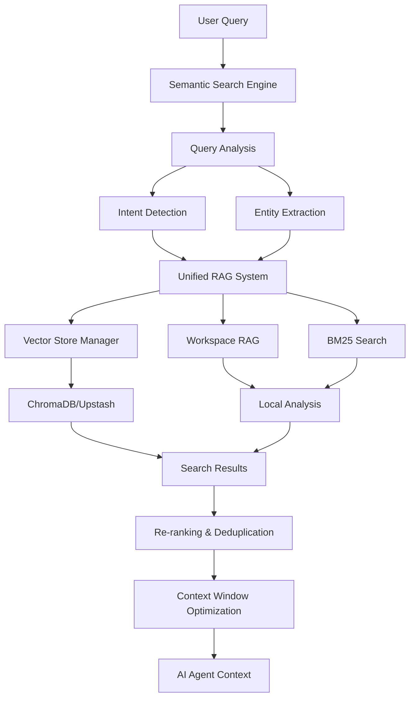

# Context & RAG System

NikCLI's Context & RAG (Retrieval-Augmented Generation) system provides intelligent workspace understanding by combining semantic search, vector embeddings, and workspace analysis. This enables AI agents to access relevant code context efficiently, reducing token usage while improving response accuracy.

## Architecture Overview

The Context & RAG system consists of several integrated components:



## Core Components

### 1. Unified RAG System

The central orchestrator combining multiple search strategies:

- **Vector Search**: Semantic similarity using embeddings
- **Workspace Analysis**: Local file analysis and importance scoring
- **BM25 Search**: Keyword-based sparse search for precise matching
- **Hybrid Mode**: Combines all strategies for optimal results

### 2. Semantic Search Engine

Advanced query understanding with:

- Intent detection (code search, explanation, debugging, etc.)
- Entity extraction (functions, classes, files, technologies)
- Query expansion with synonyms and related concepts
- Multi-dimensional relevance scoring

### 3. Vector Store Abstraction

Unified interface supporting multiple vector databases:

- **ChromaDB**: Local or cloud vector storage
- **Upstash Vector**: Serverless vector database with Redis fallback
- **Local Filesystem**: Zero-configuration fallback option
- Automatic health monitoring and failover

### 4. Workspace Context Manager

Intelligent workspace analysis:

- File filtering with gitignore support
- Language and framework detection
- Importance scoring based on file content and location
- Real-time change detection

## Key Features

### Intelligent File Filtering

The system automatically filters files to index only relevant code:

```typescript
// Automatically excludes:
// - node_modules, dist, build directories
// - Binary files and large datasets
// - Git internal files
// - Files exceeding size limits

// Prioritizes:
// - Source code files
// - Configuration files
// - Documentation
// - Test files (lower priority)
```

### Smart Chunking

Code and documentation are intelligently chunked to preserve context:

**Code Chunking**:
- Keeps functions and classes together
- Preserves logical block boundaries
- Smart overlap for context continuity
- Language-aware splitting

**Markdown Chunking**:
- Splits by header hierarchy
- Maintains document structure
- Preserves cross-references

### Token-Aware Optimization

Results are optimized for AI context windows:

```typescript
// Automatic truncation at semantic boundaries
const results = await unifiedRAGSystem.searchWithTokenLimit(
  query,
  2000, // Max tokens
  { limit: 20 }
);

// Results truncated to:
// - ~2000 tokens total
// - Preserved sentence/paragraph boundaries
// - Most relevant content prioritized
```

## Search Strategies

### 1. Vector Search

Semantic similarity using embeddings:

```typescript
// High-level semantic understanding
const results = await unifiedRAGSystem.searchSemantic(
  "How does authentication work?",
  { limit: 10, threshold: 0.7 }
);
```

**Best for**:
- Conceptual queries
- Natural language questions
- Understanding intent

### 2. Workspace Search

Local file analysis and keyword matching:

```typescript
// File-based relevance scoring
const results = await unifiedRAGSystem.search(
  "authentication middleware",
  { limit: 15 }
);
```

**Best for**:
- File discovery
- Quick local searches
- Zero external dependencies

### 3. BM25 Search

Statistical keyword matching:

```typescript
// Precise keyword matching
// Enabled with: RAG_BM25_ENABLED=true
const results = await unifiedRAGSystem.search(
  "express authentication middleware",
  { limit: 10 }
);
```

**Best for**:
- Exact keyword matching
- Technical term searches
- Complementing semantic search

### 4. Hybrid Search

Combines all strategies for optimal results:

```typescript
// Automatic strategy selection and blending
const results = await unifiedRAGSystem.search(
  "How to add JWT authentication?",
  { limit: 20 }
);

// Combines:
// - Vector search (60% weight)
// - Workspace search (30% weight)
// - BM25 search (10% weight)
```

## Configuration

### Environment Variables

```bash
# Vector Store Configuration
UPSTASH_VECTOR_REST_URL=https://your-vector.upstash.io
UPSTASH_VECTOR_REST_TOKEN=your_token
UPSTASH_VECTOR_COLLECTION=nikcli-vectors

# Or use ChromaDB
CHROMA_URL=http://localhost:8005
CHROMA_API_KEY=your_api_key
CHROMA_TENANT=your_tenant
CHROMA_DATABASE=nikcli

# Performance Tuning
RAG_RERANK_ENABLED=true
RAG_BM25_ENABLED=true
INDEXING_BATCH_SIZE=300
EMBED_BATCH_SIZE=100

# Caching
CACHE_RAG=true
CACHE_AI=true
```

### Programmatic Configuration

```typescript
import { unifiedRAGSystem } from '@nicomatt69/nikcli';

// Update RAG configuration
unifiedRAGSystem.updateConfig({
  useVectorDB: true,
  hybridMode: true,
  maxIndexFiles: 1000,
  chunkSize: 700,
  overlapSize: 80,
  enableSemanticSearch: true,
  cacheEmbeddings: true,
  costThreshold: 0.1 // Max $0.10 for indexing
});
```

## Usage Examples

### Basic Search

```typescript
import { unifiedRAGSystem } from '@nicomatt69/nikcli';

// Initialize (happens automatically on CLI startup)
await unifiedRAGSystem.startBackgroundInitialization();

// Search for relevant context
const results = await unifiedRAGSystem.search(
  "authentication implementation",
  { limit: 10 }
);

results.forEach(result => {
  console.log(`${result.path} (score: ${result.score})`);
  console.log(result.content.substring(0, 200));
});
```

### Semantic Search

```typescript
// Advanced semantic search with intent detection
const results = await unifiedRAGSystem.searchSemantic(
  "How do I add user registration with email verification?",
  {
    limit: 15,
    threshold: 0.6,
    includeAnalysis: true
  }
);

// Results include:
// - Semantic breakdown (keyword, context, importance scores)
// - Query intent and confidence
// - Relevance factors explanation
```

### Project Analysis

```typescript
// Analyze workspace and build vector index
const analysis = await unifiedRAGSystem.analyzeProject(process.cwd());

console.log({
  indexedFiles: analysis.indexedFiles,
  embeddingsCost: `$${analysis.embeddingsCost.toFixed(4)}`,
  processingTime: `${analysis.processingTime}ms`,
  vectorDBStatus: analysis.vectorDBStatus,
  fallbackMode: analysis.fallbackMode
});
```

### Token-Optimized Search

```typescript
// Get results optimized for AI context window
const results = await unifiedRAGSystem.searchWithTokenLimit(
  "user authentication flow",
  2000, // Max 2000 tokens
  {
    limit: 30, // Start with more results
    semanticOnly: false
  }
);

// Results automatically:
// - Truncated at semantic boundaries
// - Deduplicated by file path
// - Sorted by relevance
// - Optimized for ~2000 tokens total
```

## Performance Monitoring

### Get Statistics

```typescript
// Get comprehensive performance metrics
const stats = unifiedRAGSystem.getStats();

console.log({
  // Cache performance
  embeddings: stats.caches.embeddings,
  analysis: stats.caches.analysis,

  // Search metrics
  totalSearches: stats.performance.totalSearches,
  averageLatency: stats.performance.averageLatencyMs,
  cacheHitRate: stats.performance.cacheHitRate,

  // Vector DB status
  vectorDBAvailable: stats.vectorDBAvailable,
  workspaceRAGAvailable: stats.workspaceRAGAvailable
});
```

### Performance Report

```typescript
// Get detailed performance breakdown
const metrics = unifiedRAGSystem.getPerformanceMetrics();

console.log({
  searches: metrics.searches, // By type
  performance: metrics.performance, // Latency, errors
  optimization: metrics.optimization // Cache hits, reranks
});

// Generate human-readable report
unifiedRAGSystem.logPerformanceReport();
// Output:
// Search Distribution:
//   Total Searches: 150
//   Vector: 90 (60.0%)
//   Workspace: 45 (30.0%)
//   BM25: 15 (10.0%)
// ...
```

## Best Practices

### 1. Optimize Indexing Costs

```typescript
// Estimate costs before indexing
const files = await glob('**/*.{ts,js,tsx,jsx}');
const estimatedCost = await estimateIndexingCost(files, process.cwd());

console.log(`Estimated indexing cost: $${estimatedCost.toFixed(4)}`);

// Set cost threshold
unifiedRAGSystem.updateConfig({
  costThreshold: 0.10 // Stop if exceeds $0.10
});
```

### 2. Use Appropriate Search Strategy

```typescript
// For conceptual queries -> Semantic search
const conceptResults = await unifiedRAGSystem.searchSemantic(
  "How does the payment system work?"
);

// For specific code lookups -> Hybrid search
const codeResults = await unifiedRAGSystem.search(
  "PaymentProcessor class"
);

// For exact matches -> Enable BM25
process.env.RAG_BM25_ENABLED = 'true';
const exactResults = await unifiedRAGSystem.search(
  "validatePaymentMethod function"
);
```

### 3. Leverage Caching

```typescript
// Embeddings are cached automatically
// Force cache rebuild when needed:
await unifiedRAGSystem.clearCaches();

// Re-index project
await unifiedRAGSystem.analyzeProject(process.cwd());
```

### 4. Monitor Performance

```typescript
// Regular performance checks
setInterval(() => {
  const metrics = unifiedRAGSystem.getPerformanceMetrics();

  if (parseFloat(metrics.performance.errorRate) > 5) {
    console.warn('High error rate detected');
    // Consider clearing caches or re-initializing
  }

  if (metrics.performance.averageLatency > 500) {
    console.warn('High latency detected');
    // Consider optimizing query or reducing result limit
  }
}, 60000); // Check every minute
```

## Limitations

### File Size Limits

```typescript
// Default limits:
// - Max file size: 1MB per file
// - Max total files: 1000 files
// - Max context size: 50KB per query

// Adjust limits:
unifiedRAGSystem.updateConfig({
  maxIndexFiles: 2000, // Increase file limit
});
```

### Vector Database Quotas

```typescript
// Free tier limits:
// - ChromaDB free: ~300 documents
// - Upstash free: ~10,000 vectors

// Documents are automatically truncated when limits reached
// Local fallback is used when quotas exceeded
```

### Search Accuracy

```typescript
// Factors affecting accuracy:
// 1. Query quality (specific vs vague)
// 2. Code documentation quality
// 3. File organization
// 4. Embedding model used

// Improve accuracy:
// - Write clear docstrings
// - Use descriptive file/function names
// - Organize code logically
// - Use semantic search for conceptual queries
```

## Troubleshooting

### Vector DB Connection Issues

```typescript
// Check connection status
const stats = unifiedRAGSystem.getStats();

if (!stats.vectorDBAvailable) {
  console.warn('Vector DB unavailable, using workspace fallback');

  // Verify environment variables
  console.log({
    upstashUrl: process.env.UPSTASH_VECTOR_REST_URL,
    chromaUrl: process.env.CHROMA_URL
  });
}
```

### High Latency

```typescript
// Check search metrics
const metrics = unifiedRAGSystem.getPerformanceMetrics();

if (metrics.performance.averageLatency > 500) {
  // Reduce result limit
  const results = await unifiedRAGSystem.search(query, { limit: 5 });

  // Or use cached results
  const cachedResults = await unifiedRAGSystem.search(query);
  // Second search will be much faster due to caching
}
```

### Cache Management

```typescript
// Clear specific caches
await unifiedRAGSystem.clearCaches();

// Reset performance metrics
unifiedRAGSystem.resetMetrics();

// Check cache stats
const stats = unifiedRAGSystem.getStats();
console.log({
  embeddingsCacheHitRate: stats.caches.embeddings.hitRate,
  analysisCacheHitRate: stats.caches.analysis.hitRate
});
```

## Next Steps

<CardGroup cols={2}>
  <Card title="Workspace Indexing" icon="folder-tree" href="/context-rag/workspace-indexing">
    Learn how NikCLI analyzes and indexes your workspace
  </Card>
  <Card title="Semantic Search" icon="magnifying-glass" href="/context-rag/semantic-search">
    Understand advanced semantic search capabilities
  </Card>
  <Card title="Embeddings" icon="vector-square" href="/context-rag/embeddings">
    Configure embedding providers and models
  </Card>
  <Card title="Cache System" icon="database" href="/context-rag/cache-system">
    Optimize performance with intelligent caching
  </Card>
</CardGroup>

## Related Documentation

- [Agent System](/agent-system/overview) - How agents use context for decision-making
- [Planning System](/planning-system/overview) - Context-driven plan generation
- [Configuration](/configuration/yaml-config) - RAG configuration options
- [Performance](/architecture/performance) - System performance optimization
