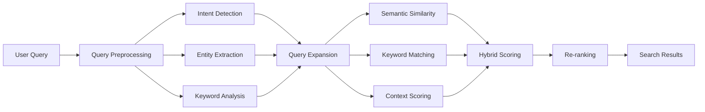

# Semantic Search Engine

NikCLI's semantic search engine provides intelligent query understanding, intent detection, and multi-dimensional relevance scoring to deliver highly accurate search results.

## Architecture



## Query Analysis

### Intent Detection

The system identifies query intent with ML-inspired classification:

```typescript
interface QueryIntent {
  type: 'code_search' | 'explanation' | 'implementation' |
        'debugging' | 'documentation' | 'analysis';
  subtype: string;
  confidence: number;
  context: string[];
}

// Example query analysis
const query = "How to implement JWT authentication?";
const analysis = await semanticSearchEngine.analyzeQuery(query);

// Result:
{
  type: 'implementation',
  subtype: 'how_to_implement',
  confidence: 0.85,
  context: ['how', 'implement', 'authentication']
}
```

**Intent Patterns**:

```typescript
const intentPatterns = {
  code_search: {
    patterns: [/find.*(function|method)/, /search.*class/],
    keywords: ['find', 'search', 'locate', 'where']
  },
  implementation: {
    patterns: [/how.*to.*implement/, /how.*to.*create/],
    keywords: ['how', 'implement', 'create', 'build']
  },
  debugging: {
    patterns: [/error/, /bug/, /fix/, /troubleshoot/],
    keywords: ['error', 'bug', 'issue', 'problem', 'fix']
  },
  explanation: {
    patterns: [/what.*does/, /explain/, /how.*work/],
    keywords: ['what', 'explain', 'understand', 'how']
  }
};
```

### Entity Extraction

Extracts code entities and technical terms:

```typescript
interface ExtractedEntity {
  text: string;
  type: 'function' | 'class' | 'variable' | 'file' |
        'library' | 'framework' | 'technology' | 'concept';
  confidence: number;
  variants: string[];
}

// Example
const query = "PaymentProcessor class in Express middleware";
const entities = extractEntities(query);

// Results:
[
  {
    text: 'PaymentProcessor',
    type: 'class',
    confidence: 0.95,
    variants: ['payment_processor', 'paymentprocessor']
  },
  {
    text: 'Express',
    type: 'framework',
    confidence: 0.90,
    variants: ['express', 'expressjs']
  }
]
```

**Entity Patterns**:

```typescript
const entityPatterns = [
  {
    pattern: /([A-Z][a-zA-Z]*)\s*\(/,
    type: 'function',
    confidence: 0.9
  },
  {
    pattern: /class\s+([A-Z][a-zA-Z]*)/i,
    type: 'class',
    confidence: 0.95
  },
  {
    pattern: /(react|vue|angular|express)/i,
    type: 'framework',
    confidence: 0.9
  }
];
```

### Keyword Analysis

Extracts and weights keywords:

```typescript
interface QueryKeyword {
  term: string;
  weight: number; // Importance score
  category: 'primary' | 'secondary' | 'context';
  synonyms: string[];
}

// Keyword weighting factors:
function calculateKeywordWeight(word: string, query: string): number {
  let weight = 1.0;

  // Length-based (longer words more important)
  if (word.length > 6) weight += 0.2;
  if (word.length > 10) weight += 0.1;

  // Frequency-based (rarer words more important)
  const frequency = countOccurrences(word, query);
  weight += Math.min(0.3, frequency * 0.1);

  // Technical term bonus
  if (isTechnicalTerm(word)) weight += 0.3;
  if (isCodeRelated(word)) weight += 0.2;

  return weight;
}
```

## Query Expansion

### Semantic Expansion

Expands queries with related terms:

```typescript
interface SemanticExpansion {
  originalTerms: string[];
  expandedTerms: string[];
  synonyms: string[];
  relatedConcepts: string[];
  domainSpecific: string[];
  codeRelated: string[];
}

// Example expansion
const query = "authentication function";
const expansion = await expandQuerySemantics(query);

// Result:
{
  originalTerms: ['authentication', 'function'],
  synonyms: ['login', 'auth', 'method', 'procedure'],
  relatedConcepts: ['authorization', 'security', 'jwt', 'session'],
  codeRelated: ['middleware', 'handler', 'validator'],
  expandedTerms: [
    'authentication', 'function',
    'login', 'auth',
    'middleware', 'security'
  ]
}
```

**Synonym Database**:

```typescript
const synonyms = {
  function: ['method', 'procedure', 'subroutine', 'routine'],
  variable: ['property', 'field', 'attribute', 'member'],
  class: ['type', 'interface', 'struct', 'object'],
  error: ['exception', 'bug', 'issue', 'problem'],
  implement: ['create', 'build', 'develop', 'code'],
  config: ['configuration', 'settings', 'setup']
};
```

## Scoring System

### Multi-Dimensional Scoring

Results are scored across multiple dimensions:

```typescript
interface EnhancedSearchResult {
  id: string;
  content: string;
  score: number; // Final weighted score
  breakdown: {
    semanticScore: number;    // 0-1: Vector similarity
    keywordScore: number;     // 0-1: Keyword matching
    contextScore: number;     // 0-1: Workspace context
    recencyScore: number;     // 0-1: File modification date
    importanceScore: number;  // 0-1: File importance
    diversityScore: number;   // 0-1: Result diversity
  };
  relevanceFactors: string[];
}

// Scoring weights by intent
const scoreWeights = {
  code_search: {
    semanticScore: 0.4,
    keywordScore: 0.3,
    contextScore: 0.1,
    recencyScore: 0.1,
    importanceScore: 0.05,
    diversityScore: 0.05
  },
  implementation: {
    semanticScore: 0.5,
    keywordScore: 0.2,
    contextScore: 0.15,
    recencyScore: 0.05,
    importanceScore: 0.05,
    diversityScore: 0.05
  }
};
```

### Semantic Similarity

Uses vector embeddings for deep understanding:

```typescript
async function calculateSemanticScore(
  content: string,
  queryAnalysis: QueryAnalysis
): Promise<number> {
  // Generate embeddings
  const [queryEmbedding, contentEmbedding] = await Promise.all([
    unifiedEmbeddingInterface.generateEmbedding(queryAnalysis.expandedQuery),
    unifiedEmbeddingInterface.generateEmbedding(content.substring(0, 2000))
  ]);

  // Calculate cosine similarity
  const similarity = calculateCosineSimilarity(
    queryEmbedding.vector,
    contentEmbedding.vector
  );

  // Apply query confidence as multiplier
  return similarity * queryAnalysis.confidence;
}
```

### Keyword Scoring

Advanced keyword matching with position and frequency:

```typescript
function calculateKeywordScore(
  content: string,
  keywords: QueryKeyword[]
): number {
  let totalScore = 0;
  let maxPossibleScore = 0;

  for (const keyword of keywords) {
    maxPossibleScore += keyword.weight;

    // Exact match scoring
    const exactMatches = countMatches(content, keyword.term);
    let keywordScore = exactMatches * keyword.weight;

    // Position-based bonus (earlier = better)
    const firstIndex = content.indexOf(keyword.term);
    if (firstIndex !== -1) {
      const positionBonus = Math.max(0, 1 - firstIndex / content.length) * 0.2;
      keywordScore += positionBonus * keyword.weight;
    }

    // Synonym matching (70% weight)
    for (const synonym of keyword.synonyms) {
      const synonymMatches = countMatches(content, synonym);
      keywordScore += synonymMatches * keyword.weight * 0.7;
    }

    totalScore += keywordScore;
  }

  return maxPossibleScore > 0 ? Math.min(1.0, totalScore / maxPossibleScore) : 0;
}
```

### Context Scoring

Considers workspace and user context:

```typescript
interface ScoringContext {
  workspaceContext: {
    primaryLanguages: string[];
    frameworks: string[];
    recentFiles: string[];
    projectType: string;
  };
  userContext: {
    recentQueries: string[];
    preferences: string[];
    expertise: string[];
  };
}

function calculateContextScore(
  metadata: Record<string, any>,
  context: ScoringContext
): number {
  let score = 0.5; // Base score

  // Language match bonus
  if (context.workspaceContext.primaryLanguages.includes(metadata.language)) {
    score += 0.2;
  }

  // Framework relevance
  if (metadata.framework && context.workspaceContext.frameworks.includes(metadata.framework)) {
    score += 0.15;
  }

  // Recent file bonus
  if (context.workspaceContext.recentFiles.includes(metadata.path)) {
    score += 0.15;
  }

  return Math.min(1.0, score);
}
```

## Advanced Features

### Re-ranking

Intelligent re-ranking for complex queries:

```typescript
function shouldRerank(query: string): boolean {
  return (
    query.length > 50 ||              // Long queries
    query.split(/\s+/).length > 8 ||  // Multi-word
    /[.!?]/.test(query) ||            // Sentence-like
    process.env.RAG_RERANK_ENABLED === 'true'
  );
}

function applyIntelligentReranking(
  result: SearchResult,
  query: string,
  queryWords: string[]
): number {
  let score = result.score;

  // 1. Semantic proximity (phrase matching)
  const phrases = extractPhrases(query); // 2-4 word combinations
  phrases.forEach(phrase => {
    if (result.content.includes(phrase.toLowerCase())) {
      score += 0.3 * phrase.split(' ').length;
    }
  });

  // 2. Position-based scoring
  queryWords.forEach(word => {
    const contentIndex = result.content.indexOf(word);
    const pathIndex = result.path.indexOf(word);

    if (contentIndex >= 0) {
      const positionBoost = Math.max(0.05, 0.2 - (contentIndex / result.content.length) * 0.15);
      score += positionBoost;
    }

    if (pathIndex >= 0) {
      score += 0.25; // Path matches highly relevant
    }
  });

  // 3. File type weighting
  const fileTypeBoosts = {
    typescript: 0.15,
    javascript: 0.12,
    markdown: 0.08,
    json: 0.05
  };
  score += fileTypeBoosts[result.metadata.fileType] || 0;

  // 4. Importance factor
  score += (result.metadata.importance / 100) * 0.25;

  // 5. Recency boost (within 7 days)
  const daysSinceModified = (Date.now() - result.metadata.lastModified.getTime()) / 86400000;
  if (daysSinceModified < 7) {
    score += (0.1 * (7 - daysSinceModified)) / 7;
  }

  return score;
}
```

### Query Optimization

Pre-processes queries for better results:

```typescript
function optimizeQuery(query: string): string {
  let optimized = query.trim();

  // 1. Remove stop words
  optimized = removeStopWords(optimized);

  // 2. Expand synonyms
  optimized = expandSynonyms(optimized);

  // 3. Resolve temporal references
  optimized = resolveTemporalReferences(optimized);
  // "last week" → "week of 2025-10-19"

  // 4. Normalize whitespace
  optimized = optimized.replace(/\s+/g, ' ').trim();

  return optimized;
}
```

## Usage Examples

### Basic Semantic Search

```typescript
import { semanticSearchEngine } from '@nicomatt69/nikcli';

const query = "How does authentication work?";
const analysis = await semanticSearchEngine.analyzeQuery(query);

console.log({
  intent: `${analysis.intent.type}:${analysis.intent.subtype}`,
  confidence: `${(analysis.confidence * 100).toFixed(1)}%`,
  keywords: analysis.keywords.slice(0, 5).map(k => k.term),
  entities: analysis.entities.map(e => `${e.text}(${e.type})`)
});

// Output:
// {
//   intent: 'explanation:code_explanation',
//   confidence: '82.5%',
//   keywords: ['authentication', 'work', 'how'],
//   entities: ['authentication(concept)']
// }
```

### Enhanced Search with Scoring

```typescript
const queryAnalysis = await semanticSearchEngine.analyzeQuery(
  "JWT authentication middleware implementation"
);

const scoringContext = {
  workspaceContext: {
    primaryLanguages: ['typescript', 'javascript'],
    frameworks: ['express', 'fastify'],
    recentFiles: ['src/auth/jwt.ts', 'src/middleware/auth.ts'],
    projectType: 'backend-api'
  },
  userContext: {
    recentQueries: ['authentication', 'middleware'],
    preferences: ['typescript'],
    expertise: ['nodejs', 'express']
  }
};

// Search with enhanced scoring
const results = await vectorStore.search(query);
const enhancedResults = await Promise.all(
  results.map(result =>
    semanticSearchEngine.calculateEnhancedScore(
      result.content,
      result.metadata,
      queryAnalysis,
      scoringContext
    )
  )
);

// Results include detailed scoring breakdown
enhancedResults.forEach(result => {
  console.log(`${result.id} (score: ${(result.score * 100).toFixed(1)}%)`);
  console.log('Breakdown:', result.breakdown);
  console.log('Factors:', result.relevanceFactors);
});
```

### Performance Monitoring

```typescript
const stats = semanticSearchEngine.getStats();

console.log({
  queriesProcessed: stats.queriesProcessed,
  averageTime: `${Math.round(stats.averageProcessingTime)}ms`,
  cacheHitRate: `${(stats.cacheHitRate * 100).toFixed(1)}%`,
  expansionRate: `${(stats.expansionRate * 100).toFixed(1)}%`
});

// Shutdown and save caches
await semanticSearchEngine.shutdown();
```

## Configuration

### Environment Variables

```bash
# Enable query re-ranking
RAG_RERANK_ENABLED=true

# Enable BM25 for keyword matching
RAG_BM25_ENABLED=true

# Embedding batch size
EMBED_BATCH_SIZE=100
```

### Programmatic Configuration

```typescript
// Configure query expansion
semanticSearchEngine.updateConfig({
  enableExpansion: true,
  maxExpansionTerms: 10,
  synonymDepth: 2,
  minConfidence: 0.6
});

// Configure scoring weights
semanticSearchEngine.setScoreWeights('implementation', {
  semanticScore: 0.5,
  keywordScore: 0.25,
  contextScore: 0.15,
  recencyScore: 0.05,
  importanceScore: 0.03,
  diversityScore: 0.02
});
```

## Best Practices

### 1. Query Formulation

```typescript
// ✓ Good: Specific, descriptive queries
"How to implement JWT authentication middleware in Express?"
"UserRepository class findByEmail method"
"Error handling in async controller functions"

// ✗ Poor: Vague or too short
"auth"
"how"
"error"
```

### 2. Leverage Intent Detection

```typescript
// For code search
"find PaymentProcessor class"
"where is the authentication middleware"

// For implementation help
"how to create user registration endpoint"
"implement file upload with validation"

// For debugging
"fix authentication token expiration error"
"troubleshoot database connection timeout"
```

### 3. Use Context

```typescript
// Provide workspace context for better results
const results = await unifiedRAGSystem.searchSemantic(query, {
  limit: 15,
  threshold: 0.6,
  workspaceContext: {
    primaryLanguages: ['typescript'],
    frameworks: ['express'],
    projectType: 'api'
  }
});
```

## Related Documentation

<CardGroup cols={2}>
  <Card title="Workspace Indexing" icon="folder-tree" href="/context-rag/workspace-indexing">
    File analysis and indexing
  </Card>
  <Card title="Embeddings" icon="vector-square" href="/context-rag/embeddings">
    Vector embedding configuration
  </Card>
  <Card title="Token Management" icon="coins" href="/context-rag/token-management">
    Optimize context window usage
  </Card>
  <Card title="Cache System" icon="database" href="/context-rag/cache-system">
    Performance optimization
  </Card>
</CardGroup>
