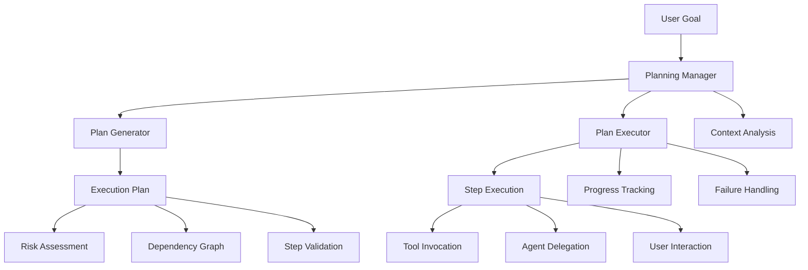

# Planning System Overview

The NikCLI Planning System is an intelligent, AI-powered execution planning framework that breaks down complex development tasks into structured, executable plans with comprehensive risk assessment, dependency management, and interactive approval workflows.

## Core Concepts

### What is the Planning System?

The Planning System transforms high-level user goals into detailed, executable plans that:

- **Analyze** project context and requirements
- **Generate** structured execution steps with dependencies
- **Assess** risks and provide mitigation strategies
- **Execute** plans with real-time progress tracking
- **Validate** results and handle failures gracefully

### Key Components



## System Architecture

### Planning Manager

The central orchestrator that coordinates plan generation, validation, approval, and execution:

```typescript
import { PlanningManager } from '@nikcli/planning'

const planner = new PlanningManager(process.cwd(), {
  maxStepsPerPlan: 50,
  requireApprovalForRisk: 'high',
  enableRollback: true,
  logLevel: 'info',
  timeoutPerStep: 60000
})

// Generate and execute a plan
const result = await planner.planAndExecute(
  'Add authentication to the API',
  '/path/to/project'
)
```

### Plan Generator

Analyzes user requests and generates comprehensive execution plans:

```typescript
const context: PlannerContext = {
  userRequest: 'Implement user authentication',
  projectPath: process.cwd(),
  availableTools: [...],
  projectAnalysis: {
    fileCount: 150,
    languages: ['typescript', 'javascript'],
    frameworks: ['express', 'react'],
    hasTests: true,
    hasDocumentation: true
  }
}

const plan = await planGenerator.generatePlan(context)
```

### Plan Executor

Executes validated plans with monitoring, approval, and error handling:

```typescript
const executor = new PlanExecutor(toolRegistry, {
  requireApprovalForRisk: 'high',
  enableRollback: true,
  timeoutPerStep: 60000,
  autoApproveReadonly: true
})

const result = await executor.executePlan(plan)
```

## Planning Lifecycle

### 1. Context Analysis

The system begins by analyzing the project context:

```typescript
// Automatic project analysis
const projectAnalysis = {
  fileCount: 250,
  languages: ['typescript', 'javascript', 'css'],
  frameworks: ['next.js', 'tailwind'],
  hasTests: true,
  hasDocumentation: true
}

// Workspace context integration
const workspaceContext = await workspaceRAG.getContextForTask(userGoal)
```

### 2. Plan Generation

AI-powered plan generation creates structured execution steps:

```typescript
const plan: ExecutionPlan = {
  id: 'plan-abc123',
  title: 'Implement User Authentication',
  description: 'Add JWT-based authentication with refresh tokens',
  steps: [
    {
      id: 'step-1',
      type: 'validation',
      title: 'Validate Request',
      description: 'Check prerequisites and dependencies',
      riskLevel: 'low',
      reversible: true,
      estimatedDuration: 2000
    },
    {
      id: 'step-2',
      type: 'tool',
      title: 'Install Dependencies',
      description: 'Install jsonwebtoken and bcrypt packages',
      toolName: 'manage-packages',
      toolArgs: {
        action: 'install',
        packages: ['jsonwebtoken', 'bcrypt']
      },
      riskLevel: 'low',
      reversible: true,
      dependencies: ['step-1']
    },
    // ... more steps
  ],
  status: 'pending',
  estimatedTotalDuration: 300000,
  riskAssessment: {
    overallRisk: 'medium',
    destructiveOperations: 0,
    fileModifications: 5,
    externalCalls: 2
  }
}
```

### 3. Risk Assessment

Comprehensive risk analysis with mitigation strategies:

```typescript
const riskAssessment: RiskAssessment = {
  overallRisk: 'medium',
  destructiveOperations: 0,
  fileModifications: 5,
  externalCalls: 2
}

// Risk scoring algorithm
const riskScore = calculatePlanRiskScore(plan) // 0-100
```

### 4. Plan Validation

Pre-execution validation ensures plan integrity:

```typescript
const validation: PlanValidationResult = {
  isValid: true,
  errors: [],
  warnings: [
    'Plan contains high-risk operations',
    'Plan includes 2 potentially destructive operations'
  ],
  suggestions: [
    'Consider breaking this plan into smaller chunks'
  ]
}
```

### 5. User Approval

Interactive approval for risky operations:

```typescript
const approval: PlanApprovalResponse = {
  approved: true,
  modifiedSteps: ['step-5'], // Steps to skip
  userComments: 'Skip database migration for now',
  timestamp: new Date()
}
```

### 6. Execution

Step-by-step execution with real-time tracking:

```typescript
const result: PlanExecutionResult = {
  planId: 'plan-abc123',
  status: 'completed',
  startTime: new Date(),
  endTime: new Date(),
  stepResults: [
    {
      stepId: 'step-1',
      status: 'success',
      output: { validated: true },
      duration: 1500,
      timestamp: new Date()
    }
  ],
  summary: {
    totalSteps: 8,
    successfulSteps: 7,
    failedSteps: 1,
    skippedSteps: 0
  }
}
```

## Plan Types

### Standard Plans

Generated from user requests with full analysis:

```typescript
const plan = await planner.generatePlanOnly(
  'Add API rate limiting',
  '/path/to/project'
)
```

### Enhanced Plans (TodoPlan)

Rich todo-based plans with detailed metadata:

```typescript
import { EnhancedPlanningSystem } from '@nikcli/planning'

const enhancedPlanner = new EnhancedPlanningSystem()

const plan = await enhancedPlanner.generatePlan(
  'Implement GraphQL API',
  {
    maxTodos: 20,
    includeContext: true,
    showDetails: true,
    saveTodoFile: true
  }
)
```

### Autonomous Plans

AI-driven plans with automatic execution:

```typescript
import { AutonomousPlanner } from '@nikcli/planning'

const autonomousPlanner = new AutonomousPlanner(workspacePath)

for await (const event of autonomousPlanner.createAndExecutePlan(
  'Optimize application performance'
)) {
  console.log(`${event.type}: ${event.content}`)
}
```

## Execution Models

### Sequential Execution

Steps execute in dependency order:

```typescript
const orderedSteps = executor.resolveDependencyOrder(plan.steps)

for (const step of orderedSteps) {
  await executor.executeStep(step, plan)
}
```

### Parallel Execution

Independent steps can run concurrently:

```typescript
const independentSteps = steps.filter(step =>
  !step.dependencies || step.dependencies.length === 0
)

await Promise.all(
  independentSteps.map(step => executor.executeStep(step, plan))
)
```

### Agent-Delegated Execution

Complex steps delegated to specialized agents:

```typescript
{
  type: 'tool',
  metadata: {
    agent: 'react-agent',
    task: 'Create authentication UI components'
  }
}
```

## Risk Management

### Risk Levels

Four risk levels determine approval requirements:

| Level | Description | Auto-Approve | Example Operations |
|-------|-------------|--------------|-------------------|
| **Low** | Read-only, non-destructive | ✅ Yes | File reading, analysis |
| **Medium** | File modifications | ⚠️ Optional | Creating files, updates |
| **High** | Potentially destructive | ❌ No | Deletions, replacements |
| **Critical** | System-level changes | ❌ No | Package installations, migrations |

### Risk Assessment Algorithm

```typescript
function calculatePlanRiskScore(plan: ExecutionPlan): number {
  let score = 0

  // Base score from overall risk
  if (plan.riskAssessment.overallRisk === 'high') score += 50
  else if (plan.riskAssessment.overallRisk === 'medium') score += 25

  // Add points for destructive operations
  score += Math.min(plan.riskAssessment.destructiveOperations * 5, 20)

  // Add points for file modifications
  score += Math.min(plan.riskAssessment.fileModifications * 3, 15)

  // Add points for external calls
  score += Math.min(plan.riskAssessment.externalCalls * 2, 10)

  return Math.min(score, 100)
}
```

### Mitigation Strategies

```typescript
const riskAssessment = {
  overallRisk: 'high',
  riskFactors: [
    'Contains 3 destructive operations',
    'Large number of file modifications (15)'
  ],
  mitigationStrategies: [
    'Review all destructive commands before execution',
    'Ensure backups are available before execution',
    'Execute in dependency order with validation'
  ]
}
```

## Tool Integration

### Tool Capabilities

The planning system integrates with the tool registry:

```typescript
const toolCapabilities: PlanningToolCapability[] = [
  {
    name: 'write-file-tool',
    description: 'Write content to file',
    riskLevel: 'medium',
    reversible: true,
    estimatedDuration: 4000,
    requiredArgs: ['filePath', 'content'],
    optionalArgs: ['options']
  }
]
```

### Secure Tool Routing

High-risk operations route through secure wrappers:

```typescript
// Secure command execution
await secureTools.executeCommand('npm install express', {
  requireApproval: true,
  auditLog: true
})

// Secure file operations
await secureTools.applyConfigPatch(filePath, operations, {
  createBackup: true,
  validateSchema: true
})
```

## Context Awareness

### Workspace Context

Integration with RAG system for intelligent planning:

```typescript
const workspaceContext = workspaceRAG.getContextForTask(userGoal)

// Returns:
{
  projectInfo: {
    name: 'my-app',
    type: 'web-application',
    stack: ['typescript', 'react', 'express']
  },
  relevantFiles: [
    { path: 'src/auth/index.ts', summary: 'Auth module' }
  ],
  dependencies: [...],
  recentChanges: [...]
}
```

### Project Analysis

Automatic detection of project characteristics:

```typescript
const analysis = {
  fileCount: 250,
  languages: ['typescript', 'javascript'],
  frameworks: ['next.js', 'prisma'],
  hasTests: true,
  hasDocumentation: true,
  testFramework: 'vitest',
  buildTool: 'vite'
}
```

## Progress Tracking

### Real-time Updates

Track execution progress in real-time:

```typescript
planner.on('stepStart', ({ stepId, stepIndex }) => {
  console.log(`Starting step ${stepIndex + 1}`)
})

planner.on('stepComplete', ({ stepId, stepIndex }) => {
  console.log(`Completed step ${stepIndex + 1}`)
})

planner.on('planExecutionComplete', ({ planId }) => {
  console.log('Plan execution completed')
})
```

### Progress Metrics

```typescript
const progress = {
  completedSteps: 5,
  totalSteps: 10,
  percentage: 50,
  currentStep: 'Installing dependencies',
  estimatedTimeRemaining: 120000
}
```

## Error Handling

### Failure Strategies

```typescript
async function handleStepFailure(
  step: ExecutionStep,
  result: StepExecutionResult
): Promise<'abort' | 'skip' | 'retry' | 'continue'> {
  if (step.riskLevel === 'low') {
    // Non-critical: continue with warning
    return 'continue'
  }

  if (step.reversible && config.enableRollback) {
    // Offer rollback for reversible steps
    return await promptUser(['abort', 'skip', 'retry'])
  }

  // Critical failure: abort
  return 'abort'
}
```

### Rollback Support

```typescript
const step: ExecutionStep = {
  reversible: true,
  metadata: {
    rollbackPlan: [
      'Delete created files',
      'Restore original configuration'
    ]
  }
}
```

## Performance Considerations

### Optimization Strategies

1. **Parallel Execution**: Run independent steps concurrently
2. **Caching**: Cache tool results for repeated operations
3. **Lazy Loading**: Load context only when needed
4. **Streaming**: Stream large outputs incrementally

### Timeouts

```typescript
{
  timeoutPerStep: 60000, // 1 minute per step
  maxStepsPerPlan: 50,   // Prevent overly complex plans
}
```

## Best Practices

### Plan Design

✅ **DO**:
- Break complex tasks into 5-15 manageable steps
- Set realistic duration estimates
- Use clear, actionable step titles
- Define proper dependencies
- Include validation steps

❌ **DON'T**:
- Create monolithic plans with 50+ steps
- Skip risk assessment
- Ignore error handling
- Omit user feedback for risky operations

### Execution

✅ **DO**:
- Review high-risk operations before approval
- Monitor execution progress
- Handle failures gracefully
- Log execution results

❌ **DON'T**:
- Auto-approve destructive operations
- Ignore validation warnings
- Skip dependency checks
- Bypass approval system

## Next Steps

<CardGroup cols={2}>
  <Card title="Plan Generation" icon="wand-magic-sparkles" href="/planning-system/plan-generation">
    Learn how to generate intelligent execution plans
  </Card>

  <Card title="Execution Flow" icon="play" href="/planning-system/execution-flow">
    Understand the plan execution lifecycle
  </Card>

  <Card title="Plan Templates" icon="file-code" href="/planning-system/plan-templates">
    Explore pre-built plan templates
  </Card>

  <Card title="Interactive Planning" icon="users" href="/planning-system/interactive-planning">
    Master interactive plan approval and modification
  </Card>
</CardGroup>

## Related Documentation

- [Tool System](/tools-system/overview) - Understand tool integration
- [Agent System](/agent-system/overview) - Learn about agent delegation
- [Context & RAG](/context-rag/overview) - Explore context awareness
- [Configuration](/configuration/planning) - Configure planning behavior
