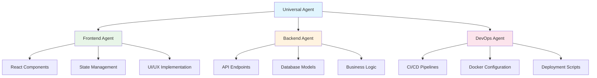

## What is NikCLI?

NikCLI is a revolutionary **autonomous AI development assistant** that transforms how you approach software development. It combines the power of advanced AI models with deep project understanding to provide intelligent, context-aware assistance for your development workflow.

<CardGroup cols={2}>
  <Card title="Autonomous Development" icon="robot">
    AI agents that can work independently on complex development tasks
  </Card>
  <Card title="Context Awareness" icon="brain">
    Deep understanding of your project structure, patterns, and conventions
  </Card>
  <Card title="Multi-Agent System" icon="users">
    Specialized agents working together for optimal results
  </Card>
  <Card title="Natural Language" icon="comments">
    Communicate with AI using natural language, just like with a human developer
  </Card>
</CardGroup>

## Core Interaction Modes

NikCLI offers three primary modes of interaction, each optimized for different development scenarios:

### 1. Chat Mode (Default)
Interactive conversational development with real-time feedback.

```
> Create a responsive navigation component with mobile menu
🔍 Analyzing project structure...
📁 Found React TypeScript project
🎯 Creating navigation component...
✏️  Writing NavBar.tsx...
📱 Adding mobile responsive styles...
✅ Component created successfully
```

**Best for:**
- Learning and experimentation
- Step-by-step development
- Code review and debugging
- Quick modifications

### 2. Autonomous Mode
AI works independently on complex tasks with minimal supervision.

```
> /auto
> Build a complete user authentication system with JWT tokens

🤖 Autonomous mode activated
📋 Planning authentication system...
   ├── User model and database schema
   ├── JWT token generation and validation
   ├── Registration and login endpoints
   ├── Authentication middleware
   ├── Frontend login/register forms
   └── Integration tests

🚀 Executing plan...
[AI proceeds to implement the entire system]
```

**Best for:**
- Large feature implementations
- Repetitive tasks
- Boilerplate generation
- System-wide refactoring

### 3. Planning Mode
Collaborative planning and review before implementation.

```
> /plan
> Implement real-time chat functionality

📋 Creating implementation plan...

## Plan: Real-time Chat Implementation

### 1. Backend Infrastructure
- Set up WebSocket server with Socket.io
- Create message model and database schema
- Implement room-based chat logic

### 2. Frontend Components
- Create chat interface components
- Implement real-time message display
- Add typing indicators and online status

### 3. Integration & Testing
- Connect frontend to WebSocket server
- Add error handling and reconnection logic
- Write integration tests

Do you want to proceed with this plan? (y/n)
```

**Best for:**
- Complex feature planning
- Architecture decisions
- Team collaboration
- Learning AI's approach

## Key Features and Capabilities

### Intelligent Project Understanding

NikCLI automatically analyzes your project to understand:

<AccordionGroup>
  <Accordion title="Technology Stack Detection">
    - **Frameworks**: React, Vue, Angular, Express, Fastify, etc.
    - **Languages**: TypeScript, JavaScript, Python, Go, etc.
    - **Tools**: Webpack, Vite, ESLint, Prettier, etc.
    - **Databases**: MongoDB, PostgreSQL, MySQL, SQLite, etc.
  </Accordion>
  
  <Accordion title="Code Patterns and Conventions">
    - Component structure and naming conventions
    - State management patterns (Redux, Zustand, Context)
    - API design patterns (REST, GraphQL)
    - Testing approaches and frameworks
  </Accordion>
  
  <Accordion title="Project Architecture">
    - Folder organization and structure
    - Module boundaries and dependencies
    - Configuration files and settings
    - Build and deployment pipelines
  </Accordion>
</AccordionGroup>

### Advanced Code Generation

NikCLI generates production-ready code that follows your project's patterns:

<Tabs>
  <Tab title="React Components">
    ```tsx
    // Generated based on your project's patterns
    import React, { useState } from 'react';
    import { Button } from '@/components/ui/button';
    import { Input } from '@/components/ui/input';
    import { useAuthStore } from '@/stores/auth';
    
    export interface LoginFormProps {
      onSuccess?: () => void;
      className?: string;
    }
    
    export const LoginForm: React.FC<LoginFormProps> = ({
      onSuccess,
      className = ''
    }) => {
      // Implementation follows your existing patterns
    };
    ```
  </Tab>
  
  <Tab title="API Endpoints">
    ```typescript
    // Follows your existing API structure
    import { Request, Response } from 'express';
    import { validateUser } from '@/middleware/validation';
    import { UserService } from '@/services/user.service';
    
    export const createUser = async (req: Request, res: Response) => {
      try {
        // Implementation with proper error handling
      } catch (error) {
        // Consistent error response format
      }
    };
    ```
  </Tab>
  
  <Tab title="Database Models">
    ```typescript
    // Matches your ORM/ODM patterns
    import { Entity, Column, PrimaryGeneratedColumn } from 'typeorm';
    
    @Entity('users')
    export class User {
      @PrimaryGeneratedColumn('uuid')
      id: string;
      
      // Follows your naming and validation patterns
    }
    ```
  </Tab>
</Tabs>

### Multi-Agent Orchestration

Different specialized agents work together on complex tasks:



## Workflow Patterns

### Feature Development Workflow

<Steps>
  <Step title="Requirements Analysis">
    ```
    > Implement user profile management with avatar upload
    ```
    
    NikCLI analyzes the requirement and breaks it down into components.
  </Step>
  
  <Step title="Architecture Planning">
    ```
    📋 Planning user profile system...
    ├── Frontend: Profile form and avatar upload
    ├── Backend: User profile API endpoints
    ├── Storage: File upload handling
    └── Database: Profile schema updates
    ```
  </Step>
  
  <Step title="Implementation">
    NikCLI implements each component while maintaining consistency across the stack.
  </Step>
  
  <Step title="Testing & Validation">
    ```
    🧪 Running tests...
    ✅ Frontend tests passed
    ✅ API tests passed
    ✅ Integration tests passed
    ```
  </Step>
  
  <Step title="Documentation & Cleanup">
    NikCLI updates documentation and ensures code quality.
  </Step>
</Steps>

### Bug Fix Workflow

<Steps>
  <Step title="Issue Analysis">
    ```
    > The user search is not working properly when filtering by role
    ```
    
    NikCLI analyzes the codebase to understand the search implementation.
  </Step>
  
  <Step title="Root Cause Identification">
    ```
    🔍 Found issue in user.service.ts:42
    Role filter is not being applied to the database query
    ```
  </Step>
  
  <Step title="Fix Implementation">
    NikCLI implements the fix while ensuring no regression.
  </Step>
  
  <Step title="Testing">
    NikCLI runs tests and may add new test cases to prevent regression.
  </Step>
</Steps>

### Refactoring Workflow

<Steps>
  <Step title="Code Analysis">
    ```
    > Refactor the authentication system to use a more secure approach
    ```
  </Step>
  
  <Step title="Impact Assessment">
    NikCLI analyzes all files that would be affected by the refactoring.
  </Step>
  
  <Step title="Gradual Migration">
    NikCLI implements changes incrementally to maintain functionality.
  </Step>
  
  <Step title="Validation">
    All tests pass and functionality is preserved.
  </Step>
</Steps>

## Best Practices

### Effective Communication

<CardGroup cols={2}>
  <Card title="Be Specific" icon="target">
    **Good**: "Create a React hook for managing form state with validation for email and password fields"
    
    **Better**: "Create a useForm hook that validates email format and password strength, with real-time feedback"
  </Card>
  
  <Card title="Provide Context" icon="info">
    **Good**: "Add authentication"
    
    **Better**: "Add JWT-based authentication to our Express API, compatible with our existing user model"
  </Card>
  
  <Card title="Reference Existing Code" icon="link">
    **Example**: "Create a component similar to UserCard.tsx but for displaying product information"
  </Card>
  
  <Card title="Specify Constraints" icon="lock">
    **Example**: "Implement this feature without adding new dependencies to package.json"
  </Card>
</CardGroup>

### Code Quality Guidelines

<AccordionGroup>
  <Accordion title="Follow Project Conventions">
    NikCLI automatically adapts to your project's patterns, but you can explicitly request adherence:
    
    ```
    > Create a new API endpoint following our existing error handling patterns
    > Use the same styling approach as our other components
    > Follow the repository pattern used in UserRepository.ts
    ```
  </Accordion>
  
  <Accordion title="Request Code Reviews">
    ```
    > Show me the changes before implementing
    > Create a plan first, then implement after I approve
    > Explain the approach you'll take for this refactoring
    ```
  </Accordion>
  
  <Accordion title="Ensure Test Coverage">
    ```
    > Implement this feature with comprehensive unit tests
    > Add integration tests for this API endpoint
    > Include edge case testing for the validation logic
    ```
  </Accordion>
</AccordionGroup>

### Security Considerations

NikCLI includes built-in security policies and best practices:

<CardGroup cols={2}>
  <Card title="Safe Command Execution" icon="shield">
    - Restricted command allowlist
    - Path-based access controls
    - Approval required for sensitive operations
  </Card>
  
  <Card title="Code Security" icon="lock">
    - Input validation and sanitization
    - SQL injection prevention
    - XSS protection in generated code
  </Card>
  
  <Card title="API Security" icon="key">
    - Secure API key storage
    - Token-based authentication
    - Rate limiting implementation
  </Card>
  
  <Card title="File System Safety" icon="folder-lock">
    - Restricted file access
    - Backup creation for critical files
    - Version control integration
  </Card>
</CardGroup>

## Common Use Cases

### Development Scenarios

<Tabs>
  <Tab title="New Feature">
    ```
    > Add a blog system to our website with CRUD operations, 
      categories, and search functionality
    ```
    
    **What NikCLI does:**
    - Creates database models
    - Implements API endpoints
    - Builds frontend components
    - Adds routing and navigation
    - Includes comprehensive testing
  </Tab>
  
  <Tab title="Code Optimization">
    ```
    > Optimize the dashboard component for better performance
    ```
    
    **What NikCLI does:**
    - Analyzes performance bottlenecks
    - Implements memoization
    - Optimizes re-renders
    - Adds loading states
    - Updates with best practices
  </Tab>
  
  <Tab title="Bug Investigation">
    ```
    > The payment processing is failing intermittently, 
      investigate and fix the issue
    ```
    
    **What NikCLI does:**
    - Analyzes payment flow
    - Identifies error conditions
    - Implements better error handling
    - Adds logging and monitoring
    - Creates tests for edge cases
  </Tab>
  
  <Tab title="Integration">
    ```
    > Integrate Stripe payment processing into our checkout flow
    ```
    
    **What NikCLI does:**
    - Researches Stripe integration patterns
    - Implements secure payment handling
    - Adds frontend payment forms
    - Handles webhooks and confirmations
    - Includes error handling and testing
  </Tab>
</Tabs>

## Performance and Efficiency

### Token Management

NikCLI automatically manages AI model token usage:

- **Context Compression**: Intelligently summarizes conversation history
- **Relevant Context**: Only includes pertinent project information
- **Caching**: Reuses analysis results for similar requests
- **Streaming**: Real-time response generation for faster interaction

### Parallel Processing

For complex tasks, NikCLI can work on multiple components simultaneously:

```
🔄 Working on user authentication system...
├── 🔄 Creating user model (Backend Agent)
├── 🔄 Building login form (Frontend Agent)  
├── 🔄 Setting up JWT middleware (Backend Agent)
└── 🔄 Adding auth routing (Frontend Agent)
```

## Next Steps

<CardGroup cols={2}>
  <Card
    title="Chat Interface"
    icon="comments"
    href="/user-guide/chat-interface"
  >
    Learn the ins and outs of NikCLI's conversational interface
  </Card>
  <Card
    title="Autonomous Mode"
    icon="robot"
    href="/user-guide/autonomous-mode"
  >
    Master autonomous development for complex tasks
  </Card>
  <Card
    title="Workflow Patterns"
    icon="workflow"
    href="/user-guide/workflow-patterns"
  >
    Discover proven patterns for different development scenarios
  </Card>
  <Card
    title="CLI Commands"
    icon="terminal"
    href="/cli-reference/commands-overview"
  >
    Complete reference for all available commands
  </Card>
</CardGroup>

<Tip>
  NikCLI becomes more effective as it learns your project patterns and preferences. The more you use it within a project, the better it understands your coding style and conventions.
</Tip>