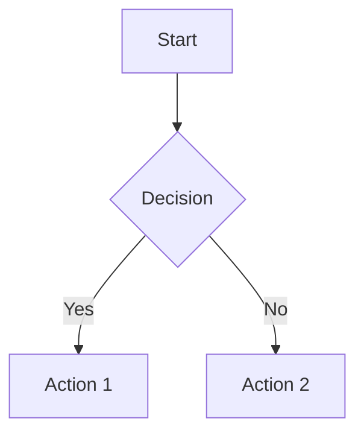

# Streamtty Enhanced Features

Streamtty is now a **simplified, visual-only** streaming markdown renderer that focuses on beautiful output without interactive complexity.

## 🎯 Design Philosophy

- **Visual + Basic Navigation**: Enhanced rendering with essential scroll controls
- **Streaming-First**: Optimized for AI content streaming
- **Production-Ready**: Reliable, minimal surface area for bugs
- **Terminal-Native**: Works in any TTY environment

## ✨ Enhanced Features

### 🖼️ Mermaid Diagrams

Automatic detection and rendering of Mermaid diagrams using [mermaid-ascii](https://github.com/AlexanderGrooff/mermaid-ascii):

```markdown


**Features:**
- Auto-detection of mermaid code blocks
- Fallback to built-in ASCII renderer if mermaid-ascii not available
- Support for flowcharts, sequence diagrams, class diagrams

### 📊 Enhanced Tables & Charts

Advanced table rendering with [tty-table](https://github.com/tecfu/tty-table) and ASCII charts with [asciichart](https://github.com/kroitor/asciichart):

```markdown
| Feature | Status | Performance |
|---------|--------|-------------|
| Tables  | ✅     | Excellent   |
| Charts  | ✅     | Fast        |
```

**CSV Data to Charts:**
```
Month,Sales
Jan,100
Feb,120
Mar,140
```

Automatically renders as ASCII line charts.

### 🎨 Syntax Highlighting

Enhanced code highlighting with proper language detection:

```typescript
const streamtty = new Streamtty({
  enhancedFeatures: {
    mermaid: true,
    advancedTables: true,
    interactiveControls: false // Visual-only!
  }
});
```

### 🔗 Smart Link & Path Formatting

- Automatic link highlighting: `https://github.com`
- File path highlighting: `/path/to/file.ts`
- Color-coded for better readability

## 🚀 Usage

### Basic Streaming

```typescript
import { Streamtty } from 'streamtty';

const streamtty = new Streamtty({
  enhancedFeatures: {
    mermaid: true,
    advancedTables: true,
    interactiveControls: false // Always false for visual-only
  }
});

// Stream content
async function streamContent(content: string) {
  await streamtty.stream(content);
}
```

### Service Integration

```typescript
import { streamttyService } from './services/streamtty-service';

// Use the singleton service (pre-configured)
await streamttyService.streamChunk(chunk, 'ai');
await streamttyService.renderBlock(content, 'system');
```

## 🛠️ Configuration

### Enhanced Features Config

```typescript
interface EnhancedFeaturesConfig {
  math?: boolean;              // LaTeX math rendering
  mermaid?: boolean;           // Mermaid diagram support
  shiki?: boolean;             // Advanced syntax highlighting
  security?: boolean;          // Input sanitization
  interactiveControls?: false; // Always disabled
  advancedTables?: boolean;    // tty-table integration
}
```

### Mermaid Configuration

```typescript
interface MermaidTTYConfig {
  theme?: 'default' | 'dark' | 'forest' | 'neutral';
  flowchart?: {
    useMaxWidth?: boolean;
  };
  // Binary options for mermaid-ascii
  paddingX?: number;
  paddingY?: number;
  ascii?: boolean;
}
```

## 📦 Dependencies

- **mermaid-ascii**: ASCII diagram generation
- **tty-table**: Advanced table rendering
- **asciichart**: ASCII chart generation
- **blessed**: Terminal UI framework
- **marked**: Markdown parsing

## 🔧 Installation

Ensure mermaid-ascii binary is available:

```bash
# Via Go
go install github.com/AlexanderGrooff/mermaid-ascii@latest

# Or download binary from releases
# https://github.com/AlexanderGrooff/mermaid-ascii/releases
```

## 🎯 Benefits

1. **Performance**: No interactive overhead
2. **Reliability**: Simplified codebase, fewer bugs
3. **Compatibility**: Works on any terminal
4. **Beautiful Output**: Enhanced visual rendering
5. **AI-Optimized**: Perfect for streaming AI content

## ⌨️ Navigation Controls

### Basic Scroll Controls (Enabled)
- `↑` / `k` - Scroll up
- `↓` / `j` - Scroll down
- `Page Up` - Scroll up one page
- `Page Down` - Scroll down one page
- `Home` / `g` - Go to top
- `End` / `G` - Go to bottom
- `Space` - Jump to bottom (useful for new content)
- `q` / `Esc` / `Ctrl+C` - Exit

**Note**: Auto-scroll is disabled by default. Use scroll keys to navigate or press `Space` to jump to new content.

## 🚫 Removed Features

- Advanced interactive modes
- Mouse controls
- Copy/export functionality
- Vi-style advanced navigation
- Complex key bindings

Most interactive features have been removed to focus on visual rendering performance while keeping essential scroll navigation.

## 📝 Example Output

```
┌─────────────────────────────────────┐
│ 📊 Mermaid Diagram                 │
│                                     │
│  ┌─────────┐                       │
│  │  Start  │                       │
│  └─────────┘                       │
│       │                            │
│       ▼                            │
│  ╱─────────╲                       │
│ │ Decision  │                      │
│  ╲─────────╱                       │
│       │                            │
│   ────┴────                        │
│  │         │                       │
│  ▼         ▼                       │
│ Action1   Action2                  │
└─────────────────────────────────────┘
```

Perfect for streaming AI content with beautiful, distraction-free visual output!