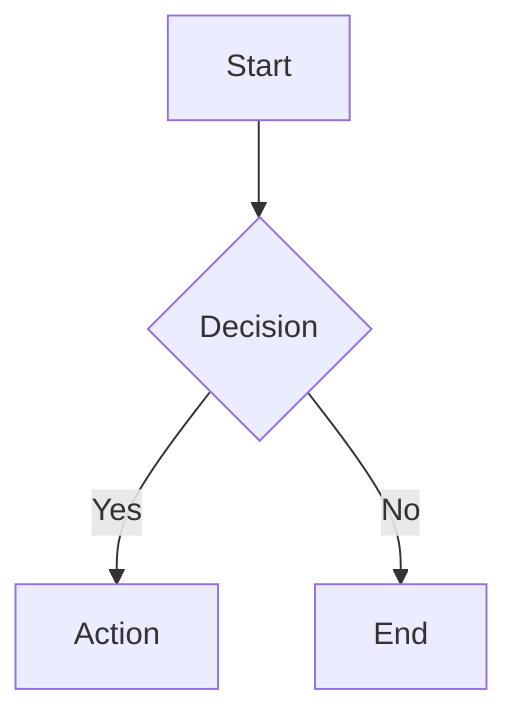

# StreamTTY Streamdown Parity Integration Guide

**Version**: 0.2.0  
**Status**: Production Ready  
**Last Updated**: 2025-01-18

---

## 📋 Quick Start

```typescript
import { Streamtty } from 'streamtty';
import {
  PluginRegistry,
  mathPlugin,
  mermaidPlugin,
  syntaxHighlightPlugin,
  securityPlugin,
} from 'streamtty';

// Create instance with default options
const streamtty = new Streamtty({
  parseIncompleteMarkdown: true,
  syntaxHighlight: true,
  theme: 'dark',
});

// Setup plugins for full features
const plugins = new PluginRegistry();
plugins.register(securityPlugin);
plugins.register(mathPlugin);
plugins.register(mermaidPlugin);
plugins.register(syntaxHighlightPlugin);
await plugins.init();

// Stream chunks from AI
for await (const chunk of aiStream) {
  const sanitized = await plugins.executeChunk(chunk);
  await streamtty.stream(sanitized);
}
```

---

## 🎯 Streamdown Parity Features

### 1. Math Rendering (LaTeX → Unicode)

**Input**:
```markdown
The formula is $E = mc^2$ and the integral is $\int_0^\infty e^{-x^2} dx = \frac{\sqrt{\pi}}{2}$
```

**Output**:
```
The formula is E = mc² and the integral is ∫₀^∞ e^(-x²) dx = √π/2
```

**Usage**:
```typescript
import { renderMathToUnicode, renderMathBlock } from 'streamtty';

// Inline
const inline = renderMathToUnicode('x^2 + y^2 = z^2');
console.log(inline); // x² + y² = z²

// Block
const block = renderMathBlock('E = mc^2', { boxStyle: 'rounded' });
console.log(block);
// ╭─────────────────╮
// │  E = mc²        │
// ╰─────────────────╯
```

### 2. Syntax Highlighting (Shiki + ANSI)

**Input**:
```markdown
\`\`\`typescript
const greeting: string = 'Hello, World!';
\`\`\`
```

**Output**: Colored code with ANSI escape sequences

**Usage**:
```typescript
import { highlightCodeWithShiki, formatCodeForTerminal } from 'streamtty';

const code = 'const x = 42;';
const highlighted = await highlightCodeWithShiki(code, 'typescript', 'nord');
console.log(highlighted); // Code with ANSI colors
```

### 3. Mermaid Diagrams (ASCII Art)

**Input**:


**Output**:
```
┌─────────┐
│  Start  │
└────┬────┘
     │
     ▼
┌──────────────┐     Yes    ┌────────┐
│  Decision    ├───────────▶│ Action │
└────┬─────────┘            └────────┘
     │ No
     ▼
┌─────────┐
│   End   │
└─────────┘
```

**Usage**:
```typescript
import { renderMermaidToASCII, isMermaidCode } from 'streamtty';

const diagram = `graph TD
  A[Start] --> B[End]`;

const ascii = renderMermaidToASCII(diagram);
console.log(ascii);
```

### 4. Advanced Tables

**Input**:
```markdown
| Feature | Status | Priority |
|---------|--------|----------|
| Math    | ✓      | High     |
| Code    | ✓      | High     |
| Tables  | ✓      | Medium   |
```

**Output**:
```
┌─────────┬────────┬──────────┐
│ Feature │ Status │ Priority │
├─────────┼────────┼──────────┤
│ Math    │ ✓      │ High     │
│ Code    │ ✓      │ High     │
│ Tables  │ ✓      │ Medium   │
└─────────┴────────┴──────────┘
```

**Usage**:
```typescript
import { parseMarkdownTable, formatTableToASCII } from 'streamtty';

const markdown = `| A | B |
|---|---|
| 1 | 2 |`;

const table = parseMarkdownTable(markdown);
const ascii = formatTableToASCII(table, { borderStyle: 'rounded' });
console.log(ascii);
```

### 5. Security & Sanitization

**Features**:
- ANSI injection prevention
- Null byte filtering
- Control character stripping
- Buffer overflow protection
- Safe ANSI color code whitelisting

**Usage**:
```typescript
import { sanitizeForTerminal, validateInput } from 'streamtty';

// Simple sanitization
const safe = sanitizeForTerminal(userInput, {
  stripAnsi: false,           // Keep safe ANSI codes
  maxLength: 1000000,
  allowUnicode: true,
  stripControlChars: true,
});

// Full validation
const result = validateInput(userInput);
if (result.valid) {
  console.log('Input is safe:', result.sanitized);
} else {
  console.error('Errors:', result.errors);
}
```

### 6. Streaming Statistics & Progress

**Usage**:
```typescript
import { StreamStatsTracker } from 'streamtty';
import { StreamIndicator, ProgressBar } from 'streamtty';

// Track statistics
const stats = new StreamStatsTracker();

for await (const chunk of stream) {
  await process(chunk);
  const bytes = Buffer.byteLength(chunk);
  stats.recordChunk(bytes);
}

// Display progress
const progress = new ProgressBar(30);
progress.show(current, total, 'Downloading');

// Show indicator
const indicator = new StreamIndicator();
indicator.show('Processing...');
indicator.update('Processing...', { progress: 50, total: 100 });
indicator.complete('Done!');
```

---

## 🔌 Plugin System

### Creating Custom Plugins

```typescript
import { StreamPlugin } from 'streamtty';

const myPlugin: StreamPlugin = {
  name: 'my-plugin',
  version: '1.0.0',
  description: 'My custom plugin',

  async onInit() {
    console.log('Plugin initialized');
  },

  async onChunk(chunk, ctx) {
    // Transform chunk
    return chunk.toUpperCase();
  },

  async onTokens(tokens, ctx) {
    // Transform tokens
    return tokens;
  },

  async onRender(content, ctx) {
    // Transform rendered content
    return content;
  },

  async onError(error, ctx) {
    console.error('Error in context:', error);
  },

  async onComplete(stats, ctx) {
    console.log('Streaming complete, stats:', stats);
  },
};

// Register and use
const registry = new PluginRegistry();
registry.register(myPlugin);
await registry.init();
```

### Built-in Plugin Presets

```typescript
import { PLUGIN_PRESETS } from 'streamtty';

// Use presets
const minimal = PLUGIN_PRESETS.minimal;      // Security only
const standard = PLUGIN_PRESETS.standard;    // + Math + Mermaid
const full = PLUGIN_PRESETS.full;            // + Syntax highlighting
const ai = PLUGIN_PRESETS.ai;                // AI-optimized
```

---

## 🚀 Integration Patterns

### Pattern 1: Simple Streaming

```typescript
const streamtty = new Streamtty();
const registry = new PluginRegistry();
registry.register(securityPlugin);
await registry.init();

for await (const chunk of aiResponse) {
  const safe = await registry.executeChunk(chunk);
  await streamtty.stream(safe);
}
```

### Pattern 2: With Progress Tracking

```typescript
const stats = new StreamStatsTracker();
const indicator = new StreamIndicator();

indicator.show('Processing...');

for await (const chunk of stream) {
  await streamtty.stream(chunk);
  
  const bytes = Buffer.byteLength(chunk);
  stats.recordChunk(bytes);
  
  const s = stats.getStats();
  indicator.update('Processing...', {
    progress: s.bytesReceived,
    total: expectedTotal,
    stats: `${s.throughputBytesPerSec.toFixed(1)} B/s`,
  });
}

indicator.complete('✓ Done');
```

### Pattern 3: Enterprise Chat

```typescript
const streamtty = new Streamtty();
const plugins = new PluginRegistry();

// Register all plugins
[securityPlugin, mathPlugin, mermaidPlugin, syntaxHighlightPlugin]
  .forEach(p => plugins.register(p));

await plugins.init();

// Process AI message with full features
const aiMessage = '## Analysis\n\nFormula: $E=mc^2$...';

for (const chunk of aiMessage.split(' ')) {
  const processed = await plugins.executeChunk(chunk + ' ');
  await streamtty.stream(processed);
}

// Render output
await streamtty.render();
```

---

## 📊 Performance Considerations

### Streaming Latency
- Target: < 100ms per chunk
- Typical: 20-50ms with plugins
- Profiling: `StreamStatsTracker.getStats()`

### Memory Usage
- Per plugin: ~1-5MB
- Buffer: configurable (default: 1MB)
- Monitor: `stats.memoryUsageBytes`

### Plugin Overhead
- Security: ~1ms/chunk
- Math: ~5ms/chunk (first time)
- Mermaid: ~10ms/chunk
- Syntax highlight: ~50ms/chunk

**Optimization Tips**:
1. Lazy-load heavy plugins (Shiki, Mermaid)
2. Use plugin presets instead of individual registration
3. Enable syntax highlighting only for code blocks
4. Cache plugin instances

---

## 🔒 Security Best Practices

```typescript
import { sanitizeForTerminal, validateInput } from 'streamtty';

// Always sanitize user input
const userContent = getUserInput();
const validation = validateInput(userContent, 1000000);

if (!validation.valid) {
  console.error('Validation errors:', validation.errors);
  return;
}

// Use sanitized version
await streamtty.stream(validation.sanitized);
```

**What's Protected**:
- ✓ ANSI injection attacks
- ✓ Terminal escape sequences
- ✓ Null byte attacks
- ✓ Buffer overflow
- ✓ Control character injection
- ✗ XSS (N/A - not web)

---

## 📝 API Reference

### Main Classes

#### `Streamtty`
Main renderer class for blessed TTY rendering.

#### `PluginRegistry`
Plugin management and execution.

#### `StreamStatsTracker`
Statistics tracking for streaming performance.

#### `StreamIndicator`
Visual progress indicator for CLI.

#### `ProgressBar`
Simple progress bar widget.

### Utility Functions

#### Math
- `renderMathToUnicode(latex: string): string`
- `renderMathBlock(latex: string, options?): string`
- `replaceMathInText(text: string): string`
- `extractMath(text: string): MathMatch[]`

#### Syntax Highlighting
- `highlightCodeWithShiki(code, lang, theme): Promise<string>`
- `formatCodeForTerminal(code, lang, options): Promise<string>`

#### Mermaid
- `renderMermaidToASCII(code, options): string`
- `isMermaidCode(code): boolean`
- `formatMermaidCode(code): string`

#### Tables
- `parseMarkdownTable(markdown): TableData`
- `formatTableToASCII(table, options): string`
- `formatTableMultiline(table, options): string`

#### Security
- `sanitizeForTerminal(input, options): string`
- `validateInput(input, maxLength): ValidationResult`
- `stripAnsiCodes(text): string`
- `hasAnsiCodes(text): boolean`

---

## 🧪 Testing

### Unit Tests
```bash
npm test
```

### Examples
```bash
npm run example:enterprise-streaming
npm run example:chat
npm run example:streaming
```

### Benchmarks
```typescript
import { StreamStatsTracker } from 'streamtty';

const tracker = new StreamStatsTracker();
const start = Date.now();

// Your code here

const stats = tracker.getStats();
console.log(`Throughput: ${stats.throughputBytesPerSec} B/s`);
console.log(`Latency: ${stats.averageChunkLatencyMs} ms`);
```

---

## 🐛 Troubleshooting

### Math not rendering
- Check: LaTeX syntax is correct
- Verify: `renderMathToUnicode()` returns expected output
- Enable: mathPlugin in registry

### Code highlighting not working
- Check: Language is supported
- Fallback: Basic highlighting if Shiki unavailable
- Note: First call is slow (Shiki initialization)

### Performance issues
- Profile: Use `StreamStatsTracker`
- Optimize: Disable unused plugins
- Check: Buffer size isn't too large

---

## 📚 Resources

- **Shiki**: https://shiki.matsu.io/
- **KaTeX**: https://katex.org/
- **Mermaid**: https://mermaid.js.org/
- **Blessed**: https://github.com/chjj/blessed

---

## 📄 Changelog

### v0.2.0 (2025-01-18)
- ✅ Shiki ANSI syntax highlighting
- ✅ Math Unicode rendering
- ✅ Mermaid ASCII diagrams
- ✅ Advanced table formatting
- ✅ ANSI security sanitization
- ✅ Plugin system
- ✅ Progress tracking & indicators
- ✅ Full Streamdown parity

### v0.1.0 (Initial)
- Basic markdown rendering
- TTY support
- AI SDK adapter

---

**Ready for production! 🚀**
